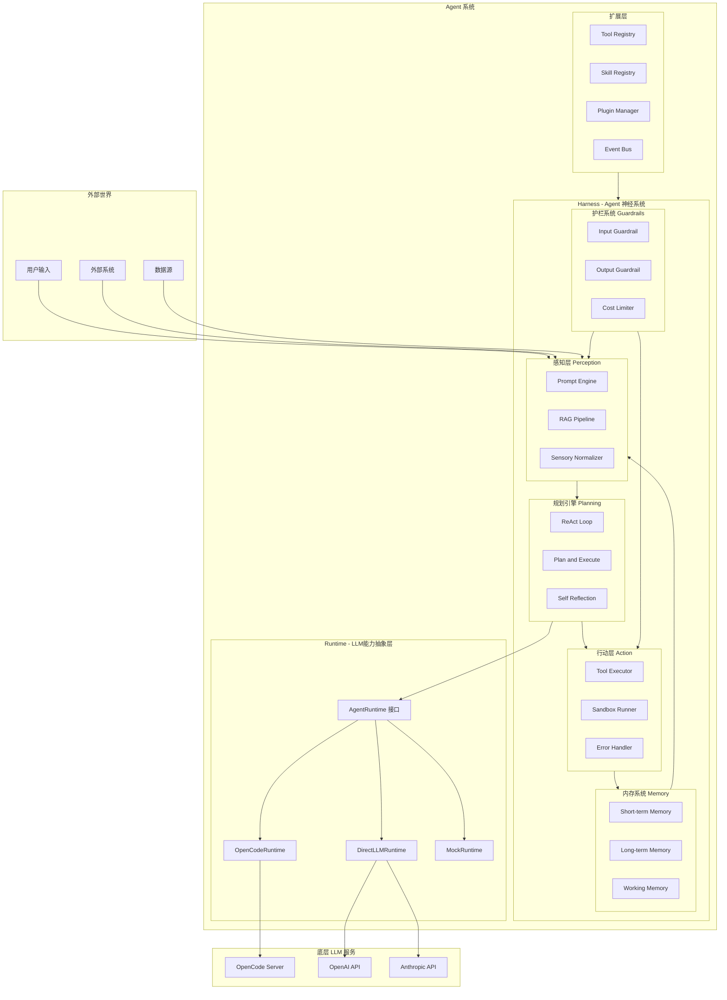
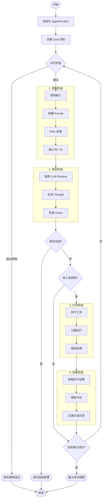
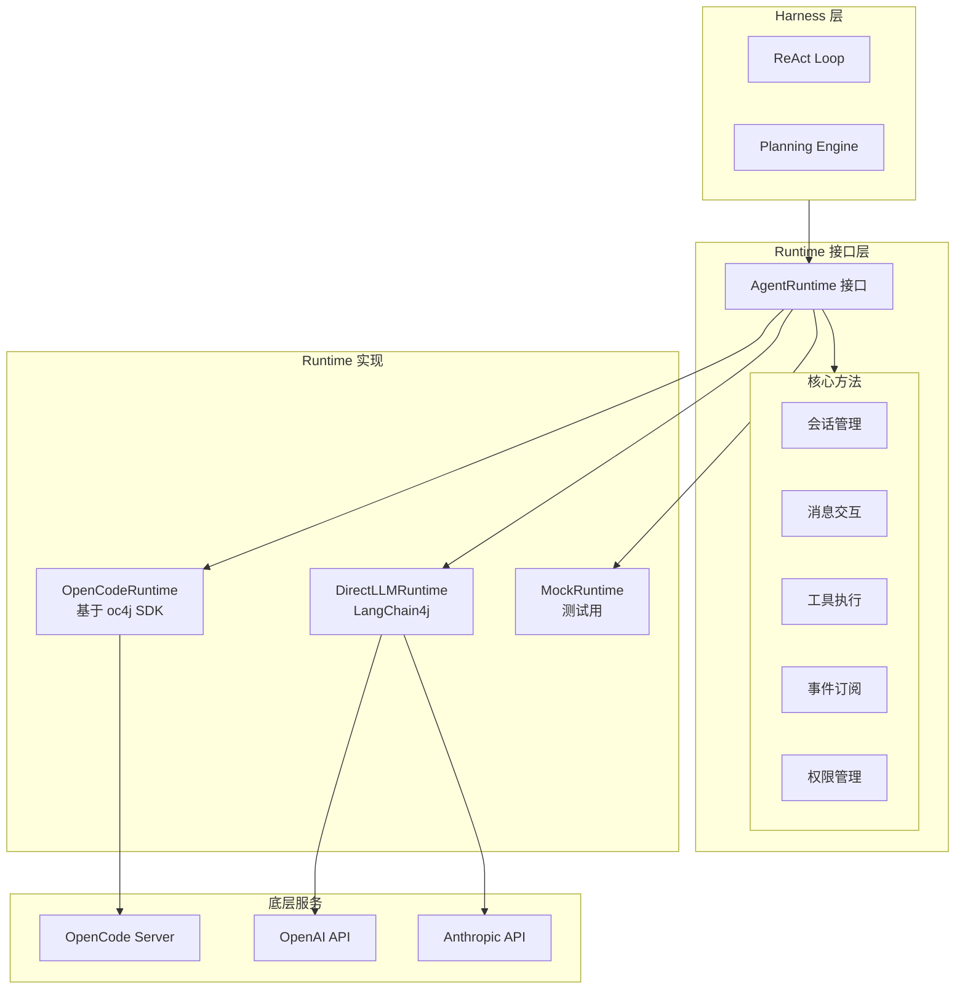
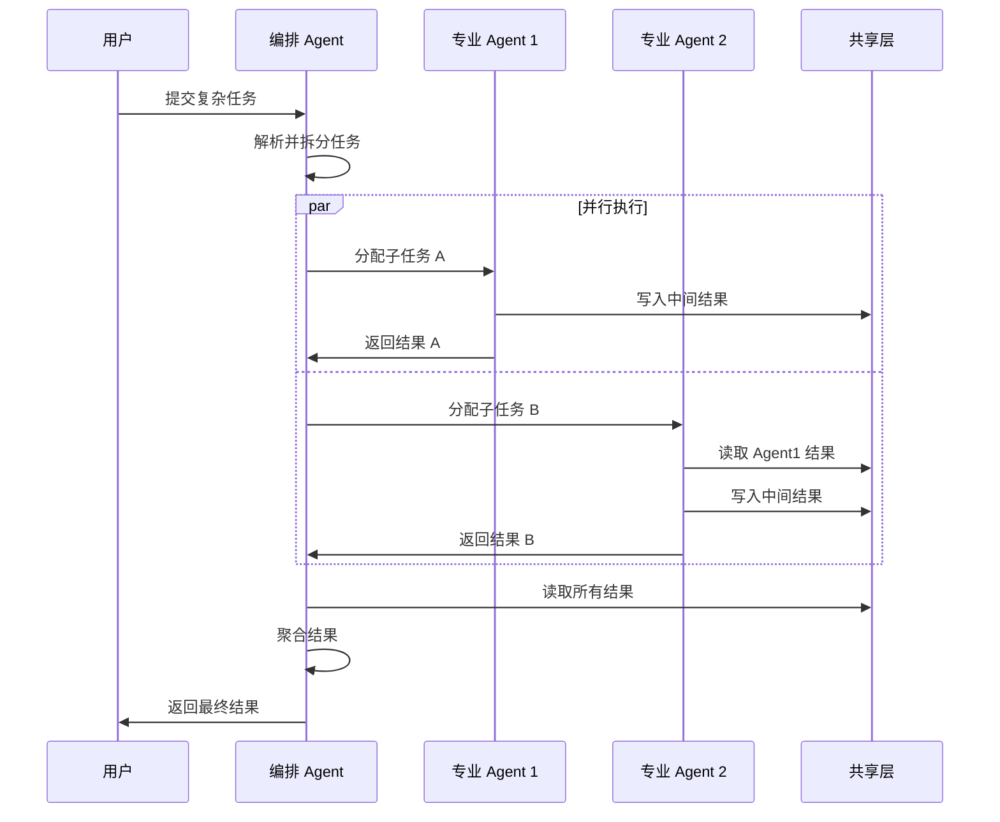
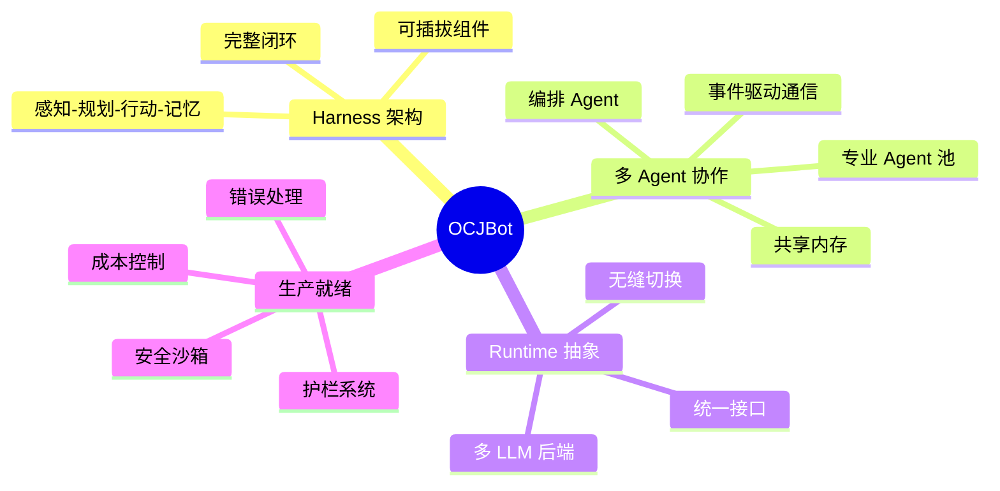

# OCJBot 架构图与流程图

## 设计目标

> **设计一个高效的 Harness 工程，通过多 Agent 协作完成复杂任务**

**核心理念**：
- **Agent = 模型 + Harness + Runtime**
- **Harness 是 Agent 的神经系统**，负责感知→规划→行动→记忆的完整闭环
- **多 Agent 协作**：通过 Harness 编排多个专业 Agent，实现复杂任务的分解与协作
- **对标 OpenClaw**：提供更系统化的 Harness 架构和更强的多 Agent 协作能力

## 1. OCJBot 完整架构图



## 2. 用户任务处理流程图（ReAct Loop）



## 3. Runtime 抽象层架构



## 4. 三层架构说明

| 层级 | 职责 | 实现方式 |
|------|------|----------|
| **Harness** | Agent 神经系统，感知→规划→行动→记忆 | 业务逻辑 |
| **Runtime** | LLM 能力抽象，会话/消息/工具/事件 | 接口 + 多实现 |
| **底层** | 具体 LLM 服务 | OpenCode Server / OpenAI API |

## 5. Harness 四层架构说明

| 组件 | 职责 | 类比 |
|------|------|------|
| **感知层** | 将原始数据转为模型可理解的格式 | 眼睛、耳朵 |
| **规划引擎** | 推理循环、决策、控制流 | 大脑皮层 |
| **行动层** | 执行工具、影响现实世界 | 双手 |
| **内存系统** | 状态管理、记忆存储 | 海马体 |
| **护栏系统** | 安全边界、成本控制 | 免疫系统 |

## 6. 多 Agent 协作架构

```mermaid
graph TB
    subgraph UserLayer[用户层]
        User[用户任务]
    end
    
    subgraph Orchestrator[编排层 - Orchestrator Agent]
        TaskParser[任务解析]
        TaskSplitter[任务拆分]
        AgentSelector[Agent 选择]
        ResultAggregator[结果聚合]
    end
    
    subgraph AgentPool[Agent 池]
        subgraph CoderAgent[Coder Agent]            
            CoderHarness[Harness]
            CoderRuntime[Runtime]
            CoderTools[代码工具]
        end
        
        subgraph ResearcherAgent[Researcher Agent]
            ResearcherHarness[Harness]
            ResearcherRuntime[Runtime]
            ResearcherTools[搜索工具]
        end
        
        subgraph AnalystAgent[Analyst Agent]
            AnalystHarness[Harness]
            AnalystRuntime[Runtime]
            AnalystTools[分析工具]
        end
        
        subgraph ExecutorAgent[Executor Agent]
            ExecutorHarness[Harness]
            ExecutorRuntime[Runtime]
            ExecutorTools[执行工具]
        end
    end
    
    subgraph SharedLayer[共享层]
        SharedMemory[共享内存]
        EventBus[事件总线]
        MessageQueue[消息队列]
    end
    
    User --> TaskParser
    TaskParser --> TaskSplitter
    TaskSplitter --> AgentSelector
    
    AgentSelector --> CoderAgent
    AgentSelector --> ResearcherAgent
    AgentSelector --> AnalystAgent
    AgentSelector --> ExecutorAgent
    
    CoderAgent --> SharedMemory
    ResearcherAgent --> SharedMemory
    AnalystAgent --> SharedMemory
    ExecutorAgent --> SharedMemory
    
    CoderAgent --> EventBus
    ResearcherAgent --> EventBus
    AnalystAgent --> EventBus
    ExecutorAgent --> EventBus
    
    SharedMemory --> ResultAggregator
    EventBus --> ResultAggregator
    ResultAggregator --> User
```

## 7. 多 Agent 协作流程



## 8. 与 OpenClaw 对标分析

| 维度 | OpenClaw | OCJBot | 说明 |
|------|----------|--------|------|
| **架构理念** | Plugin-based | Harness-based | Harness 是神经系统，统一编排 |
| **感知层** | Prompt Templates | PerceptionLayer + RAG | 更系统化的输入处理 |
| **规划引擎** | 简单循环 | ReAct/Plan-Exec/Reflection | 多种推理模式支持 |
| **行动层** | Tool Calling | ActionLayer + Sandbox | 安全沙箱执行 |
| **内存系统** | Mem0 插件 | 内置 MemorySystem | 深度集成，支持多 Agent 共享 |
| **护栏** | 无 | Guardrails | 生产必备的安全边界 |
| **多 Agent** | 单 Agent 为主 | 原生多 Agent 协作 | 编排层 + Agent 池 |
| **扩展性** | Plugin 机制 | Plugin + Skill + Tool | 三层扩展体系 |

## 9. OCJBot 核心优势



---

*文档版本: 1.1.0*
*最后更新: 2026-03-24*
