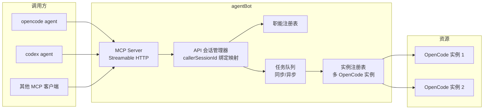

# Agent API 设计方案（agentBot 对外服务化）

> 状态：已实现（2026-10-02）｜ 撰写时间：2026-10-02
> 关联项目：agentBot（飞书 × OpenCode Agent 机器人）
>
> **实现说明（与设计稿的差异）**：
> - 安全体系未实现（按计划本期不做），凭证即能力凭证，内网可信
> - 权限请求对所有 API 会话一律自动拒绝（非只读职能亦然），保守安全策略
> - MCP 采用无状态 JSON-RPC over HTTP（响应 application/json），未实现 SSE 流与 stdio
> - `roles.json` 同时承载实例注册表、职能与会话队列配置；管理页新增"职能与实例"管理卡片

## 一、需求背景与目标

agentBot 目前只有飞书对话通道（用户 @ 机器人）。本方案为其增加**机器调用通道**：让其他智能体（opencode、codex 等）能够把 agentBot 当作可调用的子 Agent 服务使用。

核心目标：

1. **被其他智能体调用**：以 MCP Server 形式对外暴露（opencode / codex 原生支持 MCP 客户端，无需逐个适配）
2. **会话隔离**：不同调用、不同领域的问题各自使用独立的内部会话，互不污染
3. **申请制会话**：调用方先按职能申请会话，拿到会话凭证后可持续追问；也可为不同领域申请多个会话并行使用
4. **职能体系**：默认内置 2 个职能，管理页可增配更多职能；调用方按职能申请会话
5. **职能级资源隔离**：每个职能可独立配置 OpenCode 实例与模型，未配置则兜底全局
6. 同步 + 异步轮询两种调用模式

**明确不做（本期）**：调用方鉴权/安全体系，后续迭代补充。

## 二、总体架构



## 三、会话模型（核心设计）

### 3.1 Bot 生成会话凭证，调用方只认 callerSessionId

**无需调用方提供任何身份 ID**：

1. 调用方按职能申请会话：`apply_session(role)`
2. Bot 内部生成会话凭证：**`callerSessionId = {职能key}_{uuid}`**（如 `troubleshooter_a3f2...`）
3. Bot 返回 callerSessionId，**调用方自行保存并记住**
4. 后续所有调用只需携带 callerSessionId

内部映射关系（Bot 全权管理，调用方不可见）：

```
callerSessionId → { roleKey, opencode实例, 内部sessionId, 模型, 创建时间, 最近活跃时间 }
```

### 3.2 该模型解决的问题

| 原始需求 | 解决方式 |
|---|---|
| 同智能体同会话调用要落同一内部会话 | 调用方对该领域持续使用同一个 callerSessionId，天然映射到同一内部会话 |
| 隔离不同智能体/不同会话的调用 | 每次申请生成全新 callerSessionId，映射到全新内部会话 |
| 一绑多（不同领域并行提问） | 调用方可同时持有多个 callerSessionId，指定不同凭证即路由到不同职能会话 |
| 调用方身份约定问题 | Bot 生成、Bot 管理，调用方只保存凭证，无需约定 ID 规范 |

### 3.3 语义规则

- **新会话**：再次调用 `apply_session(role)` 即获得新凭证（旧凭证不失效，可继续使用）
- **会话凭证即能力凭证**：持有 callerSessionId 即可操作对应会话（本期无鉴权，按内网可信设计）
- **并发**：同一 callerSessionId 的请求在内部会话上**串行排队**（复用现有串行锁）；不同 callerSessionId 之间并行（受全局并发上限约束）
- **生命周期**：会话空闲超时（可配置，默认 24h）后自动清理；对失效凭证调用返回明确错误码，调用方重新申请即可

## 四、对外工具面（MCP Tools）

| 工具 | 入参 | 出参 | 说明 |
|---|---|---|---|
| `list_roles()` | - | `[{key, name, desc}]` | 可用职能列表，供调用方按需选择 |
| `apply_session(role)` | 职能 key | `{callerSessionId}` | 按职能申请会话，返回凭证 |
| `chat(callerSessionId, message, wait?)` | 凭证 + 消息 | 同步：回复文本<br/>异步：`{taskId}` | 提问；wait 默认 false |
| `get_result(taskId)` | 任务 ID | `{status, reply, question?}` | 轮询异步结果 |
| `close_session(callerSessionId)` | 凭证 | `{ok}` | 主动释放会话（可选实现） |

### 4.1 同步 / 异步双模式

排查类任务常运行数分钟，超过 MCP 工具调用常见超时（约 60s），因此：

- **异步（默认，`wait=false`）**：`chat` 立即返回 taskId → 调用方轮询 `get_result` 直到 `status=done`
- **同步（`wait=true`）**：阻塞等待最终回复，适合短任务（如快速问答）；可带 timeout 参数，超时自动转为异步语义（返回 taskId 不丢任务）

### 4.2 异步任务状态机

```
chat 提交 → pending（排队/执行中）
         → waiting_input（职能 agent 反问，携带问题内容）
         → done（最终回复）
         → failed（失败原因）
```

**反问闭环**：职能 agent 中途反问时，任务进入 `waiting_input` 并在 `get_result` 中携带问题内容；调用方针对**同一 callerSessionId** 发起下一次 `chat`，该消息自动作为答案回传 agent，任务恢复执行。

## 五、职能（Role）体系

### 5.1 配置结构（管理页可增删改，热生效）

```json
{
  "roles": [
    {
      "key": "troubleshooter",
      "name": "问题排查",
      "desc": "日志/指标/链路问题分析排查",
      "prompt": "你是问题排查专家...",
      "skills": ["crm-log-troubleshooting"],
      "instance": "",
      "model": "",
      "readOnly": true
    },
    {
      "key": "code-analyst",
      "name": "代码分析",
      "desc": "代码架构/逻辑/质量分析",
      "prompt": "...",
      "skills": [],
      "instance": "",
      "model": "",
      "readOnly": false
    }
  ]
}
```

- **默认内置 2 个职能**：问题排查（troubleshooter）、代码分析（code-analyst）
- `instance` / `model` 留空 → 兜底全局 OpenCode 实例与默认模型
- `readOnly`：只读职能的权限请求自动拒绝（无人值守安全约束）
- `skills`：职能挂载的技能集，决定该职能 agent 的排查能力边界

## 六、多实例支撑

新增**实例注册表**（管理页配置）：

```json
{
  "instances": {
    "global": { "baseUrl": "..." },
    "gpu-1": { "baseUrl": "..." }
  }
}
```

- 现有单一 OpenCode client 改造为 **client 池**（按实例 key 缓存，懒创建）
- 职能引用实例 key，运行期热切换
- 管理页新增：**实例管理**（增删改 + 连通性检测）、**职能管理** 两个页面

## 七、会话与队列管理（新增 API 会话管理器）

- 绑定映射持久化到配置目录（重启后凭证仍有效，内部 OpenCode 会话本身持久于服务端）
- 复用现有串行锁机制（以内部 sessionId 为粒度排队）
- API 会话与飞书会话映射空间完全隔离，互不影响
- 全局并发上限（可配置）：控制 OpenCode 资源不被打垮，超限任务排队，排队超时返回失败

## 八、实施计划（排期参考）

### 阶段一：基础支撑（1 天）
- [ ] 职能注册表（配置加载/校验/热重载）
- [ ] 实例注册表 + client 池改造
- [ ] 管理页：职能管理 + 实例管理

### 阶段二：会话与队列（1 天）
- [ ] API 会话管理器（凭证生成、绑定映射、持久化、空闲清理）
- [ ] 任务队列（全局并发上限、排队超时）
- [ ] 串行锁复用接入

### 阶段三：MCP Server（1 天）
- [ ] Streamable HTTP 传输 + 5 个工具实现
- [ ] 同步/异步双模式 + get_result 轮询
- [ ] waiting_input 反问闭环

### 阶段四：联调验收（1 天）
- [ ] opencode 挂载 agentBot MCP 端到端联调（list_roles → apply_session → chat 异步轮询 → 多凭证并行）
- [ ] 异常场景：凭证失效、OpenCode 实例不可达、任务超时、并发排队
- [ ] codex 侧验证（时间允许）

**总预估：4 人天**（安全体系另计，本期不做）

## 九、风险与待确认项

| 风险/待确认 | 说明 |
|---|---|
| 凭证无鉴权 | 本期按内网可信设计，拿到凭证即可用；后续需补调用方鉴权与凭证归属校验 |
| 内置职能定义 | 问题排查 + 代码分析仅为建议，需确认实际内置职能及其技能集 |
| MCP 客户端兼容性 | opencode/codex 对 Streamable HTTP 支持程度需联调确认，必要时降级 SSE 或补 stdio 模式 |
| 反问体验 | 调用方 agent 对 waiting_input 状态的处理依赖其 prompt 约定，需在职能 prompt 中说明 |
| 长任务轮询成本 | 调用方轮询间隔由其自控；Bot 侧需防高频轮询（可加最小间隔提示或限流） |
