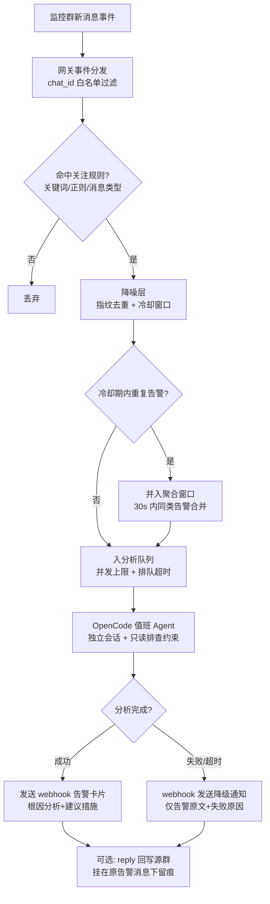

# 值班机器人（On-call Duty Bot）设计方案

> 状态：待排期实现 ｜ 撰写时间：2026-10-02
> 关联项目：agentBot（飞书 × OpenCode Agent 机器人）

## 一、需求背景与目标

agentBot 目前定位为"对话式"机器人：用户在群内 @ 机器人后，消息才进入 OpenCode 处理。

值班场景需要的是**主动监控**能力：

1. 关注若干个指定群聊（如告警群、值班群），**无需 @** 即可收到群内消息
2. 群消息命中特定规则（告警关键词/正则/特定消息类型）时触发
3. 将告警消息整理后交给 OpenCode 进行**自动分析排查**
4. 排查结果通过**指定 webhook** 推送（同时可选回写源群留痕）

一句话：让 agentBot 充当 7×24 值班机器人，有问题时自动分析排查并回报结果。

## 二、飞书平台侧前提（非代码，需提前申请）

### 2.1 权限（来自官方文档 im.message.receive_v1 事件说明）

| 需求 | 所需权限 | 说明 |
|---|---|---|
| 接收群内**所有**用户消息（不含机器人消息） | `im:message.group_msg`（敏感权限） | 需管理员审批 |
| 接收群内所有**用户+机器人**消息（告警机器人发的也收） | `im:message.group_msg.include_bot:read` | 值班场景推荐 |
| 仅接收 @机器人 的消息 | `im:message.group_at_msg:readonly` | 现有功能已具备，不满足值班场景 |

**结论：值班监控必须申请"接收群聊中所有消息"类权限**，因为告警通常由告警机器人发出，不含 @。建议直接申请 `im:message.group_msg.include_bot:read`。

### 2.2 其他前提

- 机器人必须被拉入所有待监控群
- 事件订阅使用现有 WebSocket 长连接模式，无需额外配置回调地址
- 官方注意事项：重复推送场景需以 `message_id` 去重（现有网关已实现）

### 2.3 可用的事件数据（设计依据）

`im.message.receive_v1` 事件体关键字段：

- `message.chat_id`：所属群 ID（白名单匹配依据）
- `message.message_id`：消息唯一 ID（去重 + 回复留痕）
- `message.chat_type`：`p2p` / `group`
- `message.message_type` / `content`：消息类型与 JSON 序列化内容
- `sender.sender_type`：`user` / `bot`（区分告警机器人与真人）
- `sender.sender_id`：发送者 ID

## 三、总体流程



值班通道与现有 @ 对话通道**并行独立**，互不侵入。

## 四、模块设计

### 4.1 新增配置：`config/watch.json`

```json
{
  "enabled": true,
  "chats": [
    {
      "chatId": "oc_xxxxxxxx",
      "name": "后端告警群",
      "rules": [
        { "pattern": "INTERFACE_OVERTIME|P0|ERROR", "type": "regex", "level": "P1" },
        { "pattern": "磁盘空间不足", "type": "keyword", "level": "P2" }
      ],
      "webhook": "",
      "replyToGroup": true,
      "contextMessageCount": 10
    }
  ],
  "cooldownMinutes": 10,
  "aggregateWindowSeconds": 30,
  "maxConcurrent": 2,
  "queueTimeoutMinutes": 10,
  "defaultWebhook": ""
}
```

配置项说明：

| 配置 | 说明 | 默认值 |
|---|---|---|
| `enabled` | 值班功能总开关 | `false` |
| `chats[].chatId` | 监控群 ID（白名单） | 必填 |
| `chats[].rules[]` | 触发规则，`pattern` + `type`(keyword/regex) + `level` | 必填 |
| `chats[].webhook` | 群级独立 webhook，空则走 `defaultWebhook` | 空 |
| `chats[].replyToGroup` | 是否回写源群 | `true` |
| `chats[].contextMessageCount` | 分析时附带最近 N 条群消息作为上下文 | `10` |
| `cooldownMinutes` | 同指纹告警的冷却窗口 | `10` |
| `aggregateWindowSeconds` | 聚合窗口：窗口内同类告警合并为一次分析 | `30` |
| `maxConcurrent` | 最大并行分析任务数 | `2` |
| `queueTimeoutMinutes` | 排队超时自动丢弃 | `10` |

配置页（admin-server）支持热更新，与 bot.json 同样的读写与热生效机制。

### 4.2 新增模块（src/watch/）

| 模块 | 职责 |
|---|---|
| `watch-config.js` | watch.json 加载/校验/热重载（仿 bot-config.js） |
| `trigger-matcher.js` | 规则匹配：chatId 白名单 → 规则逐条匹配（keyword/regex），返回命中的规则与等级 |
| `alert-deduper.js` | 降噪：① 指纹去重（chatId+规则+内容摘要 hash）+ 冷却窗口；② 聚合窗口（同类告警 30s 内合并，携带多条消息给 agent） |
| `duty-queue.js` | 分析任务队列：并发上限、排队超时丢弃、失败降级 |
| `duty-analyzer.js` | 分析编排：组装 prompt（告警原文+群名+等级+上下文消息）→ 创建值班专用 OpenCode 会话 → 提交分析 → 收集结果 |
| `duty-reporter.js` | 结果上报：webhook 推送（扩展 webhook-sender 支持多目标）+ 可选 reply 回写源群 |

### 4.3 对现有模块的改动（尽量小）

| 模块 | 改动 |
|---|---|
| `feishu-gateway.js` | `im.message.receive_v1` 处理器内新增一个分发点：去重后先调用值班回调（watched chat 的消息即使未@也透传），再走原有 @ 过滤链 |
| `index.js` | 装配值班模块，注入回调 |
| `webhook-sender.js` | 抽象为支持传入目标 webhook（默认仍走全局配置），保持向后兼容 |
| `interaction-manager.js` | 值班会话中 `permission.asked` 自动 reject（无人值守安全约束） |
| `session-manager.js` | 值班会话与对话会话隔离：值班使用独立 chatId 前缀（如 `duty:{chatId}:{rule}`）建立会话映射，不占用对话会话 |

### 4.4 值班 Agent 的分析 Prompt 模板（示意）

```
你是值班排查 Agent。以下是来自飞书群「{群名}」的告警，等级：{level}。
触发规则：{pattern}
当前时间：{时间}

## 告警消息（含聚合窗口内的同类消息）
{告警原文，多条时按时间排列}

## 群内最近上下文（可能有前置讨论/补充信息）
{最近 N 条消息}

## 要求
1. 判断问题类型与紧急程度
2. 输出：根因分析、影响范围、建议处置措施、置信度
3. 仅做只读排查（查日志/查指标/查代码），禁止任何写操作
4. 输出使用简洁 Markdown，控制在 500 字内
```

### 4.5 结果卡片结构（webhook 推送）

```json
{
  "msg_type": "interactive",
  "card": {
    "header": { "title": "【P1】INTERFACE_OVERTIME 排查结果", "template": "red" },
    "elements": [
      { "tag": "markdown", "content": "**告警来源**：后端告警群\n**触发时间**：...\n**根因分析**：...\n**建议措施**：...\n**置信度**：高" },
      { "tag": "note", "elements": [{ "tag": "plain_text", "content": "由 agentBot 值班模式自动分析 | 耗时 3m12s" }] }
    ]
  }
}
```

## 五、关键设计决策

| 决策点 | 选择 | 理由 |
|---|---|---|
| 群消息权限 | 申请"接收所有消息" | 告警常由机器人发出，不含 @，仅 @ 权限收不到 |
| 每条触发 vs 聚合触发 | 聚合窗口（30s） | 一次故障往往产生几十条告警，合并后一次分析，节省 token 且上下文更全 |
| 冷却去重 | chatId+规则+内容指纹，10 分钟 | 防止同一告警反复触发分析 |
| 分析会话 | 每次告警独立新会话 | 上下文隔离，避免历史告警污染本次判断 |
| 值班 agent 权限 | 只读 + 自动拒权 | 凌晨无人值守，必须防止 agent 执行写操作/发消息到生产 |
| 并发控制 | 队列 + 上限 2 + 排队超时 | 大面积故障时消息洪峰不能拖垮 OpenCode，宁可丢弃也不雪崩 |
| 失败降级 | webhook 发送"原始告警+失败原因" | 保证值班链路永远有最低限度的通知 |
| 与对话通道关系 | 完全并行独立 | 值班不能影响现有 @ 对话体验，互不干扰 |

## 六、实施计划（排期参考）

### 阶段一：飞书平台配置（0.5 天，可与开发并行）
- [ ] 申请 `im:message.group_msg.include_bot:read` 权限（管理员审批）
- [ ] 机器人拉入监控群，记录 chat_id

### 阶段二：监控触发链路（1 天）
- [ ] watch-config.js 配置加载与热重载
- [ ] 网关分发点改造（未@消息透传给值班通道）
- [ ] trigger-matcher.js 规则匹配
- [ ] alert-deduper.js 指纹去重 + 聚合窗口

### 阶段三：分析执行（1 天）
- [ ] duty-queue.js 队列与并发控制
- [ ] duty-analyzer.js 分析编排（prompt 模板、独立会话、上下文拉取）
- [ ] 值班会话权限自动拒绝

### 阶段四：结果上报（0.5 天）
- [ ] webhook-sender 多目标改造
- [ ] duty-reporter.js 上报 + reply 回写源群

### 阶段五：联调与验收（0.5 天）
- [ ] 配置页支持 watch.json 编辑
- [ ] 端到端联调：模拟告警 → 分析 → webhook 收到卡片
- [ ] 异常场景验证：告警风暴（100 条/分钟）、OpenCode 不可用、webhook 不可达

**总预估：3.5 人天**

## 七、风险与待确认项

| 风险/待确认 | 说明 |
|---|---|
| 敏感权限审批周期 | `im:message.group_msg` 为敏感权限，审批时长不可控，建议尽早提交 |
| 告警消息类型 | 告警群常见卡片消息（interactive post），当前网关只解析文本；值班匹配需支持富文本/卡片 JSON 提取，实现时确认目标群的消息类型 |
| 分析质量 | 值班 agent 的排查能力依赖其可用的技能/工具（日志查询等），需为值班 agent 配置合适的技能集 |
| webhook 归属 | 待确认结果推送到哪个 webhook（现有全局 webhook 或新建值班群机器人） |
| OpenCode 容量 | 并发分析的上限需结合 OpenCode 服务实际容量调整 |
