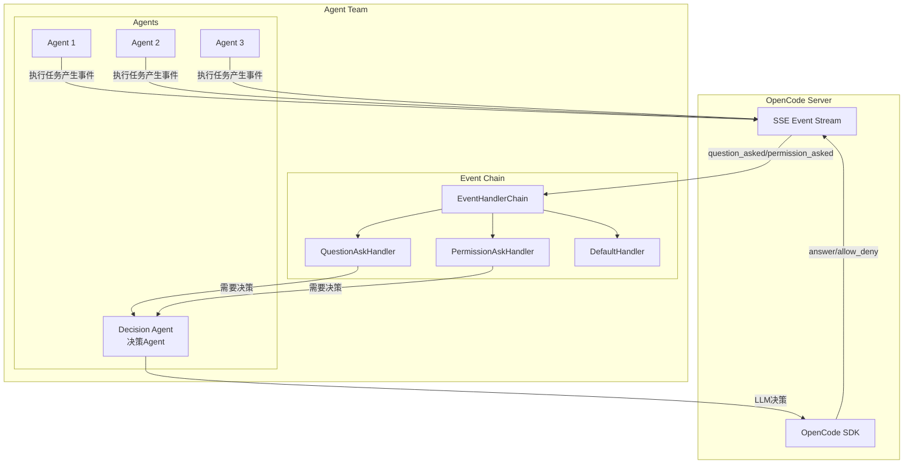

# 决策 Agent 与责任链事件处理设计

**设计日期**: 2026-03-16  
**设计状态**: 设计完成，待实现  
**设计范围**: SSE 事件责任链 + 决策 Agent

---

## 🏗️ 架构设计



---

## 📋 核心组件

### 1. 责任链处理器

```
EventHandler (抽象基类)
    ├── QuestionAskHandler    # 处理 question_asked 事件
    ├── PermissionAskHandler  # 处理 permission_asked 事件
    └── DefaultHandler        # 其他事件占位符
```

### 2. 决策 Agent

```
DecisionAgent
    ├── 专业技能: 决策分析、风险评估、策略制定
    ├── 核心职责:
    │   ├── 分析问题，做出决策回答
    │   └── 分析权限请求，决定允许/拒绝
    └── 输出: 通过 SDK 回复到事件源 session
```

---

## 🔄 事件处理流程

### Question Asked 流程

```
1. Agent A 执行任务，需要用户输入
2. OpenCode 产生 question_asked 事件
3. SSE 推送事件到 EventHandlerChain
4. QuestionAskHandler 匹配处理
5. 调用 DecisionAgent.analyze_and_decide()
6. DecisionAgent 使用 LLM 分析问题
7. DecisionAgent 通过 SDK 回答问题
8. 事件处理完成
```

### Permission Asked 流程

```
1. Agent B 执行命令，需要权限确认
2. OpenCode 产生 permission_asked 事件
3. SSE 推送事件到 EventHandlerChain
4. PermissionAskHandler 匹配处理
5. 调用 DecisionAgent.analyze_permission()
6. DecisionAgent 使用 LLM 评估风险
7. DecisionAgent 通过 SDK 允许/拒绝
8. 事件处理完成
```

---

## 📝 实现规范

### 事件类型定义

```python
class SSEEventType(Enum):
    """SSE 事件类型"""
    # 交互事件 - 需要决策 Agent 处理
    QUESTION_ASKED = "question_asked"       # 问题询问
    PERMISSION_ASKED = "permission_asked"   # 权限请求
    
    # 其他事件 - 暂时留空
    MESSAGE_UPDATED = "message_updated"
    FILE_EDITED = "file_edited"
    SESSION_ERROR = "session_error"
    # ...
```

### 责任链接口

```python
class EventHandler(ABC):
    """事件处理器基类"""
    
    @abstractmethod
    def can_handle(self, event_type: SSEEventType) -> bool:
        """判断是否能处理该事件"""
        pass
    
    @abstractmethod
    async def handle(self, event: SSEEvent, context: EventContext) -> Optional[EventResult]:
        """处理事件"""
        pass
    
    def set_next(self, handler: 'EventHandler') -> 'EventHandler':
        """设置下一个处理器"""
        self._next = handler
        return handler
```

### 决策 Agent 接口

```python
class DecisionAgent(Agent):
    """决策 Agent"""
    
    async def analyze_question(self, question: QuestionAskedEvent) -> str:
        """分析问题并生成回答"""
        pass
    
    async def analyze_permission(self, permission: PermissionAskedEvent) -> PermissionDecision:
        """分析权限请求并做出决策"""
        pass
```

---

## 🎯 实现范围

### 本次实现 (P0)

| 组件 | 文件 | 功能 |
|------|------|------|
| EventHandler 基类 | `event/chain.py` | 责任链抽象 |
| QuestionAskHandler | `event/handlers/question.py` | 问题事件处理 |
| PermissionAskHandler | `event/handlers/permission.py` | 权限事件处理 |
| DefaultHandler | `event/handlers/default.py` | 其他事件占位 |
| DecisionAgent | `agent/roles/decision.py` | 决策 Agent 实现 |
| EventContext | `event/context.py` | 事件上下文 |

### 暂不实现 (P1+)

- 其他事件类型的处理器
- 事件持久化
- 事件统计分析

---

**设计者**: System Architect Agent  
**版本**: v1.0