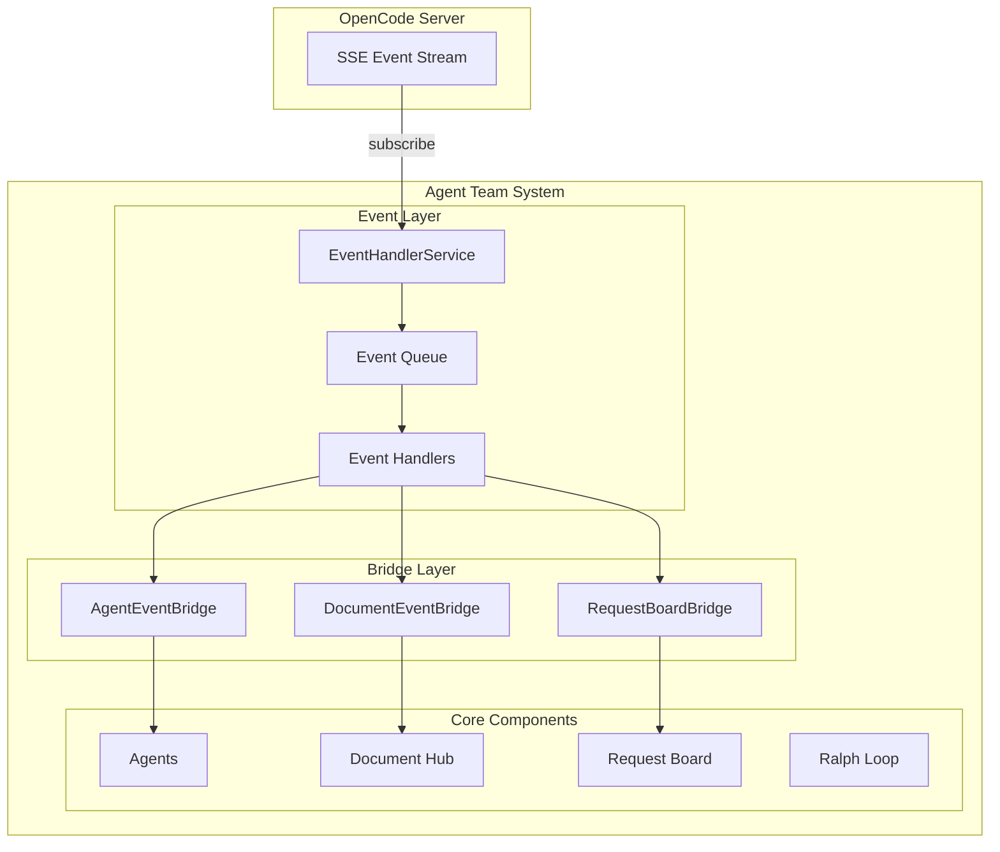

# OpenCode SSE 事件流实现方案

**设计日期**: 2026-03-16  
**设计状态**: 基础已实现，待完善集成  
**设计文件**: `src/agent/event_handler.py`

---

## 📊 当前实现状态

### ✅ 已实现

| 组件 | 文件 | 状态 |
|------|------|------|
| EventHandlerService | `event_handler.py` | ✅ 基础实现 (334 行) |
| EventType 枚举 | `event_handler.py:16` | ✅ 完整 |
| Event 模型 | `event_handler.py:36` | ✅ 完整 |
| SSE 连接逻辑 | `event_handler.py:172-210` | ✅ 基础实现 |
| AgentEventBridge | `event_handler.py:284` | ✅ 基础实现 |

### ⚠️ 待完善

| 项目 | 状态 | 说明 |
|------|------|------|
| OpenCode SDK event API 集成 | 🟡 部分 | 需验证 subscribe 方法 |
| 事件类型映射 | 🟡 部分 | 需扩展更多事件类型 |
| 与 Agent 系统集成 | ❌ 未完成 | 需在 TeamRunner 中集成 |
| 错误重连机制 | 🟡 部分 | 需增强 |

---

## 🏗️ 完整架构设计



---

## 📝 详细实现方案

### 1. OpenCode Event API 集成

#### 1.1 Event API 方法

```python
# opencode_4_py SDK 中的 Event API
OpenCodeClient.event.subscribe(session_id: str) -> AsyncIterator[Event]

# 支持的事件类型 (来自 opencode_4_py.models.event)
- EventMessageUpdated      # 消息更新
- EventMessagePartDelta    # 消息部分增量
- EventMessagePartUpdated  # 消息部分更新
- EventFileEdited          # 文件编辑
- EventSessionError        # 会话错误
- EventQuestionAsked       # 问题被询问
- EventPermissionAsked     # 权限请求
- EventSessionCreated      # 会话创建
- EventSessionStatus       # 会话状态
```

#### 1.2 完善的 SSE 连接实现

```python
# src/agent/event_handler.py (增强版)

import asyncio
import json
import time
from typing import Optional, Dict, Any, Callable, List, AsyncIterator
from dataclasses import dataclass, field
from enum import Enum
import logging

logger = logging.getLogger(__name__)


class EventType(Enum):
    """事件类型 - 扩展版"""
    # 文件事件
    FILE_CREATED = "file_created"
    FILE_MODIFIED = "file_modified"
    FILE_DELETED = "file_deleted"
    
    # Agent 事件
    AGENT_MESSAGE = "agent_message"
    AGENT_MESSAGE_DELTA = "agent_message_delta"  # 增量消息
    AGENT_STATUS = "agent_status"
    AGENT_ERROR = "agent_error"
    
    # 工作流事件
    WORKFLOW_START = "workflow_start"
    WORKFLOW_PROGRESS = "workflow_progress"
    WORKFLOW_COMPLETE = "workflow_complete"
    WORKFLOW_ERROR = "workflow_error"
    
    # 会话事件
    SESSION_CREATED = "session_created"
    SESSION_STATUS = "session_status"
    SESSION_ERROR = "session_error"
    SESSION_IDLE = "session_idle"
    
    # 交互事件
    QUESTION_ASKED = "question_asked"       # 用户问题
    PERMISSION_ASKED = "permission_asked"   # 权限请求
    
    # 系统事件
    SYSTEM_NOTIFICATION = "system_notification"
    SYSTEM_ERROR = "system_error"
    SERVER_CONNECTED = "server_connected"


@dataclass
class Event:
    """事件数据结构"""
    id: str
    type: EventType
    source: str
    data: Dict[str, Any]
    timestamp: int
    session_id: Optional[str] = None
    metadata: Dict[str, Any] = field(default_factory=dict)


class EventHandlerService:
    """
    事件处理服务 - 增强版
    
    功能：
    1. SSE 事件流连接 (OpenCode SDK)
    2. 事件分发和路由
    3. 事件过滤和聚合
    4. 事件历史记录
    5. 错误恢复和重连
    """
    
    def __init__(
        self,
        opencode_client: Any,
        session_id: Optional[str] = None,
        config: Optional[Dict[str, Any]] = None,
    ):
        self.client = opencode_client
        self.session_id = session_id
        
        # 配置
        self.config = config or {}
        self._reconnect_delay = self.config.get('reconnect_delay', 5)
        self._max_reconnect_attempts = self.config.get('max_reconnect_attempts', 10)
        self._max_history = self.config.get('max_history', 1000)
        
        # 事件处理
        self._handlers: Dict[EventType, List[Callable]] = {}
        self._wildcard_handlers: List[Callable] = []  # 处理所有事件
        self._history: List[Event] = []
        
        # 状态管理
        self._running = False
        self._connected = False
        self._reconnect_count = 0
        self._event_task: Optional[asyncio.Task] = None
        self._sse_task: Optional[asyncio.Task] = None
        self._event_queue: asyncio.Queue = asyncio.Queue()
    
    async def start(self):
        """启动事件服务"""
        if self._running:
            return
        
        self._running = True
        
        # 启动事件处理循环
        self._event_task = asyncio.create_task(self._event_loop())
        
        # 启动 SSE 监听
        self._sse_task = asyncio.create_task(self._sse_connection_manager())
        
        logger.info("EventHandlerService started")
    
    async def stop(self):
        """停止事件服务"""
        self._running = False
        
        # 取消任务
        for task in [self._event_task, self._sse_task]:
            if task:
                task.cancel()
                try:
                    await task
                except asyncio.CancelledError:
                    pass
        
        logger.info("EventHandlerService stopped")
    
    # ==================== SSE 连接管理 ====================
    
    async def _sse_connection_manager(self):
        """SSE 连接管理器 - 处理重连"""
        while self._running:
            try:
                await self._connect_and_listen()
            except asyncio.CancelledError:
                break
            except Exception as e:
                logger.error(f"SSE connection error: {e}")
                self._connected = False
                
                # 重连逻辑
                if self._reconnect_count < self._max_reconnect_attempts:
                    self._reconnect_count += 1
                    delay = self._reconnect_delay * min(self._reconnect_count, 5)
                    logger.info(f"Reconnecting in {delay}s (attempt {self._reconnect_count})")
                    await asyncio.sleep(delay)
                else:
                    logger.error("Max reconnect attempts reached")
                    break
    
    async def _connect_and_listen(self):
        """连接并监听 SSE 流"""
        if not self.client or not self.session_id:
            logger.warning("No client or session_id, SSE disabled")
            while self._running:
                await asyncio.sleep(1)
            return
        
        logger.info(f"Connecting to SSE stream for session {self.session_id}")
        
        try:
            # 使用 opencode-4-py SDK 的 event.subscribe
            event_api = self.client.event
            
            async for event in event_api.subscribe(session_id=self.session_id):
                if not self._running:
                    break
                
                self._connected = True
                self._reconnect_count = 0
                
                # 解析并分发事件
                parsed = self._parse_opencode_event(event)
                if parsed:
                    await self.emit(parsed)
                    
        except Exception as e:
            self._connected = False
            logger.error(f"SSE stream error: {e}")
            raise
    
    def _parse_opencode_event(self, opencode_event: Any) -> Optional[Event]:
        """
        解析 OpenCode 事件
        
        OpenCode 事件类型映射：
        - EventMessageUpdated -> AGENT_MESSAGE
        - EventMessagePartDelta -> AGENT_MESSAGE_DELTA
        - EventFileEdited -> FILE_MODIFIED
        - EventQuestionAsked -> QUESTION_ASKED
        - EventPermissionAsked -> PERMISSION_ASKED
        - EventSessionError -> SESSION_ERROR
        """
        try:
            # 获取事件类型名称
            event_type_name = type(opencode_event).__name__
            
            # 事件类型映射
            type_mapping = {
                'EventMessageUpdated': EventType.AGENT_MESSAGE,
                'EventMessagePartDelta': EventType.AGENT_MESSAGE_DELTA,
                'EventMessagePartUpdated': EventType.AGENT_MESSAGE,
                'EventFileEdited': EventType.FILE_MODIFIED,
                'EventFileWatcherUpdated': EventType.FILE_MODIFIED,
                'EventQuestionAsked': EventType.QUESTION_ASKED,
                'EventPermissionAsked': EventType.PERMISSION_ASKED,
                'EventSessionError': EventType.SESSION_ERROR,
                'EventSessionCreated': EventType.SESSION_CREATED,
                'EventSessionStatus': EventType.SESSION_STATUS,
                'EventSessionIdle': EventType.SESSION_IDLE,
                'EventServerConnected': EventType.SERVER_CONNECTED,
            }
            
            event_type = type_mapping.get(event_type_name, EventType.SYSTEM_NOTIFICATION)
            
            # 提取事件数据
            event_data = {}
            if hasattr(opencode_event, 'model_dump'):
                event_data = opencode_event.model_dump()
            elif hasattr(opencode_event, '__dict__'):
                event_data = opencode_event.__dict__
            
            # 特殊处理
            if event_type == EventType.AGENT_MESSAGE:
                event_data = self._extract_message_data(opencode_event)
            elif event_type == EventType.FILE_MODIFIED:
                event_data = self._extract_file_data(opencode_event)
            elif event_type == EventType.QUESTION_ASKED:
                event_data = self._extract_question_data(opencode_event)
            
            return Event(
                id=self._generate_event_id(),
                type=event_type,
                source="opencode",
                data=event_data,
                timestamp=int(time.time()),
                session_id=self.session_id,
            )
            
        except Exception as e:
            logger.error(f"Failed to parse OpenCode event: {e}")
            return None
    
    def _extract_message_data(self, event: Any) -> Dict[str, Any]:
        """提取消息事件数据"""
        return {
            "message_id": getattr(event, 'message_id', None),
            "session_id": getattr(event, 'session_id', None),
            "role": getattr(event, 'role', None),
            "content": getattr(event, 'content', None),
            "parts": getattr(event, 'parts', []),
        }
    
    def _extract_file_data(self, event: Any) -> Dict[str, Any]:
        """提取文件事件数据"""
        return {
            "path": getattr(event, 'path', None),
            "content": getattr(event, 'content', None),
            "change_type": getattr(event, 'change_type', None),
        }
    
    def _extract_question_data(self, event: Any) -> Dict[str, Any]:
        """提取问题事件数据"""
        return {
            "question_id": getattr(event, 'question_id', None),
            "question": getattr(event, 'question', None),
            "options": getattr(event, 'options', []),
        }
    
    # ==================== 事件分发 ====================
    
    async def emit(self, event: Event):
        """发送事件到队列"""
        await self._event_queue.put(event)
    
    async def emit_custom(
        self,
        event_type: EventType,
        source: str,
        data: Dict[str, Any],
    ):
        """发送自定义事件"""
        event = Event(
            id=self._generate_event_id(),
            type=event_type,
            source=source,
            data=data,
            timestamp=int(time.time()),
            session_id=self.session_id,
        )
        await self.emit(event)
    
    async def _event_loop(self):
        """事件处理循环"""
        while self._running:
            try:
                event = await asyncio.wait_for(
                    self._event_queue.get(),
                    timeout=1.0,
                )
                await self._dispatch_event(event)
            except asyncio.TimeoutError:
                continue
            except asyncio.CancelledError:
                break
            except Exception as e:
                logger.error(f"Error in event loop: {e}")
    
    async def _dispatch_event(self, event: Event):
        """分发事件到处理器"""
        # 记录历史
        self._history.append(event)
        if len(self._history) > self._max_history:
            self._history = self._history[-self._max_history:]
        
        # 调用特定类型处理器
        handlers = self._handlers.get(event.type, [])
        
        # 调用通配符处理器
        all_handlers = handlers + self._wildcard_handlers
        
        for handler in all_handlers:
            try:
                if asyncio.iscoroutinefunction(handler):
                    await handler(event)
                else:
                    handler(event)
            except Exception as e:
                logger.error(f"Error in event handler: {e}")
    
    # ==================== 事件订阅 ====================
    
    def on_event(
        self,
        event_type: EventType,
        handler: Callable[[Event], None],
    ):
        """注册事件处理器"""
        if event_type not in self._handlers:
            self._handlers[event_type] = []
        self._handlers[event_type].append(handler)
        logger.debug(f"Registered handler for {event_type.value}")
    
    def on_any_event(self, handler: Callable[[Event], None]):
        """注册通配符事件处理器 (处理所有事件)"""
        self._wildcard_handlers.append(handler)
    
    def off_event(
        self,
        event_type: EventType,
        handler: Callable,
    ):
        """取消事件处理器"""
        if event_type in self._handlers:
            self._handlers[event_type] = [
                h for h in self._handlers[event_type] if h != handler
            ]
    
    # ==================== 工具方法 ====================
    
    def _generate_event_id(self) -> str:
        """生成事件 ID"""
        import hashlib
        timestamp = int(time.time() * 1000)
        data = f"event:{timestamp}:{self.session_id}"
        return "evt_" + hashlib.md5(data.encode()).hexdigest()[:12]
    
    def get_history(
        self,
        event_type: Optional[EventType] = None,
        source: Optional[str] = None,
        limit: int = 100,
    ) -> List[Event]:
        """获取事件历史"""
        results = self._history
        
        if event_type:
            results = [e for e in results if e.type == event_type]
        
        if source:
            results = [e for e in results if e.source == source]
        
        return results[-limit:]
    
    def get_statistics(self) -> Dict[str, Any]:
        """获取事件统计"""
        by_type = {}
        for event in self._history:
            type_str = event.type.value
            by_type[type_str] = by_type.get(type_str, 0) + 1
        
        return {
            "total_events": len(self._history),
            "by_type": by_type,
            "handlers_registered": sum(len(h) for h in self._handlers.values()),
            "connected": self._connected,
            "reconnect_count": self._reconnect_count,
        }
```

### 2. Agent 事件桥接器增强

```python
# src/agent/event_handler.py (续)

class AgentEventBridge:
    """
    Agent 事件桥接器 - 增强版
    
    将 OpenCode SSE 事件桥接到 Agent Team System 组件
    """
    
    def __init__(
        self,
        event_handler: EventHandlerService,
        agent_registry: Any = None,
        document_hub: Any = None,
        request_board: Any = None,
        ralph_loop: Any = None,
    ):
        self.event_handler = event_handler
        self.agent_registry = agent_registry
        self.document_hub = document_hub
        self.request_board = request_board
        self.ralph_loop = ralph_loop
        
        self._register_handlers()
    
    def _register_handlers(self):
        """注册所有事件处理器"""
        # 文件事件
        self.event_handler.on_event(
            EventType.FILE_MODIFIED,
            self._on_file_modified
        )
        
        # Agent 消息事件
        self.event_handler.on_event(
            EventType.AGENT_MESSAGE,
            self._on_agent_message
        )
        self.event_handler.on_event(
            EventType.AGENT_MESSAGE_DELTA,
            self._on_agent_message_delta
        )
        
        # 会话事件
        self.event_handler.on_event(
            EventType.SESSION_ERROR,
            self._on_session_error
        )
        self.event_handler.on_event(
            EventType.SESSION_IDLE,
            self._on_session_idle
        )
        
        # 交互事件
        self.event_handler.on_event(
            EventType.QUESTION_ASKED,
            self._on_question_asked
        )
        self.event_handler.on_event(
            EventType.PERMISSION_ASKED,
            self._on_permission_asked
        )
        
        # 工作流事件
        self.event_handler.on_event(
            EventType.WORKFLOW_ERROR,
            self._on_workflow_error
        )
    
    # ==================== 事件处理器 ====================
    
    async def _on_file_modified(self, event: Event):
        """文件修改事件处理"""
        file_path = event.data.get("path")
        logger.info(f"📄 File modified: {file_path}")
        
        # 通知 Document Hub
        if self.document_hub:
            await self.document_hub.notify_file_change(file_path)
        
        # 通知相关 Agent
        if self.agent_registry:
            await self.agent_registry.broadcast_event(event)
    
    async def _on_agent_message(self, event: Event):
        """Agent 消息事件处理"""
        message_id = event.data.get("message_id")
        role = event.data.get("role")
        content = event.data.get("content")
        
        logger.info(f"💬 Agent message from {role}: {content[:50] if content else ''}...")
        
        # 更新 Request Board
        if self.request_board and role:
            await self.request_board.handle_agent_message(role, content)
        
        # 更新 Ralph Loop 状态
        if self.ralph_loop:
            await self.ralph_loop.record_message(role, content)
    
    async def _on_agent_message_delta(self, event: Event):
        """Agent 消息增量事件处理 (流式输出)"""
        role = event.data.get("role")
        delta = event.data.get("delta", "")
        
        # 实时更新 UI (如果有)
        logger.debug(f"📝 Delta from {role}: {delta[:20]}...")
    
    async def _on_session_error(self, event: Event):
        """会话错误事件处理"""
        error = event.data.get("error")
        logger.error(f"❌ Session error: {error}")
        
        # 通知 Ralph Loop 进行挫折恢复
        if self.ralph_loop:
            await self.ralph_loop.handle_error(error)
    
    async def _on_session_idle(self, event: Event):
        """会话空闲事件处理 - 可能表示 Agent 完成工作"""
        logger.info("⏸️ Session idle - Agent may have completed work")
        
        # 检查完成度
        if self.ralph_loop:
            completion = await self.ralph_loop.check_completion()
            logger.info(f"Completion: {completion * 100:.1f}%")
    
    async def _on_question_asked(self, event: Event):
        """问题事件处理 - 用户需要回答"""
        question_id = event.data.get("question_id")
        question = event.data.get("question")
        options = event.data.get("options", [])
        
        logger.info(f"❓ Question asked: {question}")
        
        # 这里可以触发 UI 提示用户回答
        # 或者由 Coordinator Agent 收集并批量处理
    
    async def _on_permission_asked(self, event: Event):
        """权限请求事件处理"""
        permission_id = event.data.get("permission_id")
        permission_type = event.data.get("type")
        resource = event.data.get("resource")
        
        logger.info(f"🔐 Permission asked: {permission_type} for {resource}")
        
        # 由 Permission Handler 处理
        # 可以自动响应或收集后批量询问用户
    
    async def _on_workflow_error(self, event: Event):
        """工作流错误事件处理"""
        error = event.data.get("error")
        logger.error(f"⚠️ Workflow error: {error}")
        
        if self.ralph_loop:
            await self.ralph_loop.handle_setback(error)
```

### 3. TeamRunner 集成

```python
# src/agent/opencode_integration.py (TeamRunner 增强)

class TeamRunner:
    """团队运行器 - 增强事件支持"""
    
    def __init__(
        self,
        agents: List[Any],
        opencode: Optional[OpenCodeIntegration] = None,
        enable_events: bool = True,
    ):
        self.agents = agents
        self.opencode = opencode or OpenCodeIntegration()
        self.enable_events = enable_events
        
        self.document_hub = None
        self.request_board = None
        self.loop_controller = None
        self.event_handler = None
        self.event_bridge = None
    
    async def initialize(self):
        """初始化团队"""
        # 1. 连接 OpenCode
        await self.opencode.connect()
        
        # 2. 创建会话
        await self.opencode.create_session("Agent Team Session")
        
        # 3. 初始化核心组件
        from document_hub.store import DocumentStore
        from request_board.board import RequestBoard
        from ralph_loop.controller import IterationController
        
        self.document_hub = DocumentStore()
        self.request_board = RequestBoard()
        self.loop_controller = IterationController()
        
        # 4. 初始化事件系统
        if self.enable_events:
            await self._initialize_events()
        
        # 5. 注入依赖到所有 Agent
        for agent in self.agents:
            agent.document_hub = self.document_hub
            agent.request_board = self.request_board
            agent.client = self.opencode.client
            agent.session = self.opencode.session
            agent.event_handler = self.event_handler
        
        print(f"✅ 团队初始化完成，{len(self.agents)} 个 Agent 就绪")
    
    async def _initialize_events(self):
        """初始化事件系统"""
        from agent.event_handler import EventHandlerService, AgentEventBridge
        
        # 创建事件处理服务
        self.event_handler = EventHandlerService(
            opencode_client=self.opencode.client,
            session_id=self.opencode.session.id if self.opencode.session else None,
        )
        
        # 创建事件桥接器
        self.event_bridge = AgentEventBridge(
            event_handler=self.event_handler,
            agent_registry=None,  # TODO: 添加 agent registry
            document_hub=self.document_hub,
            request_board=self.request_board,
            ralph_loop=self.loop_controller,
        )
        
        # 启动事件服务
        await self.event_handler.start()
        
        print("✅ 事件系统已启动")
    
    async def run(self, max_iterations: int = 50):
        """运行团队"""
        if not self.opencode.session:
            await self.initialize()
        
        print(f"🚀 开始执行，最大迭代次数：{max_iterations}")
        
        # ... 现有的运行逻辑 ...
    
    async def shutdown(self):
        """关闭团队"""
        if self.event_handler:
            await self.event_handler.stop()
        
        if self.opencode:
            await self.opencode.disconnect()
        
        print("✅ 团队已关闭")
```

---

## 📊 事件类型完整映射

| OpenCode 事件 | Agent Team 事件 | 用途 |
|--------------|----------------|------|
| EventMessageUpdated | AGENT_MESSAGE | Agent 完整消息 |
| EventMessagePartDelta | AGENT_MESSAGE_DELTA | 流式输出增量 |
| EventMessagePartUpdated | AGENT_MESSAGE | 消息部分更新 |
| EventFileEdited | FILE_MODIFIED | 文件修改 |
| EventFileWatcherUpdated | FILE_MODIFIED | 文件监控更新 |
| EventQuestionAsked | QUESTION_ASKED | 用户问题 |
| EventPermissionAsked | PERMISSION_ASKED | 权限请求 |
| EventSessionError | SESSION_ERROR | 会话错误 |
| EventSessionCreated | SESSION_CREATED | 会话创建 |
| EventSessionStatus | SESSION_STATUS | 会话状态 |
| EventSessionIdle | SESSION_IDLE | 会话空闲 |
| EventServerConnected | SERVER_CONNECTED | 服务器连接 |

---

## 🎯 实现优先级

### P0 - 必须实现 (4h)

1. ✅ 验证 `opencode-4-py` SDK 的 `event.subscribe` API
2. ✅ 完善 `_parse_opencode_event` 方法
3. ✅ 在 TeamRunner 中集成事件系统
4. ✅ 添加错误重连机制

### P1 - 应该实现 (2h)

5. 🟡 完善事件桥接器
6. 🟡 添加事件统计和监控
7. 🟡 添加事件过滤功能

### P2 - 可选实现 (2h)

8. ⏳ 添加事件持久化
9. ⏳ 添加事件回放功能
10. ⏳ 添加事件可视化

---

## 📋 待办事项

- [ ] 验证 `client.event.subscribe` API 是否支持异步迭代
- [ ] 测试 SSE 连接稳定性
- [ ] 添加连接状态监控
- [ ] 完善事件类型映射
- [ ] 添加事件单元测试

---

**设计人员**: System Architect Agent  
**审核状态**: 🟡 待评审  
**版本**: v1.0  
**日期**: 2026-03-16