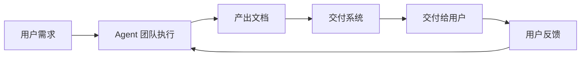
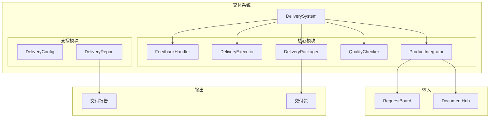

# 交付系统设计文档

> Phase 1.10 新增设计
> 
> 版本：1.0
> 创建日期：2026-03-16

---

## 1. 概述

### 1.1 设计目标

构建一个**产品交付系统**，作为 Agent Team System 的最终输出环节，实现：



### 1.2 项目目标关联

| 项目目标 | 交付系统要求 |
|---------|-------------|
| 📄 文档交付 | 整合所有产出文档，打包交付 |
| 🏢 公司化运作 | 专业的交付流程和验收标准 |
| 🔄 持续迭代 | 支持反馈循环，重新进入 Ralph Loop |
| 🙈 用户无感知 | 一键交付，自动整合 |

### 1.3 核心功能

| 功能 | 描述 |
|------|------|
| 产品整合 | 整合所有 Agent 产出的文档和代码 |
| 质量检查 | 交付前质量把关 |
| 打包交付 | 按规范打包，便于用户使用 |
| 反馈处理 | 收集用户反馈，触发迭代 |

---

## 2. 系统架构

### 2.1 整体架构



### 2.2 模块职责

| 模块 | 职责 |
|------|------|
| ProductIntegrator | 整合所有产出物，构建产品结构 |
| QualityChecker | 执行质量检查，确保交付标准 |
| DeliveryPackager | 打包产品，生成可交付格式 |
| DeliveryExecutor | 执行交付流程，管理交付状态 |
| FeedbackHandler | 处理用户反馈，触发后续迭代 |

---

## 3. 核心模块设计

### 3.1 数据模型

```python
# src/delivery/models.py

from __future__ import annotations

from enum import Enum
from typing import Optional, List, Dict, Any
from pydantic import BaseModel, Field
from datetime import datetime
import time


class DeliveryStatus(Enum):
    """交付状态"""
    PENDING = "pending"           # 待交付
    PREPARING = "preparing"       # 准备中
    QUALITY_CHECKING = "quality_checking"  # 质量检查中
    PACKAGING = "packaging"       # 打包中
    READY = "ready"               # 准备就绪
    DELIVERED = "delivered"       # 已交付
    ACCEPTED = "accepted"         # 已验收
    REJECTED = "rejected"         # 已拒绝
    FEEDBACK = "feedback"         # 有反馈


class DeliveryMethod(Enum):
    """交付方式"""
    FILE = "file"               # 文件下载
    DIRECTORY = "directory"     # 目录结构
    ARCHIVE = "archive"         # 压缩包
    GIT = "git"                 # Git 仓库


class QualityLevel(Enum):
    """质量等级"""
    EXCELLENT = "excellent"     # 优秀 (>= 90%)
    GOOD = "good"               # 良好 (>= 75%)
    ACCEPTABLE = "acceptable"   # 可接受 (>= 60%)
    POOR = "poor"               # 较差 (< 60%)


class DeliveryArtifact(BaseModel):
    """交付物"""
    id: str
    name: str
    type: str                   # document, code, config, etc.
    path: str
    content: Optional[str] = None
    size: int = 0
    hash: Optional[str] = None
    created_at: int
    metadata: Dict[str, Any] = Field(default_factory=dict)


class QualityCheckResult(BaseModel):
    """质量检查结果"""
    check_name: str
    passed: bool
    score: float
    message: str
    details: Dict[str, Any] = Field(default_factory=dict)


class DeliveryPackage(BaseModel):
    """交付包"""
    id: str
    name: str
    version: str
    status: DeliveryStatus
    artifacts: List[DeliveryArtifact] = Field(default_factory=list)
    quality_score: float = 0.0
    quality_level: QualityLevel = QualityLevel.ACCEPTABLE
    quality_checks: List[QualityCheckResult] = Field(default_factory=list)
    created_at: int
    delivered_at: Optional[int] = None
    delivery_method: DeliveryMethod = DeliveryMethod.DIRECTORY
    metadata: Dict[str, Any] = Field(default_factory=dict)


class FeedbackItem(BaseModel):
    """反馈项"""
    id: str
    type: str                   # bug, feature, improvement, question
    priority: str               # low, medium, high, critical
    content: str
    related_artifact: Optional[str] = None
    status: str = "open"
    created_at: int
    resolved_at: Optional[int] = None


class DeliveryReport(BaseModel):
    """交付报告"""
    package_id: str
    project_name: str
    summary: str
    total_artifacts: int
    quality_score: float
    quality_level: QualityLevel
    participating_agents: List[str]
    iterations: int
    total_time: float
    feedback_items: List[FeedbackItem] = Field(default_factory=list)
    generated_at: int
```

### 3.2 产品整合器

```python
# src/delivery/integrator.py

from __future__ import annotations

import hashlib
import time
from pathlib import Path
from typing import Optional, List, Dict, Any
import logging

from .models import DeliveryArtifact, DeliveryPackage, DeliveryStatus

logger = logging.getLogger(__name__)


class ProductIntegrator:
    """
    产品整合器
    
    功能：
    - 整合所有产出文档
    - 构建产品目录结构
    - 解析依赖关系
    - 生成产品清单
    """
    
    # 标准目录结构
    STANDARD_STRUCTURE = {
        "docs": {
            "prd": ["PRD.md", "requirements.md"],
            "design": ["architecture.md", "api_design.md", "db_design.md"],
            "manual": ["user_manual.md", "api_doc.md"],
            "reports": ["test_report.md", "quality_report.md"],
        },
        "src": {
            "frontend": [],
            "backend": [],
            "shared": [],
        },
        "tests": {
            "unit": [],
            "integration": [],
            "e2e": [],
        },
        "configs": [],
        "scripts": [],
    }
    
    def __init__(
        self,
        document_hub: Any,
        output_path: str = "./deliverables",
    ):
        self.document_hub = document_hub
        self.output_path = Path(output_path)
    
    async def integrate(self, project_name: str) -> DeliveryPackage:
        """
        整合产品
        
        Args:
            project_name: 项目名称
            
        Returns:
            DeliveryPackage: 交付包
        """
        logger.info(f"Starting product integration for: {project_name}")
        
        # 创建交付包
        package = DeliveryPackage(
            id=self._generate_package_id(project_name),
            name=project_name,
            version="1.0.0",
            status=DeliveryStatus.PREPARING,
            created_at=int(time.time()),
        )
        
        # 1. 获取所有文档
        documents = await self.document_hub.list_documents(limit=1000)
        
        # 2. 分类整理
        artifacts = await self._classify_documents(documents)
        package.artifacts = artifacts
        
        # 3. 构建目录结构
        await self._build_structure(package)
        
        # 4. 生成清单
        await self._generate_manifest(package)
        
        logger.info(f"Integration complete: {len(artifacts)} artifacts")
        
        return package
    
    async def _classify_documents(
        self,
        documents: List[Any],
    ) -> List[DeliveryArtifact]:
        """分类文档"""
        artifacts = []
        
        for doc in documents:
            artifact = DeliveryArtifact(
                id=doc.id,
                name=doc.metadata.title,
                type=self._infer_artifact_type(doc),
                path=self._determine_path(doc),
                content=doc.content.content,
                size=len(doc.content.content),
                hash=self._calculate_hash(doc.content.content),
                created_at=doc.metadata.created_at,
                metadata={
                    "doc_type": doc.metadata.doc_type,
                    "author": doc.metadata.author,
                    "version": doc.metadata.version,
                    "tags": doc.metadata.tags,
                },
            )
            artifacts.append(artifact)
        
        return artifacts
    
    def _infer_artifact_type(self, doc: Any) -> str:
        """推断产物类型"""
        doc_type = doc.metadata.doc_type
        
        type_mapping = {
            "prd": "document",
            "architecture": "document",
            "tech_design": "document",
            "api_design": "document",
            "db_design": "document",
            "code": "code",
            "component": "code",
            "module": "code",
            "test_case": "test",
            "test_report": "report",
            "user_manual": "document",
            "api_doc": "document",
        }
        
        if isinstance(doc_type, str):
            return type_mapping.get(doc_type, "document")
        return type_mapping.get(doc_type.value, "document")
    
    def _determine_path(self, doc: Any) -> str:
        """确定文件路径"""
        doc_type = doc.metadata.doc_type
        if isinstance(doc_type, str):
            doc_type_str = doc_type
        else:
            doc_type_str = doc_type.value
        
        title = doc.metadata.title
        
        # 根据文档类型确定路径
        path_mapping = {
            "prd": f"docs/prd/{title}.md",
            "architecture": f"docs/design/{title}.md",
            "tech_design": f"docs/design/{title}.md",
            "api_design": f"docs/design/{title}.md",
            "db_design": f"docs/design/{title}.md",
            "code": f"src/{title}",
            "test_case": f"tests/{title}.md",
            "test_report": f"docs/reports/{title}.md",
            "user_manual": f"docs/manual/{title}.md",
            "api_doc": f"docs/manual/{title}.md",
        }
        
        return path_mapping.get(doc_type_str, f"docs/{title}.md")
    
    async def _build_structure(self, package: DeliveryPackage):
        """构建目录结构"""
        # 创建输出目录
        package_dir = self.output_path / package.name
        package_dir.mkdir(parents=True, exist_ok=True)
        
        # 创建标准目录结构
        for category, subdirs in self.STANDARD_STRUCTURE.items():
            if isinstance(subdirs, dict):
                for subdir in subdirs:
                    (package_dir / category / subdir).mkdir(parents=True, exist_ok=True)
            else:
                (package_dir / category).mkdir(parents=True, exist_ok=True)
        
        # 写入文件
        for artifact in package.artifacts:
            file_path = package_dir / artifact.path
            file_path.parent.mkdir(parents=True, exist_ok=True)
            
            with open(file_path, 'w', encoding='utf-8') as f:
                f.write(artifact.content or "")
            
            logger.debug(f"Created: {artifact.path}")
    
    async def _generate_manifest(self, package: DeliveryPackage):
        """生成清单文件"""
        import json
        
        manifest = {
            "name": package.name,
            "version": package.version,
            "created_at": package.created_at,
            "artifacts": [
                {
                    "id": a.id,
                    "name": a.name,
                    "type": a.type,
                    "path": a.path,
                    "size": a.size,
                }
                for a in package.artifacts
            ],
        }
        
        package_dir = self.output_path / package.name
        manifest_path = package_dir / "manifest.json"
        
        with open(manifest_path, 'w', encoding='utf-8') as f:
            json.dump(manifest, f, ensure_ascii=False, indent=2)
    
    def _calculate_hash(self, content: str) -> str:
        """计算内容哈希"""
        return hashlib.sha256(content.encode()).hexdigest()[:16]
    
    def _generate_package_id(self, project_name: str) -> str:
        """生成交付包 ID"""
        timestamp = int(time.time())
        data = f"{project_name}:{timestamp}"
        return "pkg_" + hashlib.md5(data.encode()).hexdigest()[:12]
```

### 3.3 质量检查器

```python
# src/delivery/quality_checker.py

from __future__ import annotations

import re
from typing import List, Dict, Any, Optional
from dataclasses import dataclass
import logging

from .models import (
    QualityCheckResult,
    QualityLevel,
    DeliveryPackage,
)

logger = logging.getLogger(__name__)


@dataclass
class CheckConfig:
    """检查配置"""
    name: str
    weight: float
    required: bool = False
    threshold: float = 0.0


class QualityChecker:
    """
    质量检查器
    
    功能：
    - 文档完整性检查
    - 内容质量检查
    - 结构规范检查
    - 评分计算
    """
    
    # 默认检查配置
    DEFAULT_CHECKS = [
        CheckConfig(name="document_completeness", weight=0.2, required=True),
        CheckConfig(name="content_quality", weight=0.3),
        CheckConfig(name="structure_compliance", weight=0.2),
        CheckConfig(name="metadata_completeness", weight=0.15),
        CheckConfig(name="format_consistency", weight=0.15),
    ]
    
    def __init__(
        self,
        checks: Optional[List[CheckConfig]] = None,
    ):
        self.checks = checks or self.DEFAULT_CHECKS
        self._check_functions = {
            "document_completeness": self._check_document_completeness,
            "content_quality": self._check_content_quality,
            "structure_compliance": self._check_structure_compliance,
            "metadata_completeness": self._check_metadata_completeness,
            "format_consistency": self._check_format_consistency,
        }
    
    async def check(self, package: DeliveryPackage) -> List[QualityCheckResult]:
        """
        执行质量检查
        
        Args:
            package: 交付包
            
        Returns:
            检查结果列表
        """
        results = []
        
        for check_config in self.checks:
            check_func = self._check_functions.get(check_config.name)
            
            if not check_func:
                logger.warning(f"Unknown check: {check_config.name}")
                continue
            
            try:
                result = await check_func(package, check_config)
                results.append(result)
            except Exception as e:
                logger.error(f"Check {check_config.name} failed: {e}")
                results.append(QualityCheckResult(
                    check_name=check_config.name,
                    passed=False,
                    score=0.0,
                    message=f"Check failed: {str(e)}",
                ))
        
        return results
    
    async def _check_document_completeness(
        self,
        package: DeliveryPackage,
        config: CheckConfig,
    ) -> QualityCheckResult:
        """检查文档完整性"""
        required_docs = ["PRD", "设计", "代码"]
        
        found = {}
        missing = []
        
        for req_doc in required_docs:
            found_any = False
            for artifact in package.artifacts:
                if req_doc.lower() in artifact.name.lower():
                    found[req_doc] = artifact.name
                    found_any = True
                    break
            
            if not found_any:
                missing.append(req_doc)
        
        score = len(found) / len(required_docs) if required_docs else 1.0
        passed = len(missing) == 0
        
        return QualityCheckResult(
            check_name="document_completeness",
            passed=passed,
            score=score,
            message=f"Found {len(found)}/{len(required_docs)} required documents",
            details={
                "found": found,
                "missing": missing,
            },
        )
    
    async def _check_content_quality(
        self,
        package: DeliveryPackage,
        config: CheckConfig,
    ) -> QualityCheckResult:
        """检查内容质量"""
        if not package.artifacts:
            return QualityCheckResult(
                check_name="content_quality",
                passed=False,
                score=0.0,
                message="No artifacts to check",
            )
        
        total_score = 0.0
        
        for artifact in package.artifacts:
            artifact_score = 0.0
            content = artifact.content or ""
            
            # 长度检查
            if len(content) >= 100:
                artifact_score += 0.2
            if len(content) >= 500:
                artifact_score += 0.2
            
            # 结构检查 (Markdown)
            if artifact.type == "document":
                if re.search(r'^#\s+', content, re.MULTILINE):
                    artifact_score += 0.2  # 有标题
                if re.search(r'^##\s+', content, re.MULTILINE):
                    artifact_score += 0.2  # 有子标题
                if re.search(r'```', content):
                    artifact_score += 0.1  # 有代码块
            
            # 代码检查
            elif artifact.type == "code":
                if len(content) >= 50:
                    artifact_score += 0.3
                # 简单检查是否有函数定义
                if re.search(r'def\s+\w+|function\s+\w+|class\s+\w+', content):
                    artifact_score += 0.4
            
            total_score += min(artifact_score, 1.0)
        
        avg_score = total_score / len(package.artifacts)
        
        return QualityCheckResult(
            check_name="content_quality",
            passed=avg_score >= config.threshold,
            score=avg_score,
            message=f"Average content quality: {avg_score:.1%}",
        )
    
    async def _check_structure_compliance(
        self,
        package: DeliveryPackage,
        config: CheckConfig,
    ) -> QualityCheckResult:
        """检查结构规范性"""
        # 检查目录结构
        expected_dirs = {"docs", "src", "tests"}
        
        found_dirs = set()
        for artifact in package.artifacts:
            parts = artifact.path.split("/")
            if len(parts) > 1:
                found_dirs.add(parts[0])
        
        overlap = expected_dirs & found_dirs
        score = len(overlap) / len(expected_dirs) if expected_dirs else 0.0
        
        return QualityCheckResult(
            check_name="structure_compliance",
            passed=score >= 0.5,
            score=score,
            message=f"Found {len(overlap)}/{len(expected_dirs)} expected directories",
            details={
                "expected": list(expected_dirs),
                "found": list(found_dirs),
            },
        )
    
    async def _check_metadata_completeness(
        self,
        package: DeliveryPackage,
        config: CheckConfig,
    ) -> QualityCheckResult:
        """检查元数据完整性"""
        required_fields = ["author", "version"]
        
        complete_count = 0
        
        for artifact in package.artifacts:
            metadata = artifact.metadata
            has_all = all(field in metadata for field in required_fields)
            if has_all:
                complete_count += 1
        
        score = complete_count / len(package.artifacts) if package.artifacts else 0.0
        
        return QualityCheckResult(
            check_name="metadata_completeness",
            passed=score >= 0.8,
            score=score,
            message=f"{complete_count}/{len(package.artifacts)} artifacts have complete metadata",
        )
    
    async def _check_format_consistency(
        self,
        package: DeliveryPackage,
        config: CheckConfig,
    ) -> QualityCheckResult:
        """检查格式一致性"""
        # 检查文件扩展名一致性
        extensions = {}
        
        for artifact in package.artifacts:
            ext = artifact.path.split(".")[-1] if "." in artifact.path else "no_ext"
            if artifact.type not in extensions:
                extensions[artifact.type] = {}
            extensions[artifact.type][ext] = extensions[artifact.type].get(ext, 0) + 1
        
        # 检查每种类型是否有统一格式
        consistent_types = 0
        total_types = len(extensions)
        
        for artifact_type, exts in extensions.items():
            if len(exts) == 1:
                consistent_types += 1
        
        score = consistent_types / total_types if total_types else 0.0
        
        return QualityCheckResult(
            check_name="format_consistency",
            passed=score >= 0.7,
            score=score,
            message=f"{consistent_types}/{total_types} artifact types have consistent formats",
            details=extensions,
        )
    
    def calculate_overall_score(
        self,
        results: List[QualityCheckResult],
    ) -> tuple[float, QualityLevel]:
        """计算总体评分"""
        if not results:
            return 0.0, QualityLevel.POOR
        
        weighted_score = 0.0
        total_weight = 0.0
        
        for check_config in self.checks:
            result = next(
                (r for r in results if r.check_name == check_config.name),
                None
            )
            
            if result:
                weighted_score += result.score * check_config.weight
                total_weight += check_config.weight
        
        score = weighted_score / total_weight if total_weight else 0.0
        
        # 确定质量等级
        if score >= 0.9:
            level = QualityLevel.EXCELLENT
        elif score >= 0.75:
            level = QualityLevel.GOOD
        elif score >= 0.6:
            level = QualityLevel.ACCEPTABLE
        else:
            level = QualityLevel.POOR
        
        return score, level
```

### 3.4 交付打包器

```python
# src/delivery/packager.py

from __future__ import annotations

import shutil
import tarfile
import zipfile
import time
from pathlib import Path
from typing import Optional
import logging

from .models import (
    DeliveryPackage,
    DeliveryStatus,
    DeliveryMethod,
)

logger = logging.getLogger(__name__)


class DeliveryPackager:
    """
    交付打包器
    
    功能：
    - 打包为目录
    - 打包为压缩包
    - 打包为 Git 仓库
    - 生成校验和
    """
    
    def __init__(
        self,
        output_path: str = "./deliverables",
    ):
        self.output_path = Path(output_path)
    
    async def package(
        self,
        package: DeliveryPackage,
        method: DeliveryMethod = DeliveryMethod.DIRECTORY,
    ) -> Path:
        """
        打包交付物
        
        Args:
            package: 交付包
            method: 打包方式
            
        Returns:
            打包后的路径
        """
        package_dir = self.output_path / package.name
        
        if not package_dir.exists():
            raise FileNotFoundError(f"Package directory not found: {package_dir}")
        
        if method == DeliveryMethod.DIRECTORY:
            return await self._package_directory(package, package_dir)
        elif method == DeliveryMethod.ARCHIVE:
            return await self._package_archive(package, package_dir)
        elif method == DeliveryMethod.GIT:
            return await self._package_git(package, package_dir)
        else:
            return package_dir
    
    async def _package_directory(
        self,
        package: DeliveryPackage,
        source_dir: Path,
    ) -> Path:
        """打包为目录"""
        # 目录已存在，直接返回
        package.status = DeliveryStatus.READY
        logger.info(f"Package ready as directory: {source_dir}")
        return source_dir
    
    async def _package_archive(
        self,
        package: DeliveryPackage,
        source_dir: Path,
    ) -> Path:
        """打包为压缩包"""
        archive_path = self.output_path / f"{package.name}.tar.gz"
        
        with tarfile.open(archive_path, "w:gz") as tar:
            tar.add(source_dir, arcname=package.name)
        
        package.status = DeliveryStatus.READY
        logger.info(f"Package created: {archive_path}")
        
        return archive_path
    
    async def _package_git(
        self,
        package: DeliveryPackage,
        source_dir: Path,
    ) -> Path:
        """打包为 Git 仓库"""
        import subprocess
        
        # 初始化 Git 仓库
        subprocess.run(
            ["git", "init"],
            cwd=source_dir,
            check=True,
            capture_output=True,
        )
        
        # 添加所有文件
        subprocess.run(
            ["git", "add", "."],
            cwd=source_dir,
            check=True,
            capture_output=True,
        )
        
        # 提交
        subprocess.run(
            ["git", "commit", "-m", f"Initial commit: {package.name} v{package.version}"],
            cwd=source_dir,
            check=True,
            capture_output=True,
        )
        
        package.status = DeliveryStatus.READY
        logger.info(f"Git repository initialized: {source_dir}")
        
        return source_dir
    
    async def generate_checksum(self, package_path: Path) -> str:
        """生成校验和"""
        import hashlib
        
        if package_path.is_file():
            with open(package_path, 'rb') as f:
                return hashlib.sha256(f.read()).hexdigest()
        else:
            # 目录：计算所有文件的哈希
            hasher = hashlib.sha256()
            for file in sorted(package_path.rglob('*')):
                if file.is_file():
                    with open(file, 'rb') as f:
                        hasher.update(file.name.encode())
                        hasher.update(f.read())
            return hasher.hexdigest()
```

### 3.5 反馈处理器

```python
# src/delivery/feedback.py

from __future__ import annotations

import time
from typing import List, Dict, Any, Optional
import logging

from .models import FeedbackItem

logger = logging.getLogger(__name__)


class FeedbackHandler:
    """
    反馈处理器
    
    功能：
    - 收集用户反馈
    - 分类反馈
    - 优先级排序
    - 触发后续迭代
    """
    
    def __init__(
        self,
        request_board: Optional[Any] = None,
    ):
        self.request_board = request_board
        self._feedback_items: List[FeedbackItem] = []
    
    async def submit_feedback(
        self,
        feedback_type: str,
        priority: str,
        content: str,
        related_artifact: Optional[str] = None,
    ) -> FeedbackItem:
        """
        提交反馈
        
        Args:
            feedback_type: 反馈类型 (bug, feature, improvement, question)
            priority: 优先级 (low, medium, high, critical)
            content: 反馈内容
            related_artifact: 相关产物 ID
            
        Returns:
            FeedbackItem: 反馈项
        """
        feedback = FeedbackItem(
            id=self._generate_feedback_id(),
            type=feedback_type,
            priority=priority,
            content=content,
            related_artifact=related_artifact,
            status="open",
            created_at=int(time.time()),
        )
        
        self._feedback_items.append(feedback)
        
        logger.info(f"Feedback submitted: {feedback.id} ({feedback_type})")
        
        return feedback
    
    async def get_feedback(
        self,
        feedback_type: Optional[str] = None,
        priority: Optional[str] = None,
        status: Optional[str] = None,
    ) -> List[FeedbackItem]:
        """获取反馈列表"""
        results = self._feedback_items
        
        if feedback_type:
            results = [f for f in results if f.type == feedback_type]
        
        if priority:
            results = [f for f in results if f.priority == priority]
        
        if status:
            results = [f for f in results if f.status == status]
        
        return results
    
    async def resolve_feedback(
        self,
        feedback_id: str,
    ) -> bool:
        """解决反馈"""
        for feedback in self._feedback_items:
            if feedback.id == feedback_id:
                feedback.status = "resolved"
                feedback.resolved_at = int(time.time())
                return True
        return False
    
    async def trigger_iteration(
        self,
        feedback: FeedbackItem,
    ) -> str:
        """
        触发新的迭代
        
        Args:
            feedback: 反馈项
            
        Returns:
            新的诉求 ID
        """
        if not self.request_board:
            raise RuntimeError("RequestBoard not available")
        
        # 将反馈转换为诉求
        from request_board.models import Request, RequestType, RequestPriority, RequestStatus
        
        priority_map = {
            "low": RequestPriority.LOW,
            "medium": RequestPriority.NORMAL,
            "high": RequestPriority.HIGH,
            "critical": RequestPriority.CRITICAL,
        }
        
        request = Request(
            id="",
            type=RequestType.COLLABORATION,
            priority=priority_map.get(feedback.priority, RequestPriority.NORMAL),
            status=RequestStatus.PENDING,
            from_agent="User",
            to_agent="Coordinator",
            subject=f"反馈处理: {feedback.type}",
            content=feedback.content,
            context={
                "feedback_id": feedback.id,
                "feedback_type": feedback.type,
                "related_artifact": feedback.related_artifact,
            },
            created_at=int(time.time()),
            updated_at=int(time.time()),
        )
        
        request_id = await self.request_board.create_request(request)
        
        logger.info(f"Triggered iteration for feedback {feedback.id}: request {request_id}")
        
        return request_id
    
    def _generate_feedback_id(self) -> str:
        """生成反馈 ID"""
        import hashlib
        timestamp = int(time.time() * 1000)
        data = f"feedback:{timestamp}"
        return "fb_" + hashlib.md5(data.encode()).hexdigest()[:12]
    
    def get_statistics(self) -> Dict[str, Any]:
        """获取反馈统计"""
        by_type = {}
        by_priority = {}
        by_status = {}
        
        for feedback in self._feedback_items:
            by_type[feedback.type] = by_type.get(feedback.type, 0) + 1
            by_priority[feedback.priority] = by_priority.get(feedback.priority, 0) + 1
            by_status[feedback.status] = by_status.get(feedback.status, 0) + 1
        
        return {
            "total": len(self._feedback_items),
            "by_type": by_type,
            "by_priority": by_priority,
            "by_status": by_status,
        }
```

---

## 4. 交付服务门面

```python
# src/delivery/service.py

from __future__ import annotations

import time
from pathlib import Path
from typing import Optional, List, Dict, Any
import logging

from .models import (
    DeliveryPackage,
    DeliveryStatus,
    DeliveryMethod,
    DeliveryReport,
    QualityLevel,
    FeedbackItem,
)
from .integrator import ProductIntegrator
from .quality_checker import QualityChecker
from .packager import DeliveryPackager
from .feedback import FeedbackHandler

logger = logging.getLogger(__name__)


class DeliveryService:
    """
    交付服务
    
    统一的交付入口，协调各模块完成交付流程
    """
    
    def __init__(
        self,
        document_hub: Any,
        request_board: Any = None,
        output_path: str = "./deliverables",
    ):
        self.document_hub = document_hub
        self.request_board = request_board
        self.output_path = Path(output_path)
        
        # 初始化子模块
        self.integrator = ProductIntegrator(document_hub, output_path)
        self.quality_checker = QualityChecker()
        self.packager = DeliveryPackager(output_path)
        self.feedback_handler = FeedbackHandler(request_board)
        
        # 交付历史
        self._packages: Dict[str, DeliveryPackage] = {}
    
    async def prepare_delivery(
        self,
        project_name: str,
    ) -> DeliveryPackage:
        """
        准备交付
        
        Args:
            project_name: 项目名称
            
        Returns:
            DeliveryPackage: 交付包
        """
        logger.info(f"Preparing delivery for: {project_name}")
        
        # 1. 整合产品
        package = await self.integrator.integrate(project_name)
        package.status = DeliveryStatus.QUALITY_CHECKING
        
        # 2. 质量检查
        quality_results = await self.quality_checker.check(package)
        package.quality_checks = quality_results
        
        # 3. 计算质量分数
        score, level = self.quality_checker.calculate_overall_score(quality_results)
        package.quality_score = score
        package.quality_level = level
        
        # 4. 打包
        package.status = DeliveryStatus.PACKAGING
        await self.packager.package(package, DeliveryMethod.DIRECTORY)
        
        # 5. 标记准备就绪
        package.status = DeliveryStatus.READY
        
        # 保存
        self._packages[package.id] = package
        
        logger.info(f"Delivery ready: {package.id}, quality: {level.value} ({score:.1%})")
        
        return package
    
    async def deliver(
        self,
        package_id: str,
        method: DeliveryMethod = DeliveryMethod.DIRECTORY,
    ) -> Path:
        """
        执行交付
        
        Args:
            package_id: 交付包 ID
            method: 交付方式
            
        Returns:
            交付物路径
        """
        package = self._packages.get(package_id)
        
        if not package:
            raise ValueError(f"Package not found: {package_id}")
        
        if package.status != DeliveryStatus.READY:
            raise RuntimeError(f"Package not ready: {package.status.value}")
        
        # 打包
        delivery_path = await self.packager.package(package, method)
        
        # 更新状态
        package.status = DeliveryStatus.DELIVERED
        package.delivered_at = int(time.time())
        
        logger.info(f"Delivered: {package_id} to {delivery_path}")
        
        return delivery_path
    
    async def accept_delivery(
        self,
        package_id: str,
    ) -> bool:
        """验收交付"""
        package = self._packages.get(package_id)
        
        if not package:
            return False
        
        package.status = DeliveryStatus.ACCEPTED
        logger.info(f"Delivery accepted: {package_id}")
        
        return True
    
    async def reject_delivery(
        self,
        package_id: str,
        reason: str,
    ) -> bool:
        """拒绝交付"""
        package = self._packages.get(package_id)
        
        if not package:
            return False
        
        package.status = DeliveryStatus.REJECTED
        logger.info(f"Delivery rejected: {package_id}, reason: {reason}")
        
        return True
    
    async def submit_feedback(
        self,
        package_id: str,
        feedback_type: str,
        priority: str,
        content: str,
        related_artifact: Optional[str] = None,
    ) -> FeedbackItem:
        """
        提交反馈
        
        Args:
            package_id: 交付包 ID
            feedback_type: 反馈类型
            priority: 优先级
            content: 反馈内容
            related_artifact: 相关产物
            
        Returns:
            FeedbackItem: 反馈项
        """
        package = self._packages.get(package_id)
        
        if not package:
            raise ValueError(f"Package not found: {package_id}")
        
        # 更新状态
        package.status = DeliveryStatus.FEEDBACK
        
        # 提交反馈
        feedback = await self.feedback_handler.submit_feedback(
            feedback_type=feedback_type,
            priority=priority,
            content=content,
            related_artifact=related_artifact,
        )
        
        logger.info(f"Feedback submitted for {package_id}: {feedback.id}")
        
        return feedback
    
    async def generate_report(
        self,
        package_id: str,
        participating_agents: List[str] = None,
        iterations: int = 0,
        total_time: float = 0.0,
    ) -> DeliveryReport:
        """
        生成交付报告
        
        Args:
            package_id: 交付包 ID
            participating_agents: 参与的 Agent
            iterations: 迭代次数
            total_time: 总耗时
            
        Returns:
            DeliveryReport: 交付报告
        """
        package = self._packages.get(package_id)
        
        if not package:
            raise ValueError(f"Package not found: {package_id}")
        
        # 获取反馈
        feedback_items = await self.feedback_handler.get_feedback()
        
        # 生成摘要
        summary = self._generate_summary(package)
        
        report = DeliveryReport(
            package_id=package_id,
            project_name=package.name,
            summary=summary,
            total_artifacts=len(package.artifacts),
            quality_score=package.quality_score,
            quality_level=package.quality_level,
            participating_agents=participating_agents or [],
            iterations=iterations,
            total_time=total_time,
            feedback_items=feedback_items,
            generated_at=int(time.time()),
        )
        
        return report
    
    def _generate_summary(self, package: DeliveryPackage) -> str:
        """生成摘要"""
        artifact_types = {}
        for artifact in package.artifacts:
            artifact_types[artifact.type] = artifact_types.get(artifact.type, 0) + 1
        
        type_str = ", ".join(f"{t}: {c}" for t, c in artifact_types.items())
        
        return (
            f"项目 '{package.name}' 交付完成。"
            f"共产出 {len(package.artifacts)} 个产物（{type_str}）。"
            f"质量评分: {package.quality_score:.1%}（{package.quality_level.value}）。"
        )
    
    def get_package(self, package_id: str) -> Optional[DeliveryPackage]:
        """获取交付包"""
        return self._packages.get(package_id)
    
    def list_packages(self) -> List[DeliveryPackage]:
        """列出所有交付包"""
        return list(self._packages.values())
```

---

## 5. 实现计划

### 5.1 文件变更清单

| 文件 | 操作 | 内容 |
|------|------|------|
| `models.py` | 新增 | 数据模型定义 |
| `integrator.py` | 新增 | 产品整合器 |
| `quality_checker.py` | 新增 | 质量检查器 |
| `packager.py` | 新增 | 交付打包器 |
| `feedback.py` | 新增 | 反馈处理器 |
| `service.py` | 新增 | 交付服务门面 |
| `__init__.py` | 新增 | 模块导出 |

### 5.2 预计工时

| 任务 | 时间 |
|------|------|
| 数据模型设计 | 0.5h |
| 产品整合器 | 1.5h |
| 质量检查器 | 1.5h |
| 交付打包器 | 1h |
| 反馈处理器 | 1h |
| 交付服务 | 1h |
| 单元测试 | 1h |
| **总计** | **7.5h** |

---

## 6. 测试用例

### 6.1 交付流程测试

```python
# tests/delivery/test_delivery.py

import pytest
from delivery.service import DeliveryService
from delivery.models import DeliveryMethod


@pytest.fixture
async def delivery_service():
    from document_hub.store import DocumentStore
    
    doc_hub = DocumentStore(base_path="./test_delivery_docs")
    service = DeliveryService(
        document_hub=doc_hub,
        output_path="./test_deliverables",
    )
    return service


async def test_prepare_delivery(delivery_service):
    """测试准备交付"""
    # 添加一些文档
    # ...
    
    package = await delivery_service.prepare_delivery("test_project")
    
    assert package.status.value == "ready"
    assert len(package.artifacts) > 0
    assert package.quality_score >= 0


async def test_deliver(delivery_service):
    """测试执行交付"""
    package = await delivery_service.prepare_delivery("test_project")
    
    path = await delivery_service.deliver(
        package_id=package.id,
        method=DeliveryMethod.DIRECTORY,
    )
    
    assert path.exists()
    
    package = delivery_service.get_package(package.id)
    assert package.status.value == "delivered"


async def test_feedback(delivery_service):
    """测试反馈流程"""
    package = await delivery_service.prepare_delivery("test_project")
    await delivery_service.deliver(package.id)
    
    feedback = await delivery_service.submit_feedback(
        package_id=package.id,
        feedback_type="bug",
        priority="high",
        content="Test feedback",
    )
    
    assert feedback.id is not None
    assert feedback.type == "bug"
```

---

## 7. 使用示例

```python
# examples/delivery_example.py

import asyncio
from delivery.service import DeliveryService
from document_hub.store import DocumentStore


async def main():
    # 初始化
    doc_hub = DocumentStore()
    delivery_service = DeliveryService(doc_hub)
    
    # 准备交付
    package = await delivery_service.prepare_delivery("my_project")
    
    print(f"Package ready: {package.id}")
    print(f"Artifacts: {len(package.artifacts)}")
    print(f"Quality: {package.quality_level.value} ({package.quality_score:.1%})")
    
    # 执行交付
    path = await delivery_service.deliver(package.id)
    print(f"Delivered to: {path}")
    
    # 验收
    await delivery_service.accept_delivery(package.id)
    
    # 生成报告
    report = await delivery_service.generate_report(
        package_id=package.id,
        participating_agents=["PM", "Developer", "QA"],
        iterations=10,
        total_time=3600,
    )
    
    print(f"\nDelivery Report:")
    print(report.summary)


if __name__ == "__main__":
    asyncio.run(main())
```

---

> 最后更新：2026-03-16
> 状态：设计完成
> 下一步：实施