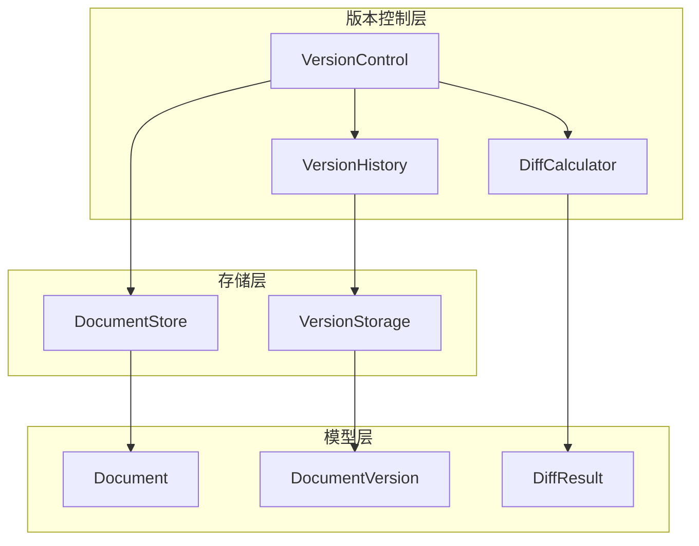

# 文档中心完善设计文档

> Phase 1.1 补充设计
> 
> 版本：1.0
> 创建日期：2026-03-16

---

## 1. 概述

### 1.1 当前状态

| 文件 | 当前状态 | 问题 |
|------|---------|------|
| `store.py` | ✅ 完整 | 无 |
| `models.py` | ✅ 完整 | 无 |
| `version.py` | ❌ 空实现 | 所有方法体为 `pass` |
| `lock.py` | ❌ 空实现 | 所有方法体为 `pass` |
| `notification.py` | 🟡 半实现 | `_notify_subscribers` 为空 |

### 1.2 项目目标关联

| 项目目标 | 文档中心要求 |
|---------|-------------|
| 📄 文档交付 | 支持完整版本控制、Diff、回滚 |
| 🤝 平等协作 | 文档锁防止并发冲突 |
| 🙈 用户无感知 | 内部版本管理透明 |

---

## 2. 版本控制完善设计

### 2.1 架构设计



### 2.2 数据模型

```python
# src/document_hub/models.py (新增)

from pydantic import BaseModel, Field
from typing import Optional, List, Dict, Any
from enum import Enum
import time


class DiffType(Enum):
    """Diff 类型"""
    ADDED = "added"       # 新增行
    REMOVED = "removed"   # 删除行
    MODIFIED = "modified" # 修改行
    UNCHANGED = "unchanged" # 未改变


class DiffLine(BaseModel):
    """Diff 行"""
    type: DiffType
    old_line_no: Optional[int] = None
    new_line_no: Optional[int] = None
    content: str


class DiffResult(BaseModel):
    """Diff 结果"""
    old_version: int
    new_version: int
    lines: List[DiffLine] = Field(default_factory=list)
    additions: int = 0
    deletions: int = 0
    modifications: int = 0
    summary: str = ""


class DocumentVersion(BaseModel):
    """文档版本"""
    version_id: str
    document_id: str
    version: int
    content: str                    # 内容快照
    author: str
    timestamp: int
    change_summary: str
    diff: Optional[DiffResult] = None
    parent_version_id: Optional[str] = None
    tags: List[str] = Field(default_factory=list)


class VersionHistory(BaseModel):
    """版本历史"""
    document_id: str
    versions: List[DocumentVersion] = Field(default_factory=list)
    current_version: int = 0
    total_versions: int = 0
```

### 2.3 Diff 计算算法

```python
# src/document_hub/diff.py

import difflib
from typing import List, Tuple
from .models import DiffLine, DiffType, DiffResult


class DiffCalculator:
    """
    Diff 计算器
    
    使用 Myers diff 算法计算两个文本之间的差异
    """
    
    def calculate(self, old_content: str, new_content: str) -> DiffResult:
        """
        计算两个内容之间的 Diff
        
        Args:
            old_content: 旧内容
            new_content: 新内容
            
        Returns:
            DiffResult: Diff 结果
        """
        old_lines = old_content.splitlines(keepends=True)
        new_lines = new_content.splitlines(keepends=True)
        
        # 使用 unified_diff 格式
        diff = difflib.unified_diff(
            old_lines,
            new_lines,
            fromfile='old',
            tofile='new',
            lineterm=''
        )
        
        # 解析 diff 结果
        lines = self._parse_diff(list(diff))
        
        # 统计
        additions = sum(1 for l in lines if l.type == DiffType.ADDED)
        deletions = sum(1 for l in lines if l.type == DiffType.REMOVED)
        modifications = sum(1 for l in lines if l.type == DiffType.MODIFIED)
        
        return DiffResult(
            old_version=0,  # 由调用者设置
            new_version=0,  # 由调用者设置
            lines=lines,
            additions=additions,
            deletions=deletions,
            modifications=modifications,
            summary=f"+{additions} -{deletions} ~{modifications}"
        )
    
    def _parse_diff(self, diff_lines: List[str]) -> List[DiffLine]:
        """解析 diff 输出"""
        result = []
        old_line_no = 0
        new_line_no = 0
        
        for line in diff_lines:
            if line.startswith('@@'):
                # 解析行号信息
                # @@ -old_start,old_count +new_start,new_count @@
                import re
                match = re.search(r'@@ -(\d+),?\d* \+(\d+),?\d* @@', line)
                if match:
                    old_line_no = int(match.group(1))
                    new_line_no = int(match.group(2))
                continue
            
            if line.startswith('---') or line.startswith('+++'):
                continue
            
            if line.startswith('-'):
                result.append(DiffLine(
                    type=DiffType.REMOVED,
                    old_line_no=old_line_no,
                    content=line[1:]
                ))
                old_line_no += 1
            elif line.startswith('+'):
                result.append(DiffLine(
                    type=DiffType.ADDED,
                    new_line_no=new_line_no,
                    content=line[1:]
                ))
                new_line_no += 1
            elif line.startswith(' '):
                result.append(DiffLine(
                    type=DiffType.UNCHANGED,
                    old_line_no=old_line_no,
                    new_line_no=new_line_no,
                    content=line[1:]
                ))
                old_line_no += 1
                new_line_no += 1
        
        return result
    
    def apply_diff(self, content: str, diff: DiffResult) -> str:
        """
        应用 Diff 到内容
        
        用于版本回滚场景
        """
        lines = content.splitlines(keepends=True)
        result = []
        
        for diff_line in diff.lines:
            if diff_line.type == DiffType.UNCHANGED:
                if diff_line.old_line_no and diff_line.old_line_no <= len(lines):
                    result.append(lines[diff_line.old_line_no - 1])
            elif diff_line.type == DiffType.ADDED:
                result.append(diff_line.content + '\n')
            # REMOVED 类型跳过（不添加到结果）
        
        return ''.join(result)
```

### 2.4 版本控制实现

```python
# src/document_hub/version.py

from __future__ import annotations

import json
import hashlib
import time
from pathlib import Path
from typing import Optional, List, Dict, Any

from .models import DocumentVersion, DiffResult
from .diff import DiffCalculator


class VersionControl:
    """
    版本控制器
    
    功能：
    - 创建版本快照
    - 计算版本间 Diff
    - 版本回滚
    - 版本历史管理
    """
    
    def __init__(self, store, version_path: Optional[Path] = None):
        """
        初始化版本控制器
        
        Args:
            store: DocumentStore 实例
            version_path: 版本存储路径
        """
        self.store = store
        self.version_path = version_path or store.base_path.parent / "versions"
        self.diff_calculator = DiffCalculator()
        
        # 确保版本目录存在
        self.version_path.mkdir(parents=True, exist_ok=True)
    
    async def create_version(
        self,
        document_id: str,
        content: str,
        author: str,
        change_summary: str = "",
    ) -> DocumentVersion:
        """
        创建新版本
        
        Args:
            document_id: 文档 ID
            content: 文档内容
            author: 作者
            change_summary: 变更摘要
            
        Returns:
            DocumentVersion: 新创建的版本
        """
        # 获取当前版本号
        current_version = await self._get_current_version(document_id)
        new_version = current_version + 1
        
        # 计算 Diff（如果有上一版本）
        diff = None
        if current_version > 0:
            prev_version = await self.get_version(document_id, current_version)
            if prev_version:
                diff = self.diff_calculator.calculate(
                    prev_version.content,
                    content
                )
                diff.old_version = current_version
                diff.new_version = new_version
        
        # 创建版本对象
        version = DocumentVersion(
            version_id=self._generate_version_id(document_id, new_version),
            document_id=document_id,
            version=new_version,
            content=content,
            author=author,
            timestamp=int(time.time()),
            change_summary=change_summary,
            diff=diff,
            parent_version_id=self._generate_version_id(document_id, current_version) if current_version > 0 else None,
        )
        
        # 保存版本
        await self._save_version(version)
        
        return version
    
    async def get_version(
        self,
        document_id: str,
        version: int,
    ) -> Optional[DocumentVersion]:
        """
        获取指定版本
        
        Args:
            document_id: 文档 ID
            version: 版本号
            
        Returns:
            DocumentVersion 或 None
        """
        version_file = self._get_version_file_path(document_id, version)
        
        if not version_file.exists():
            return None
        
        with open(version_file, 'r', encoding='utf-8') as f:
            data = json.load(f)
        
        return DocumentVersion(**data)
    
    async def get_version_history(
        self,
        document_id: str,
        limit: int = 50,
    ) -> List[DocumentVersion]:
        """
        获取版本历史
        
        Args:
            document_id: 文档 ID
            limit: 最大返回数量
            
        Returns:
            版本列表（按版本号降序）
        """
        versions = []
        doc_version_dir = self.version_path / document_id
        
        if not doc_version_dir.exists():
            return versions
        
        # 获取所有版本文件
        version_files = sorted(
            doc_version_dir.glob("v*.json"),
            key=lambda p: int(p.stem[1:]),
            reverse=True
        )
        
        for vf in version_files[:limit]:
            with open(vf, 'r', encoding='utf-8') as f:
                data = json.load(f)
            versions.append(DocumentVersion(**data))
        
        return versions
    
    async def rollback(
        self,
        document_id: str,
        target_version: int,
        author: str,
    ) -> Optional[DocumentVersion]:
        """
        回滚到指定版本
        
        Args:
            document_id: 文档 ID
            target_version: 目标版本号
            author: 执行回滚的作者
            
        Returns:
            新版本（内容为回滚后的内容）
        """
        # 获取目标版本
        target = await self.get_version(document_id, target_version)
        if not target:
            raise ValueError(f"Version {target_version} not found for document {document_id}")
        
        # 创建新版本（内容为目标版本内容）
        new_version = await self.create_version(
            document_id=document_id,
            content=target.content,
            author=author,
            change_summary=f"Rollback to version {target_version}",
        )
        
        return new_version
    
    async def compare_versions(
        self,
        document_id: str,
        version1: int,
        version2: int,
    ) -> Optional[DiffResult]:
        """
        比较两个版本
        
        Args:
            document_id: 文档 ID
            version1: 版本1
            version2: 版本2
            
        Returns:
            DiffResult 或 None
        """
        v1 = await self.get_version(document_id, version1)
        v2 = await self.get_version(document_id, version2)
        
        if not v1 or not v2:
            return None
        
        diff = self.diff_calculator.calculate(v1.content, v2.content)
        diff.old_version = version1
        diff.new_version = version2
        
        return diff
    
    async def _get_current_version(self, document_id: str) -> int:
        """获取当前版本号"""
        doc_version_dir = self.version_path / document_id
        
        if not doc_version_dir.exists():
            return 0
        
        version_files = list(doc_version_dir.glob("v*.json"))
        if not version_files:
            return 0
        
        return max(int(vf.stem[1:]) for vf in version_files)
    
    def _generate_version_id(self, document_id: str, version: int) -> str:
        """生成版本 ID"""
        return f"{document_id}_v{version}"
    
    def _get_version_file_path(self, document_id: str, version: int) -> Path:
        """获取版本文件路径"""
        doc_version_dir = self.version_path / document_id
        doc_version_dir.mkdir(parents=True, exist_ok=True)
        return doc_version_dir / f"v{version}.json"
    
    async def _save_version(self, version: DocumentVersion):
        """保存版本到文件"""
        version_file = self._get_version_file_path(
            version.document_id,
            version.version
        )
        
        with open(version_file, 'w', encoding='utf-8') as f:
            json.dump(version.model_dump(), f, ensure_ascii=False, indent=2)
    
    async def get_statistics(self, document_id: str) -> Dict[str, Any]:
        """获取版本统计信息"""
        history = await self.get_version_history(document_id, limit=1000)
        
        if not history:
            return {
                "total_versions": 0,
                "authors": [],
                "first_version": None,
                "last_version": None,
            }
        
        authors = list(set(v.author for v in history))
        
        return {
            "total_versions": len(history),
            "authors": authors,
            "first_version": history[-1].version if history else None,
            "last_version": history[0].version if history else None,
            "total_changes": sum(
                (v.diff.additions + v.diff.deletions) 
                for v in history if v.diff
            ),
        }
```

---

## 3. 文档锁完善设计

### 3.1 锁类型说明

```mermaid
graph LR
    subgraph 读锁(共享)
        R1[Agent A 读锁]
        R2[Agent B 读锁]
        R1 -.-> R2
    end
    
    subgraph 写锁(独占)
        W1[Agent A 写锁]
        W2[Agent B 请求]
        W1 -->|阻塞| W2
    end
    
    subgraph 读写互斥
        RR[Agent A 读锁]
        WW[Agent B 写锁请求]
        RR -->|阻塞| WW
    end
```

### 3.2 数据模型

```python
# src/document_hub/models.py (新增)

from enum import Enum
from pydantic import BaseModel, Field
from typing import Optional
import time


class LockType(Enum):
    """锁类型"""
    READ = "read"     # 共享锁，允许多个读者
    WRITE = "write"   # 独占锁，只允许一个写者


class LockStatus(Enum):
    """锁状态"""
    PENDING = "pending"     # 等待中
    ACQUIRED = "acquired"   # 已获取
    RELEASED = "released"   # 已释放
    EXPIRED = "expired"     # 已过期
    DEADLOCK = "deadlock"   # 死锁检测


class DocumentLock(BaseModel):
    """文档锁"""
    lock_id: str
    document_id: str
    lock_type: LockType
    holder: str                    # 持有者 (Agent 角色)
    acquired_at: int
    expires_at: int
    status: LockStatus = LockStatus.PENDING
    
    # 死锁检测相关
    waiting_for: Optional[str] = None  # 等待的锁 ID
    waited_by: list[str] = Field(default_factory=list)  # 被谁等待
```

### 3.3 锁管理器实现

```python
# src/document_hub/lock.py

from __future__ import annotations

import asyncio
import hashlib
import time
from enum import Enum
from typing import Optional, Dict, List, Set, Any
from datetime import datetime
import logging

from .models import DocumentLock, LockType, LockStatus

logger = logging.getLogger(__name__)


class DeadlockError(Exception):
    """死锁异常"""
    pass


class LockTimeoutError(Exception):
    """锁超时异常"""
    pass


class LockManager:
    """
    文档锁管理器
    
    功能：
    - 读写锁 (共享/独占)
    - 锁超时自动释放
    - 死锁检测
    - 锁等待队列
    """
    
    def __init__(
        self,
        default_timeout: int = 300,
        deadlock_check_interval: int = 10,
    ):
        """
        初始化锁管理器
        
        Args:
            default_timeout: 默认锁超时时间（秒）
            deadlock_check_interval: 死锁检测间隔（秒）
        """
        self.default_timeout = default_timeout
        self.deadlock_check_interval = deadlock_check_interval
        
        # 活跃锁：document_id -> List[DocumentLock]
        self._locks: Dict[str, List[DocumentLock]] = {}
        
        # 等待队列：document_id -> List[Tuple[DocumentLock, asyncio.Event]]
        self._wait_queue: Dict[str, List[tuple]] = {}
        
        # 锁持有者索引：holder -> List[lock_id]
        self._holder_index: Dict[str, List[str]] = {}
        
        # 锁 ID 索引：lock_id -> DocumentLock
        self._lock_by_id: Dict[str, DocumentLock] = {}
        
        # 异步锁
        self._async_lock = asyncio.Lock()
        
        # 后台任务
        self._running = False
        self._cleanup_task: Optional[asyncio.Task] = None
    
    async def start(self):
        """启动锁管理器"""
        self._running = True
        self._cleanup_task = asyncio.create_task(self._cleanup_loop())
        logger.info("LockManager started")
    
    async def stop(self):
        """停止锁管理器"""
        self._running = False
        if self._cleanup_task:
            self._cleanup_task.cancel()
            try:
                await self._cleanup_task
            except asyncio.CancelledError:
                pass
        logger.info("LockManager stopped")
    
    async def acquire_read_lock(
        self,
        document_id: str,
        holder: str,
        timeout: Optional[int] = None,
    ) -> DocumentLock:
        """
        获取读锁
        
        读锁是共享的，多个 Agent 可以同时持有读锁，
        但不能在有写锁时获取读锁。
        
        Args:
            document_id: 文档 ID
            holder: 持有者
            timeout: 超时时间（秒）
            
        Returns:
            DocumentLock: 获取的锁
            
        Raises:
            LockTimeoutError: 获取锁超时
            DeadlockError: 检测到死锁
        """
        return await self._acquire_lock(
            document_id=document_id,
            lock_type=LockType.READ,
            holder=holder,
            timeout=timeout,
        )
    
    async def acquire_write_lock(
        self,
        document_id: str,
        holder: str,
        timeout: Optional[int] = None,
    ) -> DocumentLock:
        """
        获取写锁
        
        写锁是独占的，不能有其他的读锁或写锁。
        
        Args:
            document_id: 文档 ID
            holder: 持有者
            timeout: 超时时间（秒）
            
        Returns:
            DocumentLock: 获取的锁
            
        Raises:
            LockTimeoutError: 获取锁超时
            DeadlockError: 检测到死锁
        """
        return await self._acquire_lock(
            document_id=document_id,
            lock_type=LockType.WRITE,
            holder=holder,
            timeout=timeout,
        )
    
    async def release_lock(self, lock_id: str) -> bool:
        """
        释放锁
        
        Args:
            lock_id: 锁 ID
            
        Returns:
            bool: 是否成功释放
        """
        async with self._async_lock:
            lock = self._lock_by_id.get(lock_id)
            if not lock:
                return False
            
            document_id = lock.document_id
            
            # 从活跃锁列表移除
            if document_id in self._locks:
                self._locks[document_id] = [
                    l for l in self._locks[document_id] 
                    if l.lock_id != lock_id
                ]
            
            # 从持有者索引移除
            if lock.holder in self._holder_index:
                self._holder_index[lock.holder] = [
                    lid for lid in self._holder_index[lock.holder]
                    if lid != lock_id
                ]
            
            # 从 ID 索引移除
            del self._lock_by_id[lock_id]
            
            # 更新状态
            lock.status = LockStatus.RELEASED
            
            # 通知等待者
            await self._notify_waiters(document_id)
            
            logger.debug(f"Lock released: {lock_id} by {lock.holder}")
            return True
    
    async def release_all_locks(self, holder: str) -> int:
        """
        释放某个持有者的所有锁
        
        Args:
            holder: 持有者
            
        Returns:
            int: 释放的锁数量
        """
        lock_ids = self._holder_index.get(holder, []).copy()
        count = 0
        
        for lock_id in lock_ids:
            if await self.release_lock(lock_id):
                count += 1
        
        return count
    
    async def get_lock_info(self, document_id: str) -> List[DocumentLock]:
        """获取文档的锁信息"""
        return self._locks.get(document_id, []).copy()
    
    async def is_locked(self, document_id: str) -> bool:
        """检查文档是否被锁定"""
        return document_id in self._locks and len(self._locks[document_id]) > 0
    
    async def _acquire_lock(
        self,
        document_id: str,
        lock_type: LockType,
        holder: str,
        timeout: Optional[int] = None,
    ) -> DocumentLock:
        """内部获取锁方法"""
        timeout = timeout or self.default_timeout
        
        # 创建锁对象
        lock = DocumentLock(
            lock_id=self._generate_lock_id(document_id, holder),
            document_id=document_id,
            lock_type=lock_type,
            holder=holder,
            acquired_at=int(time.time()),
            expires_at=int(time.time()) + timeout,
            status=LockStatus.PENDING,
        )
        
        # 检查是否可以立即获取
        can_acquire = await self._can_acquire_lock(document_id, lock_type, holder)
        
        if can_acquire:
            async with self._async_lock:
                await self._register_lock(lock)
            return lock
        
        # 需要等待
        event = asyncio.Event()
        wait_entry = (lock, event)
        
        if document_id not in self._wait_queue:
            self._wait_queue[document_id] = []
        self._wait_queue[document_id].append(wait_entry)
        
        # 死锁检测
        if await self._detect_deadlock(holder, document_id):
            self._wait_queue[document_id].remove(wait_entry)
            raise DeadlockError(f"Deadlock detected for {holder} on {document_id}")
        
        try:
            # 等待锁可用
            await asyncio.wait_for(event.wait(), timeout=timeout)
            
            async with self._async_lock:
                await self._register_lock(lock)
            
            return lock
            
        except asyncio.TimeoutError:
            # 从等待队列移除
            if document_id in self._wait_queue:
                self._wait_queue[document_id] = [
                    w for w in self._wait_queue[document_id]
                    if w[0].lock_id != lock.lock_id
                ]
            raise LockTimeoutError(f"Timeout acquiring {lock_type.value} lock on {document_id}")
    
    async def _can_acquire_lock(
        self,
        document_id: str,
        lock_type: LockType,
        holder: str,
    ) -> bool:
        """检查是否可以获取锁"""
        existing_locks = self._locks.get(document_id, [])
        
        # 过滤过期的锁
        active_locks = [
            l for l in existing_locks
            if l.status == LockStatus.ACQUIRED and l.expires_at > int(time.time())
        ]
        
        if not active_locks:
            return True
        
        if lock_type == LockType.READ:
            # 读锁：只有当没有写锁时才能获取
            has_write_lock = any(
                l.lock_type == LockType.WRITE for l in active_locks
            )
            return not has_write_lock
        
        else:  # WRITE
            # 写锁：不能有任何锁
            return len(active_locks) == 0
    
    async def _register_lock(self, lock: DocumentLock):
        """注册锁"""
        lock.status = LockStatus.ACQUIRED
        
        # 添加到活跃锁
        if lock.document_id not in self._locks:
            self._locks[lock.document_id] = []
        self._locks[lock.document_id].append(lock)
        
        # 添加到持有者索引
        if lock.holder not in self._holder_index:
            self._holder_index[lock.holder] = []
        self._holder_index[lock.holder].append(lock.lock_id)
        
        # 添加到 ID 索引
        self._lock_by_id[lock.lock_id] = lock
        
        logger.debug(f"Lock acquired: {lock.lock_id} ({lock.lock_type.value}) by {lock.holder}")
    
    async def _notify_waiters(self, document_id: str):
        """通知等待者"""
        wait_queue = self._wait_queue.get(document_id, [])
        
        for lock, event in wait_queue:
            can_acquire = await self._can_acquire_lock(
                document_id,
                lock.lock_type,
                lock.holder
            )
            if can_acquire:
                event.set()
    
    async def _detect_deadlock(self, holder: str, document_id: str) -> bool:
        """
        死锁检测
        
        使用等待图检测循环等待
        """
        # 构建等待图
        wait_graph: Dict[str, Set[str]] = {}
        
        for doc_id, waiters in self._wait_queue.items():
            for lock, _ in waiters:
                if lock.holder not in wait_graph:
                    wait_graph[lock.holder] = set()
                
                # 该 holder 等待持有 doc_id 锁的人
                for existing_lock in self._locks.get(doc_id, []):
                    wait_graph[lock.holder].add(existing_lock.holder)
        
        # 检测循环
        visited = set()
        path = set()
        
        def has_cycle(node: str) -> bool:
            if node in path:
                return True
            if node in visited:
                return False
            
            visited.add(node)
            path.add(node)
            
            for neighbor in wait_graph.get(node, set()):
                if has_cycle(neighbor):
                    return True
            
            path.remove(node)
            return False
        
        return has_cycle(holder)
    
    def _generate_lock_id(self, document_id: str, holder: str) -> str:
        """生成锁 ID"""
        timestamp = int(time.time() * 1000)
        data = f"{document_id}:{holder}:{timestamp}"
        return "lock_" + hashlib.md5(data.encode()).hexdigest()[:12]
    
    async def _cleanup_loop(self):
        """清理过期锁的后台任务"""
        while self._running:
            try:
                await self._cleanup_expired_locks()
                await asyncio.sleep(self.deadlock_check_interval)
            except asyncio.CancelledError:
                break
            except Exception as e:
                logger.error(f"Error in cleanup loop: {e}")
    
    async def _cleanup_expired_locks(self):
        """清理过期锁"""
        now = int(time.time())
        expired_locks = []
        
        async with self._async_lock:
            for document_id, locks in list(self._locks.items()):
                for lock in locks[:]:
                    if lock.expires_at < now:
                        lock.status = LockStatus.EXPIRED
                        expired_locks.append(lock.lock_id)
                        locks.remove(lock)
                        
                        logger.warning(f"Lock expired: {lock.lock_id} by {lock.holder}")
                
                if not locks:
                    del self._locks[document_id]
        
        # 通知等待者
        for document_id in set(l.split('_')[0] for l in expired_locks):
            await self._notify_waiters(document_id)
    
    def get_statistics(self) -> Dict[str, Any]:
        """获取锁统计信息"""
        total_locks = sum(len(locks) for locks in self._locks.values())
        total_waiters = sum(len(waiters) for waiters in self._wait_queue.values())
        
        locks_by_type = {
            LockType.READ.value: 0,
            LockType.WRITE.value: 0,
        }
        
        for locks in self._locks.values():
            for lock in locks:
                locks_by_type[lock.lock_type.value] += 1
        
        return {
            "total_active_locks": total_locks,
            "total_waiters": total_waiters,
            "locks_by_type": locks_by_type,
            "documents_locked": len(self._locks),
        }
```

---

## 4. 通知服务完善设计

### 4.1 通知服务实现

```python
# src/document_hub/notification.py

from __future__ import annotations

import asyncio
import hashlib
import time
from enum import Enum
from typing import Optional, List, Callable, Dict, Any, Set
from pydantic import BaseModel, Field
import logging

logger = logging.getLogger(__name__)


class NotificationType(Enum):
    """通知类型"""
    DOCUMENT_CREATED = "document_created"
    DOCUMENT_UPDATED = "document_updated"
    DOCUMENT_DELETED = "document_deleted"
    DOCUMENT_LOCKED = "document_locked"
    DOCUMENT_UNLOCKED = "document_unlocked"
    VERSION_CREATED = "version_created"
    VERSION_ROLLBACK = "version_rollback"


class NotificationPriority(Enum):
    """通知优先级"""
    LOW = "low"
    NORMAL = "normal"
    HIGH = "high"
    URGENT = "urgent"


class Notification(BaseModel):
    """通知"""
    id: str
    type: NotificationType
    priority: NotificationPriority
    document_id: str
    document_title: str
    message: str
    sender: str
    recipients: List[str]
    timestamp: int
    read: bool = False
    metadata: Dict[str, Any] = Field(default_factory=dict)


class NotificationService:
    """
    通知服务
    
    功能：
    - 订阅/发布模式
    - 按主题过滤
    - 批量通知
    - 通知历史
    """
    
    def __init__(self):
        # 订阅者：topic -> Set[callback]
        self._subscribers: Dict[str, Set[Callable]] = {}
        
        # Agent 收件箱：agent_role -> List[Notification]
        self._inbox: Dict[str, List[Notification]] = {}
        
        # 通知历史
        self._history: List[Notification] = []
        
        # 最大历史数
        self.max_history = 1000
    
    def subscribe(
        self,
        topic: str,
        callback: Callable[[Notification], None],
    ):
        """
        订阅主题
        
        Args:
            topic: 主题名称
                - "document.*" - 所有文档事件
                - "document.created" - 文档创建
                - "document.updated.{doc_type}" - 特定类型更新
                - "agent.{role}" - 特定 Agent 的通知
            callback: 回调函数
        """
        if topic not in self._subscribers:
            self._subscribers[topic] = set()
        self._subscribers[topic].add(callback)
        logger.debug(f"Subscribed to topic: {topic}")
    
    def unsubscribe(
        self,
        topic: str,
        callback: Callable[[Notification], None],
    ):
        """取消订阅"""
        if topic in self._subscribers:
            self._subscribers[topic].discard(callback)
    
    async def publish(self, notification: Notification):
        """
        发布通知
        
        Args:
            notification: 通知对象
        """
        # 添加到历史
        self._history.append(notification)
        if len(self._history) > self.max_history:
            self._history = self._history[-self.max_history:]
        
        # 添加到收件箱
        for recipient in notification.recipients:
            if recipient not in self._inbox:
                self._inbox[recipient] = []
            self._inbox[recipient].append(notification)
        
        # 通知订阅者
        await self._notify_subscribers(notification)
        
        logger.debug(f"Notification published: {notification.id} to {notification.recipients}")
    
    async def _notify_subscribers(self, notification: Notification):
        """通知匹配的订阅者"""
        topics_to_notify: Set[str] = set()
        
        # 精确匹配
        exact_topic = f"document.{notification.type.value}"
        if exact_topic in self._subscribers:
            topics_to_notify.add(exact_topic)
        
        # 通配符匹配
        wildcard_topic = "document.*"
        if wildcard_topic in self._subscribers:
            topics_to_notify.add(wildcard_topic)
        
        # 按 Agent 匹配
        for recipient in notification.recipients:
            agent_topic = f"agent.{recipient}"
            if agent_topic in self._subscribers:
                topics_to_notify.add(agent_topic)
        
        # 按文档类型匹配
        doc_type = notification.metadata.get("doc_type")
        if doc_type:
            type_topic = f"document.{notification.type.value}.{doc_type}"
            if type_topic in self._subscribers:
                topics_to_notify.add(type_topic)
        
        # 发送通知
        for topic in topics_to_notify:
            for callback in self._subscribers.get(topic, set()):
                try:
                    if asyncio.iscoroutinefunction(callback):
                        await callback(notification)
                    else:
                        callback(notification)
                except Exception as e:
                    logger.error(f"Error in notification callback: {e}")
    
    async def notify_document_change(
        self,
        notification_type: NotificationType,
        document_id: str,
        document_title: str,
        sender: str,
        recipients: List[str],
        metadata: Optional[Dict[str, Any]] = None,
    ):
        """
        发送文档变更通知
        
        便捷方法
        """
        notification = Notification(
            id=self._generate_notification_id(),
            type=notification_type,
            priority=NotificationPriority.NORMAL,
            document_id=document_id,
            document_title=document_title,
            message=self._generate_message(notification_type, document_title, sender),
            sender=sender,
            recipients=recipients,
            timestamp=int(time.time()),
            metadata=metadata or {},
        )
        
        await self.publish(notification)
    
    def get_inbox(
        self,
        agent_role: str,
        unread_only: bool = False,
        limit: int = 50,
    ) -> List[Notification]:
        """
        获取 Agent 的收件箱
        
        Args:
            agent_role: Agent 角色
            unread_only: 是否只返回未读
            limit: 最大数量
            
        Returns:
            通知列表
        """
        notifications = self._inbox.get(agent_role, [])
        
        if unread_only:
            notifications = [n for n in notifications if not n.read]
        
        return notifications[-limit:]
    
    def mark_as_read(self, notification_id: str, agent_role: str):
        """标记通知为已读"""
        for notification in self._inbox.get(agent_role, []):
            if notification.id == notification_id:
                notification.read = True
                break
    
    def clear_inbox(self, agent_role: str):
        """清空收件箱"""
        self._inbox[agent_role] = []
    
    def get_history(
        self,
        document_id: Optional[str] = None,
        notification_type: Optional[NotificationType] = None,
        limit: int = 100,
    ) -> List[Notification]:
        """获取通知历史"""
        results = self._history
        
        if document_id:
            results = [n for n in results if n.document_id == document_id]
        
        if notification_type:
            results = [n for n in results if n.type == notification_type]
        
        return results[-limit:]
    
    def _generate_notification_id(self) -> str:
        """生成通知 ID"""
        timestamp = int(time.time() * 1000)
        data = f"notification:{timestamp}"
        return "notif_" + hashlib.md5(data.encode()).hexdigest()[:12]
    
    def _generate_message(
        self,
        notification_type: NotificationType,
        document_title: str,
        sender: str,
    ) -> str:
        """生成通知消息"""
        messages = {
            NotificationType.DOCUMENT_CREATED: f"{sender} 创建了文档: {document_title}",
            NotificationType.DOCUMENT_UPDATED: f"{sender} 更新了文档: {document_title}",
            NotificationType.DOCUMENT_DELETED: f"{sender} 删除了文档: {document_title}",
            NotificationType.DOCUMENT_LOCKED: f"{sender} 锁定了文档: {document_title}",
            NotificationType.DOCUMENT_UNLOCKED: f"{sender} 解锁了文档: {document_title}",
            NotificationType.VERSION_CREATED: f"{sender} 创建了新版本: {document_title}",
            NotificationType.VERSION_ROLLBACK: f"{sender} 回滚了文档: {document_title}",
        }
        return messages.get(notification_type, f"{sender} 对 {document_title} 执行了操作")
```

---

## 5. 实现计划

### 5.1 文件变更清单

| 文件 | 操作 | 内容 |
|------|------|------|
| `models.py` | 修改 | 新增 Diff 相关模型 |
| `diff.py` | 新增 | DiffCalculator 类 |
| `version.py` | 重写 | 完整版本控制实现 |
| `lock.py` | 重写 | 完整锁管理器实现 |
| `notification.py` | 重写 | 完整通知服务实现 |

### 5.2 预计工时

| 任务 | 时间 |
|------|------|
| Diff 计算器 | 1h |
| 版本控制完善 | 1.5h |
| 锁管理器完善 | 1.5h |
| 通知服务完善 | 1h |
| 单元测试 | 1h |
| **总计** | **6h** |

---

## 6. 测试用例

### 6.1 版本控制测试

```python
# tests/document_hub/test_version.py

import pytest
from document_hub.version import VersionControl
from document_hub.store import DocumentStore
from document_hub.models import Document, DocumentMetadata, DocumentContent, DocumentType


@pytest.fixture
async def setup():
    store = DocumentStore(base_path="./test_storage")
    version_control = VersionControl(store)
    return store, version_control


async def test_create_version(setup):
    """测试创建版本"""
    store, vc = setup
    
    # 创建文档
    doc = Document(
        id="test_doc_1",
        path="test/test.md",
        metadata=DocumentMetadata(
            title="Test Document",
            doc_type=DocumentType.OTHER,
            author="Test Agent",
            created_at=0,
            updated_at=0,
            version=1,
        ),
        content=DocumentContent(content="Version 1 content"),
    )
    await store.save(doc)
    
    # 创建版本
    version = await vc.create_version(
        document_id="test_doc_1",
        content="Version 1 content",
        author="Test Agent",
        change_summary="Initial version",
    )
    
    assert version.version == 1
    assert version.author == "Test Agent"


async def test_rollback(setup):
    """测试版本回滚"""
    store, vc = setup
    
    # 创建多个版本
    for i in range(3):
        await vc.create_version(
            document_id="test_doc_1",
            content=f"Version {i+1} content",
            author="Test Agent",
            change_summary=f"Version {i+1}",
        )
    
    # 回滚到版本 1
    rolled_back = await vc.rollback(
        document_id="test_doc_1",
        target_version=1,
        author="Test Agent",
    )
    
    assert rolled_back.content == "Version 1 content"
    assert rolled_back.version == 4  # 新版本号
```

### 6.2 锁管理器测试

```python
# tests/document_hub/test_lock.py

import pytest
import asyncio
from document_hub.lock import LockManager, LockType, LockTimeoutError, DeadlockError


@pytest.fixture
async def lock_manager():
    lm = LockManager()
    await lm.start()
    yield lm
    await lm.stop()


async def test_read_lock_shared(lock_manager):
    """测试读锁共享"""
    # 获取第一个读锁
    lock1 = await lock_manager.acquire_read_lock("doc_1", "Agent A")
    assert lock1.status.value == "acquired"
    
    # 获取第二个读锁（应该成功）
    lock2 = await lock_manager.acquire_read_lock("doc_1", "Agent B")
    assert lock2.status.value == "acquired"
    
    # 释放
    await lock_manager.release_lock(lock1.lock_id)
    await lock_manager.release_lock(lock2.lock_id)


async def test_write_lock_exclusive(lock_manager):
    """测试写锁独占"""
    # 获取写锁
    lock1 = await lock_manager.acquire_write_lock("doc_2", "Agent A")
    assert lock1.status.value == "acquired"
    
    # 尝试获取另一个写锁（应该等待）
    with pytest.raises(LockTimeoutError):
        await lock_manager.acquire_write_lock(
            "doc_2", "Agent B", timeout=1
        )
    
    await lock_manager.release_lock(lock1.lock_id)


async def test_deadlock_detection(lock_manager):
    """测试死锁检测"""
    # Agent A 锁 doc_1
    lock1 = await lock_manager.acquire_write_lock("doc_1", "Agent A")
    
    # Agent B 锁 doc_2
    lock2 = await lock_manager.acquire_write_lock("doc_2", "Agent B")
    
    # Agent A 尝试锁 doc_2（应该等待）
    # Agent B 尝试锁 doc_1（应该检测到死锁）
    
    # 这个测试需要更复杂的设置
    await lock_manager.release_lock(lock1.lock_id)
    await lock_manager.release_lock(lock2.lock_id)
```

---

> 最后更新：2026-03-16
> 状态：设计完成
> 下一步：实施