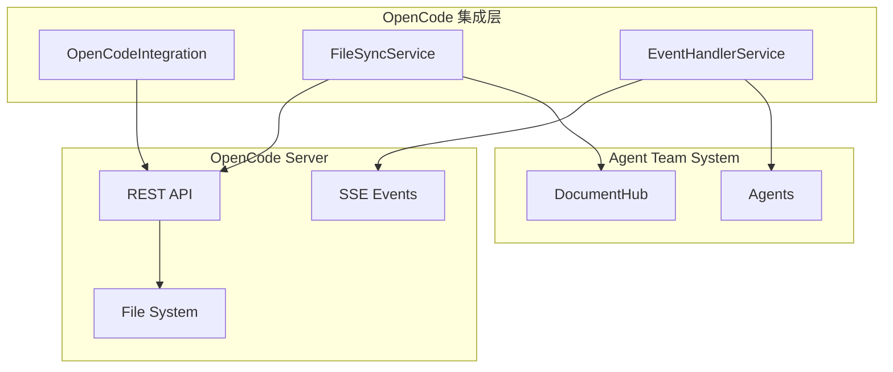

# OpenCode 集成完善设计文档

> Phase 1.6 补充设计
> 
> 版本：1.0
> 创建日期：2026-03-16

---

## 1. 概述

### 1.1 当前状态

| 功能 | 当前状态 | 问题 |
|------|---------|------|
| 连接管理 | ✅ 完整 | 无 |
| 会话管理 | ✅ 完整 | 无 |
| 消息发送 | ✅ 完整 | 已修复 agent="System" 问题 |
| TeamRunner | ✅ 完整 | 无 |
| 文件读写 | 🟡 间接实现 | 通过消息间接操作 |
| 事件流(SSE) | ❌ 未实现 | 缺失 |

### 1.2 项目目标关联

| 项目目标 | OpenCode 集成要求 |
|---------|------------------|
| 🙈 用户无感知 | 与 OpenCode 无缝集成 |
| 📄 文档交付 | 支持文件同步 |
| 🔄 持续迭代 | 实时事件通知 |

---

## 2. 文件同步服务设计

### 2.1 架构设计



### 2.2 文件同步服务实现

```python
# src/agent/file_sync.py

from __future__ import annotations

import asyncio
import hashlib
import time
from pathlib import Path
from typing import Optional, List, Dict, Any, Callable
from dataclasses import dataclass, field
from enum import Enum
import logging
import json

logger = logging.getLogger(__name__)


class SyncStatus(Enum):
    """同步状态"""
    SYNCED = "synced"           # 已同步
    PENDING = "pending"         # 待同步
    CONFLICT = "conflict"       # 冲突
    ERROR = "error"             # 错误


@dataclass
class FileInfo:
    """文件信息"""
    path: str
    content: str
    hash: str
    size: int
    modified_at: int
    sync_status: SyncStatus = SyncStatus.SYNCED


@dataclass
class SyncConflict:
    """同步冲突"""
    path: str
    local_content: str
    remote_content: str
    local_modified: int
    remote_modified: int
    resolution: Optional[str] = None


class FileSyncService:
    """
    文件同步服务
    
    功能：
    - 双向文件同步
    - 冲突检测和解决
    - 增量同步
    - 文件监控
    """
    
    def __init__(
        self,
        opencode_client: Any,
        document_hub: Any,
        local_base_path: str = "./workspace",
    ):
        """
        初始化文件同步服务
        
        Args:
            opencode_client: OpenCode 客户端
            document_hub: 文档中心
            local_base_path: 本地基础路径
        """
        self.client = opencode_client
        self.document_hub = document_hub
        self.local_base_path = Path(local_base_path)
        
        # 文件状态缓存
        self._file_cache: Dict[str, FileInfo] = {}
        
        # 冲突队列
        self._conflicts: List[SyncConflict] = []
        
        # 监控回调
        self._watch_callbacks: Dict[str, List[Callable]] = {}
        
        # 同步锁
        self._sync_lock = asyncio.Lock()
        
        # 运行状态
        self._running = False
        self._watch_task: Optional[asyncio.Task] = None
    
    async def start(self):
        """启动同步服务"""
        self._running = True
        self._watch_task = asyncio.create_task(self._watch_loop())
        logger.info("FileSyncService started")
    
    async def stop(self):
        """停止同步服务"""
        self._running = False
        if self._watch_task:
            self._watch_task.cancel()
            try:
                await self._watch_task
            except asyncio.CancelledError:
                pass
        logger.info("FileSyncService stopped")
    
    async def read_file(self, path: str) -> Optional[str]:
        """
        读取文件
        
        优先从本地缓存读取，缓存未命中则从 OpenCode 读取
        
        Args:
            path: 文件路径
            
        Returns:
            文件内容或 None
        """
        # 检查本地缓存
        if path in self._file_cache:
            return self._file_cache[path].content
        
        # 从 OpenCode 读取
        try:
            content = await self._read_from_opencode(path)
            if content is not None:
                # 更新缓存
                self._file_cache[path] = FileInfo(
                    path=path,
                    content=content,
                    hash=self._calculate_hash(content),
                    size=len(content),
                    modified_at=int(time.time()),
                )
            return content
        except Exception as e:
            logger.error(f"Failed to read file {path}: {e}")
            return None
    
    async def write_file(
        self,
        path: str,
        content: str,
        author: str,
        sync: bool = True,
    ) -> bool:
        """
        写入文件
        
        Args:
            path: 文件路径
            content: 文件内容
            author: 作者
            sync: 是否同步到 OpenCode
            
        Returns:
            是否成功
        """
        async with self._sync_lock:
            try:
                # 计算新哈希
                new_hash = self._calculate_hash(content)
                
                # 检查是否有冲突
                if path in self._file_cache:
                    cached = self._file_cache[path]
                    if cached.hash != new_hash and cached.sync_status == SyncStatus.PENDING:
                        # 有未同步的修改，可能冲突
                        await self._handle_conflict(path, content)
                        return False
                
                # 写入本地
                local_path = self.local_base_path / path
                local_path.parent.mkdir(parents=True, exist_ok=True)
                with open(local_path, 'w', encoding='utf-8') as f:
                    f.write(content)
                
                # 更新缓存
                self._file_cache[path] = FileInfo(
                    path=path,
                    content=content,
                    hash=new_hash,
                    size=len(content),
                    modified_at=int(time.time()),
                    sync_status=SyncStatus.PENDING if sync else SyncStatus.SYNCED,
                )
                
                # 同步到 OpenCode
                if sync:
                    success = await self._write_to_opencode(path, content)
                    if success:
                        self._file_cache[path].sync_status = SyncStatus.SYNCED
                
                # 保存到文档中心
                await self._save_to_document_hub(path, content, author)
                
                logger.debug(f"Wrote file {path}")
                return True
                
            except Exception as e:
                logger.error(f"Failed to write file {path}: {e}")
                return False
    
    async def sync_file(self, path: str) -> SyncStatus:
        """
        同步单个文件
        
        Args:
            path: 文件路径
            
        Returns:
            同步状态
        """
        async with self._sync_lock:
            try:
                # 获取远程内容
                remote_content = await self._read_from_opencode(path)
                
                if remote_content is None:
                    return SyncStatus.ERROR
                
                # 检查本地是否有修改
                if path in self._file_cache:
                    cached = self._file_cache[path]
                    local_content = cached.content
                    
                    if local_content != remote_content:
                        # 有差异，检查冲突
                        remote_hash = self._calculate_hash(remote_content)
                        if cached.hash != remote_hash and cached.sync_status == SyncStatus.PENDING:
                            # 本地有未同步修改，冲突
                            await self._handle_conflict(path, local_content)
                            return SyncStatus.CONFLICT
                
                # 更新缓存
                self._file_cache[path] = FileInfo(
                    path=path,
                    content=remote_content,
                    hash=self._calculate_hash(remote_content),
                    size=len(remote_content),
                    modified_at=int(time.time()),
                    sync_status=SyncStatus.SYNCED,
                )
                
                return SyncStatus.SYNCED
                
            except Exception as e:
                logger.error(f"Failed to sync file {path}: {e}")
                return SyncStatus.ERROR
    
    async def sync_all(self, paths: Optional[List[str]] = None) -> Dict[str, SyncStatus]:
        """
        同步所有文件
        
        Args:
            paths: 指定路径列表（可选）
            
        Returns:
            路径 -> 同步状态 映射
        """
        results = {}
        
        target_paths = paths or list(self._file_cache.keys())
        
        for path in target_paths:
            results[path] = await self.sync_file(path)
        
        return results
    
    async def watch_file(self, path: str, callback: Callable[[str, str], None]):
        """
        监控文件变化
        
        Args:
            path: 文件路径
            callback: 回调函数 (path, content)
        """
        if path not in self._watch_callbacks:
            self._watch_callbacks[path] = []
        self._watch_callbacks[path].append(callback)
    
    async def unwatch_file(self, path: str, callback: Callable):
        """取消监控"""
        if path in self._watch_callbacks:
            self._watch_callbacks[path] = [
                cb for cb in self._watch_callbacks[path] if cb != callback
            ]
    
    async def get_conflicts(self) -> List[SyncConflict]:
        """获取所有冲突"""
        return self._conflicts.copy()
    
    async def resolve_conflict(
        self,
        path: str,
        resolution: str,
        content: Optional[str] = None,
    ):
        """
        解决冲突
        
        Args:
            path: 文件路径
            resolution: 解决方案 ("local", "remote", "merge")
            content: 合并后的内容（当 resolution="merge" 时）
        """
        conflict = next(
            (c for c in self._conflicts if c.path == path),
            None
        )
        
        if not conflict:
            return
        
        if resolution == "local":
            # 使用本地版本
            await self.write_file(path, conflict.local_content, "System")
        elif resolution == "remote":
            # 使用远程版本
            await self.write_file(path, conflict.remote_content, "System")
        elif resolution == "merge" and content:
            # 使用合并版本
            await self.write_file(path, content, "System")
        
        # 移除冲突
        self._conflicts = [c for c in self._conflicts if c.path != path]
    
    async def _read_from_opencode(self, path: str) -> Optional[str]:
        """从 OpenCode 读取文件"""
        try:
            if not self.client:
                return None
            
            # 使用 OpenCode SDK 读取
            result = self.client.file.read(path=path)
            return result.content if result else None
            
        except Exception as e:
            logger.error(f"OpenCode read error: {e}")
            return None
    
    async def _write_to_opencode(self, path: str, content: str) -> bool:
        """写入文件到 OpenCode"""
        try:
            if not self.client:
                return False
            
            # 使用 OpenCode SDK 写入
            self.client.file.write(path=path, content=content)
            return True
            
        except Exception as e:
            logger.error(f"OpenCode write error: {e}")
            return False
    
    async def _save_to_document_hub(self, path: str, content: str, author: str):
        """保存到文档中心"""
        if not self.document_hub:
            return
        
        try:
            from document_hub.models import Document, DocumentMetadata, DocumentContent, DocumentType
            
            doc = Document(
                id=self._path_to_doc_id(path),
                path=path,
                metadata=DocumentMetadata(
                    title=Path(path).stem,
                    doc_type=self._infer_doc_type(path),
                    author=author,
                    created_at=int(time.time()),
                    updated_at=int(time.time()),
                    version=1,
                ),
                content=DocumentContent(content=content),
            )
            
            await self.document_hub.save(doc)
            
        except Exception as e:
            logger.error(f"Failed to save to document hub: {e}")
    
    async def _handle_conflict(self, path: str, local_content: str):
        """处理冲突"""
        remote_content = await self._read_from_opencode(path)
        
        if remote_content is None:
            return
        
        conflict = SyncConflict(
            path=path,
            local_content=local_content,
            remote_content=remote_content,
            local_modified=self._file_cache[path].modified_at if path in self._file_cache else int(time.time()),
            remote_modified=int(time.time()),
        )
        
        self._conflicts.append(conflict)
        self._file_cache[path].sync_status = SyncStatus.CONFLICT
        
        logger.warning(f"Sync conflict detected for {path}")
    
    async def _watch_loop(self):
        """监控循环"""
        while self._running:
            try:
                await self._check_file_changes()
                await asyncio.sleep(5)  # 每 5 秒检查一次
            except asyncio.CancelledError:
                break
            except Exception as e:
                logger.error(f"Error in watch loop: {e}")
                await asyncio.sleep(1)
    
    async def _check_file_changes(self):
        """检查文件变化"""
        for path, callbacks in self._watch_callbacks.items():
            try:
                content = await self.read_file(path)
                if content is None:
                    continue
                
                cached = self._file_cache.get(path)
                if cached:
                    new_hash = self._calculate_hash(content)
                    if new_hash != cached.hash:
                        # 文件已变化
                        for callback in callbacks:
                            try:
                                if asyncio.iscoroutinefunction(callback):
                                    await callback(path, content)
                                else:
                                    callback(path, content)
                            except Exception as e:
                                logger.error(f"Error in watch callback: {e}")
            except Exception as e:
                logger.error(f"Error checking file {path}: {e}")
    
    def _calculate_hash(self, content: str) -> str:
        """计算内容哈希"""
        return hashlib.sha256(content.encode()).hexdigest()
    
    def _path_to_doc_id(self, path: str) -> str:
        """路径转文档 ID"""
        return hashlib.md5(path.encode()).hexdigest()[:16]
    
    def _infer_doc_type(self, path: str) -> str:
        """推断文档类型"""
        path_lower = path.lower()
        
        if path_lower.endswith('.md'):
            return 'markdown'
        elif path_lower.endswith('.py'):
            return 'python'
        elif path_lower.endswith('.js') or path_lower.endswith('.ts'):
            return 'javascript'
        elif path_lower.endswith('.json'):
            return 'json'
        else:
            return 'other'
    
    def get_statistics(self) -> Dict[str, Any]:
        """获取同步统计"""
        by_status = {}
        for info in self._file_cache.values():
            status = info.sync_status.value
            by_status[status] = by_status.get(status, 0) + 1
        
        return {
            "total_files": len(self._file_cache),
            "by_status": by_status,
            "conflicts": len(self._conflicts),
            "watched_files": len(self._watch_callbacks),
        }
```

---

## 3. 事件处理服务设计

### 3.1 SSE 事件流实现

```python
# src/agent/event_handler.py

from __future__ import annotations

import asyncio
import json
import time
from typing import Optional, Dict, Any, Callable, List
from dataclasses import dataclass, field
from enum import Enum
import logging

logger = logging.getLogger(__name__)


class EventType(Enum):
    """事件类型"""
    # 文件事件
    FILE_CREATED = "file_created"
    FILE_MODIFIED = "file_modified"
    FILE_DELETED = "file_deleted"
    
    # Agent 事件
    AGENT_MESSAGE = "agent_message"
    AGENT_STATUS = "agent_status"
    AGENT_ERROR = "agent_error"
    
    # 工作流事件
    WORKFLOW_START = "workflow_start"
    WORKFLOW_PROGRESS = "workflow_progress"
    WORKFLOW_COMPLETE = "workflow_complete"
    WORKFLOW_ERROR = "workflow_error"
    
    # 系统事件
    SYSTEM_NOTIFICATION = "system_notification"
    SYSTEM_ERROR = "system_error"


@dataclass
class Event:
    """事件"""
    id: str
    type: EventType
    source: str
    data: Dict[str, Any]
    timestamp: int
    metadata: Dict[str, Any] = field(default_factory=dict)


class EventHandlerService:
    """
    事件处理服务
    
    功能：
    - SSE 事件流连接
    - 事件分发
    - 事件过滤
    - 事件历史
    """
    
    def __init__(
        self,
        opencode_client: Any,
        session_id: Optional[str] = None,
    ):
        self.client = opencode_client
        self.session_id = session_id
        
        # 事件处理器
        self._handlers: Dict[EventType, List[Callable]] = {}
        
        # 事件历史
        self._history: List[Event] = []
        self._max_history = 1000
        
        # 运行状态
        self._running = False
        self._event_task: Optional[asyncio.Task] = None
        
        # 事件队列
        self._event_queue: asyncio.Queue = asyncio.Queue()
    
    async def start(self):
        """启动事件服务"""
        self._running = True
        
        # 启动事件处理循环
        self._event_task = asyncio.create_task(self._event_loop())
        
        # 启动 SSE 连接
        await self._connect_sse()
        
        logger.info("EventHandlerService started")
    
    async def stop(self):
        """停止事件服务"""
        self._running = False
        
        if self._event_task:
            self._event_task.cancel()
            try:
                await self._event_task
            except asyncio.CancelledError:
                pass
        
        logger.info("EventHandlerService stopped")
    
    def on_event(
        self,
        event_type: EventType,
        handler: Callable[[Event], None],
    ):
        """
        注册事件处理器
        
        Args:
            event_type: 事件类型
            handler: 处理函数
        """
        if event_type not in self._handlers:
            self._handlers[event_type] = []
        self._handlers[event_type].append(handler)
    
    def off_event(
        self,
        event_type: EventType,
        handler: Callable,
    ):
        """取消事件处理器"""
        if event_type in self._handlers:
            self._handlers[event_type] = [
                h for h in self._handlers[event_type] if h != handler
            ]
    
    async def emit(self, event: Event):
        """
        发送事件
        
        Args:
            event: 事件对象
        """
        await self._event_queue.put(event)
    
    async def emit_custom(
        self,
        event_type: EventType,
        source: str,
        data: Dict[str, Any],
    ):
        """
        发送自定义事件
        
        Args:
            event_type: 事件类型
            source: 事件源
            data: 事件数据
        """
        event = Event(
            id=self._generate_event_id(),
            type=event_type,
            source=source,
            data=data,
            timestamp=int(time.time()),
        )
        await self.emit(event)
    
    async def _event_loop(self):
        """事件处理循环"""
        while self._running:
            try:
                event = await asyncio.wait_for(
                    self._event_queue.get(),
                    timeout=1.0,
                )
                await self._dispatch_event(event)
            except asyncio.TimeoutError:
                continue
            except asyncio.CancelledError:
                break
            except Exception as e:
                logger.error(f"Error in event loop: {e}")
    
    async def _dispatch_event(self, event: Event):
        """分发事件"""
        # 添加到历史
        self._history.append(event)
        if len(self._history) > self._max_history:
            self._history = self._history[-self._max_history:]
        
        # 获取处理器
        handlers = self._handlers.get(event.type, [])
        
        # 执行处理器
        for handler in handlers:
            try:
                if asyncio.iscoroutinefunction(handler):
                    await handler(event)
                else:
                    handler(event)
            except Exception as e:
                logger.error(f"Error in event handler: {e}")
    
    async def _connect_sse(self):
        """连接 SSE 事件流"""
        if not self.client:
            logger.warning("No OpenCode client, SSE disabled")
            return
        
        try:
            # 启动 SSE 监听任务
            asyncio.create_task(self._sse_listener())
            logger.info("SSE connection established")
        except Exception as e:
            logger.error(f"Failed to connect SSE: {e}")
    
    async def _sse_listener(self):
        """SSE 监听器"""
        while self._running:
            try:
                # 使用 OpenCode SDK 的 SSE 功能
                # 注意：这需要 SDK 支持
                async for sse_event in self._get_sse_stream():
                    event = self._parse_sse_event(sse_event)
                    if event:
                        await self.emit(event)
            except Exception as e:
                logger.error(f"SSE error: {e}")
                await asyncio.sleep(5)  # 等待后重连
    
    async def _get_sse_stream(self):
        """获取 SSE 流"""
        # 模拟 SSE 流
        # 实际实现需要 OpenCode SDK 支持
        while self._running:
            await asyncio.sleep(1)
            # yield sse_event
    
    def _parse_sse_event(self, sse_data: Any) -> Optional[Event]:
        """解析 SSE 事件"""
        try:
            if isinstance(sse_data, str):
                data = json.loads(sse_data)
            else:
                data = sse_data
            
            event_type_str = data.get("type", "unknown")
            try:
                event_type = EventType(event_type_str)
            except ValueError:
                event_type = EventType.SYSTEM_NOTIFICATION
            
            return Event(
                id=data.get("id", self._generate_event_id()),
                type=event_type,
                source=data.get("source", "opencode"),
                data=data.get("data", {}),
                timestamp=data.get("timestamp", int(time.time())),
                metadata=data.get("metadata", {}),
            )
        except Exception as e:
            logger.error(f"Failed to parse SSE event: {e}")
            return None
    
    def _generate_event_id(self) -> str:
        """生成事件 ID"""
        import hashlib
        timestamp = int(time.time() * 1000)
        data = f"event:{timestamp}"
        return "evt_" + hashlib.md5(data.encode()).hexdigest()[:12]
    
    def get_history(
        self,
        event_type: Optional[EventType] = None,
        source: Optional[str] = None,
        limit: int = 100,
    ) -> List[Event]:
        """获取事件历史"""
        results = self._history
        
        if event_type:
            results = [e for e in results if e.type == event_type]
        
        if source:
            results = [e for e in results if e.source == source]
        
        return results[-limit:]
    
    def get_statistics(self) -> Dict[str, Any]:
        """获取事件统计"""
        by_type = {}
        for event in self._history:
            type_str = event.type.value
            by_type[type_str] = by_type.get(type_str, 0) + 1
        
        return {
            "total_events": len(self._history),
            "by_type": by_type,
            "handlers_registered": sum(len(h) for h in self._handlers.values()),
        }


class AgentEventBridge:
    """
    Agent 事件桥接器
    
    将 OpenCode 事件桥接到 Agent Team System
    """
    
    def __init__(
        self,
        event_handler: EventHandlerService,
        agent_registry: Any = None,
        request_board: Any = None,
    ):
        self.event_handler = event_handler
        self.agent_registry = agent_registry
        self.request_board = request_board
        
        # 注册事件处理器
        self._register_handlers()
    
    def _register_handlers(self):
        """注册事件处理器"""
        self.event_handler.on_event(
            EventType.FILE_MODIFIED,
            self._on_file_modified
        )
        
        self.event_handler.on_event(
            EventType.AGENT_MESSAGE,
            self._on_agent_message
        )
        
        self.event_handler.on_event(
            EventType.WORKFLOW_ERROR,
            self._on_workflow_error
        )
    
    async def _on_file_modified(self, event: Event):
        """文件修改事件处理"""
        file_path = event.data.get("path")
        logger.info(f"File modified: {file_path}")
        
        # 通知相关 Agent
        # TODO: 实现 Agent 通知逻辑
    
    async def _on_agent_message(self, event: Event):
        """Agent 消息事件处理"""
        message = event.data.get("message")
        source_agent = event.data.get("agent")
        logger.info(f"Agent message from {source_agent}: {message}")
        
        # 创建诉求
        # TODO: 实现诉求创建逻辑
    
    async def _on_workflow_error(self, event: Event):
        """工作流错误事件处理"""
        error = event.data.get("error")
        logger.error(f"Workflow error: {error}")
        
        # 触发挫折处理
        # TODO: 实现挫折处理逻辑
```

---

## 4. OpenCode 集成增强

### 4.1 增强的集成类

```python
# src/agent/opencode_integration.py (增强)

class OpenCodeIntegration:
    """OpenCode SDK 集成类 - 增强版"""
    
    def __init__(
        self,
        base_url: str = "http://localhost:4096",
        enable_sse: bool = True,
        enable_file_sync: bool = True,
    ):
        self.base_url = base_url
        self.enable_sse = enable_sse
        self.enable_file_sync = enable_file_sync
        
        self.client: Optional[OpenCodeClient] = None
        self.session: Optional[Session] = None
        
        # 新增：文件同步服务
        self.file_sync: Optional[FileSyncService] = None
        
        # 新增：事件处理服务
        self.event_handler: Optional[EventHandlerService] = None
    
    async def connect(self) -> bool:
        """连接到 OpenCode Server"""
        try:
            if not OPENCODE_AVAILABLE:
                logger.error("OpenCode SDK not installed")
                return False
            
            from opencode_4_py import ClientConfig
            self.client = OpenCodeClient(
                ClientConfig(base_url=self.base_url),
            )
            
            # 健康检查
            health = self.client.health_check()
            logger.info(f"Connected to OpenCode Server v{health.version}")
            
            # 初始化文件同步服务
            if self.enable_file_sync:
                self.file_sync = FileSyncService(self.client, None)
                await self.file_sync.start()
            
            # 初始化事件处理服务
            if self.enable_sse:
                self.event_handler = EventHandlerService(self.client)
                await self.event_handler.start()
            
            return True
            
        except Exception as e:
            logger.error(f"Connection failed: {e}")
            return False
    
    async def disconnect(self):
        """断开连接"""
        if self.file_sync:
            await self.file_sync.stop()
        
        if self.event_handler:
            await self.event_handler.stop()
        
        if self.client:
            self.client.close()
        
        logger.info("Disconnected from OpenCode")
    
    async def read_file(self, path: str) -> Optional[str]:
        """读取文件"""
        if self.file_sync:
            return await self.file_sync.read_file(path)
        
        # 回退到直接读取
        return await self._read_file_direct(path)
    
    async def write_file(self, path: str, content: str, author: str = "System") -> bool:
        """写入文件"""
        if self.file_sync:
            return await self.file_sync.write_file(path, content, author)
        
        # 回退到间接写入
        return await self._write_file_indirect(path, content)
    
    async def _read_file_direct(self, path: str) -> Optional[str]:
        """直接读取文件（SDK 方式）"""
        if not self.client:
            return None
        
        try:
            result = self.client.file.read(path=path)
            return result.content if result else None
        except Exception as e:
            logger.error(f"Direct file read failed: {e}")
            return None
    
    async def _write_file_indirect(self, path: str, content: str) -> bool:
        """间接写入文件（通过消息）"""
        if not self.client or not self.session:
            return False
        
        try:
            self.client.message.send_text(
                session_id=self.session.id,
                text=f"Save this content to {path}:\n\n{content}",
            )
            return True
        except Exception as e:
            logger.error(f"Indirect file write failed: {e}")
            return False
    
    def on_event(self, event_type: EventType, handler: Callable):
        """注册事件处理器"""
        if self.event_handler:
            self.event_handler.on_event(event_type, handler)
    
    def get_statistics(self) -> Dict[str, Any]:
        """获取统计信息"""
        stats = {
            "connected": self.client is not None,
            "session_id": self.session.id if self.session else None,
        }
        
        if self.file_sync:
            stats["file_sync"] = self.file_sync.get_statistics()
        
        if self.event_handler:
            stats["events"] = self.event_handler.get_statistics()
        
        return stats
```

---

## 5. 实现计划

### 5.1 文件变更清单

| 文件 | 操作 | 内容 |
|------|------|------|
| `file_sync.py` | 新增 | 文件同步服务 |
| `event_handler.py` | 新增 | 事件处理服务 |
| `opencode_integration.py` | 修改 | 增强集成类 |

### 5.2 预计工时

| 任务 | 时间 |
|------|------|
| 文件同步服务 | 2h |
| 事件处理服务 | 1.5h |
| 集成增强 | 1h |
| 单元测试 | 1h |
| **总计** | **5.5h** |

---

## 6. 测试用例

### 6.1 文件同步测试

```python
# tests/agent/test_file_sync.py

import pytest
import asyncio
from agent.file_sync import FileSyncService, SyncStatus


@pytest.fixture
async def file_sync(tmp_path):
    service = FileSyncService(
        opencode_client=None,
        document_hub=None,
        local_base_path=str(tmp_path),
    )
    await service.start()
    yield service
    await service.stop()


async def test_write_and_read(file_sync):
    """测试写入和读取"""
    path = "test/file.txt"
    content = "Hello, World!"
    
    # 写入
    success = await file_sync.write_file(path, content, "Test")
    assert success is True
    
    # 读取
    read_content = await file_sync.read_file(path)
    assert read_content == content


async def test_file_hash(file_sync):
    """测试文件哈希"""
    path = "test/hash.txt"
    content = "Test content"
    
    await file_sync.write_file(path, content, "Test")
    
    info = file_sync._file_cache.get(path)
    assert info is not None
    assert info.hash == file_sync._calculate_hash(content)


async def test_conflict_detection(file_sync):
    """测试冲突检测"""
    path = "test/conflict.txt"
    content1 = "Version 1"
    content2 = "Version 2"
    
    # 写入初始版本
    await file_sync.write_file(path, content1, "Test")
    
    # 模拟并发修改
    # （需要 mock OpenCode 返回不同内容）
    
    # 检查冲突
    # conflicts = await file_sync.get_conflicts()
    # assert len(conflicts) > 0
```

---

> 最后更新：2026-03-16
> 状态：设计完成
> 下一步：实施