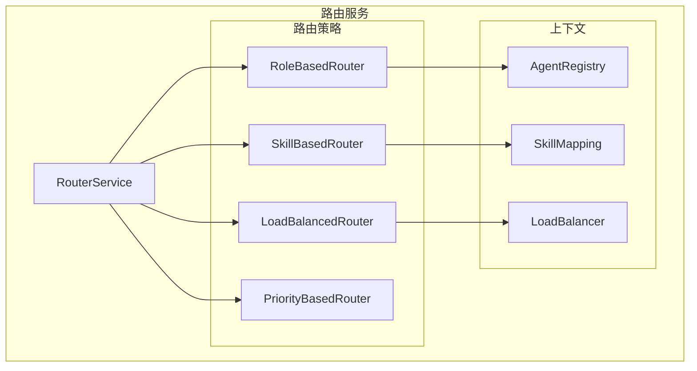
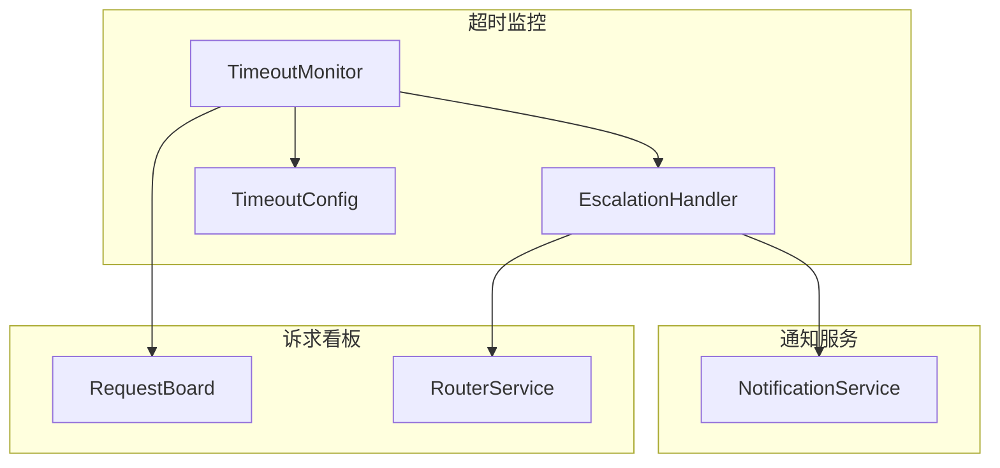

# 诉求看板完善设计文档

> Phase 1.3 补充设计
> 
> 版本：1.0
> 创建日期：2026-03-16

---

## 1. 概述

### 1.1 当前状态

| 文件 | 当前状态 | 问题 |
|------|---------|------|
| `board.py` | ✅ 完整 | 基本功能完整 |
| `models.py` | ✅ 完整 | 无 |
| `router.py` | 🟡 简化实现 | 仅实现基本角色路由 |
| `timeout.py` | ❌ 不存在 | 超时监控模块缺失 |

### 1.2 项目目标关联

| 项目目标 | 诉求看板要求 |
|---------|-------------|
| 💬 诉求驱动 | 智能路由到合适的 Agent |
| 🤝 平等协作 | 公平的诉求分配 |
| 🔄 持续迭代 | 超时自动升级机制 |

---

## 2. 路由服务完善设计

### 2.1 架构设计



### 2.2 路由策略实现

```python
# src/request_board/router.py

from __future__ import annotations

import asyncio
import random
from abc import ABC, abstractmethod
from enum import Enum
from typing import Optional, List, Dict, Any, TYPE_CHECKING
from dataclasses import dataclass
import logging

if TYPE_CHECKING:
    from .board import RequestBoard
    from .models import Request

logger = logging.getLogger(__name__)


class RoutingStrategy(Enum):
    """路由策略"""
    ROLE_BASED = "role_based"          # 基于角色
    SKILL_BASED = "skill_based"        # 基于技能
    LOAD_BALANCED = "load_balanced"    # 负载均衡
    PRIORITY_BASED = "priority_based"  # 优先级
    ROUND_ROBIN = "round_robin"        # 轮询
    SMART = "smart"                    # 智能路由


@dataclass
class RoutingContext:
    """路由上下文"""
    request: "Request"
    available_agents: List[str]
    agent_skills: Dict[str, List[str]]
    agent_workloads: Dict[str, int]
    agent_status: Dict[str, str]


class RouterStrategy(ABC):
    """路由策略基类"""
    
    @abstractmethod
    async def route(self, context: RoutingContext) -> List[str]:
        """
        路由诉求到目标 Agent
        
        Args:
            context: 路由上下文
            
        Returns:
            目标 Agent 列表（按优先级排序）
        """
        pass
    
    @property
    @abstractmethod
    def name(self) -> str:
        """策略名称"""
        pass


class RoleBasedRouter(RouterStrategy):
    """
    基于角色的路由器
    
    根据诉求的目标角色直接路由
    支持：
    - 单个角色
    - 角色组 (group:devs)
    - 广播 (all)
    """
    
    # 预定义角色组
    ROLE_GROUPS = {
        "devs": ["Frontend Developer", "Backend Developer", "Full Stack Developer"],
        "quality": ["QA Engineer", "Code Reviewer"],
        "leadership": ["Product Manager", "System Architect", "Tech Lead"],
        "all": None,  # 特殊处理
    }
    
    @property
    def name(self) -> str:
        return "role_based"
    
    async def route(self, context: RoutingContext) -> List[str]:
        to_agent = context.request.to_agent
        available = context.available_agents
        
        # 广播到所有人
        if to_agent == "all":
            return available
        
        # 角色组
        if to_agent.startswith("group:"):
            group_name = to_agent.split(":")[1]
            group_members = self.ROLE_GROUPS.get(group_name, [])
            return [a for a in available if a in group_members]
        
        # 单个角色
        if to_agent in available:
            return [to_agent]
        
        # 尝试模糊匹配
        matched = [a for a in available if to_agent.lower() in a.lower()]
        if matched:
            return matched
        
        logger.warning(f"No match for role: {to_agent}")
        return []


class SkillBasedRouter(RouterStrategy):
    """
    基于技能的路由器
    
    根据诉求所需技能匹配 Agent
    """
    
    @property
    def name(self) -> str:
        return "skill_based"
    
    async def route(self, context: RoutingContext) -> List[str]:
        request = context.request
        required_skills = request.context.get("required_skills", [])
        
        if not required_skills:
            # 没有技能要求，回退到角色路由
            return context.available_agents
        
        # 计算每个 Agent 的技能匹配分数
        scored_agents: List[tuple[str, int, int]] = []
        
        for agent in context.available_agents:
            agent_skills = context.agent_skills.get(agent, [])
            
            # 计算匹配分数
            matched_skills = [s for s in required_skills if s in agent_skills]
            match_count = len(matched_skills)
            
            if match_count > 0:
                scored_agents.append((agent, match_count, len(agent_skills)))
        
        if not scored_agents:
            logger.warning(f"No agent matches required skills: {required_skills}")
            return context.available_agents
        
        # 按匹配数量降序，技能数量升序（选择更专注的 Agent）
        scored_agents.sort(key=lambda x: (-x[1], x[2]))
        
        return [agent for agent, _, _ in scored_agents]


class LoadBalancedRouter(RouterStrategy):
    """
    负载均衡路由器
    
    将诉求分配给当前工作负载最低的 Agent
    """
    
    def __init__(self, request_board: Optional["RequestBoard"] = None):
        self.request_board = request_board
    
    @property
    def name(self) -> str:
        return "load_balanced"
    
    async def route(self, context: RoutingContext) -> List[str]:
        workloads = context.agent_workloads
        
        if not workloads:
            return context.available_agents
        
        # 找到最低负载
        min_workload = min(workloads.values()) if workloads else 0
        
        # 返回所有最低负载的 Agent
        low_load_agents = [
            agent for agent, workload in workloads.items()
            if workload == min_workload and agent in context.available_agents
        ]
        
        if low_load_agents:
            return low_load_agents
        
        return context.available_agents


class PriorityBasedRouter(RouterStrategy):
    """
    优先级路由器
    
    根据诉求优先级选择不同策略
    - 紧急：选择最可靠的 Agent
    - 高：选择技能最匹配的 Agent
    - 普通：负载均衡
    - 低：轮询
    """
    
    def __init__(self):
        self.role_router = RoleBasedRouter()
        self.skill_router = SkillBasedRouter()
        self.load_router = LoadBalancedRouter()
    
    @property
    def name(self) -> str:
        return "priority_based"
    
    async def route(self, context: RoutingContext) -> List[str]:
        priority = context.request.priority
        
        if priority == "critical":
            # 紧急：选择 Tech Lead 或 Coordinator
            critical_handlers = ["Tech Lead", "Coordinator", "Product Manager"]
            for handler in critical_handlers:
                if handler in context.available_agents:
                    return [handler]
            return context.available_agents
        
        elif priority == "high":
            # 高优先级：技能匹配
            return await self.skill_router.route(context)
        
        elif priority == "normal":
            # 普通：负载均衡
            return await self.load_router.route(context)
        
        else:  # low
            # 低优先级：轮询（返回所有可用）
            return context.available_agents


class SmartRouter(RouterStrategy):
    """
    智能路由器
    
    综合考虑多个因素：
    - 角色匹配
    - 技能匹配
    - 当前负载
    - 历史表现
    - 优先级
    """
    
    def __init__(self):
        self.role_router = RoleBasedRouter()
        self.skill_router = SkillBasedRouter()
        self.load_router = LoadBalancedRouter()
        
        # 历史表现分数 (agent -> average_score)
        self._performance_scores: Dict[str, float] = {}
    
    @property
    def name(self) -> str:
        return "smart"
    
    async def route(self, context: RoutingContext) -> List[str]:
        available = context.available_agents
        
        if not available:
            return []
        
        # 如果明确指定了目标，使用角色路由
        if context.request.to_agent and context.request.to_agent != "all":
            role_result = await self.role_router.route(context)
            if role_result:
                return role_result
        
        # 计算综合分数
        scored_agents: List[tuple[str, float]] = []
        
        for agent in available:
            score = await self._calculate_score(agent, context)
            scored_agents.append((agent, score))
        
        # 按分数降序排序
        scored_agents.sort(key=lambda x: x[1], reverse=True)
        
        # 返回分数最高的 Agent
        return [agent for agent, _ in scored_agents]
    
    async def _calculate_score(self, agent: str, context: RoutingContext) -> float:
        """计算 Agent 的综合分数"""
        score = 0.0
        
        # 1. 技能匹配 (权重: 0.3)
        required_skills = context.request.context.get("required_skills", [])
        if required_skills:
            agent_skills = context.agent_skills.get(agent, [])
            skill_match = sum(1 for s in required_skills if s in agent_skills) / len(required_skills)
            score += skill_match * 0.3
        
        # 2. 负载情况 (权重: 0.3)
        workload = context.agent_workloads.get(agent, 0)
        max_workload = max(context.agent_workloads.values()) if context.agent_workloads else 1
        load_score = 1 - (workload / max_workload) if max_workload > 0 else 1
        score += load_score * 0.3
        
        # 3. 历史表现 (权重: 0.2)
        performance = self._performance_scores.get(agent, 0.5)
        score += performance * 0.2
        
        # 4. 优先级加成 (权重: 0.2)
        priority = context.request.priority
        if priority == "critical":
            # 关键任务交给资深人员
            senior_roles = ["Tech Lead", "System Architect", "Coordinator"]
            if agent in senior_roles:
                score += 0.2
        
        return score
    
    def update_performance(self, agent: str, score: float):
        """更新 Agent 表现分数"""
        current = self._performance_scores.get(agent, 0.5)
        # 使用指数移动平均
        self._performance_scores[agent] = current * 0.7 + score * 0.3


class RouterService:
    """
    路由服务
    
    统一管理路由策略，根据配置选择合适的路由器
    """
    
    def __init__(
        self,
        request_board: Optional["RequestBoard"] = None,
        default_strategy: RoutingStrategy = RoutingStrategy.SMART,
    ):
        self.request_board = request_board
        self.default_strategy = default_strategy
        
        # 注册路由策略
        self._strategies: Dict[RoutingStrategy, RouterStrategy] = {
            RoutingStrategy.ROLE_BASED: RoleBasedRouter(),
            RoutingStrategy.SKILL_BASED: SkillBasedRouter(),
            RoutingStrategy.LOAD_BALANCED: LoadBalancedRouter(request_board),
            RoutingStrategy.PRIORITY_BASED: PriorityBasedRouter(),
            RoutingStrategy.SMART: SmartRouter(),
        }
        
        # Agent 技能映射
        self._agent_skills: Dict[str, List[str]] = {
            "Product Manager": ["需求分析", "产品规划", "用户研究", "优先级管理"],
            "System Architect": ["架构设计", "技术选型", "性能优化", "系统设计"],
            "Tech Lead": ["技术决策", "代码审查", "团队管理", "技术规划"],
            "Frontend Developer": ["React", "Vue", "CSS", "JavaScript", "UI开发"],
            "Backend Developer": ["Python", "Java", "数据库", "API设计", "微服务"],
            "Full Stack Developer": ["React", "Python", "数据库", "API设计", "DevOps"],
            "QA Engineer": ["测试用例", "自动化测试", "性能测试", "质量保证"],
            "Code Reviewer": ["代码审查", "最佳实践", "重构", "安全审查"],
            "Doc Writer": ["技术文档", "API文档", "用户手册", "需求文档"],
            "DevOps Engineer": ["CI/CD", "Docker", "Kubernetes", "监控", "自动化"],
            "Security Engineer": ["安全审计", "渗透测试", "安全架构", "合规"],
            "Coordinator": ["协调", "调度", "资源分配", "进度管理"],
        }
        
        # Agent 工作负载
        self._agent_workloads: Dict[str, int] = {}
        
        # 轮询索引
        self._round_robin_index: Dict[str, int] = {}
    
    def register_strategy(
        self,
        strategy: RoutingStrategy,
        router: RouterStrategy,
    ):
        """注册路由策略"""
        self._strategies[strategy] = router
    
    def register_agent_skills(
        self,
        agent_role: str,
        skills: List[str],
    ):
        """注册 Agent 技能"""
        self._agent_skills[agent_role] = skills
    
    def update_agent_workload(
        self,
        agent_role: str,
        workload: int,
    ):
        """更新 Agent 工作负载"""
        self._agent_workloads[agent_role] = workload
    
    async def route_request(
        self,
        request: "Request",
        strategy: Optional[RoutingStrategy] = None,
        available_agents: Optional[List[str]] = None,
    ) -> List[str]:
        """
        路由诉求
        
        Args:
            request: 诉求对象
            strategy: 路由策略（可选）
            available_agents: 可用 Agent 列表（可选）
            
        Returns:
            目标 Agent 列表
        """
        # 获取可用 Agent
        if available_agents is None:
            available_agents = await self._get_available_agents()
        
        # 构建路由上下文
        context = RoutingContext(
            request=request,
            available_agents=available_agents,
            agent_skills=self._agent_skills,
            agent_workloads=self._agent_workloads.copy(),
            agent_status={},  # TODO: 从 Agent Registry 获取
        )
        
        # 选择策略
        selected_strategy = strategy or self.default_strategy
        router = self._strategies.get(selected_strategy)
        
        if not router:
            logger.warning(f"Strategy {selected_strategy} not found, using default")
            router = self._strategies[RoutingStrategy.ROLE_BASED]
        
        # 执行路由
        targets = await router.route(context)
        
        logger.debug(
            f"Routed request {request.id} to {targets} "
            f"using {router.name} strategy"
        )
        
        return targets
    
    async def _get_available_agents(self) -> List[str]:
        """获取可用 Agent 列表"""
        # TODO: 从 Agent Registry 获取实际状态
        return list(self._agent_skills.keys())
    
    def get_statistics(self) -> Dict[str, Any]:
        """获取路由统计信息"""
        return {
            "strategies": list(self._strategies.keys()),
            "agents_registered": len(self._agent_skills),
            "current_workloads": self._agent_workloads.copy(),
        }
```

---

## 3. 超时监控设计

### 3.1 架构设计



### 3.2 超时监控实现

```python
# src/request_board/timeout.py

from __future__ import annotations

import asyncio
import time
from typing import Optional, Dict, Any, List, TYPE_CHECKING
from dataclasses import dataclass
from enum import Enum
import logging

if TYPE_CHECKING:
    from .board import RequestBoard
    from .router import RouterService

logger = logging.getLogger(__name__)


class EscalationLevel(Enum):
    """升级级别"""
    FIRST = "first"       # 首次升级
    SECOND = "second"     # 二次升级
    FINAL = "final"       # 最终升级（通知用户）


@dataclass
class TimeoutConfig:
    """超时配置"""
    
    # 各优先级的超时时间（秒）
    timeout_by_priority: Dict[str, int] = None
    
    # 各优先级的升级阈值（秒）
    escalation_threshold: Dict[str, int] = None
    
    # 各优先级的升级目标
    escalation_targets: Dict[str, str] = None
    
    # 监控检查间隔（秒）
    check_interval: int = 60
    
    # 最大升级次数
    max_escalations: int = 3
    
    def __post_init__(self):
        if self.timeout_by_priority is None:
            self.timeout_by_priority = {
                "low": 3600,        # 1 小时
                "normal": 1800,     # 30 分钟
                "high": 900,        # 15 分钟
                "critical": 300,    # 5 分钟
            }
        
        if self.escalation_threshold is None:
            self.escalation_threshold = {
                "low": 1800,        # 30 分钟未响应
                "normal": 900,      # 15 分钟
                "high": 300,        # 5 分钟
                "critical": 120,    # 2 分钟
            }
        
        if self.escalation_targets is None:
            self.escalation_targets = {
                "low": "Coordinator",
                "normal": "Tech Lead",
                "high": "Product Manager",
                "critical": "Product Manager",
            }
    
    def get_timeout(self, priority: str) -> int:
        """获取超时时间"""
        return self.timeout_by_priority.get(priority, 1800)
    
    def get_escalation_threshold(self, priority: str) -> int:
        """获取升级阈值"""
        return self.escalation_threshold.get(priority, 900)
    
    def get_escalation_target(self, priority: str) -> str:
        """获取升级目标"""
        return self.escalation_targets.get(priority, "Coordinator")


class TimeoutMonitor:
    """
    超时监控器
    
    功能：
    - 监控诉求处理时间
    - 自动升级超时诉求
    - 发送提醒通知
    - 记录超时历史
    """
    
    def __init__(
        self,
        request_board: "RequestBoard",
        router_service: Optional["RouterService"] = None,
        notification_service: Optional[Any] = None,
        config: Optional[TimeoutConfig] = None,
    ):
        self.request_board = request_board
        self.router_service = router_service
        self.notification_service = notification_service
        self.config = config or TimeoutConfig()
        
        # 监控状态
        self._running = False
        self._monitor_task: Optional[asyncio.Task] = None
        
        # 升级计数：request_id -> escalation_count
        self._escalation_count: Dict[str, int] = {}
        
        # 超时历史
        self._timeout_history: List[Dict[str, Any]] = []
        
        # 最大历史数
        self.max_history = 500
    
    async def start(self):
        """启动监控"""
        if self._running:
            return
        
        self._running = True
        self._monitor_task = asyncio.create_task(self._monitor_loop())
        logger.info("TimeoutMonitor started")
    
    async def stop(self):
        """停止监控"""
        self._running = False
        if self._monitor_task:
            self._monitor_task.cancel()
            try:
                await self._monitor_task
            except asyncio.CancelledError:
                pass
        logger.info("TimeoutMonitor stopped")
    
    async def _monitor_loop(self):
        """监控循环"""
        while self._running:
            try:
                await self._check_timeouts()
                await asyncio.sleep(self.config.check_interval)
            except asyncio.CancelledError:
                break
            except Exception as e:
                logger.error(f"Error in timeout monitor: {e}")
                await asyncio.sleep(5)
    
    async def _check_timeouts(self):
        """检查超时诉求"""
        now = int(time.time())
        
        # 获取所有待处理诉求
        pending_requests = await self.request_board.get_all_requests()
        pending_requests = [
            r for r in pending_requests
            if r.status in ["pending", "processing", "waiting"]
        ]
        
        for request in pending_requests:
            # 计算诉求年龄
            age = now - request.created_at
            
            # 获取优先级对应的阈值
            threshold = self.config.get_escalation_threshold(request.priority)
            timeout = self.config.get_timeout(request.priority)
            
            # 检查是否需要升级
            if age >= threshold:
                await self._handle_timeout(request, age, threshold, timeout)
    
    async def _handle_timeout(
        self,
        request: Any,
        age: int,
        threshold: int,
        timeout: int,
    ):
        """处理超时诉求"""
        request_id = request.id
        escalation_count = self._escalation_count.get(request_id, 0)
        
        # 检查是否达到最大升级次数
        if escalation_count >= self.config.max_escalations:
            logger.warning(f"Request {request_id} reached max escalations")
            return
        
        # 执行升级
        escalation_level = self._get_escalation_level(escalation_count)
        escalation_target = self._get_next_escalation_target(
            request.priority,
            escalation_count
        )
        
        # 记录超时事件
        timeout_event = {
            "request_id": request_id,
            "age": age,
            "threshold": threshold,
            "escalation_level": escalation_level.value,
            "escalation_target": escalation_target,
            "timestamp": int(time.time()),
        }
        self._timeout_history.append(timeout_event)
        if len(self._timeout_history) > self.max_history:
            self._timeout_history = self._timeout_history[-self.max_history:]
        
        # 更新诉求状态
        original_target = request.to_agent
        await self.request_board.update_request(
            request_id=request_id,
            updates={
                "status": "escalated",
                "context": {
                    **request.context,
                    "escalation": {
                        "level": escalation_level.value,
                        "original_target": original_target,
                        "escalated_to": escalation_target,
                        "escalated_at": int(time.time()),
                    }
                }
            }
        )
        
        # 更新升级计数
        self._escalation_count[request_id] = escalation_count + 1
        
        # 发送通知
        await self._send_escalation_notification(
            request,
            escalation_target,
            escalation_level,
            age,
        )
        
        logger.info(
            f"Escalated request {request_id} from {original_target} "
            f"to {escalation_target} (level: {escalation_level.value})"
        )
    
    def _get_escalation_level(self, count: int) -> EscalationLevel:
        """获取升级级别"""
        if count == 0:
            return EscalationLevel.FIRST
        elif count == 1:
            return EscalationLevel.SECOND
        else:
            return EscalationLevel.FINAL
    
    def _get_next_escalation_target(
        self,
        priority: str,
        escalation_count: int,
    ) -> str:
        """获取下一个升级目标"""
        base_target = self.config.get_escalation_target(priority)
        
        # 升级链：Agent -> Tech Lead -> Product Manager -> Coordinator
        escalation_chain = {
            "Coordinator": "Tech Lead",
            "Tech Lead": "Product Manager",
            "Product Manager": "Coordinator",  # 循环回去
        }
        
        target = base_target
        for _ in range(escalation_count):
            target = escalation_chain.get(target, "Coordinator")
        
        return target
    
    async def _send_escalation_notification(
        self,
        request: Any,
        escalation_target: str,
        level: EscalationLevel,
        age: int,
    ):
        """发送升级通知"""
        if not self.notification_service:
            return
        
        # 构建通知内容
        priority_emoji = {
            "critical": "🔴",
            "high": "🟠",
            "normal": "🟡",
            "low": "🟢",
        }
        
        emoji = priority_emoji.get(request.priority, "⚪")
        level_text = {
            EscalationLevel.FIRST: "首次升级",
            EscalationLevel.SECOND: "二次升级",
            EscalationLevel.FINAL: "最终升级",
        }
        
        message = (
            f"{emoji} **{level_text[level]}提醒**\n\n"
            f"诉求 #{request.id} 已等待 {age // 60} 分钟未响应\n\n"
            f"**主题**: {request.subject}\n"
            f"**优先级**: {request.priority}\n"
            f"**原始接收方**: {request.to_agent}\n\n"
            f"请及时处理。"
        )
        
        # 发送通知
        # TODO: 集成 NotificationService
        logger.info(f"Sending escalation notification to {escalation_target}")
    
    def get_statistics(self) -> Dict[str, Any]:
        """获取超时统计"""
        now = int(time.time())
        
        # 统计最近 1 小时的超时
        recent_timeouts = [
            e for e in self._timeout_history
            if now - e["timestamp"] < 3600
        ]
        
        # 按升级级别统计
        by_level = {}
        for event in recent_timeouts:
            level = event["escalation_level"]
            by_level[level] = by_level.get(level, 0) + 1
        
        return {
            "total_escalations": len(self._timeout_history),
            "recent_escalations_1h": len(recent_timeouts),
            "by_level": by_level,
            "escalation_counts": dict(self._escalation_count),
        }
    
    def get_timeout_history(
        self,
        request_id: Optional[str] = None,
        limit: int = 100,
    ) -> List[Dict[str, Any]]:
        """获取超时历史"""
        history = self._timeout_history
        
        if request_id:
            history = [e for e in history if e["request_id"] == request_id]
        
        return history[-limit:]


class ReminderService:
    """
    提醒服务
    
    在诉求即将超时前发送提醒
    """
    
    def __init__(
        self,
        request_board: "RequestBoard",
        notification_service: Optional[Any] = None,
        config: Optional[TimeoutConfig] = None,
    ):
        self.request_board = request_board
        self.notification_service = notification_service
        self.config = config or TimeoutConfig()
        
        # 提醒阈值（超时前的百分比）
        self.reminder_thresholds = [0.5, 0.75, 0.9]  # 50%, 75%, 90%
        
        # 已发送提醒：request_id -> Set[threshold_index]
        self._reminders_sent: Dict[str, set] = {}
        
        self._running = False
        self._task: Optional[asyncio.Task] = None
    
    async def start(self):
        """启动提醒服务"""
        self._running = True
        self._task = asyncio.create_task(self._reminder_loop())
    
    async def stop(self):
        """停止提醒服务"""
        self._running = False
        if self._task:
            self._task.cancel()
    
    async def _reminder_loop(self):
        """提醒循环"""
        while self._running:
            try:
                await self._check_and_send_reminders()
                await asyncio.sleep(self.config.check_interval)
            except asyncio.CancelledError:
                break
            except Exception as e:
                logger.error(f"Error in reminder loop: {e}")
    
    async def _check_and_send_reminders(self):
        """检查并发送提醒"""
        now = int(time.time())
        pending_requests = await self.request_board.get_all_requests()
        pending_requests = [
            r for r in pending_requests
            if r.status in ["pending", "processing"]
        ]
        
        for request in pending_requests:
            timeout = self.config.get_timeout(request.priority)
            age = now - request.created_at
            
            # 计算已用时间比例
            progress = age / timeout
            
            # 检查是否需要发送提醒
            for i, threshold in enumerate(self.reminder_thresholds):
                if progress >= threshold:
                    await self._send_reminder_if_needed(request, i, threshold)
    
    async def _send_reminder_if_needed(
        self,
        request: Any,
        threshold_index: int,
        threshold: float,
    ):
        """如果需要，发送提醒"""
        request_id = request.id
        
        if request_id not in self._reminders_sent:
            self._reminders_sent[request_id] = set()
        
        if threshold_index in self._reminders_sent[request_id]:
            return  # 已发送过
        
        # 发送提醒
        await self._send_reminder(request, threshold)
        
        # 标记已发送
        self._reminders_sent[request_id].add(threshold_index)
    
    async def _send_reminder(self, request: Any, threshold: float):
        """发送提醒"""
        remaining_percent = int((1 - threshold) * 100)
        
        logger.info(
            f"Sending reminder for request {request.id} "
            f"({remaining_percent}% time remaining)"
        )
        
        # TODO: 集成 NotificationService
```

---

## 4. 诉求看板增强

### 4.1 新增方法

```python
# src/request_board/board.py (新增方法)

class RequestBoard:
    # ... 现有代码 ...
    
    async def get_requests_by_type(
        self,
        request_type: str,
        limit: int = 100,
    ) -> List[Request]:
        """按类型获取诉求"""
        results = []
        for request in self._requests.values():
            if request.type == request_type:
                results.append(request)
            if len(results) >= limit:
                break
        return results
    
    async def get_statistics(self) -> Dict[str, Any]:
        """获取诉求统计"""
        by_status = {}
        by_priority = {}
        by_type = {}
        
        for request in self._requests.values():
            by_status[request.status] = by_status.get(request.status, 0) + 1
            by_priority[request.priority] = by_priority.get(request.priority, 0) + 1
            by_type[request.type] = by_type.get(request.type, 0) + 1
        
        return {
            "total": len(self._requests),
            "by_status": by_status,
            "by_priority": by_priority,
            "by_type": by_type,
        }
    
    async def get_agent_workload(self, agent_role: str) -> int:
        """获取 Agent 工作负载"""
        pending = await self.get_requests_for_agent(
            agent_role=agent_role,
            status=RequestStatus.PENDING,
        )
        processing = await self.get_requests_for_agent(
            agent_role=agent_role,
            status=RequestStatus.PROCESSING,
        )
        return len(pending) + len(processing)
```

---

## 5. 实现计划

### 5.1 文件变更清单

| 文件 | 操作 | 内容 |
|------|------|------|
| `router.py` | 重写 | 完整路由策略实现 |
| `timeout.py` | 新增 | 超时监控和升级 |
| `board.py` | 修改 | 新增统计和工作负载方法 |

### 5.2 预计工时

| 任务 | 时间 |
|------|------|
| 路由策略完善 | 2h |
| 超时监控实现 | 1.5h |
| 提醒服务实现 | 1h |
| 单元测试 | 1h |
| **总计** | **5.5h** |

---

## 6. 测试用例

### 6.1 路由策略测试

```python
# tests/request_board/test_router.py

import pytest
from request_board.router import (
    RouterService,
    RoutingStrategy,
    RoleBasedRouter,
    SkillBasedRouter,
    LoadBalancedRouter,
    SmartRouter,
)
from request_board.models import Request, RequestType, RequestPriority, RequestStatus


@pytest.fixture
def router_service():
    return RouterService()


async def test_role_based_routing(router_service):
    """测试角色路由"""
    request = Request(
        id="test_1",
        type=RequestType.COLLABORATION,
        priority=RequestPriority.NORMAL,
        status=RequestStatus.PENDING,
        from_agent="Product Manager",
        to_agent="System Architect",
        subject="Test",
        content="Test content",
        created_at=0,
        updated_at=0,
    )
    
    targets = await router_service.route_request(
        request=request,
        strategy=RoutingStrategy.ROLE_BASED,
    )
    
    assert "System Architect" in targets


async def test_skill_based_routing(router_service):
    """测试技能路由"""
    request = Request(
        id="test_2",
        type=RequestType.COLLABORATION,
        priority=RequestPriority.NORMAL,
        status=RequestStatus.PENDING,
        from_agent="Product Manager",
        to_agent="all",
        subject="Need React developer",
        content="Test content",
        context={"required_skills": ["React", "CSS"]},
        created_at=0,
        updated_at=0,
    )
    
    targets = await router_service.route_request(
        request=request,
        strategy=RoutingStrategy.SKILL_BASED,
    )
    
    # Frontend Developer 应该排在前面（有 React 技能）
    assert len(targets) > 0


async def test_load_balanced_routing(router_service):
    """测试负载均衡路由"""
    # 设置工作负载
    router_service.update_agent_workload("Frontend Developer", 5)
    router_service.update_agent_workload("Backend Developer", 2)
    
    request = Request(
        id="test_3",
        type=RequestType.COLLABORATION,
        priority=RequestPriority.NORMAL,
        status=RequestStatus.PENDING,
        from_agent="Product Manager",
        to_agent="all",
        subject="Test",
        content="Test content",
        created_at=0,
        updated_at=0,
    )
    
    targets = await router_service.route_request(
        request=request,
        strategy=RoutingStrategy.LOAD_BALANCED,
    )
    
    # Backend Developer 负载更低，应该排在前面
    assert targets[0] == "Backend Developer"
```

### 6.2 超时监控测试

```python
# tests/request_board/test_timeout.py

import pytest
import asyncio
from request_board.timeout import TimeoutMonitor, TimeoutConfig
from request_board.board import RequestBoard
from request_board.models import Request, RequestType, RequestPriority, RequestStatus


@pytest.fixture
async def setup():
    board = RequestBoard()
    config = TimeoutConfig(
        timeout_by_priority={"normal": 2},  # 2 秒超时
        escalation_threshold={"normal": 1},  # 1 秒后升级
        check_interval=1,
    )
    monitor = TimeoutMonitor(board, config=config)
    await monitor.start()
    yield board, monitor
    await monitor.stop()


async def test_timeout_escalation(setup):
    """测试超时升级"""
    board, monitor = setup
    
    # 创建诉求
    request = Request(
        id="test_timeout",
        type=RequestType.COLLABORATION,
        priority=RequestPriority.NORMAL,
        status=RequestStatus.PENDING,
        from_agent="Product Manager",
        to_agent="Frontend Developer",
        subject="Test timeout",
        content="Test",
        created_at=int(time.time()) - 5,  # 5 秒前创建
        updated_at=int(time.time()) - 5,
    )
    await board.create_request(request)
    
    # 等待监控检查
    await asyncio.sleep(2)
    
    # 检查是否被升级
    updated = await board.get_request("test_timeout")
    assert updated.status == "escalated"
```

---

> 最后更新：2026-03-16
> 状态：设计完成
> 下一步：实施