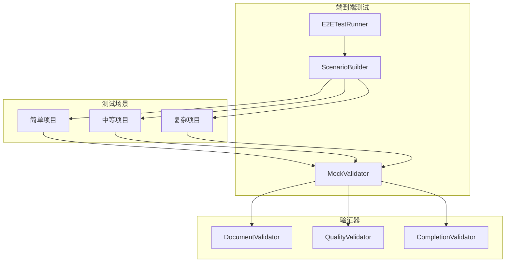

# 测试框架完善设计文档

> Phase 1.7 补充设计
> 
> 版本：1.0
> 创建日期：2026-03-16

---

## 1. 概述

### 1.1 当前状态

| 测试类型 | 当前状态 | 覆盖情况 |
|---------|---------|---------|
| 单元测试 | ✅ 完整 | 226 个测试通过 |
| 集成测试 | ✅ 完整 | 多 Agent 协作测试 |
| 端到端测试 | ❌ 缺失 | 0% |
| 场景测试 | ❌ 缺失 | 0% |
| 性能测试 | ❌ 缺失 | 0% |

### 1.2 项目目标关联

| 项目目标 | 测试要求 |
|---------|---------|
| 🏢 公司化运作 | 端到端业务流程测试 |
| 🤝 平等协作 | 多 Agent 协作测试 |
| 🔄 持续迭代 | Ralph Loop 完整测试 |
| 🙈 用户无感知 | 场景测试验证用户无需干预 |

---

## 2. 端到端测试设计

### 2.1 架构设计



### 2.2 端到端测试框架

```python
# tests/e2e/test_e2e_framework.py

from __future__ import annotations

import asyncio
import time
from typing import Optional, List, Dict, Any, Callable
from dataclasses import dataclass, field
from enum import Enum
from pathlib import Path
import logging

logger = logging.getLogger(__name__)


class TestStatus(Enum):
    """测试状态"""
    PENDING = "pending"
    RUNNING = "running"
    PASSED = "passed"
    FAILED = "failed"
    SKIPPED = "skipped"


@dataclass
class TestResult:
    """测试结果"""
    name: str
    status: TestStatus
    duration: float
    message: str = ""
    details: Dict[str, Any] = field(default_factory=dict)
    errors: List[str] = field(default_factory=list)


@dataclass
class ScenarioConfig:
    """场景配置"""
    name: str
    description: str
    user_request: str              # 用户需求
    expected_agents: List[str]     # 预期参与的角色
    expected_documents: List[str]  # 预期产出的文档
    max_iterations: int = 50       # 最大迭代次数
    timeout: int = 3600            # 超时时间（秒）
    auto_approve: bool = True      # 自动批准权限请求
    validate_quality: bool = True  # 是否验证质量


class E2ETestRunner:
    """
    端到端测试运行器
    
    功能：
    - 运行完整的业务场景
    - 验证系统行为
    - 检查输出质量
    - 生成测试报告
    """
    
    def __init__(
        self,
        output_dir: str = "./test_output",
    ):
        self.output_dir = Path(output_dir)
        self.output_dir.mkdir(parents=True, exist_ok=True)
        
        # 测试结果
        self._results: List[TestResult] = []
        
        # Mock 组件
        self._mock_opencode: Optional[Any] = None
        self._mock_document_hub: Optional[Any] = None
        self._mock_request_board: Optional[Any] = None
    
    async def run_scenario(
        self,
        config: ScenarioConfig,
    ) -> TestResult:
        """
        运行测试场景
        
        Args:
            config: 场景配置
            
        Returns:
            TestResult: 测试结果
        """
        result = TestResult(
            name=config.name,
            status=TestStatus.RUNNING,
            duration=0,
        )
        
        start_time = time.time()
        
        try:
            logger.info(f"Running scenario: {config.name}")
            
            # 1. 初始化测试环境
            await self._setup_environment(config)
            
            # 2. 创建团队
            team = await self._create_team(config)
            
            # 3. 执行任务
            await self._execute_task(team, config)
            
            # 4. 验证结果
            await self._validate_results(config, result)
            
            # 5. 清理环境
            await self._cleanup()
            
            result.status = TestStatus.PASSED
            result.message = "All validations passed"
            
        except Exception as e:
            result.status = TestStatus.FAILED
            result.message = str(e)
            result.errors.append(str(e))
            logger.error(f"Scenario failed: {e}")
        
        finally:
            result.duration = time.time() - start_time
            self._results.append(result)
        
        return result
    
    async def run_all_scenarios(
        self,
        configs: List[ScenarioConfig],
    ) -> List[TestResult]:
        """运行所有场景"""
        results = []
        
        for config in configs:
            result = await self.run_scenario(config)
            results.append(result)
        
        return results
    
    async def _setup_environment(self, config: ScenarioConfig):
        """设置测试环境"""
        # 创建 Mock OpenCode
        self._mock_opencode = MockOpenCodeClient()
        
        # 创建文档中心
        from document_hub.store import DocumentStore
        doc_path = self.output_dir / "documents"
        self._mock_document_hub = DocumentStore(base_path=str(doc_path))
        
        # 创建诉求看板
        from request_board.board import RequestBoard
        self._mock_request_board = RequestBoard()
    
    async def _create_team(self, config: ScenarioConfig):
        """创建团队"""
        from team.builder import TeamBuilder
        from team.analyzer import TaskAnalyzer
        
        # 分析任务
        analyzer = TaskAnalyzer()
        analysis = await analyzer.analyze(config.user_request)
        
        # 构建团队
        builder = TeamBuilder(
            document_hub=self._mock_document_hub,
            request_board=self._mock_request_board,
        )
        team = await builder.build(analysis)
        
        # 验证团队组成
        actual_agents = [agent.role for agent in team.agents]
        for expected in config.expected_agents:
            if expected not in actual_agents:
                raise AssertionError(f"Missing expected agent: {expected}")
        
        return team
    
    async def _execute_task(self, team: Any, config: ScenarioConfig):
        """执行任务"""
        from workflow.engine import WorkflowEngine
        from workflow.config import WorkflowConfig
        
        # 创建工作流引擎
        workflow_config = WorkflowConfig(
            max_iterations=config.max_iterations,
            auto_approve=config.auto_approve,
        )
        
        engine = WorkflowEngine(
            config=workflow_config,
            document_hub=self._mock_document_hub,
            request_board=self._mock_request_board,
        )
        
        # 执行工作流
        await engine.run(
            team=team,
            task=config.user_request,
            timeout=config.timeout,
        )
    
    async def _validate_results(
        self,
        config: ScenarioConfig,
        result: TestResult,
    ):
        """验证结果"""
        # 验证文档产出
        documents = await self._mock_document_hub.list_documents(limit=100)
        
        result.details["documents_produced"] = len(documents)
        
        for expected_doc in config.expected_documents:
            found = any(
                expected_doc.lower() in doc.metadata.title.lower()
                for doc in documents
            )
            if not found:
                result.errors.append(f"Missing expected document: {expected_doc}")
        
        # 验证质量
        if config.validate_quality:
            quality_score = await self._calculate_quality_score(documents)
            result.details["quality_score"] = quality_score
            
            if quality_score < 0.7:
                result.errors.append(f"Quality score too low: {quality_score}")
        
        # 如果有错误，抛出异常
        if result.errors:
            raise AssertionError("; ".join(result.errors))
    
    async def _calculate_quality_score(self, documents: List[Any]) -> float:
        """计算质量分数"""
        if not documents:
            return 0.0
        
        total_score = 0.0
        
        for doc in documents:
            score = 0.0
            
            # 检查文档结构
            if doc.metadata.title:
                score += 0.2
            if doc.content.content:
                score += 0.2
            
            # 检查内容长度
            content_len = len(doc.content.content)
            if content_len > 100:
                score += 0.2
            if content_len > 500:
                score += 0.2
            
            # 检查格式
            if doc.content.format == "markdown":
                # 检查 Markdown 结构
                if "#" in doc.content.content:
                    score += 0.1
                if "##" in doc.content.content:
                    score += 0.1
            
            total_score += min(score, 1.0)
        
        return total_score / len(documents)
    
    async def _cleanup(self):
        """清理测试环境"""
        self._mock_opencode = None
        self._mock_document_hub = None
        self._mock_request_board = None
    
    def generate_report(self) -> str:
        """生成测试报告"""
        report = []
        report.append("# 端到端测试报告")
        report.append("")
        
        # 统计
        total = len(self._results)
        passed = sum(1 for r in self._results if r.status == TestStatus.PASSED)
        failed = sum(1 for r in self._results if r.status == TestStatus.FAILED)
        
        report.append(f"**总计**: {total} 个测试")
        report.append(f"**通过**: {passed} 个")
        report.append(f"**失败**: {failed} 个")
        report.append(f"**通过率**: {passed/total*100:.1f}%" if total > 0 else "**通过率**: N/A")
        report.append("")
        
        # 详细结果
        report.append("## 测试详情")
        report.append("")
        
        for result in self._results:
            status_emoji = "✅" if result.status == TestStatus.PASSED else "❌"
            report.append(f"### {status_emoji} {result.name}")
            report.append(f"- **状态**: {result.status.value}")
            report.append(f"- **耗时**: {result.duration:.2f}秒")
            report.append(f"- **消息**: {result.message}")
            
            if result.details:
                report.append("- **详情**:")
                for key, value in result.details.items():
                    report.append(f"  - {key}: {value}")
            
            if result.errors:
                report.append("- **错误**:")
                for error in result.errors:
                    report.append(f"  - {error}")
            
            report.append("")
        
        return "\n".join(report)


class MockOpenCodeClient:
    """Mock OpenCode 客户端"""
    
    def __init__(self):
        self._sessions: Dict[str, Any] = {}
        self._messages: List[Dict[str, Any]] = []
    
    def health_check(self):
        """健康检查"""
        from dataclasses import dataclass
        @dataclass
        class Health:
            version: str = "1.0.0-mock"
        return Health()
    
    def session_create(self, title: str):
        """创建会话"""
        import uuid
        from dataclasses import dataclass
        
        session_id = str(uuid.uuid4())
        
        @dataclass
        class Session:
            id: str
            title: str
        
        session = Session(id=session_id, title=title)
        self._sessions[session_id] = session
        return session
    
    def message_send_text(self, session_id: str, text: str, agent: str = None):
        """发送消息"""
        # 模拟 AI 响应
        from dataclasses import dataclass, field
        from typing import List
        
        @dataclass
        class MessagePart:
            type: str
            text: str
        
        @dataclass
        class MessageResult:
            parts: List[MessagePart] = field(default_factory=list)
        
        # 根据消息内容生成模拟响应
        response_text = self._generate_mock_response(text, agent)
        
        return MessageResult(parts=[
            MessagePart(type="text", text=response_text)
        ])
    
    def _generate_mock_response(self, text: str, agent: str) -> str:
        """生成模拟响应"""
        if "PRD" in text or "需求" in text:
            return "# 产品需求文档\n\n## 需求概述\n\n这是一个模拟的 PRD 文档。\n\n## 功能需求\n\n1. 功能 A\n2. 功能 B\n3. 功能 C\n"
        elif "设计" in text or "架构" in text:
            return "# 系统设计文档\n\n## 架构概述\n\n这是一个模拟的设计文档。\n\n## 模块设计\n\n- 模块 A\n- 模块 B\n"
        else:
            return f"模拟响应：收到来自 {agent} 的请求，已处理完成。"
    
    def file_read(self, path: str):
        """读取文件"""
        from dataclasses import dataclass
        
        @dataclass
        class FileContent:
            path: str
            content: str
        
        return FileContent(path=path, content=f"# Mock content for {path}")
    
    def file_write(self, path: str, content: str):
        """写入文件"""
        pass
    
    def close(self):
        """关闭连接"""
        pass
```

---

## 3. 场景测试设计

### 3.1 预定义场景

```python
# tests/e2e/scenarios.py

from .test_e2e_framework import ScenarioConfig


# 简单项目场景
SIMPLE_SCENARIO = ScenarioConfig(
    name="简单项目 - Todo 应用",
    description="开发一个简单的 Todo 列表应用",
    user_request="""
    请帮我开发一个简单的 Todo 列表应用：
    - 用户可以添加、删除、标记完成 Todo 项
    - 数据保存在本地存储
    - 简洁的用户界面
    """,
    expected_agents=[
        "Product Manager",
        "Frontend Developer",
        "QA Engineer",
    ],
    expected_documents=[
        "PRD",
        "设计",
        "代码",
        "测试",
    ],
    max_iterations=30,
    timeout=1800,
)


# 中等项目场景
MEDIUM_SCENARIO = ScenarioConfig(
    name="中等项目 - 博客系统",
    description="开发一个完整的博客系统",
    user_request="""
    请帮我开发一个博客系统：
    - 用户注册、登录、个人资料管理
    - 文章的创建、编辑、删除、查看
    - 评论功能
    - 文章分类和标签
    - 搜索功能
    - 响应式设计
    """,
    expected_agents=[
        "Product Manager",
        "System Architect",
        "Frontend Developer",
        "Backend Developer",
        "QA Engineer",
        "Doc Writer",
    ],
    expected_documents=[
        "PRD",
        "架构设计",
        "API设计",
        "数据库设计",
        "前端代码",
        "后端代码",
        "测试用例",
        "用户手册",
    ],
    max_iterations=50,
    timeout=3600,
)


# 复杂项目场景
COMPLEX_SCENARIO = ScenarioConfig(
    name="复杂项目 - 电商平台",
    description="开发一个完整的电商平台",
    user_request="""
    请帮我开发一个电商平台：
    
    ## 用户模块
    - 用户注册、登录、第三方登录
    - 个人资料、收货地址管理
    - 会员等级、积分系统
    
    ## 商品模块
    - 商品分类、品牌管理
    - 商品搜索、筛选、排序
    - 商品详情、评价
    
    ## 购物车模块
    - 添加、删除、修改数量
    - 优惠券应用
    
    ## 订单模块
    - 下单、支付、取消
    - 订单状态追踪
    - 售后服务
    
    ## 后台管理
    - 商品管理
    - 订单管理
    - 用户管理
    - 数据统计
    """,
    expected_agents=[
        "Product Manager",
        "System Architect",
        "Tech Lead",
        "Frontend Developer",
        "Backend Developer",
        "Full Stack Developer",
        "QA Engineer",
        "Code Reviewer",
        "DevOps Engineer",
        "Security Engineer",
        "Doc Writer",
    ],
    expected_documents=[
        "PRD",
        "系统架构",
        "API文档",
        "数据库设计",
        "安全设计",
        "部署文档",
        "测试报告",
    ],
    max_iterations=100,
    timeout=7200,
)


# 所有场景
ALL_SCENARIOS = [
    SIMPLE_SCENARIO,
    MEDIUM_SCENARIO,
    COMPLEX_SCENARIO,
]
```

### 3.2 场景测试入口

```python
# tests/e2e/test_scenarios.py

import pytest
from .test_e2e_framework import E2ETestRunner
from .scenarios import ALL_SCENARIOS, SIMPLE_SCENARIO, MEDIUM_SCENARIO


@pytest.fixture
def runner():
    return E2ETestRunner()


@pytest.mark.asyncio
@pytest.mark.e2e
async def test_simple_scenario(runner):
    """测试简单项目场景"""
    result = await runner.run_scenario(SIMPLE_SCENARIO)
    assert result.status.value == "passed", result.message


@pytest.mark.asyncio
@pytest.mark.e2e
@pytest.mark.slow
async def test_medium_scenario(runner):
    """测试中等项目场景"""
    result = await runner.run_scenario(MEDIUM_SCENARIO)
    assert result.status.value == "passed", result.message


@pytest.mark.asyncio
@pytest.mark.e2e
@pytest.mark.slow
@pytest.mark.skip(reason="Too time consuming for CI")
async def test_all_scenarios(runner):
    """测试所有场景"""
    results = await runner.run_all_scenarios(ALL_SCENARIOS)
    
    # 生成报告
    report = runner.generate_report()
    print(report)
    
    # 验证至少 80% 通过
    passed = sum(1 for r in results if r.status.value == "passed")
    assert passed / len(results) >= 0.8
```

---

## 4. 性能测试设计

### 4.1 性能测试框架

```python
# tests/performance/test_performance.py

import asyncio
import time
from typing import Dict, Any, List
from dataclasses import dataclass
import statistics


@dataclass
class PerformanceMetrics:
    """性能指标"""
    operation: str
    samples: int
    mean: float
    median: float
    p95: float
    p99: float
    min: float
    max: float


class PerformanceTestRunner:
    """性能测试运行器"""
    
    def __init__(self):
        self._results: Dict[str, List[float]] = {}
    
    async def benchmark(
        self,
        operation: str,
        func: callable,
        iterations: int = 100,
        warmup: int = 10,
    ) -> PerformanceMetrics:
        """
        执行性能基准测试
        
        Args:
            operation: 操作名称
            func: 要测试的函数
            iterations: 迭代次数
            warmup: 预热次数
            
        Returns:
            PerformanceMetrics: 性能指标
        """
        # 预热
        for _ in range(warmup):
            await func()
        
        # 正式测试
        durations = []
        for _ in range(iterations):
            start = time.perf_counter()
            await func()
            duration = time.perf_counter() - start
            durations.append(duration)
        
        # 计算指标
        metrics = PerformanceMetrics(
            operation=operation,
            samples=iterations,
            mean=statistics.mean(durations),
            median=statistics.median(durations),
            p95=self._percentile(durations, 95),
            p99=self._percentile(durations, 99),
            min=min(durations),
            max=max(durations),
        )
        
        self._results[operation] = durations
        return metrics
    
    def _percentile(self, data: List[float], p: int) -> float:
        """计算百分位数"""
        sorted_data = sorted(data)
        index = int(len(sorted_data) * p / 100)
        return sorted_data[min(index, len(sorted_data) - 1)]
    
    def generate_report(self) -> str:
        """生成性能报告"""
        report = []
        report.append("# 性能测试报告")
        report.append("")
        
        report.append("| 操作 | 样本数 | 平均值 | 中位数 | P95 | P99 | 最小 | 最大 |")
        report.append("|------|--------|--------|--------|-----|-----|------|------|")
        
        for op, durations in self._results.items():
            metrics = self._calculate_metrics(op, durations)
            report.append(
                f"| {metrics.operation} | {metrics.samples} | "
                f"{metrics.mean*1000:.2f}ms | {metrics.median*1000:.2f}ms | "
                f"{metrics.p95*1000:.2f}ms | {metrics.p99*1000:.2f}ms | "
                f"{metrics.min*1000:.2f}ms | {metrics.max*1000:.2f}ms |"
            )
        
        return "\n".join(report)


# 性能测试用例
@pytest.mark.asyncio
@pytest.mark.performance
async def test_document_store_performance():
    """测试文档存储性能"""
    from document_hub.store import DocumentStore
    from document_hub.models import Document, DocumentMetadata, DocumentContent, DocumentType
    
    store = DocumentStore(base_path="./perf_test_storage")
    runner = PerformanceTestRunner()
    
    async def save_document():
        doc = Document(
            id=f"perf_test_{time.time_ns()}",
            path="test/perf.md",
            metadata=DocumentMetadata(
                title="Performance Test",
                doc_type=DocumentType.OTHER,
                author="PerfTest",
                created_at=int(time.time()),
                updated_at=int(time.time()),
                version=1,
            ),
            content=DocumentContent(content="# Test\n\n" + "x" * 1000),
        )
        await store.save(doc)
    
    metrics = await runner.benchmark("document_save", save_document, iterations=50)
    
    print(f"\nDocument save performance:")
    print(f"  Mean: {metrics.mean*1000:.2f}ms")
    print(f"  P95: {metrics.p95*1000:.2f}ms")
    
    # 断言性能要求
    assert metrics.p95 < 0.1, f"Document save too slow: P95={metrics.p95*1000:.2f}ms"


@pytest.mark.asyncio
@pytest.mark.performance
async def test_request_board_performance():
    """测试诉求看板性能"""
    from request_board.board import RequestBoard
    from request_board.models import Request, RequestType, RequestPriority, RequestStatus
    
    board = RequestBoard()
    runner = PerformanceTestRunner()
    
    async def create_request():
        req = Request(
            id="",
            type=RequestType.COLLABORATION,
            priority=RequestPriority.NORMAL,
            status=RequestStatus.PENDING,
            from_agent="PerfTest",
            to_agent="Target",
            subject="Performance Test",
            content="Test content",
            created_at=int(time.time()),
            updated_at=int(time.time()),
        )
        await board.create_request(req)
    
    metrics = await runner.benchmark("request_create", create_request, iterations=100)
    
    print(f"\nRequest create performance:")
    print(f"  Mean: {metrics.mean*1000:.2f}ms")
    print(f"  P95: {metrics.p95*1000:.2f}ms")
    
    assert metrics.p95 < 0.05, f"Request create too slow: P95={metrics.p95*1000:.2f}ms"
```

---

## 5. 测试配置

### 5.1 pytest 配置

```ini
# pytest.ini

[pytest]
testpaths = tests
python_files = test_*.py
python_classes = Test*
python_functions = test_*

# 标记
markers =
    unit: 单元测试
    integration: 集成测试
    e2e: 端到端测试
    performance: 性能测试
    slow: 慢测试
    skip_ci: CI 中跳过的测试

# 异步支持
asyncio_mode = auto

# 输出配置
addopts = 
    -v
    --tb=short
    --strict-markers
    -ra

# 日志配置
log_cli = true
log_cli_level = INFO
```

### 5.2 运行测试脚本

```bash
# scripts/run_tests.sh

#!/bin/bash

# 运行所有单元测试
pytest -m unit -v

# 运行集成测试
pytest -m integration -v

# 运行端到端测试
pytest -m e2e -v

# 运行性能测试
pytest -m performance -v

# 运行所有测试（排除慢测试）
pytest -v --ignore-glob="**/test_scenarios.py"

# 运行完整测试套件
pytest -v

# 生成覆盖率报告
pytest --cov=src --cov-report=html --cov-report=term
```

---

## 6. 实现计划

### 6.1 文件变更清单

| 文件 | 操作 | 内容 |
|------|------|------|
| `tests/e2e/test_e2e_framework.py` | 新增 | 端到端测试框架 |
| `tests/e2e/scenarios.py` | 新增 | 预定义测试场景 |
| `tests/e2e/test_scenarios.py` | 新增 | 场景测试用例 |
| `tests/performance/test_performance.py` | 新增 | 性能测试 |
| `pytest.ini` | 修改 | 更新 pytest 配置 |

### 6.2 预计工时

| 任务 | 时间 |
|------|------|
| 端到端测试框架 | 2h |
| 测试场景定义 | 1h |
| 性能测试框架 | 1h |
| 测试配置完善 | 0.5h |
| **总计** | **4.5h** |

---

## 7. 测试覆盖率目标

| 模块 | 当前覆盖率 | 目标覆盖率 |
|------|-----------|-----------|
| 文档中心 | 56% | 85% |
| 诉求看板 | 60% | 85% |
| Agent 框架 | 65% | 85% |
| Ralph Loop | 70% | 85% |
| 工作流引擎 | 75% | 90% |
| **总体** | 70% | 85% |

---

> 最后更新：2026-03-16
> 状态：设计完成
> 下一步：实施