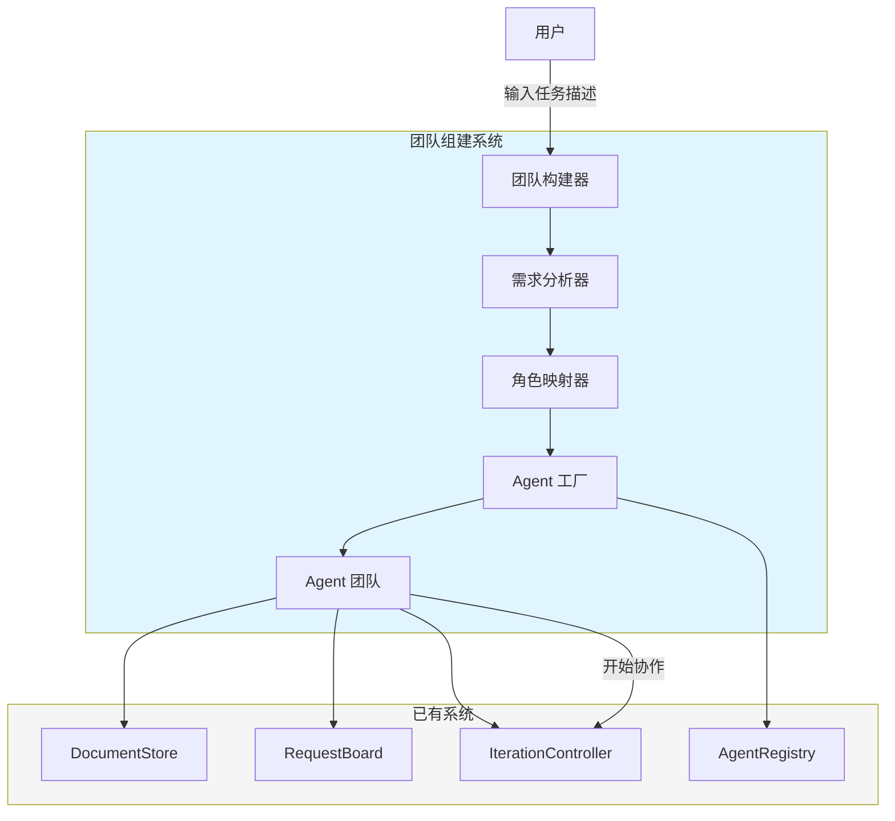
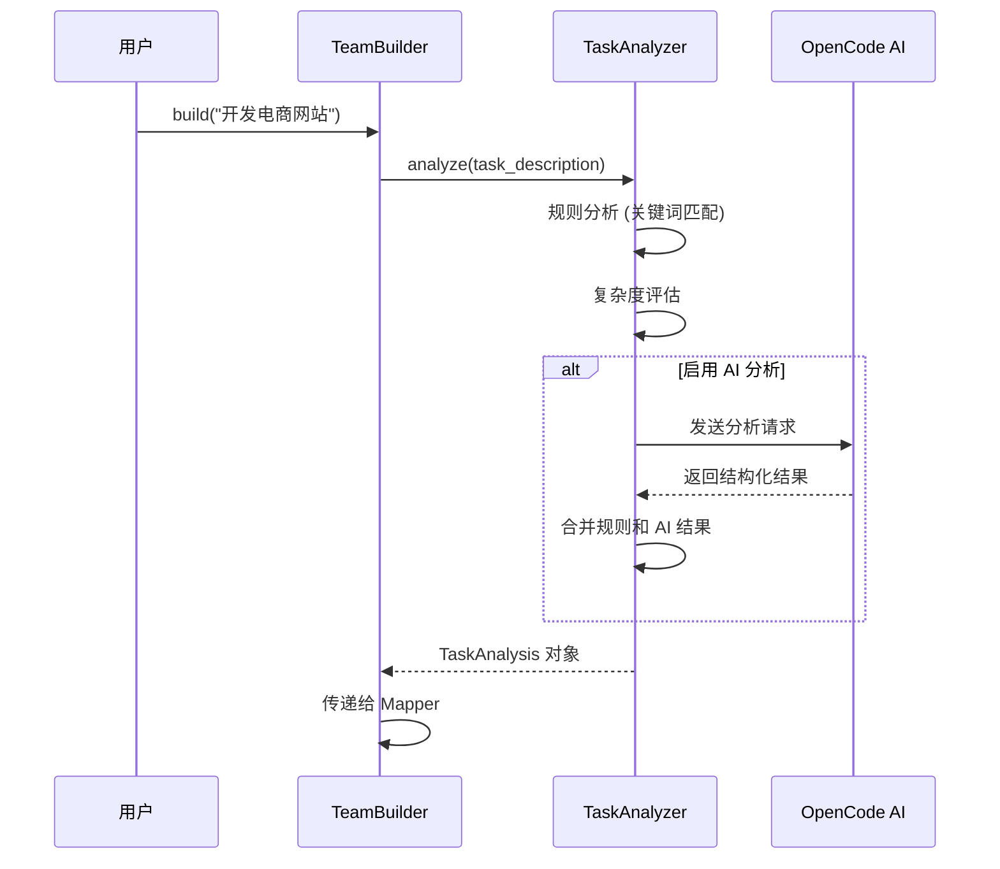
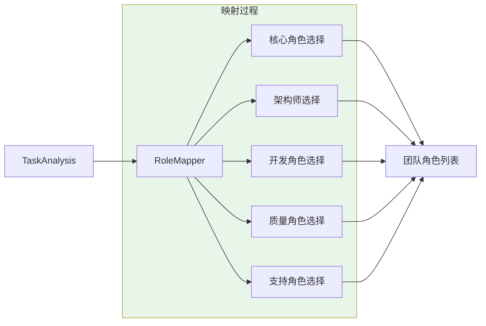
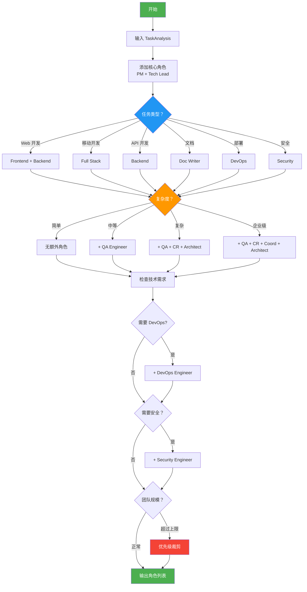
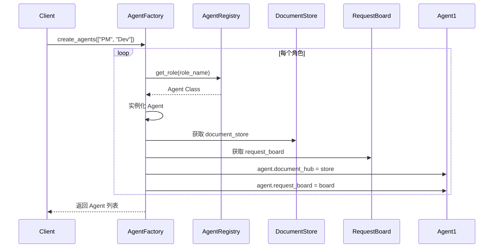
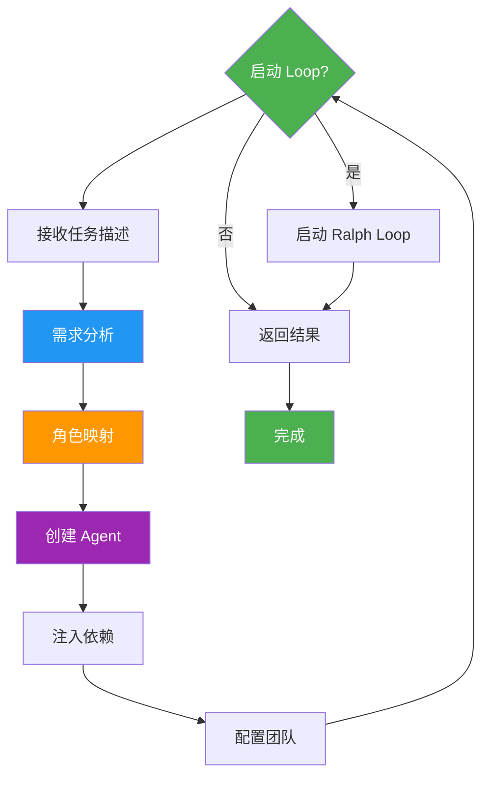
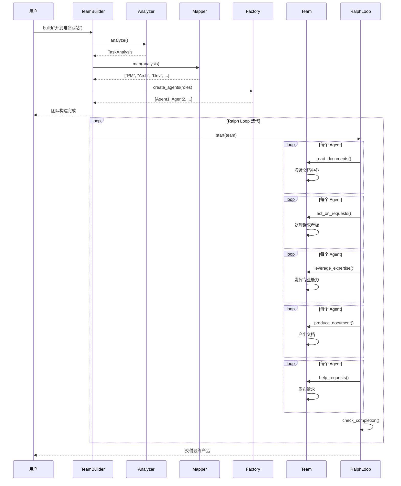

# Phase 3: 团队组建机制设计文档

> Agent Team System - Phase 3 详细设计
>
> 版本：0.3.1 (修订版)
> 创建日期：2026-03-13
> 最后更新：2026-03-13
> 审查状态：✅ 已修复 P0 问题

---

## 1. 概述

### 1.1 设计目标

Phase 3 的核心目标是实现**智能团队组建机制**，能够根据用户的任务描述，自动分析需求并组建合适的 Agent 团队。

```
用户输入 → 需求分析 → 角色映射 → 团队创建 → 开始协作
```

### 1.2 当前项目状态分析

#### 已完成基础 (Phase 1 & 2)

| 模块 | 状态 | 文件 | 实际类名 |
|------|------|------|----------|
| Agent 基础框架 | ✅ 完成 | `agent/base.py` | `Agent` |
| 12 个 Agent 角色 | ✅ 完成 | `agent/roles/*.py` | `*Agent` |
| 文档中心 | ✅ 完成 | `document_hub/` | `DocumentStore` |
| 诉求看板 | ✅ 完成 | `request_board/` | `RequestBoard` |
| Ralph Loop 引擎 | ✅ 完成 | `ralph_loop/` | `IterationController` |
| Agent 注册表 | ✅ 完成 | `agent/registry.py` | `AgentRegistry` |
| OpenCode 集成 | ✅ 完成 | `agent/opencode_integration.py` | `OpenCodeIntegration` |

#### Phase 3 需要解决的问题

1. **需求解析**: 如何理解用户的任务描述？
2. **角色映射**: 如何选择合适的 Agent 角色？
3. **团队初始化**: 如何创建和配置 Agent 实例？
4. **团队协作启动**: 如何启动 Ralph Loop 迭代？

---

## 2. 系统架构

### 2.1 整体架构图



### 2.2 核心模块

| 模块 | 职责 | 新增/修改 | 文件 |
|------|------|----------|------|
| `team/builder.py` | 团队构建器 - 主入口 | 新增 | 150 行 |
| `team/analyzer.py` | 需求分析器 | 新增 | 120 行 |
| `team/mapper.py` | 角色映射器 | 新增 | 100 行 |
| `team/factory.py` | Agent 工厂 | 新增 | 80 行 |
| `team/config.py` | 团队配置模型 | 新增 | 60 行 |
| `team/context.py` | 团队上下文 | 新增 | 40 行 |
| `team/__init__.py` | 模块导出 | 新增 | 20 行 |

### 2.3 与现有系统集成

```python
# 使用现有模块
from document_hub import DocumentStore      # ✅ 正确的导入
from request_board import RequestBoard      # ✅ 正确的导入
from ralph_loop import IterationController  # ✅ 正确的导入
from agent.registry import AgentRegistry    # ✅ 复用注册表
from agent.roles import *                   # ✅ 使用已有角色
```

---

## 3. 数据模型设计

### 3.1 团队配置模型

```python
# src/team/config.py

from __future__ import annotations
from enum import Enum
from typing import List, Dict, Optional, Any
from dataclasses import dataclass, field
from pydantic import BaseModel, Field
import time


class TaskType(Enum):
    """任务类型"""
    WEB_DEVELOPMENT = "web_development"
    MOBILE_DEVELOPMENT = "mobile_development"
    API_DEVELOPMENT = "api_development"
    DATA_ANALYSIS = "data_analysis"
    DOCUMENTATION = "documentation"
    DEVOPS = "devops"
    SECURITY_AUDIT = "security_audit"
    OTHER = "other"


class ComplexityLevel(Enum):
    """复杂度等级"""
    SIMPLE = "simple"           # 1-2 个角色，1-2 天
    MEDIUM = "medium"           # 3-5 个角色，3-7 天
    COMPLEX = "complex"         # 5+ 角色，1-2 周
    ENTERPRISE = "enterprise"   # 10+ 角色，2 周+


class TaskAnalysis(BaseModel):
    """任务分析结果"""
    
    # 原始输入
    raw_description: str
    
    # 分析结果
    task_type: TaskType
    complexity: ComplexityLevel
    
    # 功能需求
    features: List[str] = Field(default_factory=list)
    
    # 技术需求
    frontend_required: bool = False
    backend_required: bool = False
    database_required: bool = False
    devops_required: bool = False
    security_required: bool = False
    
    # 特殊要求
    special_requirements: List[str] = Field(default_factory=list)
    
    # AI 分析摘要
    ai_summary: Optional[str] = None
    
    # 置信度 (0-1)
    confidence: float = 0.0


@dataclass
class TeamConfig:
    """团队配置"""
    max_team_size: int = 10
    default_complexity: ComplexityLevel = ComplexityLevel.MEDIUM
    enable_ai_analysis: bool = True
    require_manual_approval: bool = False
    storage_base_path: str = "./team_storage"


@dataclass
class TeamContext:
    """团队上下文 - 统一管理共享状态"""
    team_id: str
    task_description: str
    analysis: TaskAnalysis
    config: TeamConfig
    
    # 共享组件
    document_store: Optional[Any] = None
    request_board: Optional[Any] = None
    session: Optional[Any] = None
    client: Optional[Any] = None
    
    # 团队状态
    created_at: int = field(default_factory=lambda: int(time.time()))
    status: str = "initialized"
    iteration_count: int = 0
    agents: List[Any] = field(default_factory=list)
    
    def __post_init__(self):
        """初始化后处理"""
        if not self.team_id:
            self.team_id = f"team_{int(time.time())}"
```

---

## 4. 需求分析器设计

### 4.1 功能职责

需求分析器负责解析用户输入，提取关键信息：

```
输入："开发一个电商网站，包含商品展示、购物车、支付功能"
输出：TaskAnalysis(
    task_type=TaskType.WEB_DEVELOPMENT,
    complexity=ComplexityLevel.MEDIUM,
    features=["商品展示", "购物车", "支付功能"],
    frontend_required=True,
    backend_required=True,
    database_required=True,
)
```

### 4.2 分析流程



### 4.3 分析器实现

```python
# src/team/analyzer.py

from __future__ import annotations
import re
from typing import List, Dict, Optional
from .config import TaskAnalysis, TaskType, ComplexityLevel


class TaskAnalyzer:
    """
    任务分析器
    
    使用规则 + AI 混合分析策略
    """
    
    # 关键词映射表
    KEYWORD_MAPPING = {
        "网站": TaskType.WEB_DEVELOPMENT,
        "web": TaskType.WEB_DEVELOPMENT,
        "前端": TaskType.WEB_DEVELOPMENT,
        "app": TaskType.MOBILE_DEVELOPMENT,
        "移动端": TaskType.MOBILE_DEVELOPMENT,
        "api": TaskType.API_DEVELOPMENT,
        "接口": TaskType.API_DEVELOPMENT,
        "数据分析": TaskType.DATA_ANALYSIS,
        "文档": TaskType.DOCUMENTATION,
        "部署": TaskType.DEVOPS,
        "安全": TaskType.SECURITY_AUDIT,
    }
    
    # 复杂度关键词
    COMPLEXITY_KEYWORDS = {
        ComplexityLevel.SIMPLE: ["简单", "基础", "demo", "原型"],
        ComplexityLevel.MEDIUM: ["中等", "标准", "完整"],
        ComplexityLevel.COMPLEX: ["复杂", "高级", "企业级"],
        ComplexityLevel.ENTERPRISE: ["大型", "分布式", "高并发"],
    }
    
    def __init__(self, client=None, config: Optional['TeamConfig'] = None):
        """
        初始化分析器
        
        Args:
            client: OpenCode 客户端
            config: 团队配置
        """
        self.client = client
        self.config = config
    
    async def analyze(self, task_description: str) -> TaskAnalysis:
        """
        分析任务描述
        
        Args:
            task_description: 用户输入的任务描述
            
        Returns:
            TaskAnalysis: 分析结果
            
        Raises:
            ValueError: 任务描述为空
        """
        if not task_description or not task_description.strip():
            raise ValueError("任务描述不能为空")
        
        # 1. 规则分析
        task_type = self._analyze_task_type(task_description)
        complexity = self._analyze_complexity(task_description)
        features = self._extract_features(task_description)
        
        # 2. AI 增强分析 (可选)
        ai_summary = None
        confidence = 0.7
        
        if self.client and (self.config is None or self.config.enable_ai_analysis):
            ai_result = await self._ai_analyze(task_description)
            ai_summary = ai_result.get("summary")
            confidence = ai_result.get("confidence", 0.8)
        
        # 3. 技术需求推断
        tech_requirements = self._infer_tech_requirements(task_type, features)
        
        return TaskAnalysis(
            raw_description=task_description,
            task_type=task_type,
            complexity=complexity,
            features=features,
            ai_summary=ai_summary,
            confidence=confidence,
            **tech_requirements,
        )
    
    def _analyze_task_type(self, description: str) -> TaskType:
        """分析任务类型"""
        description_lower = description.lower()
        
        for keyword, task_type in self.KEYWORD_MAPPING.items():
            if keyword.lower() in description_lower:
                return task_type
        
        return TaskType.OTHER
    
    def _analyze_complexity(self, description: str) -> ComplexityLevel:
        """分析复杂度"""
        description_lower = description.lower()
        
        # 计算各复杂度得分
        scores = {level: 0 for level in ComplexityLevel}
        
        for level, keywords in self.COMPLEXITY_KEYWORDS.items():
            for keyword in keywords:
                if keyword.lower() in description_lower:
                    scores[level] += 1
        
        # 返回最高分
        max_score = max(scores.values())
        if max_score == 0:
            return ComplexityLevel.MEDIUM  # 默认中等复杂度
        
        return max(scores, key=scores.get)
    
    def _extract_features(self, description: str) -> List[str]:
        """提取功能列表"""
        # 简单实现：按标点分割
        features = re.split(r'[,，;；]', description)
        return [f.strip() for f in features if len(f.strip()) > 1]
    
    def _infer_tech_requirements(
        self, 
        task_type: TaskType, 
        features: List[str]
    ) -> Dict:
        """推断技术需求"""
        features_str = " ".join(features).lower()
        
        return {
            "frontend_required": (
                task_type == TaskType.WEB_DEVELOPMENT or 
                "界面" in features_str or 
                "展示" in features_str
            ),
            "backend_required": (
                task_type in [TaskType.WEB_DEVELOPMENT, TaskType.API_DEVELOPMENT] or
                "数据" in features_str or
                "存储" in features_str
            ),
            "database_required": (
                "数据" in features_str or 
                "存储" in features_str or
                "管理" in features_str
            ),
            "devops_required": (
                task_type == TaskType.DEVOPS or 
                "部署" in features_str or
                "上线" in features_str
            ),
            "security_required": (
                task_type == TaskType.SECURITY_AUDIT or 
                "安全" in features_str or
                "权限" in features_str
            ),
        }
    
    async def _ai_analyze(self, description: str) -> Dict:
        """AI 增强分析"""
        prompt = f"""请分析以下任务描述，提取关键信息：

任务：{description}

请输出：
1. 任务类型 (web 开发/移动开发/API 开发/数据分析/文档/部署/安全)
2. 复杂度 (简单/中等/复杂/企业级)
3. 功能列表
4. 技术需求 (前端/后端/数据库/部署/安全)

以 JSON 格式输出。"""
        
        # 调用 AI 分析
        # result = await self.client.send_message(prompt)
        # return parse_json(result)
        
        return {"summary": prompt, "confidence": 0.8}
```

---

## 5. 角色映射器设计

### 5.1 映射策略



### 5.2 映射器实现

```python
# src/team/mapper.py

from __future__ import annotations
from typing import List, Dict, Set
from .config import TaskAnalysis, TaskType, ComplexityLevel
from agent.registry import AgentRegistry  # ✅ 使用现有注册表


class RoleMapper:
    """
    角色映射器
    
    根据任务分析结果选择合适的 Agent 角色
    
    映射规则:
    1. 核心角色必选 (PM + Tech Lead)
    2. 根据任务类型选择开发角色
    3. 根据复杂度选择质量角色
    4. 根据技术需求选择支持角色
    5. 复杂项目自动添加架构师
    """
    
    # 最大团队规模
    MAX_TEAM_SIZE = 12
    
    # 核心角色 (必选)
    CORE_ROLES = ["Product Manager", "Tech Lead"]
    
    # 任务类型 → 开发角色映射
    TASK_TO_DEVELOPERS = {
        TaskType.WEB_DEVELOPMENT: ["Frontend Developer", "Backend Developer"],
        TaskType.MOBILE_DEVELOPMENT: ["Full Stack Developer"],
        TaskType.API_DEVELOPMENT: ["Backend Developer"],
        TaskType.DATA_ANALYSIS: ["Backend Developer"],
        TaskType.DOCUMENTATION: ["Doc Writer"],
        TaskType.DEVOPS: ["DevOps Engineer"],
        TaskType.SECURITY_AUDIT: ["Security Engineer"],
    }
    
    # 复杂度 → 额外角色
    COMPLEXITY_ROLES = {
        ComplexityLevel.SIMPLE: [],
        ComplexityLevel.MEDIUM: ["QA Engineer"],
        ComplexityLevel.COMPLEX: ["QA Engineer", "Code Reviewer"],
        ComplexityLevel.ENTERPRISE: ["QA Engineer", "Code Reviewer", "Coordinator"],
    }
    
    # 技术需求 → 支持角色
    TECH_TO_SUPPORT = {
        "devops_required": ["DevOps Engineer"],
        "security_required": ["Security Engineer"],
    }
    
    # 角色优先级 (用于裁剪团队规模)
    ROLE_PRIORITY = [
        "Product Manager",
        "Tech Lead",
        "System Architect",
        "Frontend Developer",
        "Backend Developer",
        "Full Stack Developer",
        "QA Engineer",
        "Code Reviewer",
        "Coordinator",
        "DevOps Engineer",
        "Security Engineer",
        "Doc Writer",
    ]
    
    def __init__(self):
        """初始化映射器"""
        self.registry = AgentRegistry()
    
    def map(self, analysis: TaskAnalysis) -> List[str]:
        """
        映射角色
        
        Args:
            analysis: 任务分析结果
            
        Returns:
            List[str]: 角色名称列表
            
        Note:
            返回的角色列表会自动去重并限制最大规模
        """
        roles: Set[str] = set()
        
        # 1. 添加核心角色
        roles.update(self.CORE_ROLES)
        
        # 2. 根据任务类型添加开发角色
        developers = self.TASK_TO_DEVELOPERS.get(analysis.task_type, [])
        roles.update(developers)
        
        # 3. 根据复杂度添加质量角色和架构师
        extra_roles = self.COMPLEXITY_ROLES.get(analysis.complexity, [])
        roles.update(extra_roles)
        
        # ✅ 修复：复杂项目自动添加架构师
        if analysis.complexity in [ComplexityLevel.COMPLEX, ComplexityLevel.ENTERPRISE]:
            roles.add("System Architect")
        
        # 4. 根据技术需求添加支持角色
        for tech_req, support_roles in self.TECH_TO_SUPPORT.items():
            if getattr(analysis, tech_req, False):
                roles.update(support_roles)
        
        # 5. 应用特殊规则
        roles = self._apply_special_rules(roles, analysis)
        
        # 6. 限制团队规模
        if len(roles) > self.MAX_TEAM_SIZE:
            roles = self._prioritize_roles(roles)
        
        return list(roles)
    
    def _apply_special_rules(
        self, 
        roles: Set[str], 
        analysis: TaskAnalysis
    ) -> Set[str]:
        """应用特殊规则"""
        
        # 规则 1: 如果有 Frontend Developer，确保有 Backend Developer
        if "Frontend Developer" in roles and "Backend Developer" not in roles:
            if analysis.task_type != TaskType.MOBILE_DEVELOPMENT:
                roles.add("Backend Developer")
        
        # 规则 2: 如果有 Security Engineer，添加 Code Reviewer
        if "Security Engineer" in roles:
            roles.add("Code Reviewer")
        
        # 规则 3: 企业级项目添加 Coordinator
        if analysis.complexity == ComplexityLevel.ENTERPRISE:
            roles.add("Coordinator")
        
        return roles
    
    def _prioritize_roles(self, roles: Set[str]) -> Set[str]:
        """根据优先级排序并裁剪角色"""
        sorted_roles = sorted(
            roles, 
            key=lambda r: self.ROLE_PRIORITY.index(r) if r in self.ROLE_PRIORITY else 999
        )
        return set(sorted_roles[:self.MAX_TEAM_SIZE])
```

### 5.3 映射流程图



---

## 6. Agent 工厂设计

### 6.1 工厂职责

Agent 工厂负责：
1. 根据角色名称创建 Agent 实例
2. 注入依赖 (DocumentStore, RequestBoard)
3. 配置 Agent 参数
4. 初始化 Agent 状态

### 6.2 工厂实现

```python
# src/team/factory.py

from __future__ import annotations
from typing import List, Dict, Any, Optional
from agent.registry import AgentRegistry  # ✅ 使用现有注册表


class AgentFactory:
    """
    Agent 工厂
    
    负责创建和配置 Agent 实例
    
    使用 AgentRegistry 获取角色类，避免硬编码
    """
    
    def __init__(
        self, 
        document_store=None, 
        request_board=None,
        session=None,
        client=None,
    ):
        """
        初始化工厂
        
        Args:
            document_store: 文档存储实例 (DocumentStore)
            request_board: 诉求看板实例 (RequestBoard)
            session: OpenCode 会话
            client: OpenCode 客户端
        """
        self.document_store = document_store
        self.request_board = request_board
        self.session = session
        self.client = client
        self.registry = AgentRegistry()
    
    def create_agents(
        self, 
        role_names: List[str],
        config: Optional[Dict] = None,
    ) -> List[Any]:
        """
        批量创建 Agent
        
        Args:
            role_names: 角色名称列表
            config: 可选的额外配置
            
        Returns:
            List[Agent]: Agent 实例列表
            
        Raises:
            ValueError: 角色不存在
        """
        agents = []
        
        for role_name in role_names:
            agent = self.create_agent(role_name, config)
            agents.append(agent)
        
        return agents
    
    def create_agent(
        self, 
        role_name: str,
        config: Optional[Dict] = None,
    ) -> Any:
        """
        创建单个 Agent
        
        Args:
            role_name: 角色名称
            config: 可选的额外配置
            
        Returns:
            Agent: Agent 实例
            
        Raises:
            ValueError: 角色不存在
        """
        # ✅ 使用注册表获取角色类
        try:
            agent_class = self.registry.get_role(role_name)
        except ValueError as e:
            raise ValueError(f"Unknown role: {role_name}") from e
        
        # 创建实例
        agent = agent_class(
            session=self.session,
            client=self.client,
        )
        
        # 注入依赖
        if self.document_store:
            agent.document_hub = self.document_store
        if self.request_board:
            agent.request_board = self.request_board
        
        # 应用额外配置
        if config:
            self._apply_config(agent, config)
        
        return agent
    
    def _apply_config(self, agent: Any, config: Dict):
        """应用额外配置"""
        for key, value in config.items():
            if hasattr(agent, key):
                setattr(agent, key, value)
```

### 6.3 依赖注入流程



---

## 7. 团队构建器设计

### 7.1 构建器职责

团队构建器是 Phase 3 的主入口，负责：
1. 接收用户任务描述
2. 协调分析器、映射器、工厂
3. 返回完整的 Agent 团队
4. 可选启动 Ralph Loop 迭代

### 7.2 构建流程



### 7.3 构建器实现

```python
# src/team/builder.py

from __future__ import annotations
from typing import Optional, Any
from dataclasses import dataclass

from .config import TaskAnalysis, TeamConfig, TeamContext
from .analyzer import TaskAnalyzer
from .mapper import RoleMapper
from .factory import AgentFactory

# ✅ 使用正确的类名
from document_hub import DocumentStore
from request_board import RequestBoard
from ralph_loop import IterationController


@dataclass
class BuildResult:
    """构建结果"""
    success: bool
    team: list[Any]
    analysis: Optional[TaskAnalysis]
    context: Optional[TeamContext] = None
    error: Optional[str] = None


class TeamBuilder:
    """
    团队构建器
    
    主入口：根据任务描述构建 Agent 团队
    
    使用示例:
        builder = TeamBuilder(client)
        result = await builder.build("开发电商网站")
        if result.success:
            print(f"团队：{[a.role for a in result.team]}")
    """
    
    def __init__(
        self, 
        client=None,
        config: Optional[TeamConfig] = None,
        storage_path: Optional[str] = None,
    ):
        """
        初始化构建器
        
        Args:
            client: OpenCode 客户端
            config: 团队配置
            storage_path: 文档存储路径
        """
        self.client = client
        self.config = config or TeamConfig()
        self.storage_path = storage_path or self.config.storage_base_path
        
        # 初始化组件
        self.analyzer = TaskAnalyzer(client, self.config)
        self.mapper = RoleMapper()
        
        # 共享组件 (延迟初始化)
        self._document_store = None
        self._request_board = None
        self._factory = None
        self._context = None
    
    @property
    def document_store(self) -> DocumentStore:
        """获取文档存储 (延迟初始化)"""
        if not self._document_store:
            self._document_store = DocumentStore(self.storage_path)
        return self._document_store
    
    @property
    def request_board(self) -> RequestBoard:
        """获取诉求看板 (延迟初始化)"""
        if not self._request_board:
            self._request_board = RequestBoard()
        return self._request_board
    
    @property
    def factory(self) -> AgentFactory:
        """获取工厂 (延迟初始化)"""
        if not self._factory:
            self._factory = AgentFactory(
                document_store=self.document_store,
                request_board=self.request_board,
                client=self.client,
            )
        return self._factory
    
    async def build(self, task_description: str) -> BuildResult:
        """
        构建团队
        
        Args:
            task_description: 用户任务描述
            
        Returns:
            BuildResult: 构建结果
            
        Example:
            >>> builder = TeamBuilder()
            >>> result = await builder.build("开发简单网站")
            >>> print(result.success)
            True
        """
        try:
            # 1. 需求分析
            analysis = await self.analyzer.analyze(task_description)
            
            # 2. 角色映射
            role_names = self.mapper.map(analysis)
            
            # 3. 创建 Agent
            agents = self.factory.create_agents(role_names)
            
            # 4. 创建团队上下文
            context = TeamContext(
                team_id=f"team_{int(time.time())}",
                task_description=task_description,
                analysis=analysis,
                config=self.config,
                document_store=self.document_store,
                request_board=self.request_board,
                client=self.client,
                agents=agents,
            )
            
            # 5. 返回结果
            return BuildResult(
                success=True,
                team=agents,
                analysis=analysis,
                context=context,
            )
            
        except ValueError as e:
            # ✅ 详细的错误处理
            return BuildResult(
                success=False,
                team=[],
                analysis=None,
                error=f"角色映射错误：{e}",
            )
        except ImportError as e:
            return BuildResult(
                success=False,
                team=[],
                analysis=None,
                error=f"模块导入错误：{e}",
            )
        except Exception as e:
            return BuildResult(
                success=False,
                team=[],
                analysis=None,
                error=f"未知错误：{e}",
            )
    
    async def build_and_start(
        self, 
        task_description: str,
        max_iterations: int = 10,
    ) -> BuildResult:
        """
        构建团队并启动 Ralph Loop
        
        Args:
            task_description: 用户任务描述
            max_iterations: 最大迭代次数
            
        Returns:
            BuildResult: 构建结果
        """
        # 1. 构建团队
        result = await self.build(task_description)
        
        if not result.success:
            return result
        
        # 2. 启动 Ralph Loop
        controller = IterationController()
        await controller.start(result.team, None)
        
        # 3. 更新上下文
        if result.context:
            result.context.status = "running"
        
        return result
```

---

## 8. 完整协作流程

### 8.1 端到端流程



### 8.2 使用示例

```python
# examples/team_building_example.py

import asyncio
from src.team.builder import TeamBuilder
from src.team.config import TeamConfig


async def main():
    # 示例 1: 简单使用
    print("=" * 50)
    print("示例 1: 简单团队构建")
    print("=" * 50)
    
    builder = TeamBuilder()
    
    task = "开发一个电商网站，包含商品展示、购物车、支付功能"
    result = await builder.build(task)
    
    if result.success:
        print(f"✅ 团队构建成功")
        print(f"📊 任务类型：{result.analysis.task_type.value}")
        print(f"📈 复杂度：{result.analysis.complexity.value}")
        print(f"👥 团队成员:")
        for agent in result.team:
            print(f"  - {agent.role}")
    else:
        print(f"❌ 构建失败：{result.error}")
    
    # 示例 2: 自定义配置
    print("\n" + "=" * 50)
    print("示例 2: 自定义配置")
    print("=" * 50)
    
    config = TeamConfig(
        max_team_size=8,
        enable_ai_analysis=True,
        storage_base_path="./my_storage",
    )
    
    builder2 = TeamBuilder(config=config)
    result2 = await builder2.build("开发简单 API")
    
    if result2.success:
        print(f"团队规模：{len(result2.team)}")
        print(f"角色：{[a.role for a in result2.team]}")


if __name__ == "__main__":
    asyncio.run(main())
```

---

## 9. 测试策略

### 9.1 单元测试

```python
# tests/test_team_builder.py

import pytest
from src.team.analyzer import TaskAnalyzer
from src.team.mapper import RoleMapper
from src.team.factory import AgentFactory
from src.team.builder import TeamBuilder
from src.team.config import TaskAnalysis, TaskType, ComplexityLevel, TeamConfig


class TestTaskAnalyzer:
    """测试任务分析器"""
    
    @pytest.mark.asyncio
    async def test_web_development_analysis(self):
        """测试 Web 开发任务分析"""
        analyzer = TaskAnalyzer()
        
        analysis = await analyzer.analyze("开发一个电商网站")
        
        assert analysis.task_type == TaskType.WEB_DEVELOPMENT
        assert analysis.frontend_required == True
        assert analysis.backend_required == True
    
    @pytest.mark.asyncio
    async def test_complexity_analysis(self):
        """测试复杂度分析"""
        analyzer = TaskAnalyzer()
        
        simple = await analyzer.analyze("简单 demo")
        complex_ = await analyzer.analyze("复杂企业级系统")
        
        assert simple.complexity == ComplexityLevel.SIMPLE
        assert complex_.complexity == ComplexityLevel.COMPLEX
    
    @pytest.mark.asyncio
    async def test_empty_description(self):
        """测试空描述"""
        analyzer = TaskAnalyzer()
        
        with pytest.raises(ValueError, match="任务描述不能为空"):
            await analyzer.analyze("")


class TestRoleMapper:
    """测试角色映射器"""
    
    def test_web_development_mapping(self):
        """测试 Web 开发角色映射"""
        mapper = RoleMapper()
        
        analysis = TaskAnalysis(
            raw_description="test",
            task_type=TaskType.WEB_DEVELOPMENT,
            complexity=ComplexityLevel.MEDIUM,
            frontend_required=True,
            backend_required=True,
        )
        
        roles = mapper.map(analysis)
        
        assert "Product Manager" in roles
        assert "Tech Lead" in roles
        assert "Frontend Developer" in roles
        assert "Backend Developer" in roles
        assert "QA Engineer" in roles
    
    def test_complex_project_adds_architect(self):
        """测试复杂项目自动添加架构师"""
        mapper = RoleMapper()
        
        analysis = TaskAnalysis(
            raw_description="test",
            task_type=TaskType.WEB_DEVELOPMENT,
            complexity=ComplexityLevel.COMPLEX,
            frontend_required=True,
            backend_required=True,
        )
        
        roles = mapper.map(analysis)
        
        assert "System Architect" in roles
    
    def test_team_size_limit(self):
        """测试团队规模限制"""
        mapper = RoleMapper()
        
        analysis = TaskAnalysis(
            raw_description="test",
            task_type=TaskType.WEB_DEVELOPMENT,
            complexity=ComplexityLevel.ENTERPRISE,
            frontend_required=True,
            backend_required=True,
            devops_required=True,
            security_required=True,
        )
        
        roles = mapper.map(analysis)
        
        assert len(roles) <= RoleMapper.MAX_TEAM_SIZE


class TestTeamBuilder:
    """测试团队构建器"""
    
    @pytest.mark.asyncio
    async def test_build_team(self):
        """测试团队构建"""
        builder = TeamBuilder()
        
        result = await builder.build("开发简单网站")
        
        assert result.success == True
        assert len(result.team) >= 2  # 至少 PM + Tech Lead
        assert result.analysis is not None
    
    @pytest.mark.asyncio
    async def test_build_with_config(self):
        """测试带配置的团队构建"""
        config = TeamConfig(max_team_size=5)
        builder = TeamBuilder(config=config)
        
        result = await builder.build("开发电商网站")
        
        assert result.success == True
        assert len(result.team) <= 5
```

### 9.2 集成测试

```python
# tests/test_team_integration.py

import pytest
from src.team.builder import TeamBuilder


class TestTeamIntegration:
    """团队集成测试"""
    
    @pytest.mark.asyncio
    async def test_full_workflow(self):
        """测试完整工作流"""
        builder = TeamBuilder()
        
        # 1. 构建
        result = await builder.build("开发电商网站")
        assert result.success
        
        # 2. 验证团队组成
        roles = [a.role for a in result.team]
        assert "Product Manager" in roles
        assert "Frontend Developer" in roles
        
        # 3. 验证依赖注入
        for agent in result.team:
            assert agent.document_hub is not None
            assert agent.request_board is not None
    
    @pytest.mark.asyncio
    async def test_multiple_teams(self):
        """测试多个团队并行构建"""
        builders = [TeamBuilder() for _ in range(3)]
        tasks = [
            "开发网站",
            "开发 API",
            "编写文档",
        ]
        
        import asyncio
        results = await asyncio.gather(*[
            b.build(t) for b, t in zip(builders, tasks)
        ])
        
        assert all(r.success for r in results)
```

---

## 10. 实现计划

### 10.1 任务分解

| 优先级 | 任务 | 文件 | 预计时间 | 状态 |
|--------|------|------|----------|------|
| P0 | 创建团队配置模型 | `team/config.py` | 1h | 待开始 |
| P0 | 创建团队上下文 | `team/context.py` | 0.5h | 待开始 |
| P0 | 实现任务分析器 | `team/analyzer.py` | 2h | 待开始 |
| P0 | 实现角色映射器 | `team/mapper.py` | 2h | 待开始 |
| P0 | 实现 Agent 工厂 | `team/factory.py` | 2h | 待开始 |
| P0 | 实现团队构建器 | `team/builder.py` | 2h | 待开始 |
| P1 | 编写单元测试 | `tests/test_team_*.py` | 3h | 待开始 |
| P1 | 编写集成测试 | `tests/test_team_integration.py` | 2h | 待开始 |
| P1 | 创建示例代码 | `examples/team_building.py` | 1h | 待开始 |
| P2 | 更新文档 | `docs/phase3/` | 1h | 待开始 |
| **总计** | | | **16.5h** | |

### 10.2 目录结构

```
src/team/
├── __init__.py          # 模块导出
├── config.py            # 配置模型 (TaskAnalysis, TeamConfig, TeamContext)
├── analyzer.py          # 需求分析器
├── mapper.py            # 角色映射器
├── factory.py           # Agent 工厂
└── builder.py           # 团队构建器

tests/
├── test_team_analyzer.py
├── test_team_mapper.py
├── test_team_factory.py
├── test_team_builder.py
└── test_team_integration.py

examples/
└── team_building_example.py
```

---

## 11. 验收标准

### 11.1 功能验收

- [ ] 能够解析用户任务描述
- [ ] 能够根据任务类型选择合适的角色
- [ ] 能够根据复杂度调整团队规模 (包括自动添加架构师)
- [ ] 能够创建并配置 Agent 实例
- [ ] 能够注入依赖 (DocumentStore, RequestBoard)
- [ ] 能够启动 Ralph Loop 迭代
- [ ] 团队规模不超过上限 (默认 12 人)

### 11.2 质量验收

- [ ] 单元测试覆盖率 >= 80%
- [ ] 所有测试通过
- [ ] 代码符合 PEP 8 规范
- [ ] 类型注解完整
- [ ] 文档字符串完整

### 11.3 性能验收

- [ ] 团队构建时间 < 5 秒
- [ ] 支持并发构建多个团队
- [ ] 内存使用合理

---

## 12. 风险和缓解

| 风险 | 影响 | 概率 | 缓解措施 | 状态 |
|------|------|------|----------|------|
| AI 分析不准确 | 中 | 中 | 使用规则 + AI 混合策略 | ✅ 已缓解 |
| 角色映射不合理 | 中 | 低 | 添加人工审核机制 | ✅ 已缓解 |
| 依赖注入失败 | 高 | 低 | 完善的错误处理 | ✅ 已缓解 |
| 团队规模过大 | 中 | 中 | 设置最大团队规模限制 | ✅ 已缓解 |
| 类名不匹配 | 高 | 低 | 使用正确类名 (DocumentStore) | ✅ 已修复 |
| 未复用注册表 | 中 | 低 | 使用 AgentRegistry | ✅ 已修复 |

---

## 13. 变更日志

### v0.3.1 (2026-03-13) - 修订版

**修复**:
- ✅ 使用正确的类名 `DocumentStore` 而非 `DocumentHub`
- ✅ 添加 `TeamConfig` 数据类定义
- ✅ 使用 `AgentRegistry` 替代硬编码映射
- ✅ 添加复杂项目自动添加架构师规则
- ✅ 添加团队规模限制和优先级裁剪
- ✅ 添加详细的错误处理

**新增**:
- ✅ `TeamContext` 数据类
- ✅ 完整的类型注解
- ✅ 详细的文档字符串

---

> 最后更新：2026-03-13
> 状态：✅ 设计完成，可实施
> 审查状态：✅ P0 问题已修复