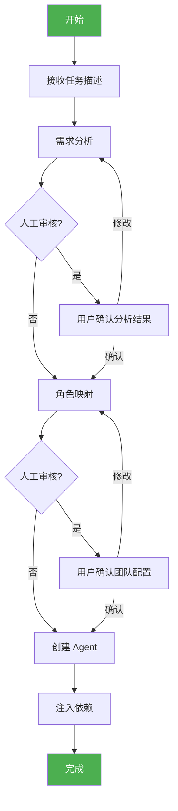

# Phase 3 设计文档审查报告

> 审查日期：2026-03-13
> 审查版本：v0.3.0
> 审查人：系统审查

---

## 1. 审查概述

### 1.1 总体评价

| 维度 | 评分 | 说明 |
|------|------|------|
| 完整性 | ⭐⭐⭐⭐☆ | 4/5 - 核心功能完整，部分细节缺失 |
| 可行性 | ⭐⭐⭐⭐☆ | 4/5 - 整体可行，需修复兼容性问题 |
| 兼容性 | ⭐⭐⭐☆☆ | 3/5 - 存在与现有代码的兼容性问题 |
| 可维护性 | ⭐⭐⭐⭐☆ | 4/5 - 模块化设计，易于维护 |
| 文档质量 | ⭐⭐⭐⭐⭐ | 5/5 - 流程图清晰，说明详细 |

**总体评分：4.0/5.0**

---

## 2. 发现的问题

### 2.1 严重问题 (P0)

#### 问题 1: DocumentHub 类名不匹配

**位置**: 设计文档第 739、782、781 行

**问题描述**:
```python
# 设计文档中使用
from document_hub.store import DocumentHub

# 实际代码中
from document_hub.store import DocumentStore  # 类名是 DocumentStore
```

**影响**: 导入失败，代码无法运行

**修复建议**:
```python
# 方案 A: 修改设计文档使用正确的类名
from document_hub.store import DocumentStore

# 方案 B: 在 document_hub/__init__.py 中添加别名
from .store import DocumentStore as DocumentHub
```

**推荐**: 方案 B，保持设计文档的可读性

---

#### 问题 2: TeamConfig 类未定义

**位置**: 设计文档第 734 行

**问题描述**:
```python
# 设计文档中引用了 TeamConfig
from .config import TaskAnalysis, TeamConfig

# 但 config.py 中只定义了 TaskAnalysis，没有 TeamConfig
```

**影响**: 导入失败

**修复建议**: 在 `team/config.py` 中添加 TeamConfig 定义
```python
@dataclass
class TeamConfig:
    """团队配置"""
    max_team_size: int = 10
    default_complexity: ComplexityLevel = ComplexityLevel.MEDIUM
    enable_ai_analysis: bool = True
```

---

### 2.2 中等问题 (P1)

#### 问题 3: AgentRegistry 未被利用

**位置**: 设计文档第 558-572 行

**问题描述**:
设计文档中的 `AgentFactory.ROLE_CLASS_MAP` 硬编码了角色映射，但项目中已有 `AgentRegistry` 类可以复用。

**当前设计**:
```python
# factory.py - 硬编码映射
ROLE_CLASS_MAP = {
    "Product Manager": ProductManagerAgent,
    "System Architect": SystemArchitectAgent,
    # ...
}
```

**现有代码**:
```python
# registry.py - 已有注册表
class AgentRegistry:
    _registry: Dict[str, Type] = {}
    
    @classmethod
    def get_role(cls, role_name: str) -> Type:
        return cls._registry[role_name]
```

**修复建议**:
```python
# factory.py - 使用现有注册表
from agent.registry import AgentRegistry

class AgentFactory:
    def create_agent(self, role_name: str, config: Optional[Dict] = None) -> Any:
        # 使用注册表获取角色类
        agent_class = AgentRegistry.get_role(role_name)
        return agent_class(session=self.session, client=self.client)
```

**好处**:
- 减少代码重复
- 自动同步新角色
- 更易扩展

---

#### 问题 4: 缺少 System Architect 的自动映射

**位置**: 设计文档第 387-398 行

**问题描述**:
```python
# 当前 CORE_ROLES 只包含 PM 和 Tech Lead
CORE_ROLES = ["Product Manager", "Tech Lead"]

# 但对于复杂项目，应该自动添加 System Architect
```

**修复建议**:
```python
def _apply_special_rules(self, roles: set, analysis: TaskAnalysis) -> set:
    # 添加规则：复杂及以上项目添加 System Architect
    if analysis.complexity in [ComplexityLevel.COMPLEX, ComplexityLevel.ENTERPRISE]:
        roles.add("System Architect")
    
    # ... 其他规则
    return roles
```

---

#### 问题 5: DocumentHub 初始化参数缺失

**位置**: 设计文档第 781-783 行

**问题描述**:
```python
# 设计文档中
self._document_hub = DocumentHub()  # 无参数

# 实际代码中
class DocumentStore:
    def __init__(self, base_path: str = "./document_hub/storage"):
        # 需要指定 base_path
```

**修复建议**:
```python
# 方案 A: 使用默认路径
self._document_hub = DocumentStore()

# 方案 B: 支持自定义路径
class TeamBuilder:
    def __init__(self, client=None, storage_path: str = None):
        self._storage_path = storage_path or "./team_storage"
```

---

### 2.3 轻微问题 (P2)

#### 问题 6: 缺少错误处理细节

**位置**: 设计文档第 830-836 行

**问题描述**:
异常捕获过于宽泛，没有区分错误类型。

**修复建议**:
```python
async def build(self, task_description: str) -> BuildResult:
    try:
        analysis = await self.analyzer.analyze(task_description)
        role_names = self.mapper.map(analysis)
        agents = self.factory.create_agents(role_names)
        
        return BuildResult(success=True, team=agents, analysis=analysis)
        
    except ValueError as e:
        # 角色映射错误
        return BuildResult(success=False, team=[], analysis=None, 
                          error=f"角色映射错误: {e}")
    except ImportError as e:
        # 导入错误
        return BuildResult(success=False, team=[], analysis=None,
                          error=f"模块导入错误: {e}")
    except Exception as e:
        # 其他未知错误
        return BuildResult(success=False, team=[], analysis=None,
                          error=f"未知错误: {e}")
```

---

#### 问题 7: 缺少团队规模限制

**位置**: 设计文档第 411-442 行

**问题描述**:
没有对最大团队规模进行限制，可能导致资源耗尽。

**修复建议**:
```python
class RoleMapper:
    MAX_TEAM_SIZE = 12  # 最大团队规模
    
    def map(self, analysis: TaskAnalysis) -> List[str]:
        roles = set()
        # ... 映射逻辑
        
        # 限制团队规模
        if len(roles) > self.MAX_TEAM_SIZE:
            roles = self._prioritize_roles(roles, analysis)
        
        return list(roles)[:self.MAX_TEAM_SIZE]
    
    def _prioritize_roles(self, roles: set, analysis: TaskAnalysis) -> list:
        """根据优先级排序角色"""
        priority_order = [
            "Product Manager", "Tech Lead", "System Architect",
            "Frontend Developer", "Backend Developer",
            "QA Engineer", "Code Reviewer", ...
        ]
        return sorted(roles, key=lambda r: priority_order.index(r) if r in priority_order else 999)
```

---

## 3. 改进建议

### 3.1 架构改进

#### 建议 1: 添加团队上下文 (TeamContext)

**目的**: 统一管理团队共享状态

```python
# team/context.py

@dataclass
class TeamContext:
    """团队上下文"""
    team_id: str
    task_description: str
    analysis: TaskAnalysis
    document_hub: DocumentStore
    request_board: RequestBoard
    session: Any = None
    client: Any = None
    created_at: int = field(default_factory=lambda: int(time.time()))
    
    # 团队状态
    status: str = "initialized"
    iteration_count: int = 0
```

**好处**:
- 统一依赖管理
- 支持团队状态追踪
- 便于测试和调试

---

#### 建议 2: 添加团队构建事件

**目的**: 支持构建过程的监控和日志

```python
# team/events.py

from enum import Enum
from dataclasses import dataclass
from typing import Any

class BuildEventType(Enum):
    STARTED = "started"
    ANALYZING = "analyzing"
    MAPPING = "mapping"
    CREATING = "creating"
    COMPLETED = "completed"
    FAILED = "failed"

@dataclass
class BuildEvent:
    type: BuildEventType
    message: str
    data: Any = None
    timestamp: int = field(default_factory=lambda: int(time.time()))
```

---

### 3.2 流程改进

#### 建议 3: 添加人工审核点

**流程图更新**:



---

### 3.3 测试改进

#### 建议 4: 添加边界测试

```python
class TestTeamBuilderBoundary:
    """边界测试"""
    
    @pytest.mark.asyncio
    async def test_empty_description(self):
        """测试空描述"""
        builder = TeamBuilder()
        result = await builder.build("")
        assert result.success == False
    
    @pytest.mark.asyncio
    async def test_very_long_description(self):
        """测试超长描述"""
        builder = TeamBuilder()
        long_desc = "开发" * 10000
        result = await builder.build(long_desc)
        assert result.success == True  # 应该能处理
    
    @pytest.mark.asyncio
    async def test_unknown_task_type(self):
        """测试未知任务类型"""
        builder = TeamBuilder()
        result = await builder.build("做一顿晚餐")
        assert result.success == True
        assert result.analysis.task_type == TaskType.OTHER
```

---

## 4. 兼容性检查清单

### 4.1 模块导入兼容性

| 设计引用 | 实际代码 | 状态 | 建议 |
|----------|----------|------|------|
| `document_hub.store.DocumentHub` | `DocumentStore` | ❌ 不匹配 | 添加别名 |
| `request_board.board.RequestBoard` | `RequestBoard` | ✅ 匹配 | - |
| `ralph_loop.controller.IterationController` | `IterationController` | ✅ 匹配 | - |
| `agent.roles.*Agent` | 各角色类 | ✅ 匹配 | - |
| `agent.registry.AgentRegistry` | `AgentRegistry` | ⚠️ 未使用 | 应复用 |

### 4.2 接口兼容性

| 接口 | 设计定义 | 实际代码 | 状态 |
|------|----------|----------|------|
| `DocumentHub()` | 无参数 | `DocumentStore(base_path)` | ⚠️ 参数不匹配 |
| `RequestBoard()` | 无参数 | 无参数 | ✅ |
| `Agent.__init__` | `(session, client)` | `(session, client)` | ✅ |
| `IterationController.start` | `(agents, team_session)` | `(agents, team_session)` | ✅ |

---

## 5. 修复清单

### 5.1 必须修复 (阻断实施)

| 编号 | 问题 | 文件 | 修复方案 |
|------|------|------|----------|
| P0-1 | DocumentHub 类名不匹配 | `document_hub/__init__.py` | 添加别名 |
| P0-2 | TeamConfig 未定义 | `team/config.py` | 添加定义 |

### 5.2 建议修复 (提升质量)

| 编号 | 问题 | 文件 | 修复方案 |
|------|------|------|----------|
| P1-1 | 未复用 AgentRegistry | `team/factory.py` | 使用注册表 |
| P1-2 | 缺少 System Architect 自动映射 | `team/mapper.py` | 添加规则 |
| P1-3 | DocumentHub 初始化参数 | `team/builder.py` | 添加参数 |

### 5.3 可选改进

| 编号 | 建议 | 优先级 |
|------|------|--------|
| P2-1 | 添加详细错误处理 | 低 |
| P2-2 | 添加团队规模限制 | 低 |
| P2-3 | 添加 TeamContext | 低 |
| P2-4 | 添加构建事件 | 低 |

---

## 6. 修复补丁

### 6.1 document_hub/__init__.py 补丁

```python
# src/document_hub/__init__.py

from .store import DocumentStore

# 添加别名，保持向后兼容
DocumentHub = DocumentStore

__all__ = ["DocumentStore", "DocumentHub"]
```

### 6.2 team/config.py 补充定义

```python
# src/team/config.py (在文件末尾添加)

from dataclasses import dataclass, field
import time

@dataclass
class TeamConfig:
    """团队配置"""
    max_team_size: int = 10
    default_complexity: ComplexityLevel = ComplexityLevel.MEDIUM
    enable_ai_analysis: bool = True
    require_manual_approval: bool = False
    storage_base_path: str = "./team_storage"
```

---

## 7. 结论

### 7.1 总体评估

Phase 3 设计文档整体质量良好，架构清晰，流程图详细，符合项目目标。主要问题集中在：

1. **类名/导入不匹配** - 需要添加别名或更新设计
2. **缺少部分定义** - TeamConfig 需要补充
3. **未充分利用现有代码** - AgentRegistry 应该复用

### 7.2 实施建议

1. **先修复 P0 问题** - 确保代码可运行
2. **再处理 P1 问题** - 提升代码质量
3. **按设计实施** - 核心逻辑正确可行

### 7.3 下一步

1. 应用本报告的修复补丁
2. 更新设计文档
3. 开始实施 Phase 3 开发

---

> 审查完成时间：2026-03-13
> 状态：需要修复 P0 问题后方可实施