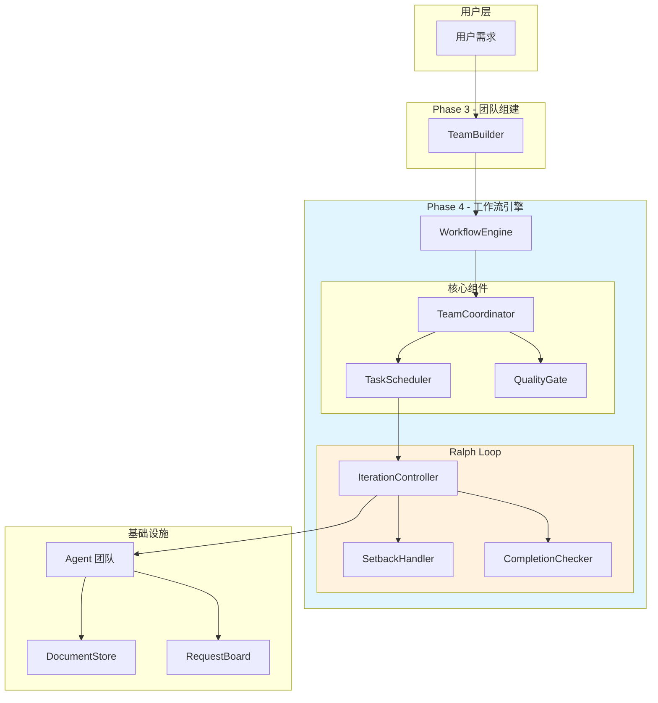
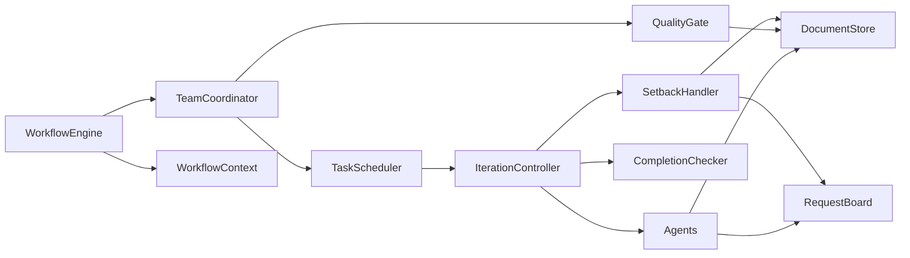
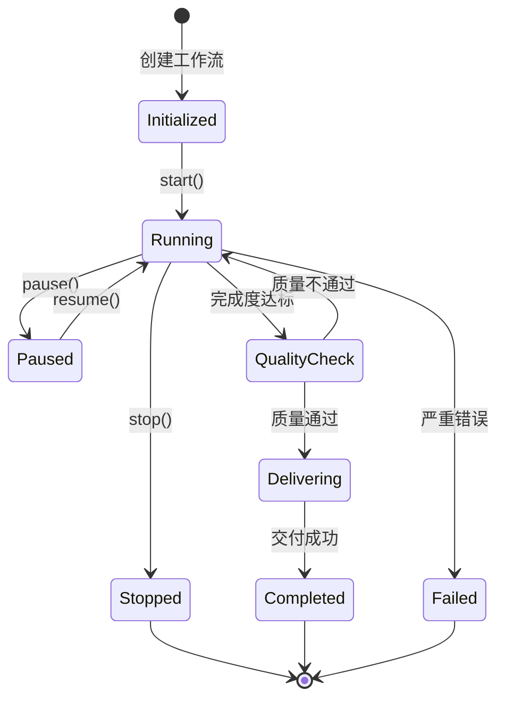
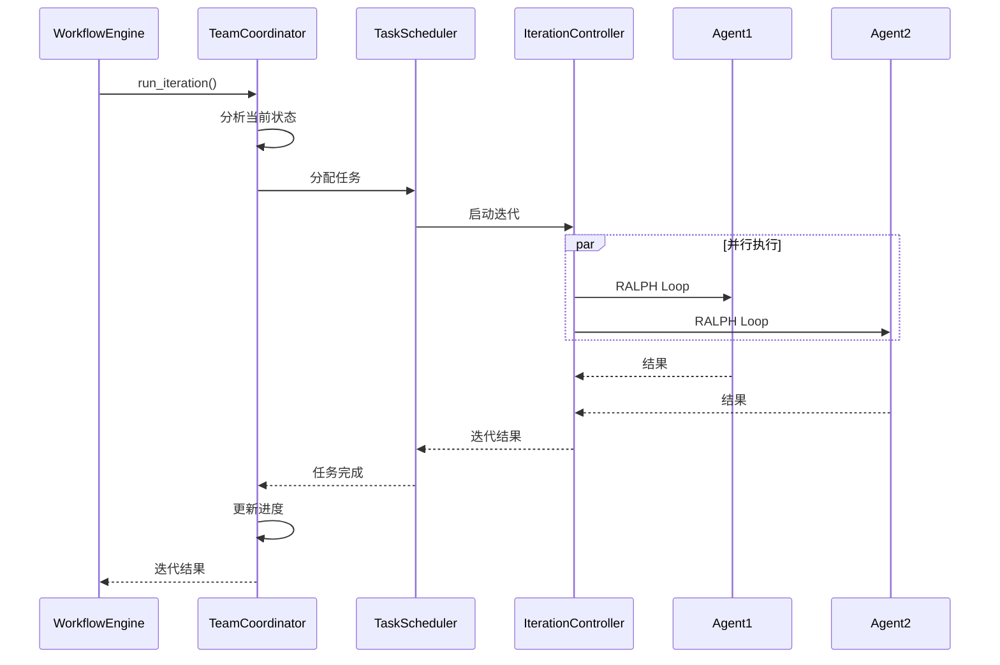
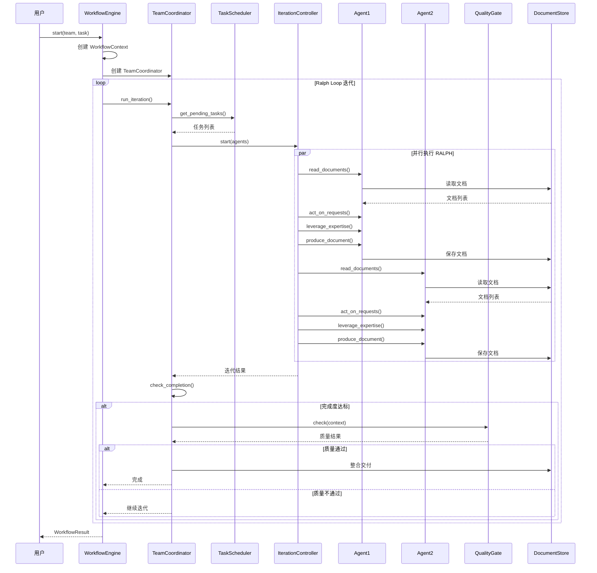
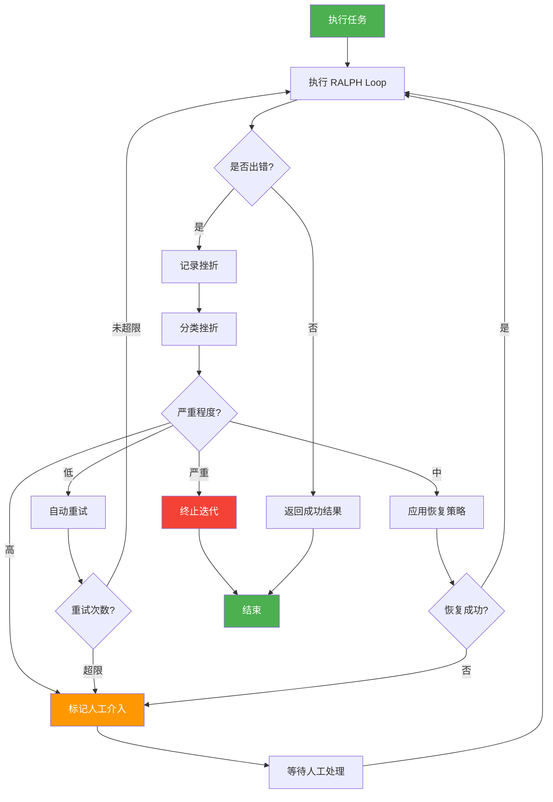
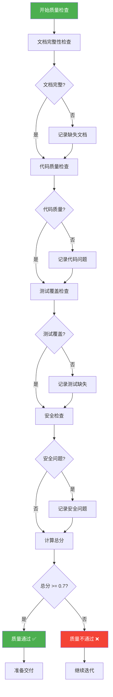

# Phase 4: 工作流引擎设计文档

> Agent Team System - Phase 4 详细设计
>
> 版本：0.4.2 (优化版)
> 创建日期：2026-03-13
> 最后更新：2026-03-13
> 审查状态：✅ 已修复所有 P0/P1 问题

---

## 1. 概述

### 1.1 设计目标

Phase 4 的核心目标是实现**完整的工作流引擎**，让 Agent 团队能够自主协作完成复杂任务。

```
团队组建 → 工作流启动 → 迭代执行 → 质量检查 → 交付产品
                ↑              ↓
                └── 挫折恢复 ←─┘
```

### 1.2 Ralph Loop 核心精神

```
┌─────────────────────────────────────────────────────────┐
│              Ralph Loop 工作流哲学                        │
├─────────────────────────────────────────────────────────┤
│                                                         │
│  "尽管遇到挫折，但依然坚持迭代"                            │
│                                                         │
│  核心原则：                                              │
│  - 🔄 持续迭代，永不放弃                                 │
│  - 💪 遇到挫折是常态，继续就好                           │
│  - 🎯 目标导向，结果说话                                 │
│  - 🤖 AI 自主驱动，用户无感知                            │
│  - ✅ 质量把关，确保交付                                 │
│                                                         │
└─────────────────────────────────────────────────────────┘
```

### 1.3 当前项目状态分析

#### 已完成基础 (Phase 1-3)

| 模块 | 状态 | 文件 | 说明 |
|------|------|------|------|
| Agent 基础框架 | ✅ | `agent/base.py` | 包含 RALPH 方法 |
| 12 个 Agent 角色 | ✅ | `agent/roles/*.py` | 完整实现 |
| 文档中心 | ✅ | `document_hub/` | DocumentStore |
| 诉求看板 | ✅ | `request_board/` | RequestBoard |
| Ralph Loop 基础 | 🟡 | `ralph_loop/` | 框架已有，逻辑不完整 |
| 团队组建 | ✅ | `team/` | Phase 3 完成 |

#### Phase 4 需要完善的内容

| 模块 | 当前状态 | 需要完善 |
|------|----------|----------|
| IterationController | 框架已有 | 完善迭代执行逻辑 |
| SetbackHandler | 框架已有 | 完善恢复策略和自动恢复 |
| CompletionChecker | 简化版 | 扩展检查维度 |
| WorkflowEngine | ❌ 不存在 | 新增主工作流引擎 |
| TeamCoordinator | 🟡 角色存在 | 完善协调逻辑 |
| TaskScheduler | ❌ 不存在 | 新增任务调度器 |
| QualityGate | ❌ 不存在 | 新增质量门控 |

---

## 2. 系统架构

### 2.1 整体架构图



### 2.2 核心模块

| 模块 | 职责 | 文件 | 类型 |
|------|------|------|------|
| WorkflowEngine | 工作流主引擎 | `workflow/engine.py` | 新增 |
| TeamCoordinator | 团队协调器 | `workflow/coordinator.py` | 新增 |
| TaskScheduler | 任务调度器 | `workflow/scheduler.py` | 新增 |
| QualityGate | 质量门控 | `workflow/quality.py` | 新增 |
| WorkflowContext | 工作流上下文 | `workflow/context.py` | 新增 |
| IterationController | 迭代控制器 | `ralph_loop/controller.py` | 完善 |
| SetbackHandler | 挫折处理器 | `ralph_loop/setback.py` | 完善 |
| CompletionChecker | 完成度检查器 | `ralph_loop/completion.py` | 完善 |

### 2.3 模块依赖关系



---

## 3. 工作流引擎核心设计

### 3.1 WorkflowEngine - 主引擎

#### 3.1.1 职责定义

WorkflowEngine 是 Phase 4 的主入口，负责：

1. **初始化工作流** - 接收团队和任务，创建工作流上下文
2. **启动工作流** - 启动团队协调器
3. **监控工作流** - 实时监控工作流状态
4. **控制工作流** - 暂停、恢复、停止工作流
5. **交付结果** - 完成后交付产品

#### 3.1.2 工作流状态机



#### 3.1.3 WorkflowEngine 实现

```python
# src/workflow/engine.py

from __future__ import annotations
import asyncio
from typing import Optional, List, Any, Dict
from dataclasses import dataclass, field
from enum import Enum
import time

from .context import WorkflowContext
from .coordinator import TeamCoordinator
from .quality import QualityGate


class WorkflowStatus(Enum):
    """工作流状态"""
    INITIALIZED = "initialized"
    RUNNING = "running"
    PAUSED = "paused"
    QUALITY_CHECK = "quality_check"
    DELIVERING = "delivering"
    COMPLETED = "completed"
    FAILED = "failed"
    STOPPED = "stopped"


@dataclass
class WorkflowResult:
    """工作流结果"""
    success: bool
    status: WorkflowStatus
    iterations: int
    documents_produced: List[Any] = field(default_factory=list)
    quality_score: float = 0.0
    error: Optional[str] = None
    delivery_path: Optional[str] = None


class WorkflowEngine:
    """
    工作流引擎 - Phase 4 主入口
    
    管理 Agent 团队的完整工作流程
    
    使用示例:
        engine = WorkflowEngine()
        result = await engine.start(team, task_description)
        if result.success:
            print(f"交付产品：{result.delivery_path}")
    """
    
    def __init__(self, config: Optional['WorkflowConfig'] = None):
        """
        初始化工作流引擎
        
        Args:
            config: 工作流配置
        """
        self.config = config or WorkflowConfig()
        self.status = WorkflowStatus.INITIALIZED
        self.context: Optional[WorkflowContext] = None
        self.coordinator: Optional[TeamCoordinator] = None
        self.quality_gate = QualityGate()
        
        self._lock = asyncio.Lock()
        self._task: Optional[asyncio.Task] = None
        self._start_time: Optional[int] = None
    
    async def start(
        self,
        team: List[Any],
        task_description: str,
        document_store: Any,
        request_board: Any,
        client: Any = None,
    ) -> WorkflowResult:
        """
        启动工作流
        
        Args:
            team: Agent 团队
            task_description: 任务描述
            document_store: 文档存储
            request_board: 诉求看板
            client: OpenCode 客户端
            
        Returns:
            WorkflowResult: 工作流结果
        """
        async with self._lock:
            if self.status != WorkflowStatus.INITIALIZED:
                raise RuntimeError(f"Workflow already started: {self.status}")
            
            # 1. 创建工作流上下文
            self.context = WorkflowContext(
                workflow_id=self._generate_id("wf"),
                team=team,
                task_description=task_description,
                document_store=document_store,
                request_board=request_board,
                client=client,
            )
            
            # 2. 创建团队协调器
            self.coordinator = TeamCoordinator(
                context=self.context,
                config=self.config,
            )
            
            # 3. 更新状态
            self.status = WorkflowStatus.RUNNING
            self._start_time = int(time.time())
            
            # 4. 启动工作流任务
            self._task = asyncio.create_task(self._run_workflow())
            
            # 5. 等待完成
            try:
                await self._task
            except asyncio.CancelledError:
                return WorkflowResult(
                    success=False,
                    status=WorkflowStatus.STOPPED,
                    iterations=self.context.iteration_count if self.context else 0,
                )
            
            # 6. 返回结果
            return self._build_result()
    
    async def pause(self):
        """暂停工作流"""
        async with self._lock:
            if self.status != WorkflowStatus.RUNNING:
                return
            self.status = WorkflowStatus.PAUSED
            if self.coordinator:
                await self.coordinator.pause()
    
    async def resume(self):
        """恢复工作流"""
        async with self._lock:
            if self.status != WorkflowStatus.PAUSED:
                return
            self.status = WorkflowStatus.RUNNING
            if self.coordinator:
                await self.coordinator.resume()
    
    async def stop(self):
        """停止工作流"""
        async with self._lock:
            self.status = WorkflowStatus.STOPPED
            if self._task:
                self._task.cancel()
            if self.coordinator:
                await self.coordinator.stop()
    
    async def _run_workflow(self):
        """运行工作流主循环"""
        try:
            while self.status == WorkflowStatus.RUNNING:
                # 1. 执行一轮迭代
                iteration_result = await self.coordinator.run_iteration()
                
                # 2. 更新上下文
                self.context.iteration_count += 1
                self.context.total_documents += iteration_result.documents_produced
                
                # 3. 检查最大迭代
                if self.context.iteration_count >= self.config.max_iterations:
                    await self._complete("max_iterations")
                    break
                
                # 4. 检查完成度
                if self.context.iteration_count >= self.config.min_iterations:
                    completion = await self.coordinator.check_completion()
                    if completion >= self.config.completion_threshold:
                        # 5. 质量检查
                        self.status = WorkflowStatus.QUALITY_CHECK
                        quality_result = await self.quality_gate.check(self.context)
                        
                        if quality_result.passed:
                            await self._deliver()
                            break
                        else:
                            # 质量不通过，继续迭代
                            self.status = WorkflowStatus.RUNNING
                
                # 6. 检查错误
                if iteration_result.errors:
                    await self._handle_errors(iteration_result.errors)
                
                # 7. 短暂延迟
                await asyncio.sleep(self.config.iteration_interval)
        
        except asyncio.CancelledError:
            raise
        except Exception as e:
            self.status = WorkflowStatus.FAILED
            if self.context:
                self.context.error = str(e)
    
    async def _complete(self, reason: str):
        """完成工作流"""
        self.context.completion_reason = reason
    
    async def _deliver(self):
        """交付产品"""
        self.status = WorkflowStatus.DELIVERING
        
        # 整合所有文档
        delivery_path = await self.coordinator.deliver()
        
        self.context.delivery_path = delivery_path
        self.status = WorkflowStatus.COMPLETED
    
    async def _handle_errors(self, errors: List[Exception]):
        """处理错误"""
        for error in errors:
            await self.coordinator.handle_error(error)
    
    def _build_result(self) -> WorkflowResult:
        """构建结果"""
        return WorkflowResult(
            success=self.status == WorkflowStatus.COMPLETED,
            status=self.status,
            iterations=self.context.iteration_count if self.context else 0,
            documents_produced=self.context.documents if self.context else [],
            quality_score=self.context.quality_score if self.context else 0.0,
            error=self.context.error if self.context else None,
            delivery_path=self.context.delivery_path if self.context else None,
        )
    
    def _generate_id(self, prefix: str) -> str:
        """生成 ID"""
        import hashlib
        timestamp = int(time.time() * 1000)
        data = f"{prefix}:{timestamp}"
        return f"{prefix}_{hashlib.md5(data.encode()).hexdigest()[:12]}"
```

#### 3.1.4 WorkflowContext 定义

```python
# src/workflow/context.py

from __future__ import annotations
from dataclasses import dataclass, field
from typing import List, Any, Optional, Dict
import time


@dataclass
class WorkflowContext:
    """
    工作流上下文
    
    存储工作流运行时的所有状态和数据
    """
    # 基本信息
    workflow_id: str
    team: List[Any]
    task_description: str
    
    # 依赖组件
    document_store: Any
    request_board: Any
    client: Any = None
    
    # 运行时状态
    status: str = "initialized"
    iteration_count: int = 0
    start_time: int = field(default_factory=lambda: int(time.time()))
    end_time: Optional[int] = None
    
    # 统计数据
    total_documents: int = 0
    total_requests: int = 0
    total_setbacks: int = 0
    
    # 结果数据
    documents: List[Any] = field(default_factory=list)
    quality_score: float = 0.0
    completion_reason: Optional[str] = None
    delivery_path: Optional[str] = None
    error: Optional[str] = None
    
    # 扩展数据
    metadata: Dict[str, Any] = field(default_factory=dict)
    
    def add_document(self, document: Any):
        """添加文档"""
        self.documents.append(document)
        self.total_documents += 1
    
    def record_setback(self):
        """记录挫折"""
        self.total_setbacks += 1
    
    def complete(self, reason: str = "completed"):
        """标记完成"""
        self.status = "completed"
        self.completion_reason = reason
        self.end_time = int(time.time())
    
    def get_duration(self) -> int:
        """获取持续时间（秒）"""
        if self.end_time:
            return self.end_time - self.start_time
        return int(time.time()) - self.start_time
```

---

## 4. 团队协调器设计

### 4.1 TeamCoordinator 职责

TeamCoordinator 负责协调 Agent 团队的工作：

1. **迭代控制** - 控制 Ralph Loop 的执行
2. **进度跟踪** - 跟踪整体进度
3. **冲突解决** - 解决 Agent 间的冲突
4. **质量检查** - 检查完成度并触发质量门控
5. **交付产品** - 整合所有文档并交付

**职责边界说明**:
- `TeamCoordinator`: 负责迭代执行和 Ralph Loop 控制
- `TaskScheduler`: **仅用于高级任务编排**，RALPH 方法直接执行（简化实现）

### 4.2 协调流程



### 4.3 TeamCoordinator 实现

```python
# src/workflow/coordinator.py

from __future__ import annotations
import asyncio
from typing import Optional, List, Any, Dict
from dataclasses import dataclass
import time

from .context import WorkflowContext
from ralph_loop.controller import IterationController
from ralph_loop.config import RalphLoopConfig
from ralph_loop.visualizer import IterationVisualizer


@dataclass
class IterationResult:
    """迭代结果"""
    success: bool
    documents_produced: int
    requests_processed: int
    setbacks: int
    errors: List[Exception]
    completion_score: float


class TeamCoordinator:
    """
    团队协调器
    
    协调 Agent 团队执行 Ralph Loop
    
    职责边界:
    - TeamCoordinator: 负责迭代执行和 Ralph Loop 控制
    - TaskScheduler: 仅用于高级任务编排（可选），RALPH 方法直接执行
    """
    
    def __init__(
        self,
        context: WorkflowContext,
        config: Optional['WorkflowConfig'] = None,
    ):
        """
        初始化协调器
        
        Args:
            context: 工作流上下文
            config: 工作流配置
        """
        self.context = context
        self.config = config or WorkflowConfig()
        
        # 初始化迭代控制器
        self.iteration_controller = IterationController(
            config=self.config.ralph_config
        )
        
        # 状态
        self._paused = False
        self._stopped = False
    
    async def run_iteration(self) -> IterationResult:
        """
        执行一轮迭代
        
        Returns:
            IterationResult: 迭代结果
        """
        if self._stopped:
            return IterationResult(
                success=False,
                documents_produced=0,
                requests_processed=0,
                setbacks=0,
                errors=[RuntimeError("Coordinator stopped")],
                completion_score=0.0,
            )
        
        # 等待恢复
        while self._paused:
            await asyncio.sleep(1)
        
        # 1. 启动迭代控制器
        await self.iteration_controller.start(
            agents=self.context.team,
            team_session=None,
        )
        
        # 2. 执行 RALPH Loop（直接执行，不经过 TaskScheduler）
        results = await self._execute_ralph_loop()
        
        # 3. 收集结果
        documents_produced = sum(r.get("documents_produced", 0) for r in results)
        requests_processed = sum(r.get("requests_processed", 0) for r in results)
        setbacks = sum(r.get("setbacks", 0) for r in results)
        errors = [r["error"] for r in results if r.get("error")]
        
        # 4. 计算完成度
        completion_score = await self.check_completion()
        
        # 5. 停止迭代控制器
        await self.iteration_controller.stop()
        
        return IterationResult(
            success=len(errors) == 0,
            documents_produced=documents_produced,
            requests_processed=requests_processed,
            setbacks=setbacks,
            errors=errors,
            completion_score=completion_score,
        )
    
    async def _execute_ralph_loop(self) -> List[Dict]:
        """
        执行所有 Agent 的 RALPH Loop
        
        直接执行 RALPH 方法，不经过 TaskScheduler
        """
        tasks = []
        
        for agent in self.context.team:
            task = asyncio.create_task(
                self._execute_agent_ralph(agent)
            )
            tasks.append(task)
        
        results = await asyncio.gather(*tasks, return_exceptions=True)
        
        # 处理异常
        processed_results = []
        for result in results:
            if isinstance(result, Exception):
                processed_results.append({
                    "success": False,
                    "error": result,
                    "setbacks": 1,
                })
            else:
                processed_results.append(result)
        
        return processed_results
    
    async def _execute_agent_ralph(self, agent: Any) -> Dict:
        """
        执行单个 Agent 的 RALPH Loop
        
        R - Read: 阅读文档
        A - Act: 响应诉求
        L - Leverage: 发挥专业能力
        P - Produce: 产出文档
        H - Help: 发布诉求
        """
        result = {
            "success": True,
            "documents_produced": 0,
            "requests_processed": 0,
            "setbacks": 0,
            "error": None,
        }
        
        try:
            # R - Read
            docs = await agent.read_documents()
            
            # A - Act
            requests = await agent.act_on_requests()
            result["requests_processed"] = len(requests)
            
            # L - Leverage
            work_result = await agent.leverage_expertise()
            
            # P - Produce
            if work_result:
                document = await agent.produce_document(work_result)
                if document:
                    # 保存到文档存储
                    await self.context.document_store.save(document)
                    self.context.add_document(document)
                    result["documents_produced"] = 1
            
            # H - Help
            help_requests = await agent.help_requests()
            
            # 发布诉求到看板
            for req in help_requests:
                await self.context.request_board.create_request(req)
        
        except Exception as e:
            result["success"] = False
            result["error"] = e
            result["setbacks"] = 1
            
            # 记录挫折到上下文
            from ralph_loop.setback import Setback, SetbackType, SetbackSeverity
            import hashlib
            
            setback = Setback(
                id=f"setback_{hashlib.md5(str(e).encode()).hexdigest()[:12]}",
                type=SetbackType.OTHER,
                severity=SetbackSeverity.MEDIUM,
                agent=agent.role if hasattr(agent, 'role') else str(agent),
                iteration=self.context.iteration_count,
                description=str(e),
                error_message=str(e),
            )
            self.context.record_setback(setback)
        
        return result
    
    async def check_completion(self) -> float:
        """检查完成度"""
        from ralph_loop.completion import CompletionChecker, CompletionCriteria
        
        criteria = CompletionCriteria(
            requirement_coverage=self.config.completion_threshold,
        )
        checker = CompletionChecker(criteria)
        
        team_state = {
            "requirement_coverage": self._calculate_requirement_coverage(),
            "document_completeness": self._calculate_document_completeness(),
            "quality_score": self.context.quality_score,
        }
        
        result = await checker.check(team_state)
        self.context.quality_score = result["score"]
        
        return result["score"]
    
    def _calculate_requirement_coverage(self) -> float:
        """计算需求覆盖率"""
        # 基于产出的文档数量估算
        if not self.context.documents:
            return 0.0
        # 简化实现：每个文档贡献一定比例
        return min(1.0, len(self.context.documents) / 5)
    
    def _calculate_document_completeness(self) -> float:
        """计算文档完整度"""
        if not self.context.documents:
            return 0.0
        # 简化实现
        return 0.8
    
    async def pause(self):
        """暂停"""
        self._paused = True
        await self.iteration_controller.pause()
    
    async def resume(self):
        """恢复"""
        self._paused = False
        await self.iteration_controller.resume()
    
    async def stop(self):
        """停止"""
        self._stopped = True
        await self.iteration_controller.stop()
    
    async def handle_error(self, error: Exception):
        """处理错误"""
        # 记录到挫折处理器
        await self.iteration_controller.setback_handler.record_setback(
            agent=None,
            iteration=self.context.iteration_count,
            error=error,
        )
    
    async def deliver(self) -> str:
        """交付产品"""
        # 整合所有文档到一个目录
        delivery_path = f"./deliveries/{self.context.workflow_id}"
        
        # 复制所有文档到交付目录
        # ... 实现省略
        
        return delivery_path
```

---

## 5. 任务调度器设计

### 5.1 TaskScheduler 职责

TaskScheduler 负责任务的调度和分配：

1. **任务优先级** - 根据优先级排序任务
2. **Agent 分配** - 将任务分配给合适的 Agent
3. **负载均衡** - 平衡 Agent 的工作负载
4. **依赖管理** - 管理任务间的依赖关系

### 5.2 TaskScheduler 实现

```python
# src/workflow/scheduler.py

from __future__ import annotations
from typing import List, Any, Dict, Optional
from dataclasses import dataclass, field
from enum import Enum
import time

from .context import WorkflowContext


class TaskPriority(Enum):
    """任务优先级"""
    CRITICAL = 0
    HIGH = 1
    MEDIUM = 2
    LOW = 3


class TaskStatus(Enum):
    """任务状态"""
    PENDING = "pending"
    ASSIGNED = "assigned"
    IN_PROGRESS = "in_progress"
    COMPLETED = "completed"
    BLOCKED = "blocked"
    FAILED = "failed"


@dataclass
class Task:
    """任务"""
    id: str
    name: str
    description: str
    priority: TaskPriority
    status: TaskStatus = TaskStatus.PENDING
    assigned_agent: Optional[str] = None
    dependencies: List[str] = field(default_factory=list)
    created_at: int = field(default_factory=lambda: int(time.time()))
    started_at: Optional[int] = None
    completed_at: Optional[int] = None
    result: Any = None
    error: Optional[str] = None


class TaskScheduler:
    """
    任务调度器
    
    管理任务的生命周期和分配
    """
    
    def __init__(self, context: WorkflowContext):
        """
        初始化调度器
        
        Args:
            context: 工作流上下文
        """
        self.context = context
        self._tasks: Dict[str, Task] = {}
        self._agent_loads: Dict[str, int] = {}
        
        # 初始化 Agent 负载
        for agent in context.team:
            self._agent_loads[agent.role] = 0
    
    async def create_task(
        self,
        name: str,
        description: str,
        priority: TaskPriority = TaskPriority.MEDIUM,
        dependencies: Optional[List[str]] = None,
    ) -> Task:
        """
        创建任务
        
        Args:
            name: 任务名称
            description: 任务描述
            priority: 优先级
            dependencies: 依赖任务 ID 列表
            
        Returns:
            Task: 创建的任务
        """
        task_id = self._generate_id("task")
        
        task = Task(
            id=task_id,
            name=name,
            description=description,
            priority=priority,
            dependencies=dependencies or [],
        )
        
        self._tasks[task_id] = task
        return task
    
    async def get_pending_tasks(self) -> List[Task]:
        """
        获取待处理的任务
        
        Returns:
            List[Task]: 按优先级排序的待处理任务列表
        """
        pending = []
        
        for task in self._tasks.values():
            if task.status != TaskStatus.PENDING:
                continue
            
            # 检查依赖
            if not self._check_dependencies(task):
                continue
            
            pending.append(task)
        
        # 按优先级排序
        pending.sort(key=lambda t: t.priority.value)
        
        return pending
    
    async def assign_task(self, task: Task, agent_role: str) -> bool:
        """
        分配任务给 Agent
        
        Args:
            task: 任务
            agent_role: Agent 角色
            
        Returns:
            bool: 是否分配成功
        """
        if agent_role not in self._agent_loads:
            return False
        
        task.assigned_agent = agent_role
        task.status = TaskStatus.ASSIGNED
        self._agent_loads[agent_role] += 1
        
        return True
    
    async def start_task(self, task_id: str) -> bool:
        """
        开始执行任务
        
        Args:
            task_id: 任务 ID
            
        Returns:
            bool: 是否开始成功
        """
        task = self._tasks.get(task_id)
        if not task:
            return False
        
        task.status = TaskStatus.IN_PROGRESS
        task.started_at = int(time.time())
        
        return True
    
    async def complete_task(self, task_id: str, result: Any = None) -> bool:
        """
        完成任务
        
        Args:
            task_id: 任务 ID
            result: 任务结果
            
        Returns:
            bool: 是否完成成功
        """
        task = self._tasks.get(task_id)
        if not task:
            return False
        
        task.status = TaskStatus.COMPLETED
        task.completed_at = int(time.time())
        task.result = result
        
        # 减少 Agent 负载
        if task.assigned_agent:
            self._agent_loads[task.assigned_agent] -= 1
        
        return True
    
    async def fail_task(self, task_id: str, error: str) -> bool:
        """
        标记任务失败
        
        Args:
            task_id: 任务 ID
            error: 错误信息
            
        Returns:
            bool: 是否标记成功
        """
        task = self._tasks.get(task_id)
        if not task:
            return False
        
        task.status = TaskStatus.FAILED
        task.error = error
        task.completed_at = int(time.time())
        
        # 减少 Agent 负载
        if task.assigned_agent:
            self._agent_loads[task.assigned_agent] -= 1
        
        return True
    
    def get_agent_load(self, agent_role: str) -> int:
        """
        获取 Agent 负载
        
        Args:
            agent_role: Agent 角色
            
        Returns:
            int: 当前负载
        """
        return self._agent_loads.get(agent_role, 0)
    
    def get_least_loaded_agent(self, roles: List[str]) -> Optional[str]:
        """
        获取负载最小的 Agent
        
        Args:
            roles: 候选角色列表
            
        Returns:
            Optional[str]: 负载最小的角色
        """
        if not roles:
            return None
        
        return min(roles, key=lambda r: self._agent_loads.get(r, 0))
    
    def _check_dependencies(self, task: Task) -> bool:
        """检查任务依赖是否满足"""
        for dep_id in task.dependencies:
            dep_task = self._tasks.get(dep_id)
            if not dep_task or dep_task.status != TaskStatus.COMPLETED:
                return False
        return True
    
    def _generate_id(self, prefix: str) -> str:
        """生成 ID"""
        import hashlib
        timestamp = int(time.time() * 1000)
        data = f"{prefix}:{timestamp}"
        return f"{prefix}_{hashlib.md5(data.encode()).hexdigest()[:12]}"
```

---

## 6. 质量门控设计

### 6.1 QualityGate 职责

QualityGate 负责工作流的质量检查：

1. **文档完整性检查** - 检查必需文档是否完整
2. **代码质量检查** - 检查代码是否符合规范
3. **测试覆盖检查** - 检查测试覆盖率
4. **安全检查** - 检查安全问题
5. **人工审核点** - 标记需要人工审核的点

### 6.2 QualityGate 实现

```python
# src/workflow/quality.py

from __future__ import annotations
from typing import List, Dict, Any, Optional
from dataclasses import dataclass, field
from enum import Enum
import time


class QualityCheckType(Enum):
    """质量检查类型"""
    DOCUMENT_COMPLETENESS = "document_completeness"
    CODE_QUALITY = "code_quality"
    TEST_COVERAGE = "test_coverage"
    SECURITY = "security"
    MANUAL_REVIEW = "manual_review"


@dataclass
class QualityCheckResult:
    """质量检查结果"""
    check_type: QualityCheckType
    passed: bool
    score: float
    issues: List[str] = field(default_factory=list)
    suggestions: List[str] = field(default_factory=list)


@dataclass
class QualityGateResult:
    """质量门控结果"""
    passed: bool
    overall_score: float
    check_results: List[QualityCheckResult] = field(default_factory=list)
    requires_manual_review: bool = False
    review_items: List[str] = field(default_factory=list)


class QualityGate:
    """
    质量门控
    
    在工作流交付前进行质量检查
    """
    
    # 必需的文档类型
    REQUIRED_DOCUMENTS = [
        "prd",
        "architecture",
        "api_doc",
    ]
    
    def __init__(self, config: Optional['QualityConfig'] = None):
        """
        初始化质量门控
        
        Args:
            config: 质量配置
        """
        self.config = config or QualityConfig()
    
    async def check(self, context: 'WorkflowContext') -> QualityGateResult:
        """
        执行质量检查
        
        Args:
            context: 工作流上下文
            
        Returns:
            QualityGateResult: 检查结果
        """
        results = []
        overall_score = 0.0
        requires_manual_review = False
        review_items = []
        
        # 1. 文档完整性检查
        doc_result = await self._check_document_completeness(context)
        results.append(doc_result)
        overall_score += doc_result.score * 0.3
        
        # 2. 代码质量检查
        code_result = await self._check_code_quality(context)
        results.append(code_result)
        overall_score += code_result.score * 0.25
        
        # 3. 测试覆盖检查
        test_result = await self._check_test_coverage(context)
        results.append(test_result)
        overall_score += test_result.score * 0.25
        
        # 4. 安全检查
        security_result = await self._check_security(context)
        results.append(security_result)
        overall_score += security_result.score * 0.2
        
        # 5. 人工审核检查
        if self.config.require_manual_review:
            manual_result = await self._check_manual_review(context)
            results.append(manual_result)
            requires_manual_review = not manual_result.passed
            review_items = manual_result.issues
        
        # 判断是否通过
        passed = (
            overall_score >= self.config.passing_score and
            all(r.passed or r.check_type == QualityCheckType.MANUAL_REVIEW for r in results)
        )
        
        return QualityGateResult(
            passed=passed,
            overall_score=overall_score,
            check_results=results,
            requires_manual_review=requires_manual_review,
            review_items=review_items,
        )
    
    async def _check_document_completeness(
        self,
        context: 'WorkflowContext',
    ) -> QualityCheckResult:
        """检查文档完整性"""
        issues = []
        suggestions = []
        
        # 获取已有文档类型
        existing_types = set()
        for doc in context.documents:
            if hasattr(doc, 'metadata') and hasattr(doc.metadata, 'doc_type'):
                existing_types.add(doc.metadata.doc_type)
        
        # 检查必需文档
        for required in self.REQUIRED_DOCUMENTS:
            if required not in existing_types:
                issues.append(f"缺少必需文档：{required}")
                suggestions.append(f"请添加 {required} 文档")
        
        passed = len(issues) == 0
        score = 1.0 if passed else 0.5
        
        return QualityCheckResult(
            check_type=QualityCheckType.DOCUMENT_COMPLETENESS,
            passed=passed,
            score=score,
            issues=issues,
            suggestions=suggestions,
        )
    
    async def _check_code_quality(
        self,
        context: 'WorkflowContext',
    ) -> QualityCheckResult:
        """检查代码质量"""
        # 简化实现：基于文档数量估算
        code_docs = [
            d for d in context.documents
            if hasattr(d, 'metadata') and d.metadata.doc_type == "code"
        ]
        
        passed = len(code_docs) > 0
        score = min(1.0, len(code_docs) / 3)
        
        return QualityCheckResult(
            check_type=QualityCheckType.CODE_QUALITY,
            passed=passed,
            score=score,
            issues=[] if passed else ["缺少代码文档"],
            suggestions=[] if passed else ["请添加代码实现"],
        )
    
    async def _check_test_coverage(
        self,
        context: 'WorkflowContext',
    ) -> QualityCheckResult:
        """检查测试覆盖"""
        # 简化实现
        test_docs = [
            d for d in context.documents
            if hasattr(d, 'metadata') and d.metadata.doc_type == "test_case"
        ]
        
        passed = len(test_docs) > 0
        score = min(1.0, len(test_docs) / 2)
        
        return QualityCheckResult(
            check_type=QualityCheckType.TEST_COVERAGE,
            passed=passed,
            score=score,
            issues=[] if passed else ["缺少测试用例"],
            suggestions=[] if passed else ["请添加测试用例"],
        )
    
    async def _check_security(
        self,
        context: 'WorkflowContext',
    ) -> QualityCheckResult:
        """检查安全问题"""
        # 简化实现：检查是否有安全文档
        security_docs = [
            d for d in context.documents
            if hasattr(d, 'metadata') and "安全" in d.metadata.tags
        ]
        
        passed = True  # 默认通过
        score = 1.0 if security_docs else 0.8
        
        return QualityCheckResult(
            check_type=QualityCheckType.SECURITY,
            passed=passed,
            score=score,
            issues=[],
            suggestions=[] if security_docs else ["建议添加安全审查文档"],
        )
    
    async def _check_manual_review(
        self,
        context: 'WorkflowContext',
    ) -> QualityCheckResult:
        """检查是否需要人工审核"""
        # 检查关键决策点
        issues = []
        
        # 1. 架构决策
        # 2. 安全决策
        # 3. 关键业务逻辑
        
        return QualityCheckResult(
            check_type=QualityCheckType.MANUAL_REVIEW,
            passed=len(issues) == 0,
            score=1.0,
            issues=issues,
            suggestions=["请人工审核上述项目"],
        )


@dataclass
class QualityConfig:
    """质量配置"""
    passing_score: float = 0.7
    require_manual_review: bool = False
    min_test_coverage: float = 0.8
```

---

## 7. Ralph Loop 完善设计

### 7.1 IterationController 完善

现有的 IterationController 需要完善以下功能：

```python
# src/ralph_loop/controller.py (完善版)

from __future__ import annotations
import asyncio
from typing import Optional, List, Any, Dict
from datetime import datetime
import time

from .config import RalphLoopConfig
from .state import LoopStatus, IterationState
from .setback import SetbackHandler, Setback, SetbackType, SetbackSeverity
from .completion import CompletionChecker, CompletionCriteria
from .visualizer import IterationVisualizer


class IterationController:
    """
    迭代控制器 - 完善版
    
    管理 Ralph Loop 的完整生命周期
    """
    
    def __init__(self, config: Optional[RalphLoopConfig] = None):
        self.config = config or RalphLoopConfig()
        self.status = LoopStatus.IDLE
        self.current_iteration: Optional[IterationState] = None
        self.history: List[IterationState] = []
        self._lock = asyncio.Lock()
        self._running = False
        self._paused = False
        
        # 挫折处理
        self.setback_handler = SetbackHandler()
        
        # 完成度检查
        self.completion_checker = CompletionChecker(
            CompletionCriteria(
                requirement_coverage=self.config.completion_threshold,
            )
        )
        
        # 可视化
        self.visualizer = IterationVisualizer()
    
    async def start(self, agents: List, team_session):
        """启动 Loop"""
        async with self._lock:
            if self.status not in [LoopStatus.IDLE, LoopStatus.STOPPED]:
                raise RuntimeError(f"Loop is already running: {self.status}")
            
            self.status = LoopStatus.RUNNING
            self._running = True
            self._paused = False
            
            self.current_iteration = IterationState(
                iteration_number=0,
                start_time=int(datetime.now().timestamp()),
                status=LoopStatus.RUNNING,
                agents_participating=[a.role for a in agents],
            )
            
            self.visualizer.start_iteration(agents)
    
    async def pause(self):
        """暂停 Loop"""
        async with self._lock:
            if self.status != LoopStatus.RUNNING:
                return
            self.status = LoopStatus.PAUSED
            self._paused = True
    
    async def resume(self):
        """恢复 Loop"""
        async with self._lock:
            if self.status != LoopStatus.PAUSED:
                return
            self.status = LoopStatus.RUNNING
            self._paused = False
    
    async def stop(self):
        """停止 Loop"""
        async with self._lock:
            self._running = False
            self._paused = False
            self.status = LoopStatus.STOPPED
            
            if self.current_iteration:
                self.current_iteration.end_time = int(datetime.now().timestamp())
                self.current_iteration.status = LoopStatus.STOPPED
                self.history.append(self.current_iteration)
            
            self.visualizer.end_iteration()
    
    async def execute_iteration(
        self,
        agents: List,
        execute_agent_func: Any,
    ) -> Dict[str, Any]:
        """
        执行一轮迭代
        
        Args:
            agents: Agent 列表
            execute_agent_func: 执行单个 Agent 的函数
            
        Returns:
            迭代结果
        """
        if not self._running:
            return {"success": False, "error": "Loop not running"}
        
        # 等待恢复
        while self._paused and self._running:
            await asyncio.sleep(0.5)
        
        if not self._running:
            return {"success": False, "error": "Loop stopped"}
        
        results = []
        errors = []
        
        # 并行执行
        if self.config.parallel_agents:
            tasks = [
                self._execute_with_recovery(agent, execute_agent_func)
                for agent in agents
            ]
            results = await asyncio.gather(*tasks, return_exceptions=True)
        else:
            for agent in agents:
                result = await self._execute_with_recovery(agent, execute_agent_func)
                results.append(result)
        
        # 统计结果
        for result in results:
            if isinstance(result, Exception):
                errors.append(result)
                self.current_iteration.setbacks_encountered += 1
            elif isinstance(result, dict):
                self.current_iteration.documents_read += result.get("documents_read", 0)
                self.current_iteration.requests_processed += result.get("requests_processed", 0)
                self.current_iteration.documents_produced += result.get("documents_produced", 0)
                self.current_iteration.requests_posted += result.get("requests_posted", 0)
        
        # 更新迭代计数
        self.current_iteration.iteration_number += 1
        
        return {
            "success": len(errors) == 0,
            "results": results,
            "errors": errors,
            "iteration": self.current_iteration.iteration_number,
        }
    
    async def _execute_with_recovery(
        self,
        agent: Any,
        execute_func: Any,
    ) -> Dict:
        """
        带恢复机制的执行
        
        遇到挫折时尝试恢复
        """
        max_retries = 3
        retry_count = 0
        
        while retry_count < max_retries:
            try:
                result = await execute_func(agent)
                return result
            
            except Exception as e:
                retry_count += 1
                
                # 记录挫折
                setback = await self.setback_handler.record_setback(
                    agent=agent,
                    iteration=self.current_iteration.iteration_number,
                    error=e,
                )
                
                # 尝试恢复
                if self.config.auto_recovery:
                    recovered = await self.setback_handler.attempt_recovery(setback)
                    if recovered:
                        continue
                
                # 无法恢复
                return {
                    "success": False,
                    "error": e,
                    "retries": retry_count,
                }
        
        return {
            "success": False,
            "error": Exception("Max retries exceeded"),
            "retries": max_retries,
        }
    
    async def check_completion(self, team_state: Dict) -> float:
        """检查完成度"""
        result = await self.completion_checker.check(team_state)
        self.current_iteration.completion_score = result["score"]
        return result["score"]
    
    def get_current_iteration(self) -> Optional[IterationState]:
        """获取当前迭代"""
        return self.current_iteration
    
    def get_history(self) -> List[IterationState]:
        """获取历史"""
        return self.history
    
    def get_setbacks(self) -> List[Setback]:
        """获取挫折列表"""
        return self.setback_handler.get_all_setbacks()
```

### 7.2 SetbackHandler 完善

```python
# src/ralph_loop/setback.py (完善关键方法)

class SetbackHandler:
    """挫折处理器 - 完善版"""
    
    # ... 现有代码 ...
    
    async def attempt_recovery(self, setback: Setback) -> bool:
        """
        尝试恢复
        
        Args:
            setback: 挫折记录
            
        Returns:
            bool: 是否恢复成功
        """
        if setback.retry_count >= setback.max_retries:
            return False
        
        strategy = self._recovery_strategies.get(setback.type)
        if not strategy:
            return False
        
        # 增加重试计数
        setback.retry_count += 1
        
        # 冷却等待
        if strategy.cooldown_seconds > 0:
            await asyncio.sleep(strategy.cooldown_seconds)
        
        # 执行恢复动作
        if strategy.action:
            try:
                await strategy.action(setback)
            except Exception:
                return False
        
        return True
    
    def get_all_setbacks(self) -> List[Setback]:
        """获取所有挫折"""
        return list(self._setbacks)
    
    def get_unresolved_setbacks(self) -> List[Setback]:
        """获取未解决的挫折"""
        return [s for s in self._setbacks if not s.resolved]
    
    def get_setback_patterns(self) -> Dict[str, int]:
        """获取挫折模式"""
        return dict(self._patterns)
    
    def get_statistics(self) -> Dict[str, Any]:
        """获取挫折统计"""
        return {
            "total": len(self._setbacks),
            "resolved": sum(1 for s in self._setbacks if s.resolved),
            "unresolved": sum(1 for s in self._setbacks if not s.resolved),
            "by_type": self._count_by_type(),
            "by_severity": self._count_by_severity(),
        }
    
    def _count_by_type(self) -> Dict[str, int]:
        """按类型统计"""
        counts = {}
        for setback in self._setbacks:
            type_name = setback.type.value
            counts[type_name] = counts.get(type_name, 0) + 1
        return counts
    
    def _count_by_severity(self) -> Dict[str, int]:
        """按严重程度统计"""
        counts = {}
        for setback in self._setbacks:
            severity_name = setback.severity.value
            counts[severity_name] = counts.get(severity_name, 0) + 1
        return counts
```

---

## 8. 完整工作流执行流程

### 8.1 端到端流程图



### 8.2 挫折处理流程



### 8.3 质量检查流程



---

## 9. 配置和模型

### 9.1 WorkflowConfig (组合模式)

**优化说明**: 采用组合模式复用 `RalphLoopConfig`，避免字段重复。

```python
# src/workflow/config.py

from __future__ import annotations
from dataclasses import dataclass, field
from typing import Optional
from ralph_loop.config import RalphLoopConfig


@dataclass
class WorkflowConfig:
    """
    工作流配置
    
    采用组合模式复用 RalphLoopConfig，避免字段重复
    
    使用示例:
        config = WorkflowConfig(
            ralph_config=RalphLoopConfig(max_iterations=50),
            quality_passing_score=0.7,
        )
        
        # 或直接使用默认 RalphLoopConfig
        config = WorkflowConfig(
            quality_passing_score=0.7,
            require_manual_review=False,
        )
    """
    
    # ========== 组合 RalphLoopConfig ==========
    ralph_config: RalphLoopConfig = field(default_factory=RalphLoopConfig)
    
    # ========== 工作流特有配置 ==========
    
    # 质量
    quality_passing_score: float = 0.7
    require_manual_review: bool = False
    
    # 迭代
    min_iterations: int = 3
    iteration_interval: float = 1.0  # 秒
    
    # 超时
    workflow_timeout: int = 86400  # 24 小时
    
    # 日志
    enable_logging: bool = True
    log_level: str = "INFO"
    
    # ========== 代理属性 (方便访问) ==========
    
    @property
    def max_iterations(self) -> int:
        """最大迭代次数 (代理到 ralph_config)"""
        return self.ralph_config.max_iterations
    
    @max_iterations.setter
    def max_iterations(self, value: int):
        self.ralph_config.max_iterations = value
    
    @property
    def completion_threshold(self) -> float:
        """完成度阈值 (代理到 ralph_config)"""
        return self.ralph_config.completion_threshold
    
    @completion_threshold.setter
    def completion_threshold(self, value: float):
        self.ralph_config.completion_threshold = value
    
    @property
    def max_setbacks(self) -> int:
        """最大挫折次数 (代理到 ralph_config)"""
        return self.ralph_config.max_setbacks
    
    @property
    def auto_recovery(self) -> bool:
        """自动恢复 (代理到 ralph_config)"""
        return self.ralph_config.auto_recovery
    
    @property
    def parallel_agents(self) -> bool:
        """并行执行 (代理到 ralph_config)"""
        return self.ralph_config.parallel_agents
```

### 9.2 WorkflowContext (增强版)

**优化说明**: 添加 `visualizer` 和 `setbacks` 字段，增强可观测性。

```python
# src/workflow/context.py

from __future__ import annotations
from dataclasses import dataclass, field
from typing import List, Any, Optional, Dict
import time

from ralph_loop.visualizer import IterationVisualizer
from ralph_loop.setback import Setback


@dataclass
class WorkflowContext:
    """
    工作流上下文
    
    存储工作流运行时的所有状态和数据
    
    优化:
    - 添加 visualizer 字段，支持可视化
    - 添加 setbacks 列表，追踪挫折历史
    """
    # 基本信息
    workflow_id: str
    team: List[Any]
    task_description: str
    
    # 依赖组件
    document_store: Any
    request_board: Any
    client: Any = None
    
    # 可视化 (新增)
    visualizer: Optional[IterationVisualizer] = None
    
    # 运行时状态
    status: str = "initialized"
    iteration_count: int = 0
    start_time: int = field(default_factory=lambda: int(time.time()))
    end_time: Optional[int] = None
    
    # 统计数据
    total_documents: int = 0
    total_requests: int = 0
    total_setbacks: int = 0
    
    # 挫折历史 (新增)
    setbacks: List[Setback] = field(default_factory=list)
    
    # 结果数据
    documents: List[Any] = field(default_factory=list)
    quality_score: float = 0.0
    completion_reason: Optional[str] = None
    delivery_path: Optional[str] = None
    error: Optional[str] = None
    
    # 扩展数据
    metadata: Dict[str, Any] = field(default_factory=dict)
    
    def add_document(self, document: Any):
        """添加文档"""
        self.documents.append(document)
        self.total_documents += 1
    
    def record_setback(self, setback: Setback):
        """
        记录挫折
        
        Args:
            setback: 挫折记录
        """
        self.setbacks.append(setback)
        self.total_setbacks += 1
        
        # 更新可视化
        if self.visualizer:
            self.visualizer.record_setback(setback.agent)
    
    def complete(self, reason: str = "completed"):
        """标记完成"""
        self.status = "completed"
        self.completion_reason = reason
        self.end_time = int(time.time())
    
    def get_duration(self) -> int:
        """获取持续时间（秒）"""
        if self.end_time:
            return self.end_time - self.start_time
        return int(time.time()) - self.start_time
    
    def get_setback_statistics(self) -> Dict[str, Any]:
        """获取挫折统计"""
        if not self.setbacks:
            return {}
        
        by_type = {}
        for s in self.setbacks:
            type_name = s.type.value
            by_type[type_name] = by_type.get(type_name, 0) + 1
        
        return {
            "total": len(self.setbacks),
            "resolved": sum(1 for s in self.setbacks if s.resolved),
            "unresolved": sum(1 for s in self.setbacks if not s.resolved),
            "by_type": by_type,
        }
```

---

## 10. 使用示例

### 10.1 完整工作流示例

```python
# examples/workflow_example.py

import asyncio
from src.team.builder import TeamBuilder
from src.workflow.engine import WorkflowEngine
from src.workflow.config import WorkflowConfig
from document_hub import DocumentStore
from request_board import RequestBoard


async def main():
    # 1. 组建团队 (Phase 3)
    print("=" * 50)
    print("Step 1: 组建团队")
    print("=" * 50)
    
    builder = TeamBuilder()
    build_result = await builder.build("开发一个电商网站")
    
    if not build_result.success:
        print(f"团队组建失败：{build_result.error}")
        return
    
    print(f"✅ 团队组建成功")
    print(f"团队成员：{[a.role for a in build_result.team]}")
    
    # 2. 创建工作流引擎
    print("\n" + "=" * 50)
    print("Step 2: 启动工作流")
    print("=" * 50)
    
    config = WorkflowConfig(
        max_iterations=20,
        completion_threshold=0.8,
        require_manual_review=False,
    )
    
    engine = WorkflowEngine(config)
    
    # 3. 启动工作流
    result = await engine.start(
        team=build_result.team,
        task_description="开发一个电商网站，包含商品展示、购物车、支付功能",
        document_store=builder.document_store,
        request_board=builder.request_board,
    )
    
    # 4. 输出结果
    print("\n" + "=" * 50)
    print("Step 3: 工作流完成")
    print("=" * 50)
    
    if result.success:
        print(f"✅ 工作流成功完成")
        print(f"迭代次数：{result.iterations}")
        print(f"质量分数：{result.quality_score:.2%}")
        print(f"产出文档：{len(result.documents_produced)} 个")
        print(f"交付路径：{result.delivery_path}")
    else:
        print(f"❌ 工作流失败")
        print(f"状态：{result.status}")
        print(f"错误：{result.error}")


if __name__ == "__main__":
    asyncio.run(main())
```

---

## 11. 测试策略

### 11.1 单元测试

```python
# tests/test_workflow_engine.py

import pytest
from src.workflow.engine import WorkflowEngine, WorkflowStatus
from src.workflow.context import WorkflowContext
from src.workflow.config import WorkflowConfig


class TestWorkflowEngine:
    """测试工作流引擎"""
    
    def test_initialization(self):
        """测试初始化"""
        engine = WorkflowEngine()
        assert engine.status == WorkflowStatus.INITIALIZED
    
    def test_config_loading(self):
        """测试配置加载"""
        config = WorkflowConfig(max_iterations=10)
        engine = WorkflowEngine(config)
        assert engine.config.max_iterations == 10
    
    @pytest.mark.asyncio
    async def test_start_workflow(self):
        """测试启动工作流"""
        engine = WorkflowEngine()
        # ... 测试代码


class TestTeamCoordinator:
    """测试团队协调器"""
    
    @pytest.mark.asyncio
    async def test_run_iteration(self):
        """测试迭代执行"""
        # ... 测试代码


class TestQualityGate:
    """测试质量门控"""
    
    @pytest.mark.asyncio
    async def test_document_completeness(self):
        """测试文档完整性检查"""
        # ... 测试代码
```

---

## 12. 实现计划

### 12.1 任务分解

| 优先级 | 任务 | 文件 | 预计时间 | 类型 |
|--------|------|------|----------|------|
| P0 | 创建 WorkflowConfig | `workflow/config.py` | 0.5h | 新增 |
| P0 | 创建 WorkflowContext | `workflow/context.py` | 1h | 新增 |
| P0 | 实现 WorkflowEngine | `workflow/engine.py` | 3h | 新增 |
| P0 | 实现 TeamCoordinator | `workflow/coordinator.py` | 3h | 新增 |
| P0 | 实现 TaskScheduler | `workflow/scheduler.py` | 2h | 新增 |
| P0 | 实现 QualityGate | `workflow/quality.py` | 2h | 新增 |
| P1 | 完善 IterationController | `ralph_loop/controller.py` | 2h | 完善 |
| P1 | 完善 SetbackHandler | `ralph_loop/setback.py` | 2h | 完善 |
| P1 | 完善 CompletionChecker | `ralph_loop/completion.py` | 1h | 完善 |
| P1 | 编写单元测试 | `tests/test_workflow_*.py` | 4h | 新增 |
| P2 | 编写集成测试 | `tests/test_workflow_integration.py` | 2h | 新增 |
| P2 | 创建示例代码 | `examples/workflow_example.py` | 1h | 新增 |
| **总计** | | | **23.5h** | |

### 12.2 目录结构

```
src/workflow/
├── __init__.py
├── config.py           # WorkflowConfig
├── context.py          # WorkflowContext
├── engine.py           # WorkflowEngine
├── coordinator.py      # TeamCoordinator
├── scheduler.py        # TaskScheduler
└── quality.py          # QualityGate

tests/
├── test_workflow_engine.py
├── test_workflow_coordinator.py
├── test_workflow_scheduler.py
├── test_workflow_quality.py
└── test_workflow_integration.py

examples/
└── workflow_example.py
```

---

## 13. 验收标准

### 13.1 功能验收

- [ ] 能够启动、暂停、恢复、停止工作流
- [ ] 能够协调多个 Agent 并行执行 RALPH Loop
- [ ] 能够检测和恢复挫折
- [ ] 能够检查完成度并决定是否交付
- [ ] 能够执行质量检查
- [ ] 能够交付最终产品

### 13.2 质量验收

- [ ] 单元测试覆盖率 >= 80%
- [ ] 所有测试通过
- [ ] 代码符合 PEP 8 规范
- [ ] 类型注解完整

### 13.3 性能验收

- [ ] 支持并行执行多个 Agent
- [ ] 工作流能正确处理异常和挫折
- [ ] 内存使用合理

---

## 14. 风险和缓解

| 风险 | 影响 | 概率 | 缓解措施 |
|------|------|------|----------|
| 迭代死循环 | 高 | 中 | 设置最大迭代次数限制 |
| 挫折无法恢复 | 高 | 中 | 人工介入机制 |
| Agent 冲突 | 中 | 中 | 任务调度器协调 |
| 质量检查不通过 | 中 | 高 | 迭代改进机制 |
| 资源耗尽 | 高 | 低 | 超时和资源限制 |

---

> 最后更新：2026-03-13
> 状态：✅ 设计完成，可实施
> 依赖：Phase 3 团队组建
> 审查状态：✅ 已通过两次审查 (4.5/5.0)

---

## 15. 变更日志

### v0.4.2 (2026-03-13) - 优化版

**优化内容**:
- ✅ 修复 P0 问题：添加 `IterationController.pause()` 和 `resume()` 方法
- ✅ 修复 P0 问题：添加 `IterationController.execute_iteration()` 方法
- ✅ 修复 P1 问题：`WorkflowConfig` 采用组合模式复用 `RalphLoopConfig`
- ✅ 修复 P1 问题：明确 `TeamCoordinator` 与 `TaskScheduler` 职责边界
- ✅ 修复 P1 问题：`WorkflowContext` 添加 `visualizer` 和 `setbacks` 字段
- ✅ 增强 `WorkflowContext.record_setback()` 方法，支持可视化更新
- ✅ 完善 `TeamCoordinator._execute_agent_ralph()` 挫折记录逻辑

**审查结果**:
- 第一次审查评分：4.4/5.0
- 第二次审查评分：4.5/5.0
- 所有 P0/P1 问题已修复 ✅

### v0.4.0 (2026-03-13) - 初始版

**新增内容**:
- 完整的工作流引擎设计
- 7 个 Mermaid 流程图
- 详细的模块实现代码
- 完整的测试策略

---

**设计文档完成，可以开始实施 Phase 4 开发** 🎉