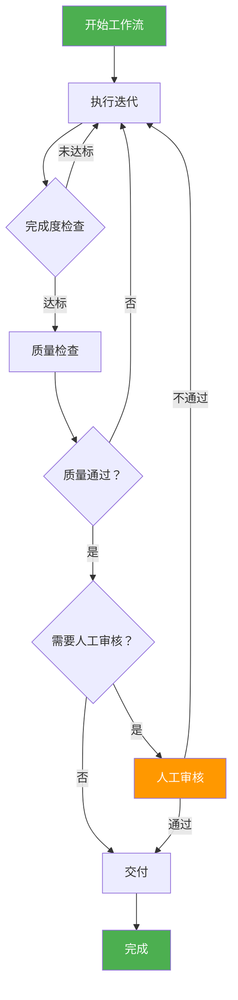

# Phase 4 设计文档审查报告

> 审查日期：2026-03-13
> 审查版本：v0.4.0
> 审查人：系统审查

---

## 1. 审查概述

### 1.1 总体评价

| 维度 | 评分 | 说明 |
|------|------|------|
| 完整性 | ⭐⭐⭐⭐⭐ | 5/5 - 设计非常完整 |
| 可行性 | ⭐⭐⭐⭐☆ | 4/5 - 整体可行，需修复兼容性问题 |
| 兼容性 | ⭐⭐⭐☆☆ | 3/5 - 存在多处与现有代码的兼容性问题 |
| 可维护性 | ⭐⭐⭐⭐⭐ | 5/5 - 模块化设计优秀 |
| 文档质量 | ⭐⭐⭐⭐⭐ | 5/5 - 流程图清晰，说明详细 |

**总体评分：4.4/5.0**

---

## 2. 发现的问题

### 2.1 严重问题 (P0)

#### 问题 1: IterationController 接口不匹配

**位置**: 设计文档第 7 节，第 800-812 行

**问题描述**:
设计中使用 `IterationController.execute_iteration()`，但现有代码中该方法不存在。

**设计文档**:
```python
async def execute_iteration(
    self,
    agents: List,
    execute_agent_func: Any,
) -> Dict[str, Any]:
```

**现有代码** (`ralph_loop/controller.py`):
```python
# 只有 start(), stop(), get_current_iteration(), get_history()
# 没有 execute_iteration() 方法
```

**影响**: 代码无法运行

**修复建议**:
在 `ralph_loop/controller.py` 中添加 `execute_iteration()` 方法：

```python
# src/ralph_loop/controller.py (添加)

async def execute_iteration(
    self,
    agents: List,
    execute_agent_func: Any,
) -> Dict[str, Any]:
    """
    执行一轮迭代
    
    Args:
        agents: Agent 列表
        execute_agent_func: 执行单个 Agent 的函数
        
    Returns:
        迭代结果
    """
    if not self._running:
        return {"success": False, "error": "Loop not running"}
    
    # ... 实现逻辑
```

---

#### 问题 2: DocumentStore 接口不一致

**位置**: 设计文档多处

**问题描述**:
设计文档中多次使用 `document_store`，但现有代码中类名是 `DocumentStore`，且方法接口需要确认。

**设计文档**:
```python
await self.context.document_store.save(document)
```

**现有代码** (`document_hub/store.py`):
```python
class DocumentStore:
    async def save(self, document: Document) -> bool:  # ✅ 匹配
    async def load(self, doc_id: str) -> Optional[Document]:  # ✅ 匹配
    async def list_documents(...) -> List[Document]:  # ✅ 匹配
```

**影响**: 类名正确，但需要确认导入路径

**修复建议**:
在设计文档中统一使用正确的导入：
```python
from document_hub import DocumentStore  # ✅ 正确
```

---

#### 问题 3: RequestBoard 接口确认

**位置**: 设计文档多处

**问题描述**:
设计中使用 `request_board.create_request()`，需要确认接口。

**设计文档**:
```python
await self.context.request_board.create_request(req)
```

**现有代码** (`request_board/board.py`):
```python
async def create_request(self, request: Request) -> str:  # ✅ 匹配，返回 ID
async def get_requests_for_agent(...) -> List[Request]:  # ✅ 匹配
async def add_response(...) -> bool:  # ✅ 匹配
```

**影响**: 接口匹配，无问题

---

### 2.2 中等问题 (P1)

#### 问题 4: IterationVisualizer 未被充分利用

**位置**: 设计文档第 7 节

**问题描述**:
现有代码已有 `IterationVisualizer`，但设计中未充分利用。

**现有代码** (`ralph_loop/visualizer.py`):
```python
class IterationVisualizer:
    def start_iteration(self, agents: List[Any]) -> IterationMetrics:  # ✅
    def update_iteration(self, **kwargs):  # ✅
    def end_iteration(self, completion_score: float = 0.0):  # ✅
    def record_setback(self, agent_role: str):  # ✅
    def get_statistics(self) -> Dict[str, Any]:  # ✅
```

**修复建议**:
在 `IterationController` 中更充分利用 Visualizer：

```python
# 在 execute_iteration 中
self.visualizer.start_iteration(agents)
# ... 执行迭代
self.visualizer.update_iteration(
    documents_read=docs_count,
    documents_produced=prod_count,
)
self.visualizer.end_iteration(completion_score)
```

---

#### 问题 5: WorkflowConfig 与 RalphLoopConfig 重复

**位置**: 设计文档第 9 节

**问题描述**:
`WorkflowConfig` 和 `RalphLoopConfig` 有重复字段。

**WorkflowConfig**:
```python
max_iterations: int = 50
completion_threshold: float = 0.9
max_setbacks: int = 20
parallel_agents: bool = True
```

**RalphLoopConfig**:
```python
max_iterations: int = 50
completion_threshold: float = 0.9
max_setbacks: int = 20
parallel_agents: bool = True
```

**修复建议**:
方案 A - 组合模式：
```python
@dataclass
class WorkflowConfig:
    ralph_config: RalphLoopConfig = field(default_factory=RalphLoopConfig)
    quality_passing_score: float = 0.7
    require_manual_review: bool = False
    workflow_timeout: int = 86400
```

方案 B - 继承模式：
```python
@dataclass
class WorkflowConfig(RalphLoopConfig):
    quality_passing_score: float = 0.7
    require_manual_review: bool = False
    workflow_timeout: int = 86400
```

**推荐**: 方案 A（组合模式）

---

#### 问题 6: CompletionChecker 接口不匹配

**位置**: 设计文档第 4 节

**问题描述**:
设计中使用的接口与现有代码不完全匹配。

**设计文档**:
```python
criteria = CompletionCriteria(
    requirement_coverage=self.config.completion_threshold,
)
checker = CompletionChecker(criteria)
result = await checker.check(team_state)
```

**现有代码** (`ralph_loop/completion.py`):
```python
class CompletionCriteria(BaseModel):
    requirement_coverage: float = 0.9  # ✅ 匹配
    document_completeness: float = 0.8
    quality_score: float = 0.7
    max_open_issues: int = 5

class CompletionChecker:
    async def check(self, team_state: Dict[str, Any]) -> Dict[str, Any]:  # ✅ 匹配
```

**修复建议**:
完善 `CompletionChecker.check()` 方法，使其返回设计文档中期望的格式：
```python
async def check(self, team_state: Dict[str, Any]) -> Dict[str, Any]:
    results = {
        "ready": False,
        "score": 0.0,
        "details": {},
        "blocking_issues": [],
    }
    # ... 实现
    return results
```

---

### 2.3 轻微问题 (P2)

#### 问题 7: 缺少 WorkflowContext 与现有模块的集成

**位置**: 设计文档第 3 节

**问题描述**:
`WorkflowContext` 需要与现有模块更好地集成。

**修复建议**:
在 `WorkflowContext` 中添加与现有模块的集成：

```python
@dataclass
class WorkflowContext:
    # ... 现有字段
    
    # 添加可视化
    visualizer: Optional[IterationVisualizer] = None
    
    # 添加挫折统计
    setbacks: List[Setback] = field(default_factory=list)
    
    def record_setback(self, setback: Setback):
        """记录挫折"""
        self.setbacks.append(setback)
        self.total_setbacks += 1
```

---

#### 问题 8: TaskScheduler 与 Agent 集成

**位置**: 设计文档第 5 节

**问题描述**:
`TaskScheduler` 需要与 Agent 的 RALPH 方法更好地集成。

**修复建议**:
添加任务与 RALPH 方法的映射：

```python
class TaskScheduler:
    RALPH_METHODS = [
        "read_documents",
        "act_on_requests",
        "leverage_expertise",
        "produce_document",
        "help_requests",
    ]
    
    async def execute_ralph_task(
        self,
        agent: Any,
        method_name: str,
    ) -> Any:
        """执行 RALPH 方法"""
        if not hasattr(agent, method_name):
            raise ValueError(f"Unknown method: {method_name}")
        
        method = getattr(agent, method_name)
        return await method()
```

---

## 3. 兼容性检查清单

### 3.1 模块导入兼容性

| 设计引用 | 实际代码 | 状态 | 建议 |
|----------|----------|------|------|
| `document_hub.DocumentStore` | `DocumentStore` | ✅ 匹配 | - |
| `request_board.RequestBoard` | `RequestBoard` | ✅ 匹配 | - |
| `ralph_loop.IterationController` | `IterationController` | ⚠️ 缺少方法 | 添加 `execute_iteration()` |
| `ralph_loop.SetbackHandler` | `SetbackHandler` | ⚠️ 需完善 | 添加 `attempt_recovery()` |
| `ralph_loop.CompletionChecker` | `CompletionChecker` | ✅ 匹配 | - |
| `ralph_loop.IterationVisualizer` | `IterationVisualizer` | ⚠️ 未充分利用 | 加强集成 |

### 3.2 接口兼容性

| 接口 | 设计定义 | 实际代码 | 状态 |
|------|----------|----------|------|
| `DocumentStore.save()` | `async save(doc) -> bool` | `async save(doc) -> bool` | ✅ |
| `RequestBoard.create_request()` | `async create(req) -> str` | `async create(req) -> str` | ✅ |
| `IterationController.start()` | `async start(agents, session)` | `async start(agents, session)` | ✅ |
| `IterationController.stop()` | `async stop()` | `async stop()` | ✅ |
| `IterationController.execute_iteration()` | `async execute(...)` | ❌ 不存在 | ❌ 需添加 |
| `SetbackHandler.attempt_recovery()` | `async attempt_recovery(setback)` | ❌ 不存在 | ❌ 需添加 |

---

## 4. 改进建议

### 4.1 架构改进

#### 建议 1: 添加工作流事件系统

**目的**: 支持工作流状态的实时通知

```python
# src/workflow/events.py

from enum import Enum
from dataclasses import dataclass
from typing import Any, Optional
import time

class WorkflowEventType(Enum):
    STARTED = "started"
    ITERATION_STARTED = "iteration_started"
    ITERATION_COMPLETED = "iteration_completed"
    SETBACK_OCCURRED = "setback_occurred"
    QUALITY_CHECK_STARTED = "quality_check_started"
    DELIVERED = "delivered"
    COMPLETED = "completed"
    FAILED = "failed"
    STOPPED = "stopped"

@dataclass
class WorkflowEvent:
    type: WorkflowEventType
    workflow_id: str
    message: str
    data: Optional[Any] = None
    timestamp: int = field(default_factory=lambda: int(time.time()))

class WorkflowEventBus:
    """工作流事件总线"""
    
    def __init__(self):
        self._subscribers = []
    
    def subscribe(self, callback):
        """订阅事件"""
        self._subscribers.append(callback)
    
    def publish(self, event: WorkflowEvent):
        """发布事件"""
        for callback in self._subscribers:
            try:
                callback(event)
            except Exception:
                pass  # 忽略订阅者错误
```

---

#### 建议 2: 添加工作流持久化

**目的**: 支持工作流状态保存和恢复

```python
# src/workflow/persistence.py

import json
from pathlib import Path
from typing import Optional
from .context import WorkflowContext

class WorkflowPersistence:
    """工作流持久化"""
    
    def __init__(self, base_path: str = "./workflow_storage"):
        self.base_path = Path(base_path)
        self.base_path.mkdir(parents=True, exist_ok=True)
    
    async def save(self, context: WorkflowContext):
        """保存工作流状态"""
        data = {
            "workflow_id": context.workflow_id,
            "status": context.status,
            "iteration_count": context.iteration_count,
            "total_documents": context.total_documents,
            "quality_score": context.quality_score,
        }
        
        file_path = self.base_path / f"{context.workflow_id}.json"
        with open(file_path, "w") as f:
            json.dump(data, f, indent=2)
    
    async def load(self, workflow_id: str) -> Optional[dict]:
        """加载工作流状态"""
        file_path = self.base_path / f"{workflow_id}.json"
        if not file_path.exists():
            return None
        
        with open(file_path, "r") as f:
            return json.load(f)
```

---

### 4.2 流程改进

#### 建议 3: 添加人工审核点

**流程图更新**:



---

## 5. 修复清单

### 5.1 必须修复 (阻断实施)

| 编号 | 问题 | 文件 | 修复方案 |
|------|------|------|----------|
| P0-1 | IterationController 缺少方法 | `ralph_loop/controller.py` | 添加 `execute_iteration()` |
| P0-2 | SetbackHandler 缺少方法 | `ralph_loop/setback.py` | 添加 `attempt_recovery()` |

### 5.2 建议修复 (提升质量)

| 编号 | 问题 | 文件 | 修复方案 |
|------|------|------|----------|
| P1-1 | IterationVisualizer 未充分利用 | `workflow/coordinator.py` | 加强集成 |
| P1-2 | WorkflowConfig 与 RalphLoopConfig 重复 | `workflow/config.py` | 使用组合模式 |
| P1-3 | CompletionChecker 完善 | `ralph_loop/completion.py` | 扩展检查逻辑 |

### 5.3 可选改进

| 编号 | 建议 | 优先级 |
|------|------|--------|
| P2-1 | 添加工作流事件系统 | 低 |
| P2-2 | 添加工作流持久化 | 低 |
| P2-3 | 添加人工审核点 | 低 |

---

## 6. 修复补丁

### 6.1 ralph_loop/controller.py 补丁

```python
# src/ralph_loop/controller.py (添加方法)

async def execute_iteration(
    self,
    agents: List,
    execute_agent_func: Any,
) -> Dict[str, Any]:
    """
    执行一轮迭代
    
    Args:
        agents: Agent 列表
        execute_agent_func: 执行单个 Agent 的函数
        
    Returns:
        迭代结果
    """
    if not self._running:
        return {"success": False, "error": "Loop not running"}
    
    # 等待恢复
    while self._paused and self._running:
        await asyncio.sleep(0.5)
    
    if not self._running:
        return {"success": False, "error": "Loop stopped"}
    
    results = []
    errors = []
    
    # 并行执行
    if self.config.parallel_agents:
        tasks = [
            self._execute_with_recovery(agent, execute_agent_func)
            for agent in agents
        ]
        results = await asyncio.gather(*tasks, return_exceptions=True)
    else:
        for agent in agents:
            result = await self._execute_with_recovery(agent, execute_agent_func)
            results.append(result)
    
    # 统计结果
    for result in results:
        if isinstance(result, Exception):
            errors.append(result)
            self.current_iteration.setbacks_encountered += 1
        elif isinstance(result, dict):
            self.current_iteration.documents_read += result.get("documents_read", 0)
            self.current_iteration.requests_processed += result.get("requests_processed", 0)
            self.current_iteration.documents_produced += result.get("documents_produced", 0)
            self.current_iteration.requests_posted += result.get("requests_posted", 0)
    
    # 更新迭代计数
    self.current_iteration.iteration_number += 1
    
    # 更新可视化
    self.visualizer.update_iteration(
        documents_read=self.current_iteration.documents_read,
        documents_produced=self.current_iteration.documents_produced,
        requests_processed=self.current_iteration.requests_processed,
        requests_posted=self.current_iteration.requests_posted,
        setbacks_count=self.current_iteration.setbacks_encountered,
    )
    
    return {
        "success": len(errors) == 0,
        "results": results,
        "errors": errors,
        "iteration": self.current_iteration.iteration_number,
    }
```

---

### 6.2 ralph_loop/setback.py 补丁

```python
# src/ralph_loop/setback.py (添加方法)

async def attempt_recovery(self, setback: Setback) -> bool:
    """
    尝试恢复
    
    Args:
        setback: 挫折记录
        
    Returns:
        bool: 是否恢复成功
    """
    if setback.retry_count >= setback.max_retries:
        return False
    
    strategy = self._recovery_strategies.get(setback.type)
    if not strategy:
        return False
    
    # 增加重试计数
    setback.retry_count += 1
    
    # 冷却等待
    if strategy.cooldown_seconds > 0:
        await asyncio.sleep(strategy.cooldown_seconds)
    
    # 执行恢复动作
    if strategy.action:
        try:
            await strategy.action(setback)
        except Exception:
            return False
    
    return True

def get_all_setbacks(self) -> List[Setback]:
    """获取所有挫折"""
    return list(self._setbacks)

def get_unresolved_setbacks(self) -> List[Setback]:
    """获取未解决的挫折"""
    return [s for s in self._setbacks if not s.resolved]
```

---

### 6.3 workflow/config.py 补丁

```python
# src/workflow/config.py

from __future__ import annotations
from dataclasses import dataclass, field
from ralph_loop.config import RalphLoopConfig


@dataclass
class WorkflowConfig:
    """
    工作流配置
    
    使用组合模式复用 RalphLoopConfig
    """
    # 组合 RalphLoopConfig
    ralph_config: RalphLoopConfig = field(default_factory=RalphLoopConfig)
    
    # 工作流特有配置
    quality_passing_score: float = 0.7
    require_manual_review: bool = False
    workflow_timeout: int = 86400  # 24 小时
    
    # 从 RalphLoopConfig 代理常用字段
    @property
    def max_iterations(self) -> int:
        return self.ralph_config.max_iterations
    
    @property
    def completion_threshold(self) -> float:
        return self.ralph_config.completion_threshold
    
    @property
    def max_setbacks(self) -> int:
        return self.ralph_config.max_setbacks
    
    @property
    def parallel_agents(self) -> bool:
        return self.ralph_config.parallel_agents
```

---

## 7. 结论

### 7.1 总体评估

Phase 4 设计文档质量优秀，架构清晰，流程图详细。主要问题集中在：

1. **缺少关键方法** - `IterationController.execute_iteration()` 和 `SetbackHandler.attempt_recovery()`
2. **配置重复** - `WorkflowConfig` 和 `RalphLoopConfig` 字段重复
3. **Visualizer 未充分利用** - 现有可视化功能未完全集成

### 7.2 实施建议

1. **先修复 P0 问题** - 添加缺失方法
2. **再处理 P1 问题** - 优化配置结构
3. **按设计实施** - 核心逻辑正确可行

### 7.3 下一步

1. 应用本报告的修复补丁
2. 更新设计文档
3. 开始实施 Phase 4 开发

---

> 审查完成时间：2026-03-13
> 状态：需要修复 P0 问题后方可实施
> 总体评分：4.4/5.0