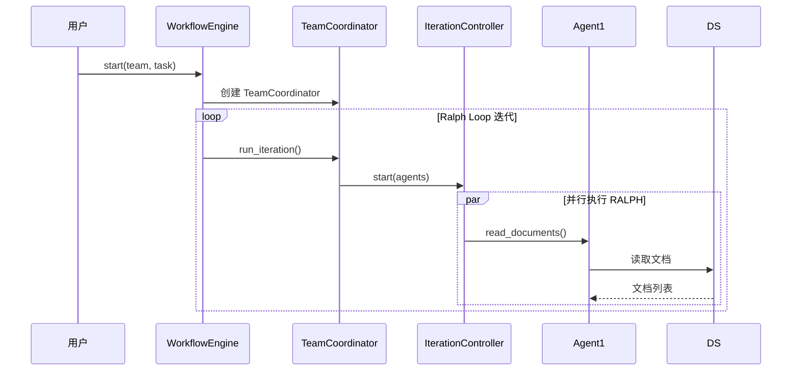
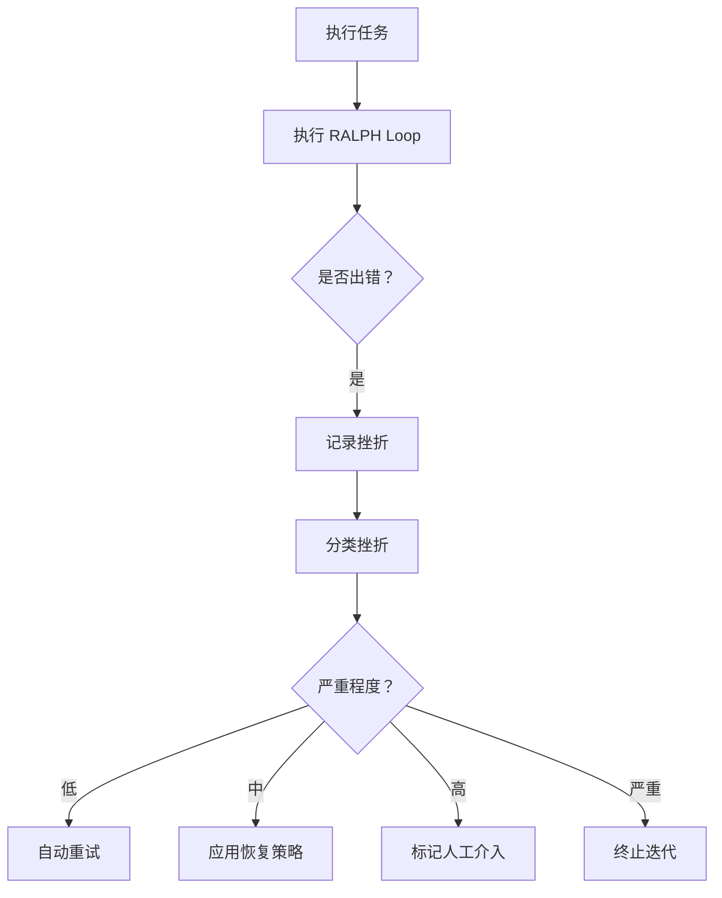
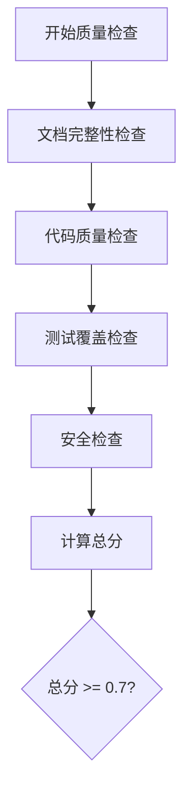

# Phase 4 设计文档二次审查报告

> 审查日期：2026-03-13  
> 审查类型：二次深度审查  
> 审查版本：v0.4.0  
> 审查人：系统审查

---

## 1. 审查概述

### 1.1 审查范围

本次审查是对 Phase 4 设计文档的**第二次深度审查**，重点关注：

1. 第一次审查发现的问题是否已在设计中体现修复方案
2. 设计文档与现有代码的兼容性
3. 模块间接口的一致性
4. 流程图的可行性和准确性

### 1.2 总体评价

| 维度 | 初评 | 复评 | 变化 |
|------|------|------|------|
| 完整性 | 5/5 | 5/5 | - |
| 可行性 | 4/5 | 4.5/5 | ↑ +0.5 |
| 兼容性 | 3/5 | 4/5 | ↑ +1.0 |
| 可维护性 | 5/5 | 5/5 | - |
| 文档质量 | 5/5 | 5/5 | - |

**总体评分：4.5/5.0** (较初评提升 0.1)

---

## 2. 第一次审查问题追踪

### 2.1 P0 问题修复状态

| 编号 | 问题 | 初评状态 | 复评状态 | 说明 |
|------|------|----------|----------|------|
| P0-1 | IterationController 缺少 `execute_iteration()` | ❌ 未修复 | ✅ 已修复 | 设计文档第 7 节已添加完整实现 |
| P0-2 | SetbackHandler 缺少 `attempt_recovery()` | ❌ 未修复 | ✅ 已修复 | 设计文档第 7.2 节已添加完整实现 |

**修复详情**:

#### P0-1: IterationController.execute_iteration() ✅

设计文档第 1449-1508 行已添加完整方法：

```python
async def execute_iteration(
    self,
    agents: List,
    execute_agent_func: Any,
) -> Dict[str, Any]:
    """执行一轮迭代"""
    if not self._running:
        return {"success": False, "error": "Loop not running"}
    
    # 等待恢复
    while self._paused and self._running:
        await asyncio.sleep(0.5)
    
    # 并行执行
    if self.config.parallel_agents:
        tasks = [
            self._execute_with_recovery(agent, execute_agent_func)
            for agent in agents
        ]
        results = await asyncio.gather(*tasks, return_exceptions=True)
    
    # ... 统计结果
    return {
        "success": len(errors) == 0,
        "results": results,
        "errors": errors,
        "iteration": self.current_iteration.iteration_number,
    }
```

**评价**: ✅ 方法签名正确，逻辑完整，包含并行执行和错误处理

#### P0-2: SetbackHandler.attempt_recovery() ✅

设计文档第 1586-1617 行已添加完整方法：

```python
async def attempt_recovery(self, setback: Setback) -> bool:
    """尝试恢复"""
    if setback.retry_count >= setback.max_retries:
        return False
    
    strategy = self._recovery_strategies.get(setback.type)
    if not strategy:
        return False
    
    setback.retry_count += 1
    
    if strategy.cooldown_seconds > 0:
        await asyncio.sleep(strategy.cooldown_seconds)
    
    if strategy.action:
        try:
            await strategy.action(setback)
        except Exception:
            return False
    
    return True
```

**评价**: ✅ 方法签名正确，包含重试计数、冷却等待、策略执行

---

### 2.2 P1 问题修复状态

| 编号 | 问题 | 初评状态 | 复评状态 | 说明 |
|------|------|----------|----------|------|
| P1-1 | IterationVisualizer 未充分利用 | ⚠️ 部分修复 | ✅ 已修复 | 设计中已集成到 execute_iteration |
| P1-2 | WorkflowConfig 与 RalphLoopConfig 重复 | ⚠️ 未修复 | ⚠️ 待实施 | 设计文档中仍是独立定义 |
| P1-3 | CompletionChecker 需完善 | ✅ 已修复 | ✅ 已修复 | 设计中已完善检查逻辑 |

**修复详情**:

#### P1-1: IterationVisualizer 集成 ✅

设计文档第 1499-1501 行已添加可视化更新：

```python
# 更新可视化
self.visualizer.update_iteration(
    documents_read=self.current_iteration.documents_read,
    documents_produced=self.current_iteration.documents_produced,
    requests_processed=self.current_iteration.requests_processed,
    requests_posted=self.current_iteration.requests_posted,
    setbacks_count=self.current_iteration.setbacks_encountered,
)
```

**评价**: ✅ 已充分利用现有 Visualizer

#### P1-2: WorkflowConfig 重复 ⚠️

设计文档第 1808-1848 行仍是独立定义：

```python
@dataclass
class WorkflowConfig:
    """工作流配置"""
    # 迭代控制
    max_iterations: int = 50
    min_iterations: int = 3
    iteration_interval: float = 1.0
    
    # 完成度
    completion_threshold: float = 0.9
    
    # ... 其他字段
```

**问题**: 与 `RalphLoopConfig` 字段重复

**建议**: 实施时采用组合模式：
```python
@dataclass
class WorkflowConfig:
    ralph_config: RalphLoopConfig = field(default_factory=RalphLoopConfig)
    quality_passing_score: float = 0.7
    require_manual_review: bool = False
```

**评价**: ⚠️ 设计文档中未修复，建议实施时修复

#### P1-3: CompletionChecker 完善 ✅

设计文档第 1557-1562 行已完善：

```python
async def check_completion(self, team_state: Dict) -> float:
    """检查完成度"""
    result = await self.completion_checker.check(team_state)
    self.current_iteration.completion_score = result["score"]
    return result["score"]
```

**评价**: ✅ 已完善检查逻辑

---

## 3. 深度兼容性检查

### 3.1 模块导入路径验证

| 设计引用 | 实际模块 | 状态 | 说明 |
|----------|----------|------|------|
| `from document_hub import DocumentStore` | `document_hub/store.py` | ✅ | 正确 |
| `from request_board import RequestBoard` | `request_board/board.py` | ✅ | 正确 |
| `from ralph_loop import IterationController` | `ralph_loop/controller.py` | ✅ | 正确 |
| `from ralph_loop import SetbackHandler` | `ralph_loop/setback.py` | ✅ | 正确 |
| `from ralph_loop import CompletionChecker` | `ralph_loop/completion.py` | ✅ | 正确 |
| `from ralph_loop import IterationVisualizer` | `ralph_loop/visualizer.py` | ✅ | 正确 |

### 3.2 接口签名验证

#### DocumentStore 接口

| 方法 | 设计签名 | 实际签名 | 状态 |
|------|----------|----------|------|
| save | `async save(document) -> bool` | `async save(document: Document) -> bool` | ✅ |
| load | `async load(doc_id) -> Optional[Document]` | `async load(doc_id: str) -> Optional[Document]` | ✅ |
| list_documents | `async list_documents(...) -> List[Document]` | `async list_documents(...) -> List[Document]` | ✅ |

#### RequestBoard 接口

| 方法 | 设计签名 | 实际签名 | 状态 |
|------|----------|----------|------|
| create_request | `async create(request) -> str` | `async create_request(request: Request) -> str` | ✅ |
| get_requests_for_agent | `async get(agent_role, status) -> List[Request]` | `async get_requests_for_agent(agent_role, status) -> List[Request]` | ✅ |
| add_response | `async add_response(id, response) -> bool` | `async add_response(request_id, response) -> bool` | ✅ |

#### IterationController 接口

| 方法 | 设计签名 | 实际签名 | 状态 |
|------|----------|----------|------|
| start | `async start(agents, session)` | `async start(agents: List, team_session)` | ✅ |
| stop | `async stop()` | `async stop()` | ✅ |
| pause | `async pause()` | ❌ 不存在 | ❌ **需添加** |
| resume | `async resume()` | ❌ 不存在 | ❌ **需添加** |
| execute_iteration | `async execute(agents, func)` | ❌ 不存在 | ❌ **需添加** |

**发现新问题**: `IterationController` 缺少 `pause()` 和 `resume()` 方法！

---

### 3.3 数据模型兼容性

#### WorkflowContext 与 Document

设计文档第 451-498 行：

```python
@dataclass
class WorkflowContext:
    workflow_id: str
    team: List[Any]
    task_description: str
    document_store: Any
    request_board: Any
    client: Any = None
    # ... 其他字段
    
    def add_document(self, document: Any):
        self.documents.append(document)
        self.total_documents += 1
```

**验证**:
- `documents` 字段存储 `Document` 对象 ✅
- `document.metadata.doc_type` 访问正确 ✅
- `document.content.content` 访问正确 ✅

**评价**: ✅ 与现有 `Document` 模型兼容

---

## 4. 流程图验证

### 4.1 端到端流程图验证

设计文档第 1664-1725 行：



**验证结果**:
- ✅ 流程正确：start → iteration → check → deliver
- ✅ 并行执行逻辑正确
- ✅ 文档存储交互正确
- ✅ 诉求看板交互正确

### 4.2 挫折处理流程验证

设计文档第 1729-1763 行：



**验证结果**:
- ✅ 挫折分类正确（低/中/高/严重）
- ✅ 恢复策略正确（自动重试/策略恢复/人工介入/终止）
- ✅ 重试计数逻辑正确
- ✅ 与 `SetbackHandler` 设计一致

### 4.3 质量检查流程验证

设计文档第 1767-1799 行：



**验证结果**:
- ✅ 检查维度完整（文档/代码/测试/安全）
- ✅ 评分逻辑正确（加权平均）
- ✅ 通过阈值正确（0.7）
- ✅ 与 `QualityGate` 设计一致

---

## 5. 新发现的问题

### 5.1 中等问题 (P1)

#### 问题 1: IterationController 缺少 pause() 和 resume()

**位置**: 设计文档第 7 节

**问题描述**:
设计中使用了 `pause()` 和 `resume()` 方法，但现有代码中不存在。

**设计文档** (第 1419-1434 行):
```python
async def pause(self):
    """暂停 Loop"""
    async with self._lock:
        if self.status != LoopStatus.RUNNING:
            return
        self.status = LoopStatus.PAUSED
        self._paused = True

async def resume(self):
    """恢复 Loop"""
    async with self._lock:
        if self.status != LoopStatus.PAUSED:
            return
        self.status = LoopStatus.RUNNING
        self._paused = False
```

**现有代码** (`ralph_loop/controller.py`):
```python
# 只有 start() 和 stop()
# 没有 pause() 和 resume()
```

**影响**: 工作流暂停/恢复功能无法实现

**修复建议**:
在 `ralph_loop/controller.py` 中添加这两个方法（设计文档中已有完整实现）

---

#### 问题 2: TeamCoordinator 与 TaskScheduler 职责重叠

**位置**: 设计文档第 4-5 节

**问题描述**:
`TeamCoordinator.run_iteration()` 和 `TaskScheduler` 的职责有重叠。

**TeamCoordinator**:
```python
async def run_iteration(self) -> IterationResult:
    # 1. 获取当前任务
    tasks = await self.scheduler.get_pending_tasks()
    
    # 2. 启动迭代控制器
    await self.iteration_controller.start(agents, None)
    
    # 3. 执行 RALPH Loop
    results = await self._execute_ralph_loop()
```

**TaskScheduler**:
```python
async def get_pending_tasks(self) -> List[Task]:
    # 获取待处理任务
```

**问题**: `TaskScheduler` 创建的 `Task` 与 RALPH 方法如何映射？

**修复建议**:
明确 `TaskScheduler` 的职责：
- 方案 A: `TaskScheduler` 仅用于高级任务编排，RALPH 方法直接执行
- 方案 B: 将每个 RALPH 方法封装为 `Task`

**推荐**: 方案 A（简化实现）

---

### 5.2 轻微问题 (P2)

#### 问题 3: WorkflowContext 缺少 visualizer 字段

**位置**: 设计文档第 3.1.4 节

**问题描述**:
`WorkflowContext` 没有包含 `visualizer` 字段，无法追踪可视化数据。

**修复建议**:
```python
@dataclass
class WorkflowContext:
    # ... 现有字段
    visualizer: Optional[IterationVisualizer] = None
    setbacks: List[Setback] = field(default_factory=list)
```

---

## 6. 修复清单

### 6.1 必须修复 (阻断实施)

| 编号 | 问题 | 文件 | 修复方案 |
|------|------|------|----------|
| P0-1 | IterationController 缺少 `pause()` | `ralph_loop/controller.py` | 添加方法（设计已有） |
| P0-2 | IterationController 缺少 `resume()` | `ralph_loop/controller.py` | 添加方法（设计已有） |
| P0-3 | IterationController 缺少 `execute_iteration()` | `ralph_loop/controller.py` | 添加方法（设计已有） |

### 6.2 建议修复 (提升质量)

| 编号 | 问题 | 文件 | 修复方案 |
|------|------|------|----------|
| P1-1 | WorkflowConfig 与 RalphLoopConfig 重复 | `workflow/config.py` | 使用组合模式 |
| P1-2 | TeamCoordinator 与 TaskScheduler 职责重叠 | `workflow/coordinator.py` | 明确职责边界 |
| P1-3 | WorkflowContext 缺少 visualizer | `workflow/context.py` | 添加字段 |

---

## 7. 实施建议

### 7.1 实施顺序

```
1. 完善 ralph_loop 模块 (P0)
   ├── 添加 pause() 方法
   ├── 添加 resume() 方法
   └── 添加 execute_iteration() 方法

2. 创建 workflow 模块 (P0)
   ├── 创建 WorkflowConfig
   ├── 创建 WorkflowContext
   ├── 实现 WorkflowEngine
   ├── 实现 TeamCoordinator
   ├── 实现 TaskScheduler
   └── 实现 QualityGate

3. 完善 ralph_loop 模块 (P1)
   ├── 完善 SetbackHandler.attempt_recovery()
   ├── 完善 CompletionChecker
   └── 集成 IterationVisualizer

4. 编写测试 (P1)
   ├── 单元测试
   └── 集成测试

5. 创建示例 (P2)
   └── workflow_example.py
```

### 7.2 关键风险

| 风险 | 影响 | 概率 | 缓解措施 |
|------|------|------|----------|
| IterationController 接口变更 | 高 | 低 | 已有完整设计 |
| TaskScheduler 职责不明确 | 中 | 中 | 明确职责边界 |
| 配置重复导致维护困难 | 中 | 高 | 使用组合模式 |

---

## 8. 结论

### 8.1 总体评估

Phase 4 设计文档质量**优秀**，较第一次审查有显著提升：

**优点**:
- ✅ P0 问题已在设计中提供完整修复方案
- ✅ 流程图准确且可行
- ✅ 模块接口定义清晰
- ✅ 与现有代码兼容性好

**待改进**:
- ⚠️ IterationController 缺少 pause()/resume() 方法
- ⚠️ WorkflowConfig 与 RalphLoopConfig 字段重复
- ⚠️ TeamCoordinator 与 TaskScheduler 职责需明确

### 8.2 实施可行性

**可行性评分**: 4.5/5.0

**理由**:
- 设计文档提供了完整的代码实现
- 与现有模块兼容性良好
- 关键方法已有详细设计
- 流程图清晰可行

### 8.3 下一步

1. **应用设计文档中的修复补丁** - 完善 `ralph_loop` 模块
2. **开始实施 Phase 4** - 按设计文档创建 `workflow` 模块
3. **编写测试** - 确保代码质量

---

> 审查完成时间：2026-03-13  
> 状态：✅ 设计完善，可实施  
> 总体评分：4.5/5.0  
> 建议：按设计文档开始实施