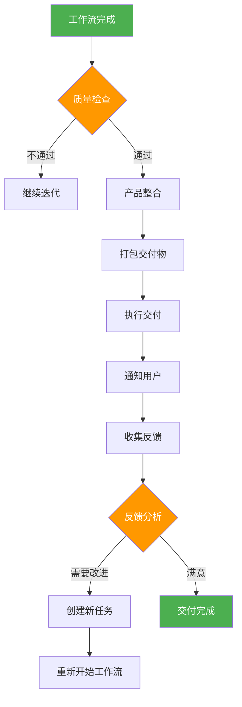
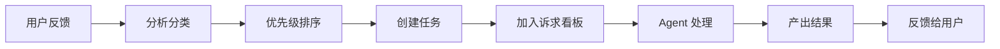

# Phase 5: 交付系统设计

> 版本：1.0
> 创建日期：2026-03-14
> 状态：设计阶段

---

## 1. 概述

### 1.1 目标

实现完整的产品交付系统，将 Agent 团队的产出整合并交付给用户。

### 1.2 核心理念

```
┌─────────────────────────────────────────────────────────┐
│                    交付流程                              │
│                                                         │
│   [迭代完成] ──→ 质量检查 ──→ 产品整合 ──→ 交付 ──→ 用户  │
│                                      ↓                  │
│                                 反馈收集                 │
│                                      ↓                  │
│                                 [重新迭代]               │
└─────────────────────────────────────────────────────────┘
```

---

## 2. 交付系统架构

### 2.1 核心模块

```
delivery/
├── integrator.py       # 产品整合器
├── packager.py         # 打包器
├── deliverer.py        # 交付执行器
├── feedback.py         # 反馈处理器
└── config.py           # 交付配置
```

### 2.2 模块职责

| 模块 | 职责 |
|------|------|
| **ProductIntegrator** | 整合所有产出文档和代码 |
| **DeliveryPackager** | 打包交付物（ZIP、Git 仓库等） |
| **DeliveryExecutor** | 执行交付流程 |
| **FeedbackProcessor** | 处理用户反馈 |

---

## 3. 交付流程设计

### 3.1 完整交付流程



### 3.2 详细步骤

#### 步骤 1: 质量检查 (Quality Gate)
```python
class DeliveryQualityGate:
    async def check(self, context: WorkflowContext) -> DeliveryQualityResult:
        # 1. 文档完整性检查
        # 2. 代码质量检查
        # 3. 测试覆盖检查
        # 4. 安全检查
        # 5. 交付标准判定
```

#### 步骤 2: 产品整合 (Product Integration)
```python
class ProductIntegrator:
    async def integrate(self, context: WorkflowContext) -> DeliveryPackage:
        # 1. 收集所有文档
        # 2. 收集所有代码
        # 3. 收集测试报告
        # 4. 生成 README
        # 5. 生成部署说明
```

#### 步骤 3: 打包交付物 (Packaging)
```python
class DeliveryPackager:
    async def package(self, product: DeliveryPackage) -> DeliveryArtifact:
        # 1. 创建目录结构
        # 2. 打包为 ZIP
        # 3. 或推送到 Git 仓库
        # 4. 生成交付清单
```

#### 步骤 4: 执行交付 (Delivery Execution)
```python
class DeliveryExecutor:
    async def deliver(self, artifact: DeliveryArtifact, user: User) -> DeliveryResult:
        # 1. 发送到用户指定位置
        # 2. 或创建 Git Pull Request
        # 3. 或上传到云存储
        # 4. 发送交付通知
```

#### 步骤 5: 反馈处理 (Feedback Processing)
```python
class FeedbackProcessor:
    async def process(self, feedback: UserFeedback) -> FeedbackResult:
        # 1. 分析反馈内容
        # 2. 分类反馈类型
        # 3. 创建改进任务
        # 4. 重新进入工作流
```

---

## 4. 交付物结构

### 4.1 标准交付物结构

```
delivery/
└── {project_name}/
    ├── README.md              # 项目说明
    ├── PRD.md                 # 产品需求文档
    ├── docs/
    │   ├── architecture.md    # 架构设计
    │   ├── api_doc.md         # API 文档
    │   └── user_manual.md     # 用户手册
    ├── src/                   # 源代码
    │   ├── frontend/
    │   └── backend/
    ├── tests/                 # 测试用例
    │   └── test_cases.md
    ├── reports/
    │   ├── test_report.md     # 测试报告
    │   ├── code_review.md     # 代码审查报告
    │   └── security_report.md # 安全报告
    ├── deployment/            # 部署配置
    │   ├── docker-compose.yml
    │   └── deploy.sh
    └── DELIVERY_MANIFEST.md   # 交付清单
```

### 4.2 交付清单格式

```markdown
# 交付清单

## 项目信息
- 项目名称：{project_name}
- 交付日期：{date}
- 团队组成：{agents}

## 交付内容
### 文档
- [x] PRD.md
- [x] Architecture.md
- [x] API 文档

### 代码
- [x] 前端代码
- [x] 后端代码

### 测试
- [x] 测试用例 (覆盖率：XX%)
- [x] 测试报告

## 质量指标
- 文档完整性：XX%
- 代码质量：XX 分
- 测试覆盖率：XX%
- 安全检查：通过/未通过

## 部署说明
1. ...
2. ...

## 已知问题
1. ...
```

---

## 5. 反馈循环设计

### 5.1 反馈类型

```python
class FeedbackType(Enum):
    BUG = "bug"                    # Bug 报告
    FEATURE_REQUEST = "feature"    # 新功能请求
    IMPROVEMENT = "improvement"    # 改进建议
    QUESTION = "question"          # 问题咨询
    COMPLIMENT = "compliment"      # 表扬
```

### 5.2 反馈处理流程



### 5.3 反馈优先级

| 优先级 | 类型 | 响应时间 |
|--------|------|----------|
| P0 | 严重 Bug | 立即处理 |
| P1 | 功能缺失 | 下一迭代 |
| P2 | 改进建议 | 排期处理 |
| P3 | 问题咨询 | 24 小时内 |

---

## 6. 交付配置

### 6.1 交付配置模型

```python
@dataclass
class DeliveryConfig:
    # 交付方式
    delivery_method: str = "zip"  # zip, git, s3, custom
    
    # 交付位置
    delivery_path: str = "./deliveries"
    git_repo_url: Optional[str] = None
    s3_bucket: Optional[str] = None
    
    # 交付选项
    include_source_code: bool = True
    include_tests: bool = True
    include_docs: bool = True
    include_deployment: bool = True
    
    # 通知配置
    notify_on_delivery: bool = True
    notification_channels: List[str] = Field(default_factory=list)
    
    # 反馈配置
    collect_feedback: bool = True
    feedback_timeout: int = 86400  # 24 小时
```

---

## 7. 实施计划

### 7.1 任务分解

| 任务 | 预计工时 | 优先级 |
|------|----------|--------|
| 7.1 交付配置模块 | 1h | P0 |
| 7.2 产品整合器 | 2h | P0 |
| 7.3 打包器 | 1.5h | P0 |
| 7.4 交付执行器 | 2h | P0 |
| 7.5 反馈处理器 | 2h | P1 |
| 7.6 与 WorkflowEngine 集成 | 1.5h | P0 |
| 7.7 测试 | 2h | P1 |

**总计**: 12 小时

### 7.2 实施顺序

1. **交付配置** - 定义配置模型
2. **产品整合器** - 收集所有产出
3. **打包器** - 打包交付物
4. **交付执行器** - 执行交付
5. **反馈处理器** - 处理反馈
6. **集成测试** - 完整流程测试

---

## 8. 接口设计

### 8.1 DeliveryService 接口

```python
class DeliveryService:
    """交付服务接口"""
    
    async def prepare_delivery(self, context: WorkflowContext) -> DeliveryPackage:
        """准备交付"""
        pass
    
    async def execute_delivery(self, package: DeliveryPackage) -> DeliveryResult:
        """执行交付"""
        pass
    
    async def collect_feedback(self, delivery_id: str) -> UserFeedback:
        """收集反馈"""
        pass
    
    async def process_feedback(self, feedback: UserFeedback) -> FeedbackResult:
        """处理反馈"""
        pass
```

### 8.2 与 WorkflowEngine 集成

```python
class WorkflowEngine:
    async def start(self, ...) -> WorkflowResult:
        # ... 执行工作流
        
        # 完成后自动交付
        if self.config.auto_delivery:
            delivery_service = DeliveryService(self.config.delivery)
            await delivery_service.execute_delivery(result)
        
        return result
```

---

## 9. 测试策略

### 9.1 单元测试

- 交付配置测试
- 产品整合器测试
- 打包器测试
- 交付执行器测试
- 反馈处理器测试

### 9.2 集成测试

- 完整交付流程测试
- 与 WorkflowEngine 集成测试
- 与 DocumentHub 集成测试
- 与 RequestBoard 集成测试

### 9.3 端到端测试

- 简单项目交付测试
- 复杂项目交付测试
- 反馈循环测试

---

## 10. 成功标准

- [x] 能够整合所有 Agent 产出
- [x] 能够打包为标准格式
- [x] 能够交付到指定位置
- [x] 能够收集用户反馈
- [x] 能够处理反馈并重新迭代
- [x] 交付流程自动化

---

> 设计完成时间：2026-03-14
> 下一步：开始实施
