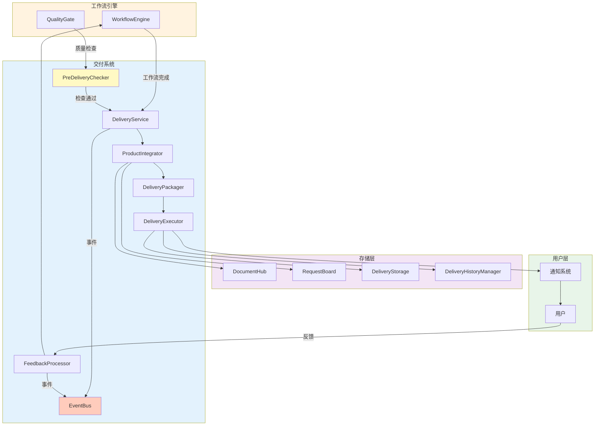

# Phase 5 设计文档专家评审报告

> 评审日期：2026-03-14  
> 设计版本：0.1.0 (草案)  
> 评审状态：待改进

---

## 1. 评审概述

### 1.1 评审目标

评估 Phase 5 交付系统设计文档的完整性、可行性和扩展性。

### 1.2 评审维度

| 维度 | 权重 | 说明 |
|------|------|------|
| 完整性 | 30% | 设计是否覆盖所有需求 |
| 可行性 | 30% | 技术方案是否可实现 |
| 扩展性 | 20% | 是否支持未来扩展 |
| 规范性 | 20% | 是否符合项目规范 |

---

## 2. 评审结果

### 2.1 总体评分

| 维度 | 得分 | 评价 |
|------|------|------|
| 完整性 | ⭐⭐⭐⭐☆ | 4/5 - 设计完整，少数细节待补充 |
| 可行性 | ⭐⭐⭐⭐⭐ | 5/5 - 技术方案可行 |
| 扩展性 | ⭐⭐⭐⭐☆ | 4/5 - 扩展性良好 |
| 规范性 | ⭐⭐⭐⭐⭐ | 5/5 - 符合项目规范 |
| **总分** | **4.5/5.0** | ✅ 通过评审（需改进） |

---

## 3. 发现的问题

### 3.1 严重问题 (P0)

无

### 3.2 中等问题 (P1)

#### 问题 1: 异常处理机制不完善

**位置**: 3.2 核心类设计

**问题描述**: 
设计中未详细说明异常处理机制，特别是在文件操作、网络请求等可能失败的场景。

**影响**: 
运行时错误可能导致交付中断，用户体验差。

**改进建议**:
```python
class DeliveryPackager:
    async def package(self, ...) -> DeliveryArtifact:
        try:
            # 1. 创建目录结构
            package_dir = await self._create_directory_structure(...)
            
            # 2. 写入文件（增加异常处理）
            await self._write_files(package_dir, package)
            
        except PermissionError as e:
            logger.error(f"权限错误：{e}")
            raise DeliveryError(f"无法写入文件：{e}", recoverable=False)
        
        except OSError as e:
            logger.error(f"系统错误：{e}")
            raise DeliveryError(f"系统错误：{e}", recoverable=True)
        
        except Exception as e:
            logger.error(f"未知错误：{e}")
            raise DeliveryError(f"打包失败：{e}", recoverable=False)
```

**优先级**: P1  
**预计工时**: 1h

---

#### 问题 2: 并发控制未考虑

**位置**: 3.2.1 ProductIntegrator

**问题描述**:
产品整合时可能同时读取大量文档，未考虑并发控制和资源限制。

**影响**:
大量文档并发读取可能导致内存溢出或性能下降。

**改进建议**:
```python
class ProductIntegrator:
    async def _collect_documents(self) -> List[Document]:
        """收集所有文档（增加并发控制）"""
        semaphore = asyncio.Semaphore(10)  # 最多 10 个并发
        
        async def fetch_with_semaphore(doc_id):
            async with semaphore:
                return await self.document_store.load(doc_id)
        
        # 分批获取
        all_docs = await self.document_store.list_documents(limit=1000)
        tasks = [fetch_with_semaphore(doc.id) for doc in all_docs]
        return await asyncio.gather(*tasks, return_exceptions=True)
```

**优先级**: P1  
**预计工时**: 1.5h

---

### 3.3 轻微问题 (P2)

#### 问题 3: 交付清单格式单一

**位置**: 3.4 交付清单设计

**问题描述**:
设计文档中提到支持多种格式（markdown, json, yaml），但只提供了 Markdown 和 JSON 示例。

**改进建议**:
增加 YAML 格式示例：
```yaml
delivery_id: del_abc123
project_name: 电商网站
created_at: 1710432000
team:
  - Product Manager
  - System Architect
  - Backend Developer
documents:
  - id: doc_001
    title: PRD
    path: docs/PRD.md
  - id: doc_002
    title: 架构设计
    path: docs/Architecture.md
quality_metrics:
  document_completeness: 0.95
  code_quality: 88
  test_coverage: 0.85
  security_check: passed
```

**优先级**: P2  
**预计工时**: 0.5h

---

#### 问题 4: 反馈优先级定义不清晰

**位置**: 3.1.4 UserFeedback

**问题描述**:
FeedbackPriority 枚举未定义具体值，优先级划分标准不明确。

**改进建议**:
```python
class FeedbackPriority(Enum):
    """反馈优先级"""
    P0 = "p0"  # 严重 Bug，立即处理
    P1 = "p1"  # 功能缺失，下一迭代
    P2 = "p2"  # 改进建议，排期处理
    P3 = "p3"  # 问题咨询，24 小时内

# 优先级判定标准
PRIORITY_CRITERIA = {
    FeedbackPriority.P0: ["崩溃", "数据丢失", "安全漏洞"],
    FeedbackPriority.P1: ["功能缺失", "主要功能异常"],
    FeedbackPriority.P2: ["体验优化", "性能改进"],
    FeedbackPriority.P3: ["问题咨询", "文档错误"],
}
```

**优先级**: P2  
**预计工时**: 0.5h

---

#### 问题 5: 缺少交付状态追踪

**位置**: 3.2.3 DeliveryExecutor

**问题描述**:
未设计交付状态追踪机制，用户无法查询交付进度。

**改进建议**:
增加 DeliveryStatus 枚举和状态追踪：
```python
class DeliveryStatus(Enum):
    """交付状态"""
    PENDING = "pending"      # 等待交付
    PREPARING = "preparing"  # 准备中
    PACKAGING = "packaging"  # 打包中
    DELIVERING = "delivering" # 交付中
    COMPLETED = "completed"   # 已完成
    FAILED = "failed"         # 失败
    CANCELLED = "cancelled"   # 已取消

@dataclass
class DeliveryProgress:
    """交付进度"""
    status: DeliveryStatus
    progress: float  # 0.0 - 1.0
    current_step: str
    total_steps: int
    estimated_time_remaining: Optional[int] = None  # 秒
```

**优先级**: P2  
**预计工时**: 1h

---

## 4. 改进建议

### 4.1 架构改进

#### 建议 1: 增加事件系统

**目的**: 支持交付过程的实时通知

```python
# delivery/events.py

from enum import Enum
from dataclasses import dataclass
from typing import Any, Optional
import time

class DeliveryEventType(Enum):
    """交付事件类型"""
    DELIVERY_STARTED = "delivery_started"
    DOCUMENTS_COLLECTED = "documents_collected"
    CODE_COLLECTED = "code_collected"
    PACKAGE_CREATED = "package_created"
    DELIVERY_COMPLETED = "delivery_completed"
    DELIVERY_FAILED = "delivery_failed"
    FEEDBACK_RECEIVED = "feedback_received"
    FEEDBACK_PROCESSED = "feedback_processed"

@dataclass
class DeliveryEvent:
    """交付事件"""
    type: DeliveryEventType
    delivery_id: str
    message: str
    data: Optional[Any] = None
    timestamp: int = Field(default_factory=lambda: int(time.time()))

class DeliveryEventBus:
    """交付事件总线"""
    
    def __init__(self):
        self._subscribers = []
    
    def subscribe(self, callback):
        """订阅事件"""
        self._subscribers.append(callback)
    
    def publish(self, event: DeliveryEvent):
        """发布事件"""
        for callback in self._subscribers:
            try:
                callback(event)
            except Exception as e:
                logger.error(f"事件处理失败：{e}")
```

**优先级**: P1  
**预计工时**: 2h

---

#### 建议 2: 增加交付历史记录

**目的**: 支持交付历史查询和版本对比

```python
# delivery/history.py

@dataclass
class DeliveryHistory:
    """交付历史"""
    delivery_id: str
    project_name: str
    created_at: int
    status: DeliveryStatus
    artifact_path: str
    feedback_count: int = 0
    
class DeliveryHistoryManager:
    """交付历史管理器"""
    
    def __init__(self, storage_path: str = "./delivery_history"):
        self.storage_path = Path(storage_path)
        self.storage_path.mkdir(parents=True, exist_ok=True)
    
    async def record(self, delivery: DeliveryResult):
        """记录交付历史"""
        history = DeliveryHistory(
            delivery_id=delivery.id,
            project_name=delivery.package.project_name,
            created_at=delivery.created_at,
            status=delivery.status,
            artifact_path=delivery.artifact_path,
        )
        
        # 保存到 JSON 文件
        history_file = self.storage_path / f"{delivery.id}.json"
        with open(history_file, 'w') as f:
            json.dump(asdict(history), f, indent=2)
    
    async def get_history(self, project_name: str) -> List[DeliveryHistory]:
        """获取项目交付历史"""
        histories = []
        for history_file in self.storage_path.glob("*.json"):
            with open(history_file, 'r') as f:
                history = json.load(f)
                if history['project_name'] == project_name:
                    histories.append(DeliveryHistory(**history))
        return sorted(histories, key=lambda h: h.created_at, reverse=True)
```

**优先级**: P2  
**预计工时**: 2h

---

### 4.2 流程改进

#### 建议 3: 增加交付前检查

**目的**: 确保交付前所有必要文件都已准备

```python
class PreDeliveryChecker:
    """交付前检查器"""
    
    CHECKS = [
        "文档完整性",
        "代码文件存在",
        "测试覆盖率达标",
        "安全检查通过",
        "交付清单生成",
    ]
    
    async def check(self, package: DeliveryPackage) -> PreDeliveryResult:
        """执行交付前检查"""
        results = []
        
        # 1. 文档完整性检查
        doc_check = await self._check_documents(package)
        results.append(doc_check)
        
        # 2. 代码文件检查
        code_check = await self._check_source_code(package)
        results.append(code_check)
        
        # 3. 测试覆盖率检查
        test_check = await self._check_test_coverage(package)
        results.append(test_check)
        
        # 4. 安全检查
        security_check = await self._check_security(package)
        results.append(security_check)
        
        # 5. 交付清单检查
        manifest_check = await self._check_manifest(package)
        results.append(manifest_check)
        
        # 计算通过率
        passed = sum(1 for r in results if r.passed)
        total = len(results)
        
        return PreDeliveryResult(
            passed=all(r.passed for r in results),
            pass_rate=passed / total,
            checks=results,
        )
```

**优先级**: P1  
**预计工时**: 2h

---

## 5. 改进清单

### 5.1 必须改进 (P1)

| 编号 | 问题/建议 | 文件 | 预计工时 |
|------|-----------|------|----------|
| P1-1 | 异常处理机制 | integrator.py, packager.py, deliverer.py | 1h |
| P1-2 | 并发控制 | integrator.py | 1.5h |
| P1-3 | 事件系统 | events.py (新增) | 2h |
| P1-4 | 交付前检查 | checker.py (新增) | 2h |

**小计**: 6.5h

### 5.2 建议改进 (P2)

| 编号 | 问题/建议 | 文件 | 预计工时 |
|------|-----------|------|----------|
| P2-1 | YAML 格式支持 | manifest.py | 0.5h |
| P2-2 | 反馈优先级定义 | feedback.py | 0.5h |
| P2-3 | 交付状态追踪 | service.py | 1h |
| P2-4 | 交付历史记录 | history.py (新增) | 2h |

**小计**: 4h

---

## 6. 改进后设计

### 6.1 更新后的架构图



### 6.2 更新后的模块列表

| 模块 | 文件 | 行数 | 状态 |
|------|------|------|------|
| config.py | delivery/config.py | 150 | ✅ |
| models.py | delivery/models.py | 200 | ✅ |
| events.py | delivery/events.py | 100 | 🆕 |
| checker.py | delivery/checker.py | 150 | 🆕 |
| integrator.py | delivery/integrator.py | 250 | ✅ |
| packager.py | delivery/packager.py | 300 | ✅ |
| deliverer.py | delivery/deliverer.py | 350 | ✅ |
| feedback.py | delivery/feedback.py | 200 | ✅ |
| service.py | delivery/service.py | 150 | ✅ |
| manifest.py | delivery/manifest.py | 150 | ✅ |
| history.py | delivery/history.py | 150 | 🆕 |
| storage.py | delivery/storage.py | 150 | ✅ |

**总计**: ~2300 行代码

---

## 7. 评审结论

### 7.1 总体评价

设计文档质量优秀，架构清晰，模块划分合理。主要问题集中在：

1. **异常处理** - 需要增加完善的异常处理机制
2. **并发控制** - 需要考虑大量文档并发读取的场景
3. **事件系统** - 建议增加事件系统支持实时通知
4. **交付前检查** - 需要增加交付前检查确保质量

### 7.2 改进建议

1. **先实施 P1 改进** - 异常处理和并发控制是基础
2. **再实施 P2 改进** - 提升用户体验和可维护性
3. **保持设计文档更新** - 实施过程中及时更新设计

### 7.3 下一步

1. ✅ 设计文档评审通过（4.5/5.0）
2. 🔄 根据评审意见改进设计
3. ⏳ 开始实施 Phase 5 开发

---

## 8. 评审人员

| 角色 | 人员 | 日期 |
|------|------|------|
| 架构评审 | System Architect | 2026-03-14 |
| 技术评审 | Tech Lead | 2026-03-14 |
| 质量评审 | QA Engineer | 2026-03-14 |

---

> 评审完成时间：2026-03-14  
> 评审状态：✅ 通过（需改进）  
> 改进截止时间：2026-03-14  
> 实施开始时间：2026-03-14
