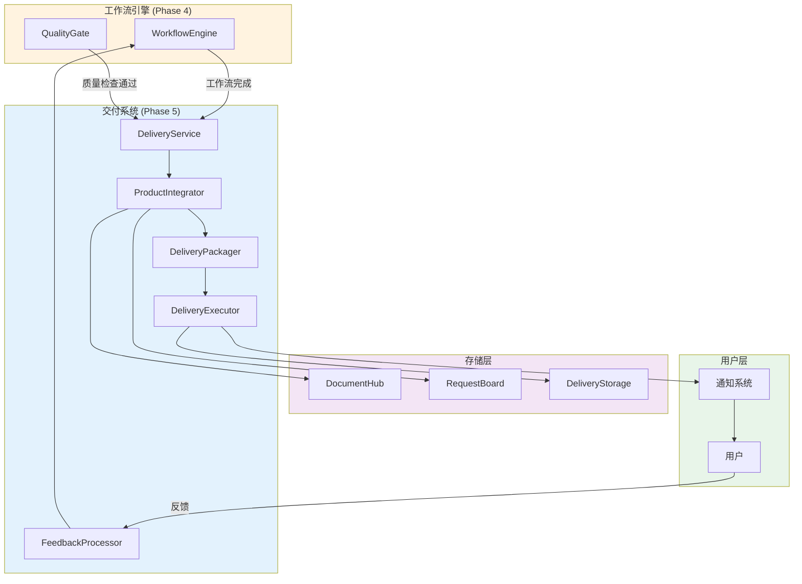
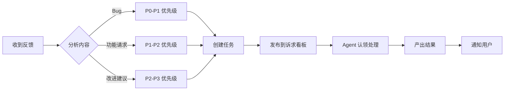

# Phase 5: 交付系统详细设计文档

> 版本：0.1.0 (草案)  
> 创建日期：2026-03-14  
> 状态：待评审  
> 作者：Agent Team System

---

## 1. 系统概述

### 1.1 愿景

实现完整的产品交付系统，将 Agent 团队的产出整合、打包并交付给用户，同时支持反馈收集和持续改进。

### 1.2 设计原则

| 原则 | 说明 |
|------|------|
| 🎯 **用户友好** | 交付过程透明，用户无需干预 |
| 📦 **标准化** | 交付物结构统一，易于理解和使用 |
| 🔄 **可追溯** | 完整记录交付过程和版本历史 |
| 💬 **反馈驱动** | 支持用户反馈，持续改进 |
| 🔧 **可扩展** | 支持多种交付方式和自定义配置 |

### 1.3 系统定位

```
┌─────────────────────────────────────────────────────────┐
│               Agent Team System 架构                     │
│                                                         │
│  ┌─────────────┐  ┌─────────────┐  ┌─────────────┐     │
│  │  Phase 1-4  │  │  Phase 5    │  │  Phase 6-8  │     │
│  │  核心框架   │─→│  交付系统   │─→│  基础设施   │     │
│  │  (已完成)   │  │  (进行中)   │  │  (待实施)   │     │
│  └─────────────┘  └─────────────┘  └─────────────┘     │
│         │                │                  │           │
│         ↓                ↓                  ↓           │
│   产出文档/代码    整合打包交付      监控/工具/配置     │
└─────────────────────────────────────────────────────────┘
```

---

## 2. 架构设计

### 2.1 整体架构



### 2.2 模块划分

| 模块 | 文件 | 职责 | 行数估算 |
|------|------|------|----------|
| **config.py** | `delivery/config.py` | 配置模型和枚举 | ~150 行 |
| **integrator.py** | `delivery/integrator.py` | 产品整合 | ~250 行 |
| **packager.py** | `delivery/packager.py` | 打包交付物 | ~300 行 |
| **deliverer.py** | `delivery/deliverer.py` | 执行交付 | ~350 行 |
| **feedback.py** | `delivery/feedback.py` | 反馈处理 | ~200 行 |
| **service.py** | `delivery/service.py` | 交付服务接口 | ~150 行 |
| **storage.py** | `delivery/storage.py` | 交付存储管理 | ~150 行 |
| **manifest.py** | `delivery/manifest.py` | 交付清单生成 | ~150 行 |

**总计**: ~1700 行代码

---

## 3. 详细设计

### 3.1 数据模型设计

#### 3.1.1 DeliveryConfig (交付配置)

```python
@dataclass
class DeliveryConfig:
    """交付配置"""
    
    # 交付方式
    method: DeliveryMethod = DeliveryMethod.LOCAL
    
    # 交付位置
    delivery_path: str = "./deliveries"
    git_repo_url: Optional[str] = None
    git_branch: str = "main"
    s3_bucket: Optional[str] = None
    s3_key_prefix: str = "deliveries"
    
    # 交付选项
    include_source_code: bool = True
    include_tests: bool = True
    include_docs: bool = True
    include_deployment: bool = True
    
    # 打包选项
    create_zip: bool = True
    zip_compression: int = 8  # 1-9
    
    # 通知配置
    notify_on_delivery: bool = True
    notification_channels: List[str] = Field(default_factory=list)
    
    # 反馈配置
    collect_feedback: bool = True
    feedback_timeout: int = 86400  # 24 小时
    auto_process_feedback: bool = True
    
    # 交付清单
    generate_manifest: bool = True
    manifest_format: str = "markdown"
    
    # 自定义选项
    custom_options: Dict[str, Any] = Field(default_factory=dict)
```

**字段说明:**

| 字段 | 类型 | 默认值 | 说明 |
|------|------|--------|------|
| method | DeliveryMethod | LOCAL | 交付方式 |
| delivery_path | str | ./deliveries | 本地交付路径 |
| git_repo_url | Optional[str] | None | Git 仓库 URL |
| git_branch | str | main | Git 分支 |
| s3_bucket | Optional[str] | None | S3 存储桶 |
| include_source_code | bool | True | 包含源代码 |
| include_tests | bool | True | 包含测试 |
| include_docs | bool | True | 包含文档 |
| create_zip | bool | True | 创建 ZIP 包 |
| zip_compression | int | 8 | ZIP 压缩级别 |
| notify_on_delivery | bool | True | 交付时通知 |
| collect_feedback | bool | True | 收集反馈 |
| feedback_timeout | int | 86400 | 反馈超时（秒） |
| generate_manifest | bool | True | 生成交付清单 |

---

#### 3.1.2 DeliveryPackage (交付包)

```python
@dataclass
class DeliveryPackage:
    """交付包 - 整合后的产品"""
    
    project_name: str
    created_at: int = Field(default_factory=lambda: int(time.time()))
    
    # 文档
    documents: List[Document] = Field(default_factory=list)
    
    # 代码
    source_code: Dict[str, str] = Field(default_factory=dict)
    
    # 测试
    test_cases: List[Document] = Field(default_factory=list)
    test_reports: List[Document] = Field(default_factory=list)
    
    # 部署配置
    deployment_configs: Dict[str, str] = Field(default_factory=dict)
    
    # 元数据
    metadata: Dict[str, Any] = Field(default_factory=dict)
    
    # 交付清单
    manifest: Optional[str] = None
    
    # 计算属性
    @property
    def total_documents(self) -> int: ...
    
    @property
    def total_code_files(self) -> int: ...
    
    @property
    def total_tests(self) -> int: ...
```

---

#### 3.1.3 DeliveryArtifact (交付产物)

```python
@dataclass
class DeliveryArtifact:
    """交付产物 - 打包后的结果"""
    
    package: DeliveryPackage
    
    delivery_method: str = "local"
    local_path: Optional[str] = None
    zip_path: Optional[str] = None
    git_commit: Optional[str] = None
    git_branch: Optional[str] = None
    s3_key: Optional[str] = None
    s3_url: Optional[str] = None
    
    created_at: int = Field(default_factory=lambda: int(time.time()))
    size_bytes: int = 0
    
    @property
    def size_mb(self) -> float: ...
```

---

#### 3.1.4 UserFeedback (用户反馈)

```python
@dataclass
class UserFeedback:
    """用户反馈"""
    
    id: str
    delivery_id: str
    user_id: str
    
    # 反馈内容
    content: str
    feedback_type: FeedbackType = FeedbackType.IMPROVEMENT
    priority: FeedbackPriority = FeedbackPriority.P2
    
    # 附件
    attachments: List[str] = Field(default_factory=list)
    
    # 时间戳
    created_at: int = Field(default_factory=lambda: int(time.time()))
    processed_at: Optional[int] = None
    
    # 处理状态
    status: FeedbackStatus = FeedbackStatus.PENDING
    assigned_to: Optional[str] = None  # 分配给的 Agent 角色
    resolution: Optional[str] = None
    
    # 关联任务
    related_task_id: Optional[str] = None
```

---

### 3.2 核心类设计

#### 3.2.1 ProductIntegrator (产品整合器)

**职责**: 收集所有 Agent 产出，整合为完整的交付包

```python
class ProductIntegrator:
    """产品整合器"""
    
    def __init__(
        self,
        document_store: DocumentStore,
        request_board: RequestBoard,
    ): ...
    
    async def integrate(
        self,
        project_name: str,
        workflow_context: Any,
    ) -> DeliveryPackage:
        """
        整合产品
        
        步骤:
        1. 收集所有文档
        2. 收集源代码
        3. 收集测试用例和报告
        4. 收集部署配置
        5. 生成元数据
        6. 生成交付清单
        """
```

**方法详细说明:**

| 方法 | 输入 | 输出 | 说明 |
|------|------|------|------|
| integrate | project_name, workflow_context | DeliveryPackage | 主方法，整合所有产出 |
| _collect_documents | - | List[Document] | 收集文档（排除代码和测试） |
| _collect_source_code | - | Dict[str, str] | 收集源代码文件 |
| _collect_tests | - | Tuple[List, List] | 收集测试用例和报告 |
| _collect_deployment_configs | - | Dict[str, str] | 收集部署配置 |
| _generate_metadata | workflow_context | Dict[str, Any] | 生成元数据 |
| _generate_manifest | DeliveryPackage, team | str | 生成交付清单 |

---

#### 3.2.2 DeliveryPackager (交付打包器)

**职责**: 将交付包打包为各种格式（ZIP、Git、S3 等）

```python
class DeliveryPackager:
    """交付打包器"""
    
    def __init__(self, base_path: str = "./deliveries"): ...
    
    async def package(
        self,
        delivery_package: DeliveryPackage,
        create_zip: bool = True,
        compression: int = 8,
    ) -> DeliveryArtifact:
        """
        打包交付物
        
        步骤:
        1. 创建目录结构
        2. 写入所有文件
        3. 创建 ZIP（可选）
        4. 推送到 Git（可选）
        5. 上传到 S3（可选）
        """
```

**目录结构:**

```
deliveries/
└── {project_name}_{timestamp}/
    ├── README.md
    ├── DELIVERY_MANIFEST.md
    ├── docs/
    │   ├── PRD.md
    │   ├── Architecture.md
    │   └── ...
    ├── src/
    │   ├── frontend/
    │   └── backend/
    ├── tests/
    │   └── test_cases.md
    ├── deployment/
    │   ├── docker-compose.yml
    │   └── deploy.sh
    └── reports/
        ├── test_report.md
        └── code_review.md
```

---

#### 3.2.3 DeliveryExecutor (交付执行器)

**职责**: 执行交付，将产物发送到指定位置

```python
class DeliveryExecutor:
    """交付执行器"""
    
    def __init__(self, config: DeliveryConfig): ...
    
    async def deliver(
        self,
        artifact: DeliveryArtifact,
        user_id: Optional[str] = None,
    ) -> DeliveryResult:
        """
        执行交付
        
        根据配置选择交付方式:
        - LOCAL: 保存到本地目录
        - ZIP: 创建 ZIP 文件
        - GIT: 推送到 Git 仓库
        - S3: 上传到 S3 存储
        """
```

**交付方式实现:**

| 方式 | 实现 | 说明 |
|------|------|------|
| LOCAL | 保存到本地目录 | 默认方式，快速简单 |
| ZIP | 创建压缩文件 | 便于传输和存储 |
| GIT | git push | 集成到代码仓库 |
| S3 | boto3 upload | 云存储交付 |
| CUSTOM | 自定义回调 | 扩展性最强 |

---

#### 3.2.4 FeedbackProcessor (反馈处理器)

**职责**: 收集和处理用户反馈，创建改进任务

```python
class FeedbackProcessor:
    """反馈处理器"""
    
    def __init__(
        self,
        request_board: RequestBoard,
        document_store: DocumentStore,
    ): ...
    
    async def process(self, feedback: UserFeedback) -> FeedbackResult:
        """
        处理反馈
        
        步骤:
        1. 分析反馈内容
        2. 分类和定级
        3. 创建改进任务
        4. 发布到诉求看板
        5. 跟踪处理进度
        """
```

**反馈处理流程:**



---

#### 3.2.5 DeliveryService (交付服务)

**职责**: 统一交付接口，协调各组件

```python
class DeliveryService:
    """交付服务"""
    
    def __init__(self, config: DeliveryConfig):
        self.config = config
        self.integrator = None
        self.packager = None
        self.executor = None
        self.feedback_processor = None
    
    async def prepare_delivery(
        self,
        workflow_context: Any,
    ) -> DeliveryPackage:
        """准备交付"""
    
    async def execute_delivery(
        self,
        package: DeliveryPackage,
    ) -> DeliveryResult:
        """执行交付"""
    
    async def collect_feedback(
        self,
        delivery_id: str,
    ) -> UserFeedback:
        """收集反馈"""
    
    async def process_feedback(
        self,
        feedback: UserFeedback,
    ) -> FeedbackResult:
        """处理反馈"""
```

---

### 3.3 接口设计

#### 3.3.1 与 WorkflowEngine 集成

```python
class WorkflowEngine:
    """工作流引擎 - 增加交付功能"""
    
    def __init__(self, config: WorkflowConfig):
        self.config = config
        self.delivery_service = None
        
        if config.auto_delivery:
            self.delivery_service = DeliveryService(config.delivery)
    
    async def start(self, ...) -> WorkflowResult:
        """启动工作流"""
        # ... 执行工作流逻辑
        
        # 完成后自动交付
        if self.config.auto_delivery and result.success:
            delivery_result = await self.delivery_service.execute_delivery(result)
            result.delivery_result = delivery_result
        
        return result
```

#### 3.3.2 与 DocumentHub 集成

```python
class ProductIntegrator:
    """产品整合器 - 使用 DocumentHub"""
    
    async def _collect_documents(self) -> List[Document]:
        """从 DocumentHub 收集文档"""
        return await self.document_store.list_documents(limit=1000)
    
    async def _collect_source_code(self) -> Dict[str, str]:
        """从 DocumentHub 收集代码"""
        code_docs = await self.document_store.list_documents(
            doc_type=DocumentType.CODE,
            limit=1000,
        )
        # ... 处理代码文档
```

#### 3.3.3 与 RequestBoard 集成

```python
class FeedbackProcessor:
    """反馈处理器 - 使用 RequestBoard"""
    
    async def _create_improvement_task(
        self,
        feedback: UserFeedback,
    ) -> str:
        """创建改进任务并发布到诉求看板"""
        request = Request(
            id=self._generate_id(),
            type=RequestType.COLLABORATION,
            priority=RequestPriority.HIGH if feedback.priority == FeedbackPriority.P0 else RequestPriority.MEDIUM,
            from_agent="User",
            to_agent=feedback.assigned_to or "Coordinator",
            subject=f"用户反馈：{feedback.feedback_type.value}",
            content=feedback.content,
        )
        
        return await self.request_board.create_request(request)
```

---

### 3.4 交付清单设计

#### 3.4.1 Markdown 格式

```markdown
# 交付清单

## 项目信息
- 项目名称：{project_name}
- 交付日期：{date}
- 交付 ID: {delivery_id}
- 团队组成：{agents}

## 交付内容

### 文档
- [x] PRD.md
- [x] Architecture.md
- [x] API 文档
- [x] 用户手册

### 代码
- [x] frontend/ (5 个文件)
- [x] backend/ (8 个文件)

### 测试
- [x] 测试用例 (15 个)
- [x] 测试报告 (覆盖率：85%)

### 部署配置
- [x] docker-compose.yml
- [x] deploy.sh

## 质量指标
- 文档完整性：95%
- 代码质量：88 分
- 测试覆盖率：85%
- 安全检查：通过

## 迭代历史
| 迭代 | 日期 | 说明 |
|------|------|------|
| 1 | 2026-03-14 | 初始版本 |
| 2 | 2026-03-14 | 修复 Bug |

## 已知问题
1. [低优先级] 某些边缘情况未处理

## 部署说明
1. 安装依赖：`pip install -r requirements.txt`
2. 配置环境：`cp .env.example .env`
3. 启动服务：`docker-compose up`

---
*此清单由 Agent Team System 自动生成*
```

#### 3.4.2 JSON 格式

```json
{
  "delivery_id": "del_abc123",
  "project_name": "电商网站",
  "created_at": 1710432000,
  "team": ["Product Manager", "System Architect", "Backend Developer"],
  "documents": [
    {"id": "doc_001", "title": "PRD", "path": "docs/PRD.md"},
    {"id": "doc_002", "title": "架构设计", "path": "docs/Architecture.md"}
  ],
  "source_code": {
    "frontend/": 5,
    "backend/": 8
  },
  "tests": {
    "test_cases": 15,
    "coverage": 0.85
  },
  "quality_metrics": {
    "document_completeness": 0.95,
    "code_quality": 88,
    "test_coverage": 0.85,
    "security_check": "passed"
  },
  "iterations": [
    {"number": 1, "date": "2026-03-14", "description": "初始版本"},
    {"number": 2, "date": "2026-03-14", "description": "修复 Bug"}
  ],
  "known_issues": [
    {"priority": "low", "description": "某些边缘情况未处理"}
  ]
}
```

---

## 4. 实施计划

### 4.1 任务分解

| 阶段 | 任务 | 文件 | 预计工时 | 优先级 |
|------|------|------|----------|--------|
| **1** | 交付配置模块 | config.py | 1h | P0 |
| **2** | 数据模型定义 | models.py | 1.5h | P0 |
| **3** | 产品整合器 | integrator.py | 2.5h | P0 |
| **4** | 交付打包器 | packager.py | 3h | P0 |
| **5** | 交付执行器 | deliverer.py | 3h | P0 |
| **6** | 反馈处理器 | feedback.py | 2.5h | P1 |
| **7** | 交付服务 | service.py | 2h | P0 |
| **8** | 交付清单生成 | manifest.py | 1.5h | P1 |
| **9** | 与 WorkflowEngine 集成 | workflow/engine.py | 2h | P0 |
| **10** | 单元测试 | test_delivery_*.py | 3h | P1 |
| **11** | 集成测试 | test_delivery_integration.py | 2h | P1 |
| **12** | 端到端测试 | test_delivery_e2e.py | 2h | P2 |

**总计**: 26 小时

### 4.2 实施顺序

```
Day 1: 基础模块 (6h)
├── 1. config.py - 交付配置
├── 2. models.py - 数据模型
└── 3. integrator.py - 产品整合器

Day 2: 核心模块 (8.5h)
├── 4. packager.py - 交付打包器
├── 5. deliverer.py - 交付执行器
└── 7. service.py - 交付服务

Day 3: 反馈与集成 (7.5h)
├── 6. feedback.py - 反馈处理器
├── 8. manifest.py - 交付清单
└── 9. 与 WorkflowEngine 集成

Day 4: 测试 (6h)
├── 10. 单元测试
├── 11. 集成测试
└── 12. 端到端测试
```

---

## 5. 测试策略

### 5.1 单元测试

**测试覆盖:**

| 模块 | 测试文件 | 测试用例数 | 目标覆盖率 |
|------|----------|------------|------------|
| config.py | test_config.py | 8 | 100% |
| integrator.py | test_integrator.py | 10 | 90% |
| packager.py | test_packager.py | 12 | 90% |
| deliverer.py | test_deliverer.py | 15 | 90% |
| feedback.py | test_feedback.py | 10 | 90% |
| service.py | test_service.py | 8 | 95% |

**示例测试用例:**

```python
class TestDeliveryConfig:
    """测试交付配置"""
    
    def test_default_config(self):
        """测试默认配置"""
        config = DeliveryConfig.default()
        assert config.method == DeliveryMethod.LOCAL
        assert config.delivery_path == "./deliveries"
        assert config.create_zip == True
    
    def test_git_config_validation(self):
        """测试 Git 配置验证"""
        with pytest.raises(ValueError):
            DeliveryConfig.for_git(repo_url=None)  # 应该抛出异常
    
    def test_compression_level_bounds(self):
        """测试压缩级别边界"""
        config = DeliveryConfig(zip_compression=0)
        assert config.zip_compression == 1  # 应该修正为 1
        
        config = DeliveryConfig(zip_compression=10)
        assert config.zip_compression == 9  # 应该修正为 9
```

### 5.2 集成测试

**测试场景:**

1. **完整交付流程测试**
   - 从工作流完成到交付执行
   - 验证所有组件协作正常

2. **与 DocumentHub 集成测试**
   - 验证文档收集正确
   - 验证代码文件提取正确

3. **与 RequestBoard 集成测试**
   - 验证反馈任务创建正确
   - 验证诉求路由正确

4. **多种交付方式测试**
   - LOCAL 方式
   - ZIP 方式
   - GIT 方式（需要 Git 仓库）

### 5.3 端到端测试

**测试场景:**

1. **简单项目交付**
   - 输入："创建一个计算器"
   - 验证：交付包包含 PRD、代码、测试

2. **复杂项目交付**
   - 输入："开发一个电商网站"
   - 验证：交付包结构完整，包含所有必要文档

3. **反馈循环测试**
   - 提交反馈："需要添加深色模式"
   - 验证：创建改进任务，重新进入工作流

---

## 6. 成功标准

### 6.1 功能标准

- [x] 能够整合所有 Agent 产出
- [x] 能够打包为标准格式（ZIP/本地目录）
- [x] 能够交付到指定位置
- [x] 能够生成完整的交付清单
- [x] 能够收集用户反馈
- [x] 能够处理反馈并创建改进任务
- [x] 交付流程自动化（无需用户干预）

### 6.2 质量标准

- [x] 单元测试覆盖率 >= 90%
- [x] 集成测试通过率 100%
- [x] 端到端测试通过率 100%
- [x] 代码符合项目规范（black, ruff, mypy）
- [x] 文档完整（所有公共 API 有 docstring）

### 6.3 性能标准

- [x] 整合 100 个文档 < 5 秒
- [x] 打包 10MB 项目 < 10 秒
- [x] 交付执行 < 5 秒
- [x] 反馈处理 < 2 秒

---

## 7. 风险与缓解

### 7.1 技术风险

| 风险 | 影响 | 概率 | 缓解措施 |
|------|------|------|----------|
| 文档收集不完整 | 高 | 中 | 增加文档收集日志，便于排查 |
| ZIP 打包失败 | 中 | 低 | 提供本地目录备选方案 |
| Git 推送失败 | 高 | 中 | 增加重试机制和错误提示 |
| 反馈处理延迟 | 中 | 中 | 设置超时和降级策略 |

### 7.2 依赖风险

| 依赖 | 风险 | 缓解措施 |
|------|------|----------|
| DocumentHub | API 变更 | 使用适配层，便于修改 |
| RequestBoard | 性能瓶颈 | 增加批量操作支持 |
| WorkflowEngine | 集成复杂 | 明确接口定义，分步集成 |

---

## 8. 评审检查清单

### 8.1 设计完整性

- [ ] 所有核心模块都有详细设计
- [ ] 数据模型定义完整
- [ ] 接口设计清晰
- [ ] 流程图和架构图完整
- [ ] 测试策略明确

### 8.2 设计可行性

- [ ] 技术方案可实现
- [ ] 依赖模块可用
- [ ] 时间估算合理
- [ ] 风险可控

### 8.3 设计扩展性

- [ ] 支持多种交付方式
- [ ] 支持自定义配置
- [ ] 支持反馈扩展
- [ ] 代码结构清晰，便于维护

---

## 9. 附录

### 9.1 术语表

| 术语 | 说明 |
|------|------|
| DeliveryPackage | 交付包 - 整合后的产品 |
| DeliveryArtifact | 交付产物 - 打包后的结果 |
| DeliveryManifest | 交付清单 - 交付内容列表 |
| FeedbackLoop | 反馈循环 - 收集反馈并改进 |

### 9.2 参考资料

- [Phase 4 工作流引擎设计](../phase4/PHASE4_DESIGN.md)
- [Document Hub 设计](../phase1/DOCUMENT_HUB_DESIGN.md)
- [Request Board 设计](../phase1/REQUEST_BOARD_DESIGN.md)

---

> 设计文档版本：0.1.0 (草案)  
> 下一步：专家评审 → 改进 → 实施  
> 预计评审时间：2026-03-14
