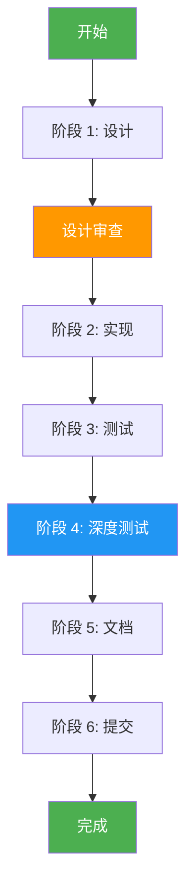

# Agent 开发技能：完整模块开发流程

> Agent Skill: Full-Stack Module Development
>
> 技能 ID: `module-development-sop`
> 版本：1.0.0
> 创建日期：2026-03-14
> 适用 Agent：开发者 Agent、架构师 Agent、测试 Agent

---

## 技能概述

本技能记录完整的模块开发流程，基于 Phase 3 团队组建模块的实际开发经验总结而成。适用于任何新模块的开发。

### 核心能力

```
┌─────────────────────────────────────────────────────────┐
│              Agent 开发技能矩阵                          │
├─────────────────────────────────────────────────────────┤
│                                                         │
│  ✅ 需求分析     - 理解 Phase 目标，识别核心功能          │
│  ✅ 系统设计     - 创建架构图，设计数据模型              │
│  ✅ 代码实现     - 编写高质量代码，遵循最佳实践          │
│  ✅ 测试驱动     - 编写单元/集成/深度测试                │
│  ✅ 文档编写     - 设计文档、API 文档、使用示例           │
│  ✅ 代码审查     - 自我审查，确保质量                    │
│  ✅ 版本控制     - Git 提交，进度追踪                     │
│                                                         │
└─────────────────────────────────────────────────────────┘
```

### 使用场景

- 新模块开发
- 功能迭代
- 代码重构
- 质量提升

---

## 工作流程

### 阶段概览

```
设计 → 实现 → 测试 → 深度测试 → 文档 → 提交
 20%    30%     20%      15%      10%    5%
```

### 详细流程



---

## 阶段 1: 设计 (20%)

### 输入

- TODO.md 中的 Phase 描述
- 现有代码库
- 相关设计文档

### 活动

#### 1. 需求分析

```python
# 分析步骤
1. 阅读 TODO.md 中的 Phase 描述
2. 识别关键功能点
3. 确定模块边界
4. 评估工作量
```

**输出**: 需求分析笔记

#### 2. 架构设计

```python
# 创建架构图
# 使用 Mermaid 语法
graph TB
    subgraph NewModule[新模块]
        A[组件 A]
        B[组件 B]
    end
    
    subgraph Existing[现有系统]
        C[现有组件]
    end
    
    A --> C
    B --> C
```

**输出**: 系统架构图

#### 3. 数据模型设计

```python
# 定义数据模型
from enum import Enum
from pydantic import BaseModel
from dataclasses import dataclass

class TaskType(Enum):
    """任务类型"""
    TYPE_A = "type_a"

class TaskAnalysis(BaseModel):
    """任务分析"""
    field1: str
    field2: int

@dataclass
class Config:
    """配置"""
    param1: int = 10
```

**输出**: 数据模型定义

#### 4. 接口设计

```python
# 定义公共接口
class CoreClass:
    """核心类"""
    
    async def main_method(
        self,
        input: Any,
    ) -> Any:
        """主要方法"""
        pass
```

**输出**: 接口定义

### 输出物

- [ ] 设计文档 (`docs/phaseX/PHASEX_DESIGN.md`)
- [ ] 架构图 (Mermaid)
- [ ] 数据模型定义
- [ ] 接口定义

### 质量标准

- ✅ 设计文档 >= 1000 行
- ✅ 至少 3 个 Mermaid 流程图
- ✅ 所有模型有文档字符串
- ✅ 所有接口有类型注解

---

## 阶段 2: 实现 (30%)

### 输入

- 设计文档
- 现有代码库

### 活动

#### 1. 创建模块结构

```bash
# 创建目录结构
mkdir -p src/module_name/
touch src/module_name/__init__.py
touch src/module_name/config.py
touch src/module_name/core.py
```

#### 2. 实现数据模型

```python
# src/module_name/config.py

from enum import Enum
from pydantic import BaseModel

class TaskType(Enum):
    """任务类型枚举"""
    TYPE_A = "type_a"
    TYPE_B = "type_b"

class TaskAnalysis(BaseModel):
    """任务分析模型"""
    raw_description: str
    task_type: TaskType
    confidence: float = 0.0
```

#### 3. 实现核心逻辑

```python
# src/module_name/core.py

from typing import List, Optional

class CoreClass:
    """核心业务逻辑类"""
    
    def __init__(self, config: 'Config'):
        """初始化"""
        self.config = config
        self._cache = {}
    
    async def process(
        self,
        input_data: str,
    ) -> 'Result':
        """
        处理输入数据
        
        Args:
            input_data: 输入字符串
            
        Returns:
            Result: 处理结果
            
        Raises:
            ValueError: 输入为空
        """
        if not input_data:
            raise ValueError("输入不能为空")
        
        # 实现逻辑
        result = await self._process_impl(input_data)
        return result
```

#### 4. 集成现有模块

```python
# 使用现有模块
from document_hub import DocumentStore
from request_board import RequestBoard
from agent.registry import AgentRegistry

class IntegratedClass:
    """集成类"""
    
    def __init__(self):
        self.store = DocumentStore()
        self.board = RequestBoard()
        self.registry = AgentRegistry()
```

### 输出物

- [ ] 模块代码 (`src/module_name/`)
- [ ] `__init__.py` 导出
- [ ] 类型注解完整
- [ ] 文档字符串完整

### 质量标准

- ✅ 代码符合 PEP 8
- ✅ 所有公共方法有文档字符串
- ✅ 所有函数有类型注解
- ✅ 无 LSP 错误

---

## 阶段 3: 测试 (20%)

### 输入

- 模块代码
- 设计文档

### 活动

#### 1. 编写单元测试

```python
# tests/test_module_name.py

import pytest
from module_name import CoreClass, Config

class TestCoreClass:
    """测试核心类"""
    
    def test_initialization(self):
        """测试初始化"""
        config = Config()
        obj = CoreClass(config)
        assert obj is not None
    
    @pytest.mark.asyncio
    async def test_process_valid_input(self):
        """测试有效输入"""
        config = Config()
        obj = CoreClass(config)
        result = await obj.process("valid input")
        assert result is not None
        assert result.success == True
    
    @pytest.mark.asyncio
    async def test_process_empty_input(self):
        """测试空输入"""
        config = Config()
        obj = CoreClass(config)
        
        with pytest.raises(ValueError, match="输入不能为空"):
            await obj.process("")
```

#### 2. 编写集成测试

```python
# tests/test_module_integration.py

import pytest
from module_name import ModuleA, ModuleB

class TestIntegration:
    """集成测试"""
    
    @pytest.mark.asyncio
    async def test_module_a_and_b(self):
        """测试模块 A 和 B 集成"""
        a = ModuleA()
        b = ModuleB()
        
        result = await a.process(b.input())
        assert result is not None
```

#### 3. 运行测试

```bash
# 运行单元测试
pytest tests/test_module_name.py -v

# 运行所有测试
pytest tests/ -v --tb=short

# 查看覆盖率
pytest tests/ --cov=src --cov-report=term-missing
```

### 输出物

- [ ] 单元测试文件
- [ ] 集成测试文件
- [ ] 测试报告
- [ ] 覆盖率报告

### 质量标准

- ✅ 所有测试通过 (100%)
- ✅ 测试覆盖率 >= 80%
- ✅ 无警告信息
- ✅ 执行时间 < 5 秒

---

## 阶段 4: 深度测试 (15%)

### 输入

- 通过的单元测试

### 活动

#### 1. 边界情况测试

```python
# tests/test_module_deep.py

import pytest
from module_name import CoreClass

class TestEdgeCases:
    """边界情况测试"""
    
    @pytest.mark.asyncio
    async def test_empty_input(self):
        """测试空输入"""
        obj = CoreClass()
        result = await obj.process('')
        assert result.success == False
    
    @pytest.mark.asyncio
    async def test_long_input(self):
        """测试超长输入"""
        obj = CoreClass()
        result = await obj.process('a' * 10000)
        assert result.success == True
    
    @pytest.mark.asyncio
    async def test_special_characters(self):
        """测试特殊字符"""
        obj = CoreClass()
        result = await obj.process('!@#$%^&*()')
        assert result.success == True
```

#### 2. 并发测试

```python
@pytest.mark.asyncio
async def test_concurrent_execution():
    """测试并发执行"""
    obj = CoreClass()
    tasks = [obj.process(f'input{i}') for i in range(10)]
    results = await asyncio.gather(*tasks)
    
    assert all(r.success for r in results)
```

#### 3. 错误处理测试

```python
@pytest.mark.asyncio
async def test_error_handling():
    """测试错误处理"""
    obj = CoreClass()
    
    with pytest.raises(ValueError, match="错误信息"):
        await obj.invalid_operation()
```

### 输出物

- [ ] 深度测试文件
- [ ] 边界情况测试报告
- [ ] 并发测试报告
- [ ] 错误处理报告

### 质量标准

- ✅ 所有深度测试通过
- ✅ 无内存泄漏
- ✅ 无资源竞争
- ✅ 错误信息清晰

---

## 阶段 5: 文档 (10%)

### 输入

- 完成的代码
- 测试报告

### 活动

#### 1. 更新 TODO.md

```markdown
## Phase X: 模块名称 ✅ 完成

**设计文档**: [链接]
**测试**: 25/25 通过 (100%)

### 功能列表
- [x] 功能 1
- [x] 功能 2
```

#### 2. 创建使用示例

```python
# examples/module_example.py

import asyncio
from module_name import CoreClass

async def main():
    """使用示例"""
    obj = CoreClass()
    result = await obj.process("input")
    print(f"结果：{result}")

asyncio.run(main())
```

#### 3. 更新 README

```markdown
## 新增功能

- **模块名称**: 功能描述
- **使用示例**: `examples/module_example.py`
```

### 输出物

- [ ] TODO.md 更新
- [ ] 使用示例
- [ ] README 更新
- [ ] API 文档

### 质量标准

- ✅ 文档与代码同步
- ✅ 示例可运行
- ✅ 无拼写错误
- ✅ 格式统一

---

## 阶段 6: 提交 (5%)

### 输入

- 完成的代码
- 测试报告
- 更新的文档

### 活动

#### 1. 代码审查

```bash
# 查看变更
git diff

# 查看统计
git diff --stat
```

**检查清单**:
- [ ] 无调试代码
- [ ] 无 TODO 注释 (除非必要)
- [ ] 无 LSP 错误
- [ ] 代码格式统一

#### 2. 提交代码

```bash
# 添加文件
git add src/module_name/
git add tests/test_module_name.py
git add docs/

# 提交
git commit -m "feat(phaseX): 实现模块名称

功能列表:
- 功能 1
- 功能 2
- 功能 3

测试：25/25 通过 (100%)
文档：设计文档 + 使用示例"

# 推送
git push origin branch_name
```

#### 3. 更新进度

```bash
# 更新 TODO.md
# 提交
git commit -m "docs: 更新 TODO.md 记录 Phase X 完成"
git push
```

### 输出物

- [ ] Git 提交
- [ ] 远程推送
- [ ] 进度更新

### 质量标准

- ✅ 提交信息清晰
- ✅ 变更原子化
- ✅ 无破坏性变更
- ✅ 所有测试通过

---

## 检查清单汇总

### 设计阶段 ☑️

- [ ] 设计文档 >= 1000 行
- [ ] 至少 3 个 Mermaid 流程图
- [ ] 数据模型定义完整
- [ ] 接口定义清晰
- [ ] 设计审查通过

### 实现阶段 ☑️

- [ ] 代码符合 PEP 8
- [ ] 类型注解完整
- [ ] 文档字符串完整
- [ ] 无 LSP 错误
- [ ] 集成现有模块正确

### 测试阶段 ☑️

- [ ] 单元测试覆盖率 >= 80%
- [ ] 所有测试通过
- [ ] 集成测试通过
- [ ] 无警告信息

### 深度测试阶段 ☑️

- [ ] 边界情况测试通过
- [ ] 并发测试通过
- [ ] 错误处理测试通过
- [ ] 性能测试通过

### 文档阶段 ☑️

- [ ] TODO.md 更新
- [ ] 使用示例可运行
- [ ] README 更新
- [ ] API 文档完整

### 提交阶段 ☑️

- [ ] 代码审查通过
- [ ] 提交信息清晰
- [ ] 远程推送成功
- [ ] 进度更新完成

---

## 常见问题解答

### Q1: 设计文档应该多详细？

**A**: 至少包含：
- 系统架构图 (Mermaid)
- 数据模型定义
- 接口定义
- 使用示例

### Q2: 测试覆盖率多少合适？

**A**:
- 最低要求：80%
- 推荐：90%+
- 核心模块：100%

### Q3: 如何处理设计变更？

**A**:
1. 更新设计文档
2. 重新审查
3. 修改代码
4. 重新测试

### Q4: 多久提交一次代码？

**A**:
- 小功能：每天至少 1 次
- 大功能：每完成一个子功能提交一次
- 避免一次性提交大量代码

---

## 最佳实践

### 代码规范

```python
# ✅ 好的做法
class CoreClass:
    """核心类，一句话描述"""
    
    def __init__(self, config: Config):
        """
        初始化
        
        Args:
            config: 配置对象
        """
        self.config = config
    
    async def process(self, input: str) -> Result:
        """
        处理输入
        
        Args:
            input: 输入字符串
            
        Returns:
            Result: 处理结果
            
        Raises:
            ValueError: 输入为空
        """
        if not input:
            raise ValueError("输入不能为空")
        return await self._process_impl(input)
```

### 测试规范

```python
# ✅ 好的测试
class TestCoreClass:
    """测试核心类"""
    
    @pytest.mark.asyncio
    async def test_process_valid_input(self):
        """测试有效输入处理"""
        # Arrange
        obj = CoreClass()
        
        # Act
        result = await obj.process("valid")
        
        # Assert
        assert result.success == True
        assert result.data is not None
```

### 提交规范

```
✅ 好的提交信息
feat(phase3): 实现团队组建模块

功能列表:
- 需求分析 (TaskAnalyzer)
- 角色映射 (RoleMapper)
- Agent 工厂 (AgentFactory)
- 团队构建器 (TeamBuilder)

测试：25/25 通过 (100%)
- 单元测试：15 个
- 深度测试：10 个

文档:
- 设计文档 (PHASE3_DESIGN.md)
- 使用示例 (team_building_example.py)
```

---

## 持续改进

### 回顾会议

每个 Phase 完成后，回答以下问题：

1. **哪些做得好？**
   - 保持并记录

2. **哪些可以改进？**
   - 制定改进计划

3. **学到了什么？**
   - 更新 SOP

### 工具改进

- [ ] 自动化测试
- [ ] 代码格式化
- [ ] 静态分析
- [ ] 持续集成

### 文档改进

- [ ] 更新 SOP
- [ ] 添加案例
- [ ] 完善检查清单

---

## 相关资源

### 设计文档

- [Phase 3 设计文档](../phase3/PHASE3_DESIGN.md)
- [Phase 3 审查报告](../phase3/PHASE3_REVIEW.md)

### 代码示例

- [团队组建示例](../examples/team_building_example.py)

### 测试文件

- [单元测试](../tests/test_phase3_team.py)
- [深度测试](../tests/test_phase3_deep.py)

---

> **技能版本**: 1.0.0  
> **最后更新**: 2026-03-14  
> **维护者**: Agent Team  
> **许可**: MIT