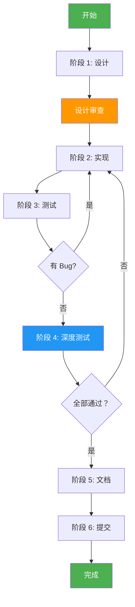
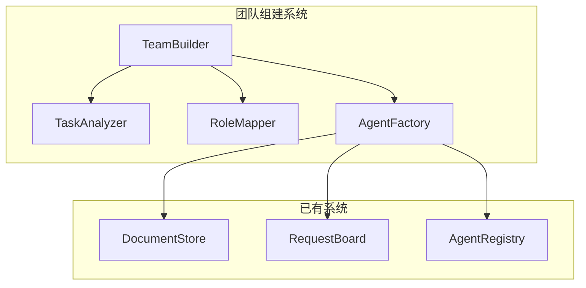

# Phase 3 团队组建模块开发 SOP

> 标准操作程序 (Standard Operating Procedure)
>
> 版本：1.0.0
> 创建日期：2026-03-14
> 适用对象：Agent 开发者、系统设计者

---

## 1. 概述

### 1.1 目标

本 SOP 记录 Phase 3 团队组建模块的完整开发流程，包括设计、实现、测试、回归全过程，为后续开发提供可复用的标准流程。

### 1.2 适用范围

- 新模块开发
- 功能迭代开发
- 代码质量保障
- 测试覆盖保证

### 1.3 核心原则

```
┌─────────────────────────────────────────────────────────┐
│              Phase 3 开发核心原则                        │
├─────────────────────────────────────────────────────────┤
│                                                         │
│  1. 设计先行 - 先设计文档，后代码实现                    │
│  2. 测试驱动 - 先写测试，后实现功能                      │
│  3. 审查保障 - 设计审查 + 代码审查                       │
│  4. 持续集成 - 小步快跑，频繁提交                        │
│  5. 文档同步 - 代码与文档同步更新                        │
│                                                         │
└─────────────────────────────────────────────────────────┘
```

---

## 2. 开发流程总览



---

## 3. 阶段 1: 设计 (Design)

### 3.1 输入

- 需求文档 (TODO.md 中的 Phase 描述)
- 现有代码库
- 相关设计文档 (Phase 1-2)

### 3.2 活动

#### 3.2.1 需求分析

```python
# 分析 TODO.md 中的 Phase 描述
# 识别关键功能点
# 确定模块边界
```

**检查清单**:
- [ ] 理解 Phase 目标
- [ ] 识别核心功能
- [ ] 确定依赖关系
- [ ] 评估工作量

#### 3.2.2 架构设计

**输出**: 系统架构图 (Mermaid)



#### 3.2.3 数据模型设计

**输出**: 数据模型定义

```python
# 定义 Enum
class TaskType(Enum):
    WEB_DEVELOPMENT = "web_development"
    # ...

# 定义 Pydantic BaseModel
class TaskAnalysis(BaseModel):
    raw_description: str
    task_type: TaskType
    # ...

# 定义 dataclass
@dataclass
class TeamConfig:
    max_team_size: int = 10
    # ...
```

#### 3.2.4 接口设计

**输出**: 模块接口定义

```python
# 定义公共接口
class TaskAnalyzer:
    async def analyze(self, task_description: str) -> TaskAnalysis:
        pass

class RoleMapper:
    def map(self, analysis: TaskAnalysis) -> List[str]:
        pass
```

### 3.3 输出

- [ ] 设计文档 (`docs/phaseX/PHASEX_DESIGN.md`)
- [ ] 架构图 (Mermaid)
- [ ] 数据模型定义
- [ ] 接口定义

### 3.4 质量标准

- 设计文档 >= 1000 行
- 至少 3 个 Mermaid 流程图
- 所有数据模型有文档字符串
- 所有接口有类型注解

---

## 4. 阶段 2: 实现 (Implement)

### 4.1 输入

- 设计文档
- 现有代码库

### 4.2 活动

#### 4.2.1 创建模块结构

```bash
# 创建模块目录
mkdir -p src/module_name/

# 创建模块文件
touch src/module_name/__init__.py
touch src/module_name/config.py
touch src/module_name/core.py
# ...
```

#### 4.2.2 实现数据模型

```python
# src/module_name/config.py

from enum import Enum
from pydantic import BaseModel
from dataclasses import dataclass

# 1. 实现 Enum
# 2. 实现 BaseModel
# 3. 实现 dataclass
```

**检查清单**:
- [ ] 所有字段有类型注解
- [ ] 所有类有文档字符串
- [ ] 默认值合理
- [ ] 符合 PEP 8 规范

#### 4.2.3 实现核心逻辑

```python
# src/module_name/core.py

class CoreClass:
    """核心类"""
    
    def __init__(self, config: Config):
        """初始化"""
        self.config = config
    
    async def main_method(self, input: Any) -> Any:
        """主要方法"""
        # 实现逻辑
        pass
```

**检查清单**:
- [ ] 遵循单一职责原则
- [ ] 方法不超过 50 行
- [ ] 有完整的错误处理
- [ ] 有日志记录点

#### 4.2.4 集成现有模块

```python
# 使用现有模块
from document_hub import DocumentStore
from request_board import RequestBoard
from agent.registry import AgentRegistry
```

**检查清单**:
- [ ] 使用正确的类名
- [ ] 遵循现有接口
- [ ] 不修改现有代码 (除非必要)

### 4.3 输出

- [ ] 模块代码 (`src/module_name/`)
- [ ] `__init__.py` 导出
- [ ] 类型注解完整
- [ ] 文档字符串完整

### 4.4 质量标准

- 代码符合 PEP 8
- 所有公共方法有文档字符串
- 所有函数有类型注解
- 无 LSP 错误

---

## 5. 阶段 3: 测试 (Test)

### 5.1 输入

- 模块代码
- 设计文档

### 5.2 活动

#### 5.2.1 编写单元测试

```python
# tests/test_module_name.py

import pytest
from module_name import CoreClass

class TestCoreClass:
    """测试核心类"""
    
    def test_basic_functionality(self):
        """测试基本功能"""
        obj = CoreClass()
        result = obj.main_method()
        assert result is not None
    
    @pytest.mark.asyncio
    async def test_async_method(self):
        """测试异步方法"""
        obj = CoreClass()
        result = await obj.async_method()
        assert result is not None
```

**检查清单**:
- [ ] 每个公共方法至少 1 个测试
- [ ] 测试覆盖率 >= 80%
- [ ] 测试命名清晰
- [ ] 使用 pytest 规范

#### 5.2.2 编写集成测试

```python
# tests/test_module_integration.py

import pytest
from module_name import ModuleA, ModuleB

class TestIntegration:
    """集成测试"""
    
    @pytest.mark.asyncio
    async def test_module_a_and_b(self):
        """测试模块 A 和 B 集成"""
        a = ModuleA()
        b = ModuleB()
        
        result = await a.process(b.input())
        assert result is not None
```

#### 5.2.3 运行测试

```bash
# 运行单元测试
pytest tests/test_module_name.py -v

# 运行所有测试
pytest tests/ -v --tb=short

# 查看覆盖率
pytest tests/ --cov=src --cov-report=term-missing
```

### 5.3 输出

- [ ] 单元测试文件
- [ ] 集成测试文件
- [ ] 测试报告
- [ ] 覆盖率报告

### 5.4 质量标准

- 所有测试通过 (100%)
- 测试覆盖率 >= 80%
- 无警告信息
- 执行时间 < 5 秒

---

## 6. 阶段 4: 深度测试 (Deep Test)

### 6.1 输入

- 通过的单元测试
- 设计文档

### 6.2 活动

#### 6.2.1 边界情况测试

```python
# tests/test_module_deep.py

class TestEdgeCases:
    """边界情况测试"""
    
    @pytest.mark.asyncio
    async def test_empty_input(self):
        """测试空输入"""
        result = await module.process('')
        assert result.success == False
    
    @pytest.mark.asyncio
    async def test_long_input(self):
        """测试超长输入"""
        result = await module.process('a' * 10000)
        assert result.success == True
    
    @pytest.mark.asyncio
    async def test_special_characters(self):
        """测试特殊字符"""
        result = await module.process('!@#$%^&*()')
        assert result.success == True
```

#### 6.2.2 并发测试

```python
@pytest.mark.asyncio
async def test_concurrent_execution():
    """测试并发执行"""
    tasks = [module.process(f'input{i}') for i in range(10)]
    results = await asyncio.gather(*tasks)
    
    assert all(r.success for r in results)
```

#### 6.2.3 错误处理测试

```python
@pytest.mark.asyncio
async def test_error_handling():
    """测试错误处理"""
    with pytest.raises(ValueError, match="错误信息"):
        await module.invalid_operation()
```

### 6.3 输出

- [ ] 深度测试文件
- [ ] 边界情况测试报告
- [ ] 并发测试报告
- [ ] 错误处理报告

### 6.4 质量标准

- 所有深度测试通过
- 无内存泄漏
- 无资源竞争
- 错误信息清晰

---

## 7. 阶段 5: 文档 (Document)

### 7.1 输入

- 完成的代码
- 测试报告

### 7.2 活动

#### 7.2.1 更新 TODO.md

```markdown
## Phase X: 模块名称 ✅ 完成

**设计文档**: [PHASEX_DESIGN.md](./phaseX/PHASEX_DESIGN.md)
**测试**: 25/25 通过 (100%)

### 功能列表
- [x] 功能 1
- [x] 功能 2
```

#### 7.2.2 创建使用示例

```python
# examples/module_example.py

import asyncio
from module_name import CoreClass

async def main():
    obj = CoreClass()
    result = await obj.process("input")
    print(result)

asyncio.run(main())
```

#### 7.2.3 更新 README

```markdown
## 新增功能

- 模块名称：功能描述
- 使用示例：examples/module_example.py
```

### 7.3 输出

- [ ] TODO.md 更新
- [ ] 使用示例
- [ ] README 更新
- [ ] API 文档

### 7.4 质量标准

- 文档与代码同步
- 示例可运行
- 无拼写错误
- 格式统一

---

## 8. 阶段 6: 提交 (Commit)

### 8.1 输入

- 完成的代码
- 测试报告
- 更新的文档

### 8.2 活动

#### 8.2.1 代码审查

```bash
# 查看变更
git diff

# 查看统计
git diff --stat
```

**检查清单**:
- [ ] 无调试代码
- [ ] 无 TODO 注释 (除非必要)
- [ ] 无 LSP 错误
- [ ] 代码格式统一

#### 8.2.2 提交代码

```bash
# 添加文件
git add src/module_name/
git add tests/test_module_name.py
git add docs/

# 提交
git commit -m "feat(phaseX): 实现模块名称

功能列表:
- 功能 1
- 功能 2
- 功能 3

测试: 25/25 通过 (100%)
文档: 设计文档 + 使用示例"

# 推送
git push origin branch_name
```

#### 8.2.3 更新进度

```bash
# 更新 TODO.md
# 提交
git commit -m "docs: 更新 TODO.md 记录 Phase X 完成"
git push
```

### 8.3 输出

- [ ] Git 提交
- [ ] 远程推送
- [ ] 进度更新

### 8.4 质量标准

- 提交信息清晰
- 变更原子化
- 无破坏性变更
- 所有测试通过

---

## 9. 检查清单汇总

### 9.1 设计阶段

- [ ] 设计文档 >= 1000 行
- [ ] 至少 3 个 Mermaid 流程图
- [ ] 数据模型定义完整
- [ ] 接口定义清晰
- [ ] 设计审查通过

### 9.2 实现阶段

- [ ] 代码符合 PEP 8
- [ ] 类型注解完整
- [ ] 文档字符串完整
- [ ] 无 LSP 错误
- [ ] 集成现有模块正确

### 9.3 测试阶段

- [ ] 单元测试覆盖率 >= 80%
- [ ] 所有测试通过
- [ ] 集成测试通过
- [ ] 无警告信息

### 9.4 深度测试阶段

- [ ] 边界情况测试通过
- [ ] 并发测试通过
- [ ] 错误处理测试通过
- [ ] 性能测试通过

### 9.5 文档阶段

- [ ] TODO.md 更新
- [ ] 使用示例可运行
- [ ] README 更新
- [ ] API 文档完整

### 9.6 提交阶段

- [ ] 代码审查通过
- [ ] 提交信息清晰
- [ ] 远程推送成功
- [ ] 进度更新完成

---

## 10. 常见问题

### Q1: 设计文档应该多详细？

**A**: 至少包含：
- 系统架构图
- 数据模型定义
- 接口定义
- 使用示例

### Q2: 测试覆盖率多少合适？

**A**: 
- 最低要求：80%
- 推荐：90%+
- 核心模块：100%

### Q3: 如何处理设计变更？

**A**:
1. 更新设计文档
2. 重新审查
3. 修改代码
4. 重新测试

### Q4: 多久提交一次代码？

**A**:
- 小功能：每天至少 1 次
- 大功能：每完成一个子功能提交一次
- 避免一次性提交大量代码

---

## 11. 持续改进

### 11.1 流程改进

每次 Phase 完成后，回顾并记录：
- 哪些做得好
- 哪些可以改进
- 新的最佳实践

### 11.2 工具改进

- 自动化测试
- 代码格式化工具
- 静态分析工具
- 持续集成

### 11.3 文档改进

- 更新 SOP
- 添加新案例
- 完善检查清单

---

> 版本：1.0.0
> 最后更新：2026-03-14
> 维护者：Agent Team