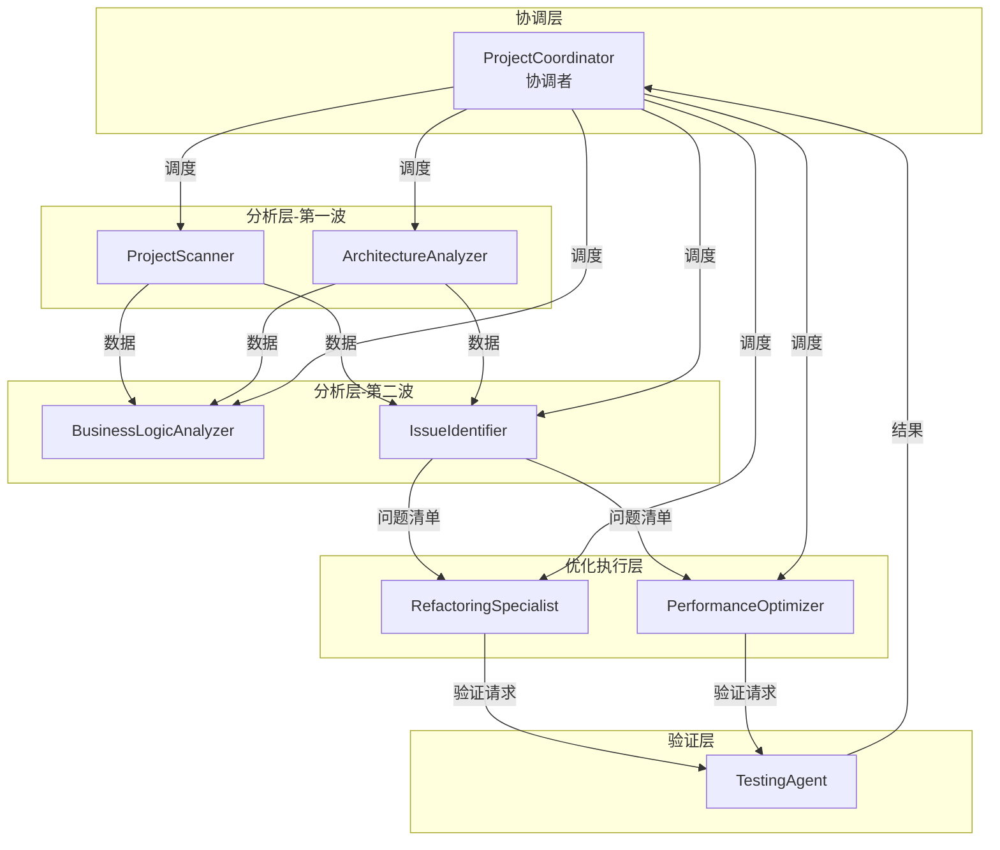

# 项目优化 Agent Pool 索引

> **版本**: v2.0  
> **创建日期**: 2025-01  
> **架构**: 1 协调者 + 4 分析Agent + 2 优化Agent + 1 验证Agent = **8 Agent**

---

## 📋 Agent 列表

| Agent | 文件 | 层级 | 核心职责 |
|-------|------|------|----------|
| **ProjectCoordinator** | [project-coordinator.md](./project-coordinator.md) | 协调 | 流程统筹、任务调度、状态管理 |
| **ProjectScanner** | [project-scanner.md](./project-scanner.md) | 分析 | 代码统计、Git分析、热点识别 |
| **ArchitectureAnalyzer** | [architecture-analyzer.md](./architecture-analyzer.md) | 分析 | 依赖分析、配置解析、分层分析 |
| **BusinessLogicAnalyzer** | [business-logic-analyzer.md](./business-logic-analyzer.md) | 分析 | 调用链追踪、领域建模、状态机分析 |
| **IssueIdentifier** | [issue-identifier.md](./issue-identifier.md) | 分析 | 问题识别、质量检查、安全扫描 |
| **RefactoringSpecialist** | [refactoring-specialist.md](./refactoring-specialist.md) | 优化执行 | 重构设计、代码实现、版本控制 |
| **PerformanceOptimizer** | [performance-optimizer.md](./performance-optimizer.md) | 优化执行 | 性能分析、优化实现、基准测试 |
| **TestingAgent** | [testing-agent.md](./testing-agent.md) | 验证 | 测试执行、回归验证、覆盖分析 |

---

## 🔄 协作流程



---

## 📊 并行策略

### 分析阶段
```
第一波 (并行): ProjectScanner ║ ArchitectureAnalyzer
                    ↓
第二波 (并行): BusinessLogicAnalyzer ║ IssueIdentifier
```

### 优化阶段
```
并行: RefactoringSpecialist ║ PerformanceOptimizer
```

---

## 🚦 人工审核门禁

| 门禁点 | 位置 | 审核内容 |
|--------|------|----------|
| **Review #1** | 分析完成后 | 分析结果、问题清单、优化策略 |
| **Review #2** | 优化方案后 | 重构方案、性能方案、风险评估 |
| **Review #3** | 执行完成后 | 代码变更、测试结果、性能对比 |

---

## 📁 知识库结构

```
./project/knowledge_base/
├── project_state.json          # 全局状态 (Coordinator维护)
├── analysis_results/           # 分析结果
│   ├── project_overview.json   # ← ProjectScanner
│   ├── architecture_analysis.json  # ← ArchitectureAnalyzer
│   ├── business_logic.json     # ← BusinessLogicAnalyzer
│   └── issue_list.json         # ← IssueIdentifier
├── optimization_plans/         # 优化方案
│   ├── refactoring_plan.json   # ← RefactoringSpecialist
│   └── performance_plan.json   # ← PerformanceOptimizer
├── execution_logs/             # 执行日志
│   ├── refactoring_execution.json  # ← RefactoringSpecialist
│   ├── performance_execution.json  # ← PerformanceOptimizer
│   └── test_report.json        # ← TestingAgent
└── human_reviews/              # 人工审核记录
    └── ...
```

---

## 🎨 Agent 颜色编码

| Agent | 颜色 | 说明 |
|-------|------|------|
| ProjectCoordinator | 🔵 #1565C0 | 蓝色 - 协调控制 |
| ProjectScanner | 🟢 #43A047 | 绿色 - 扫描探索 |
| ArchitectureAnalyzer | 🟣 #7B1FA2 | 紫色 - 架构分析 |
| BusinessLogicAnalyzer | 🟠 #F57C00 | 橙色 - 业务逻辑 |
| IssueIdentifier | 🔴 #D32F2F | 红色 - 问题警示 |
| RefactoringSpecialist | 🔵 #0097A7 | 青色 - 重构改进 |
| PerformanceOptimizer | 🟠 #FF5722 | 深橙 - 性能优化 |
| TestingAgent | 🟢 #4CAF50 | 浅绿 - 测试验证 |

---

## 📝 使用说明

### 1. 启动完整优化流程
```
调用 @project-coordinator，提供项目路径和优化目标
```

### 2. 单独使用某个Agent
```
调用 @agent-name，提供具体任务描述
```

### 3. 查看当前状态
```
查看 ./project/knowledge_base/project_state.json
```

---

## 🔗 相关文档

- [Agent协作框架](../../docs/AGENT_COLLABORATION_FRAMEWORK.md)
- [项目优化战术手册](../../docs/LARGE_PROJECT_ANALYSIS_AND_OPTIMIZATION_PLAYBOOK.md)
- [模板使用指南](../../docs/TEMPLATE_GUIDE.md)


针对 architecture-analyzer.md 和 business-logic-analyzer.md 的补充建议
1. 增加分析深度控制机制
- 定义分析深度级别（shallow/medium/deep）
- 首次快速扫描，标记需要深入分析的区域
- 允许用户或协调器指定特定模块进行深度分析
2. 建立双向反馈通道
- architecture-analyzer 发现的分层结构应能指导 business-logic-analyzer 的分析路径
- business-logic-analyzer 发现的业务流程可能揭示架构中遗漏的组件关系
- 两者分析结果存在矛盾时，触发交叉验证
3. 增加"待确认"清单输出
- 分析过程中遇到的不确定项、模糊点单独列出
- 标记需要人工确认或二次分析的区域
- 为下一轮迭代提供明确的分析目标
4. 定义分析完成度指标
- 模块覆盖率（已分析模块/总模块数）
- 业务流程覆盖率（已识别流程/预估流程数）
- 置信度分布统计（high/medium/low的比例）
- 让协调器能判断是否需要继续迭代
5. 支持增量分析模式
- 基于已有知识库进行增量分析，而非每次从零开始
- 标记哪些区域已分析、哪些是新增或变更的
- 降低重复分析的资源消耗
6. 增加入口点发现机制
- architecture-analyzer 识别系统入口点（Controller、API、定时任务等）
- business-logic-analyzer 从入口点出发追踪业务流程
- 确保不遗漏关键业务路径
7. 建立术语表/领域词典
- 分析过程中积累业务领域术语
- 统一命名，避免同一概念多种表述
- 帮助后续分析和人工审核理解
8. 增加分析假设记录
- 记录分析过程中做出的假设（如：推测某接口用途）
- 后续验证假设是否正确
- 假设被推翻时触发相关区域重新分析