# FAISS MCP 开发协作流程总结

## 项目概述

**目标**: 创建一个轻量级的本地 FAISS 向量知识库 MCP 服务，支持语义搜索，默认使用 sentence-transformers 在 CPU 上计算嵌入，暴露 MCP 工具用于添加、搜索和保存索引。同时提供独立的 HTTP API 服务用于查询和管理记忆内容。

**技术栈**:
- FAISS: 向量索引
- sentence-transformers: CPU 嵌入计算
- ONNX Runtime + DirectML: AMD GPU 加速
- PyTorch + CUDA: NVIDIA GPU 加速
- SQLite + FTS5: 元数据存储与全文搜索
- FastMCP: MCP 协议服务端
- FastAPI: HTTP API 服务


---

## 协作模式总结

### Agent 与用户交互模式

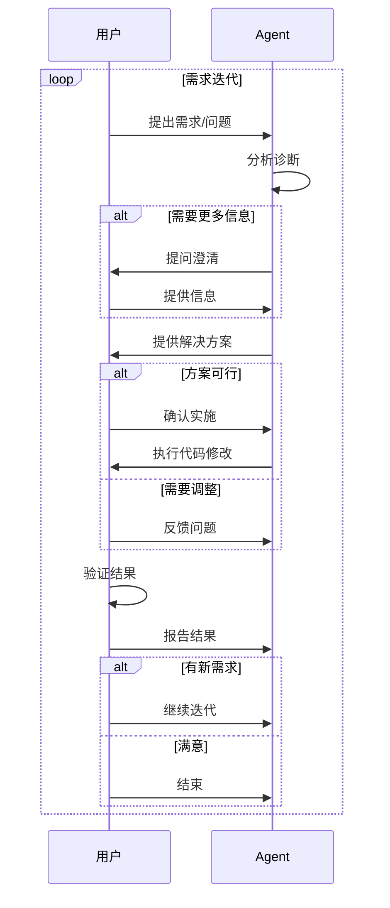

### Agent 角色定位

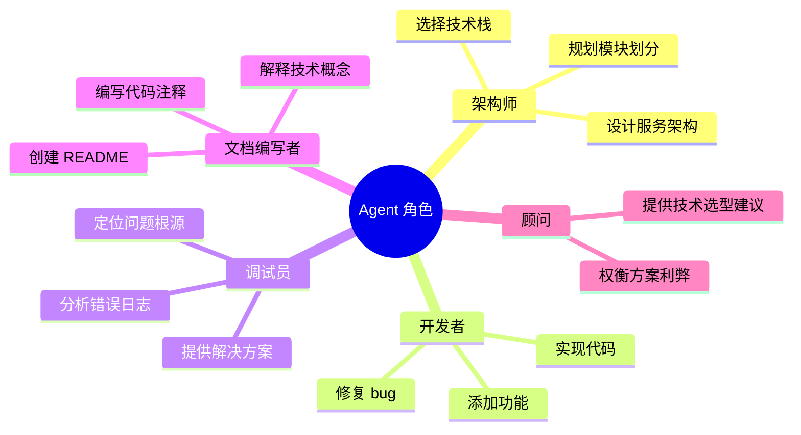

### 用户角色定位

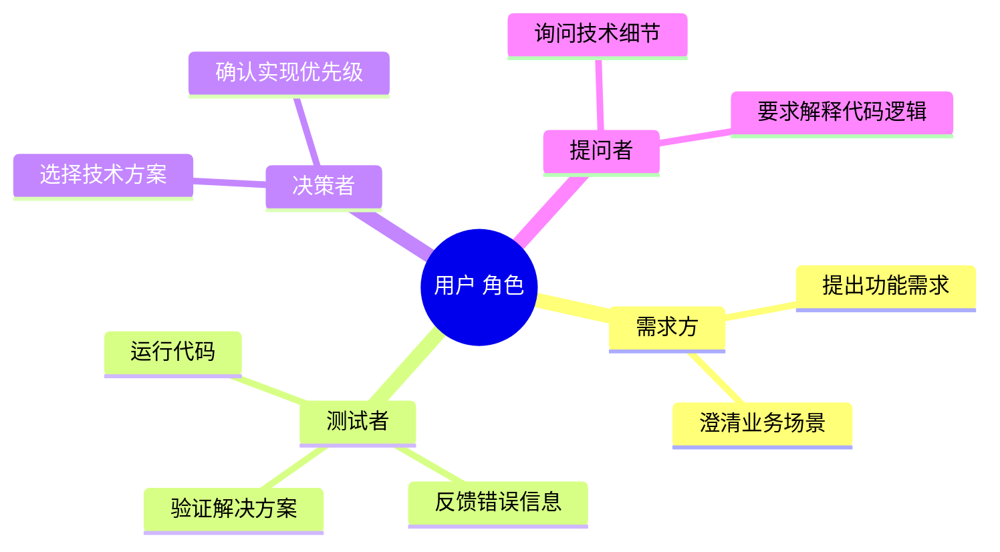

---

## 关键协作模式

### 1. 问题驱动迭代

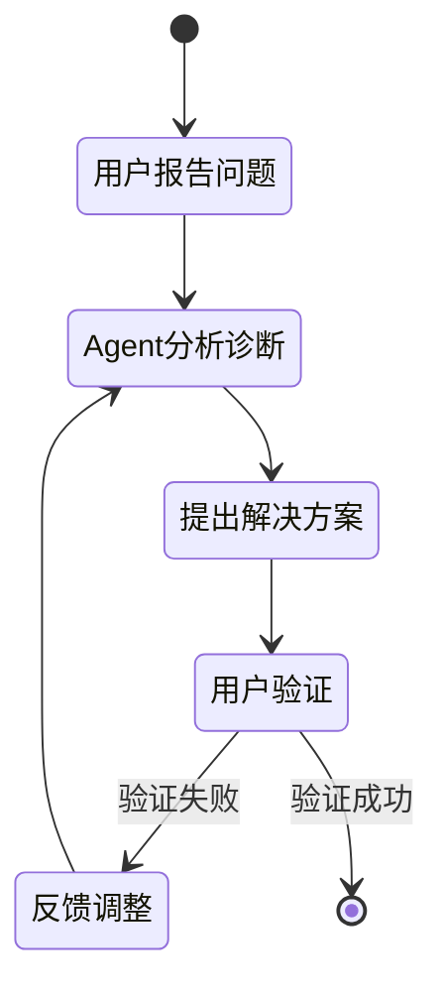

**实例**: HTTP 404 问题
- 用户: "127.0.0.1:59167 - POST /call_tool HTTP/1.1 404 Not Found"
- Agent: 创建探测工具、分析 FastMCP 路由机制、修复传输参数映射
- 结果: 成功连接

### 2. 需求渐进细化


### 3. 技术方案对比

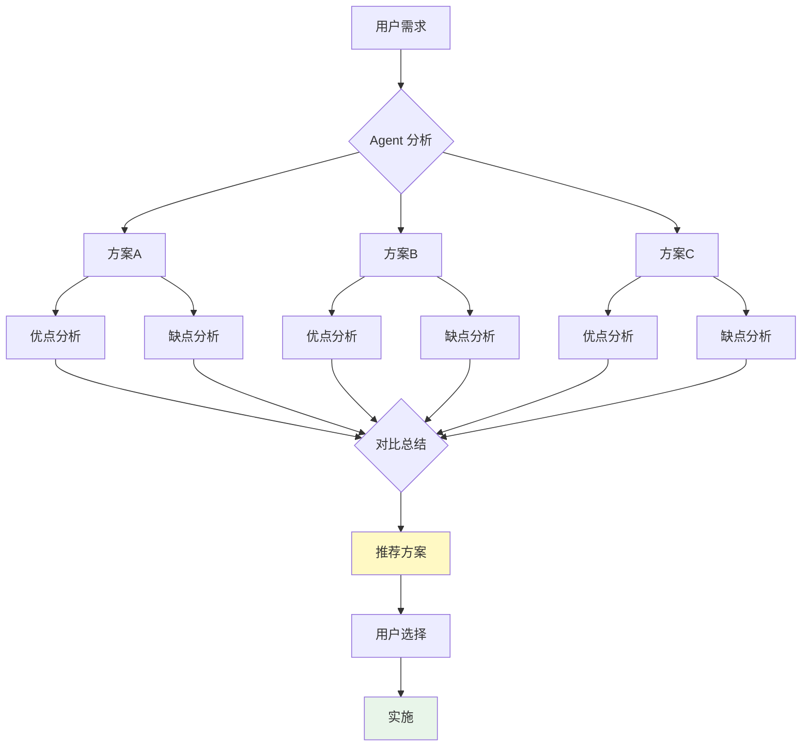

---

## 技术决策记录


| 决策点 | 选项 | 最终选择 | 理由 |
|--------|------|----------|------|
| 向量数据库 | FAISS vs Milvus vs Qdrant | FAISS | 轻量级、本地部署、CPU 友好 |
| 索引类型 | IndexFlatL2 vs IVF vs HNSW | IndexFlatL2 + IndexIDMap | 简单、适合小规模、支持 ID 映射 |
| 嵌入模型 | 默认 MiniLM vs 用户指定 | 配置文件 + 环境变量 | 灵活性、易切换 |
| 传输协议 | stdio vs SSE vs streamable-http | 全支持 | 不同场景需求 |
| GPU 加速 | torch-directml vs ONNX DirectML | ONNX DirectML (推荐) | 生产稳定、部署简单 |

---

## 系统架构

### 整体架构图

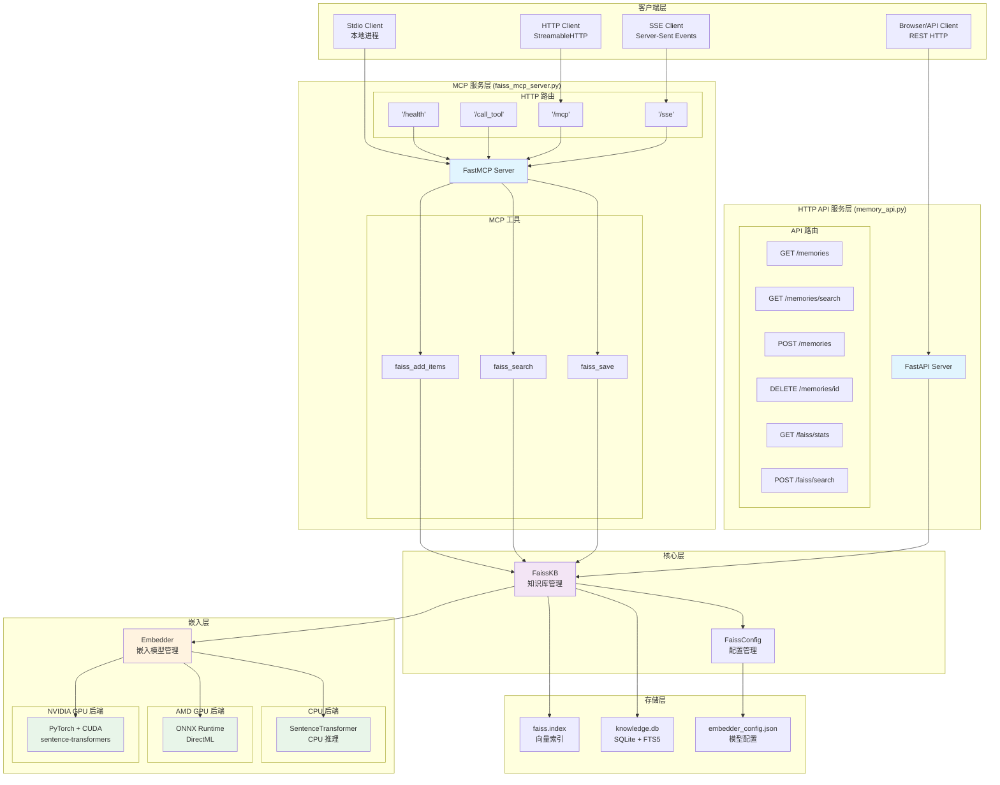

### 模块依赖关系

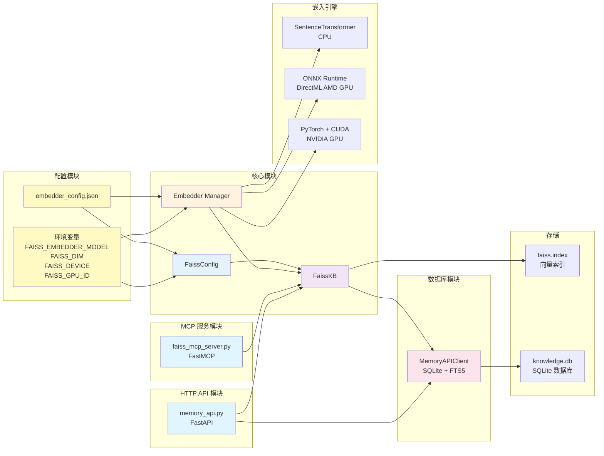

---

## 核心数据流程

### 添加文档流程

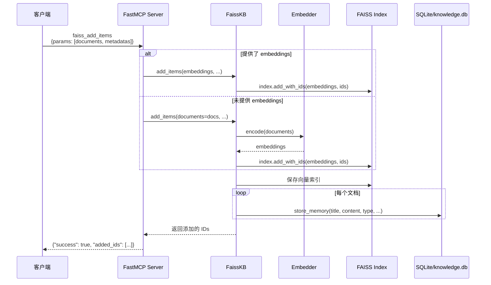

### 语义搜索流程

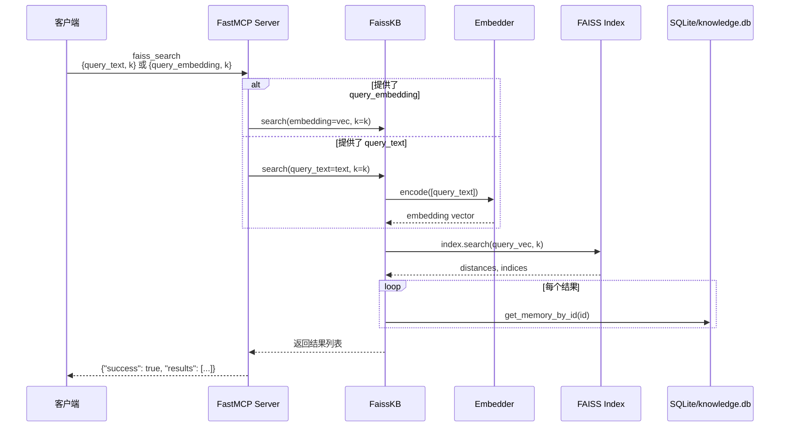

### 配置加载流程

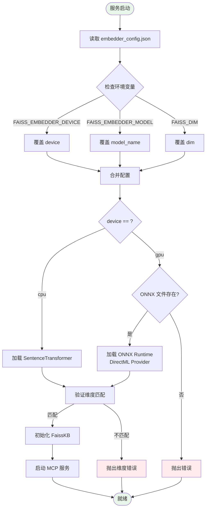

---

## 传输协议

### 三种传输模式对比

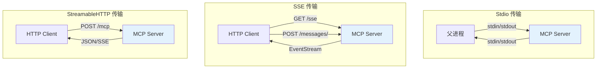

### HTTP 路由结构

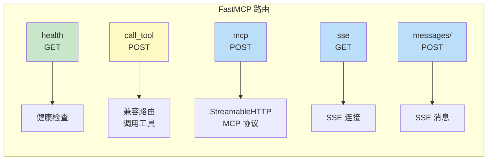

---

## 协作流程时间线

### 阶段 1: 需求澄清与架构设计

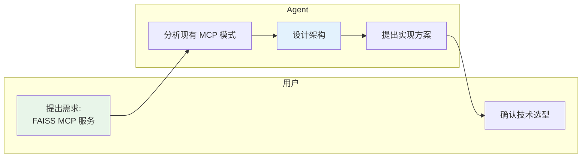

**协作成果**:
- 确定了技术栈：FAISS + sentence-transformers + FastMCP
- 确定了数据持久化方案：faiss.index + faiss_meta.json

---

### 阶段 2: 核心功能实现

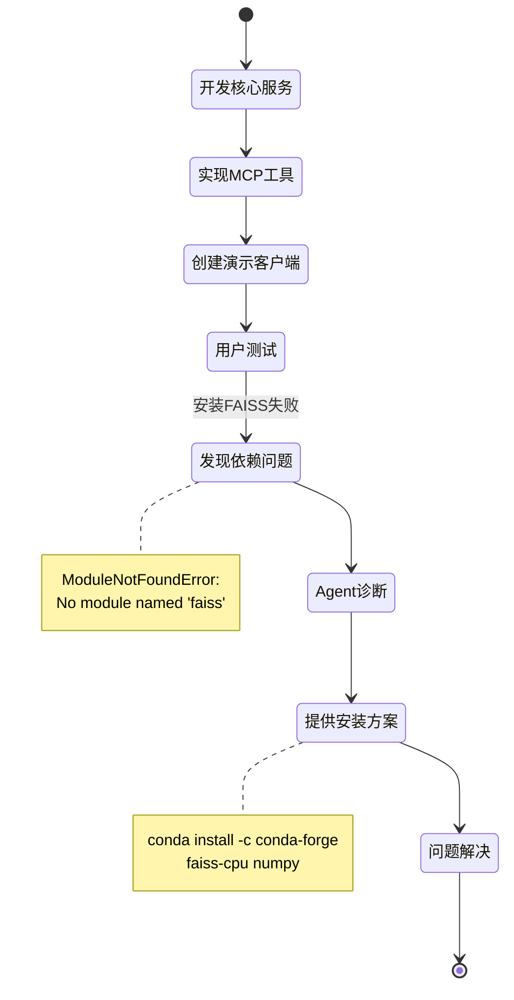

---

### 阶段 3: HTTP 传输调试

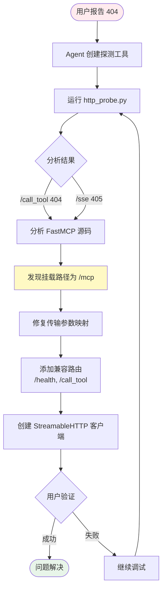

**关键发现**:
- FastMCP streamable-http 模式默认挂载路径为 `/mcp`
- 需要使用 MCP 客户端协议，而非直接 POST JSON

---

### 阶段 4: HuggingFace 缓存警告处理

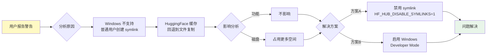

---

### 阶段 5: 模型配置外部化

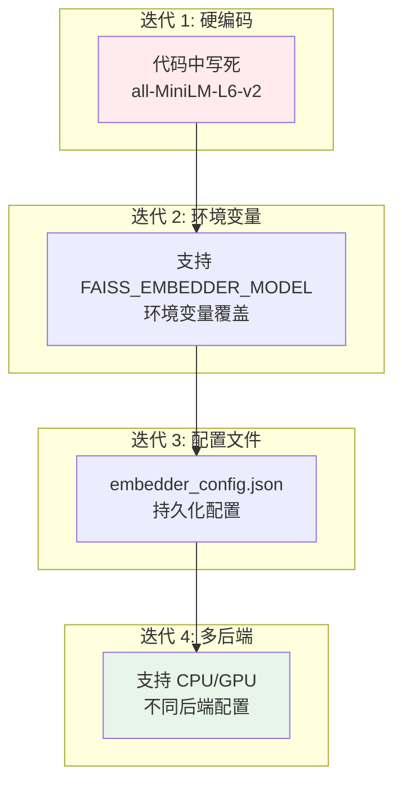

**配置优先级**:


---

### 阶段 6: 多后端 Embedding 支持

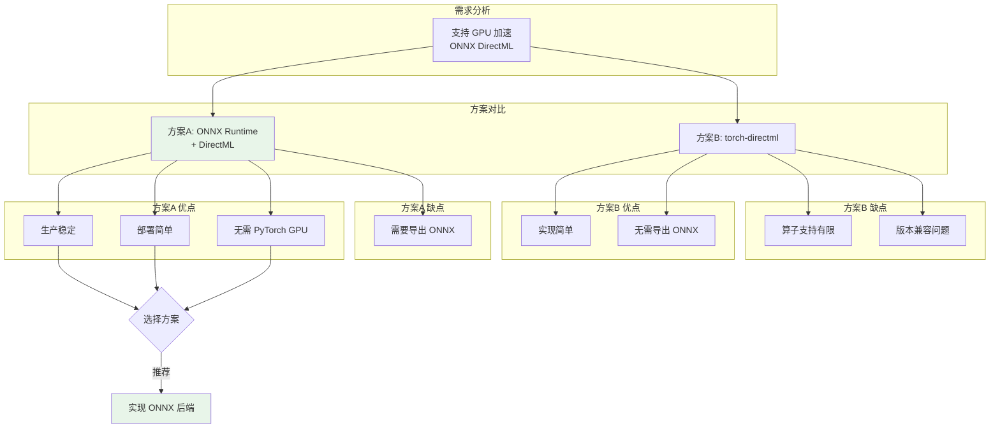

**实现架构**:

```mermaid
classDiagram
    class EmbedderConfig {
        +device: str
        +cpu: CPUEmbedder
        +gpu: GPUEmbedder
        +dim: int
    }
    
    class CPUEmbedder {
        +backend: str
        +model_name: str
    }
    
    class GPUEmbedder {
        +backend: str
        +onnx_path: str
        +tokenizer: str
    }
    
    class Embedder {
        <<interface>>
        +encode(texts: List~str~) ndarray
    }
    
    class SentenceTransformerEmbedder {
        -model: SentenceTransformer
        +encode(texts) ndarray
    }
    
    class ONNXEmbedder {
        -session: InferenceSession
        -tokenizer: Tokenizer
        +encode(texts) ndarray
    }
    
    EmbedderConfig --> CPUEmbedder
    EmbedderConfig --> GPUEmbedder
    Embedder <|.. SentenceTransformerEmbedder
    Embedder <|.. ONNXEmbedder
    
    note for EmbedderConfig "embedder_config.json"
    note for SentenceTransformerEmbedder "CPU 后端"
    note for ONNXEmbedder "GPU 后端 (DirectML)"
```

---

## 文件清单

### 核心文件职责

| 文件 | 用途 | 依赖 |
|------|------|------|
| `faiss_mcp_server.py` | MCP 服务主程序 | faiss, sentence-transformers, mcp |
---

## 经验教训

### 成功经验

```mermaid
mindmap
  root((成功经验))
    增量开发
      最小可用版本
      逐步添加功能
      快速验证反馈
    配置外置
      配置文件
      环境变量
      灵活切换
    多传输支持
      stdio 本地
      SSE 实时
      HTTP 通用
    详细日志
      启动配置
      错误追踪
      调试友好
    探测工具
      快速定位
      独立验证
      问题隔离
```

*文档生成时间: 2026-02-26*  
*协作工具: OpenCode Agent*  
*文档版本: 2.0 (含 Mermaid 图表)*