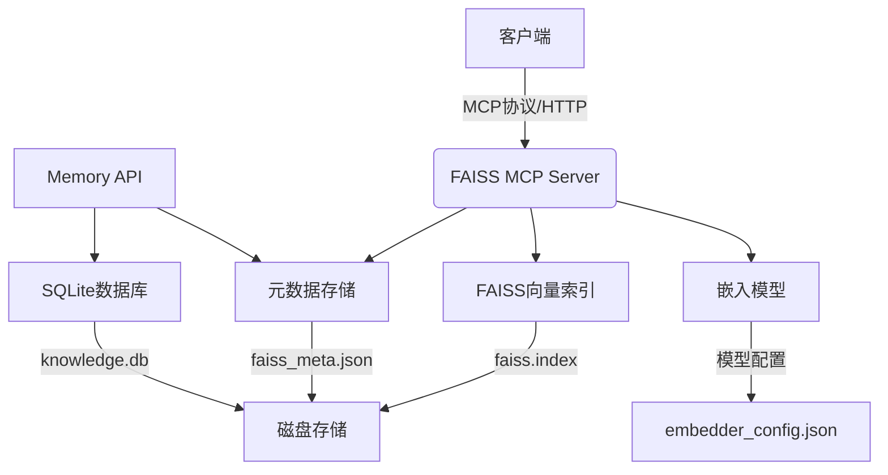
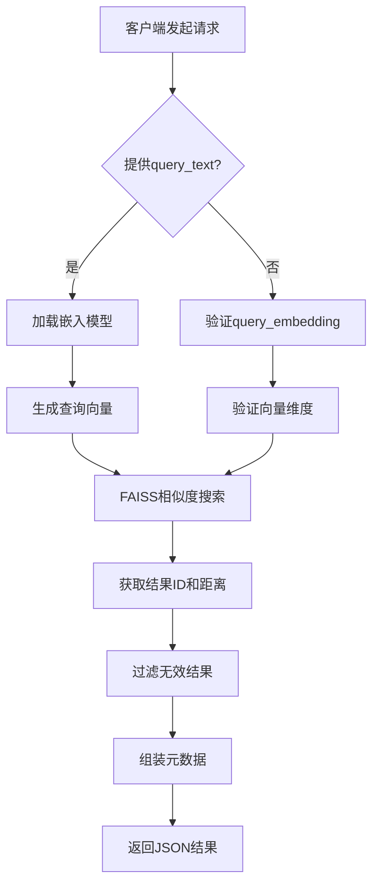
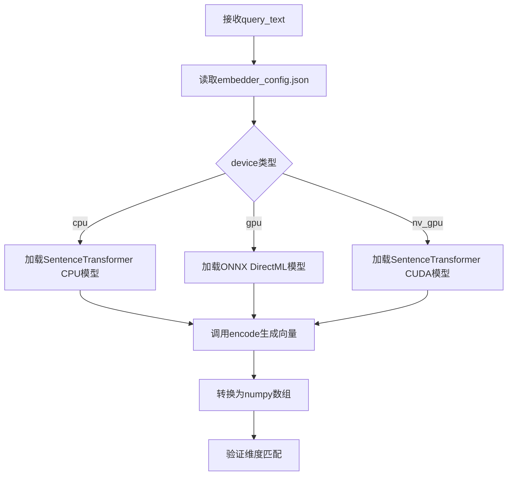
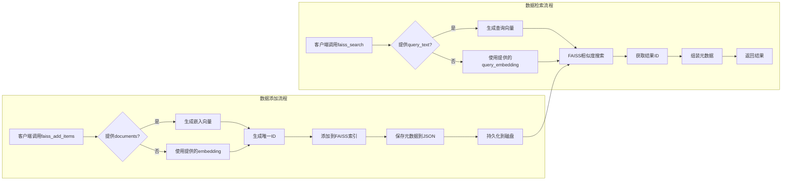

# 向量库检索工具详细流程

本文档详细描述了从客户端调用向量库检索工具到最终返回数据的完整流程。

## 系统架构概述

该系统基于FAISS向量数据库和MCP（Model Context Protocol）协议构建，主要包含以下组件：

1. **FAISS MCP Server** (`faiss_mcp_server.py`) - 核心向量检索服务
2. **Memory API** (`memory_api.py`) - 独立的HTTP接口用于管理记忆内容
3. **客户端示例** (`demo_mcp_client.py`) - 演示如何使用MCP协议调用服务
4. **配置文件** (`embedder_config.json`) - 系统配置参数

### 系统架构图



## 详细检索流程

### 检索流程图



### 1. 客户端发起请求

客户端通过MCP协议调用`faiss_search`工具，提供以下参数之一：
- `query_text`: 自然语言查询文本
- `query_embedding`: 预计算的嵌入向量
- `k`: 返回结果数量（默认5个）

```json
{
  "tool": "faiss_search",
  "arguments": {
    "params": {
      "query_text": "如何启动服务？",
      "k": 3
    }
  }
}
```

### 2. MCP服务器接收请求

FAISS MCP Server通过以下方式接收请求：
- **MCP协议**: 通过标准MCP工具调用接口
- **兼容HTTP接口**: 通过`/call_tool`端点支持简单HTTP客户端

服务器验证请求参数并调用`faiss_search`函数。

### 3. 查询处理

#### 3.1 文本查询处理
如果提供的是`query_text`：
1. 从`embedder_config.json`读取配置，确定使用的设备（CPU/GPU/NVIDIA GPU）
2. 获取对应的嵌入模型（SentenceTransformer或ONNX模型）
3. 调用`embedder.encode([query_text])`生成查询向量
4. 将向量转换为numpy数组，确保维度匹配FAISS索引



#### 3.2 向量查询处理
如果提供的是`query_embedding`：
1. 直接将嵌入向量转换为numpy数组
2. 验证向量维度是否与FAISS索引维度匹配

### 4. FAISS向量检索

1. **索引加载**: 服务器启动时加载FAISS索引（`faiss.index`）和元数据（`faiss_meta.json`）
2. **相似度搜索**: 调用`self.index.search(vec, k)`执行K近邻搜索
   - 使用L2距离（欧几里得距离）计算相似度
   - 返回距离（D）和索引ID（I）数组
3. **结果过滤**: 过滤掉无效的索引ID（-1表示未找到）

### 5. 元数据组装

对于每个检索到的结果：
1. 从内存中的`metadatas`字典获取对应ID的元数据
2. 组装包含以下信息的结果对象：
   - `id`: 条目唯一标识符
   - `score`: 相似度分数（距离值，越小越相似）
   - `metadata`: 完整的元数据信息，包括：
     - 原始文档内容
     - 用户提供的元数据（如source、category等）
     - 时间戳信息

### 6. 结果返回

服务器将结果格式化为JSON响应：

```json
{
  "success": true,
  "results": [
    {
      "id": 1001,
      "score": 0.85,
      "metadata": {
        "id": 1001,
        "document": "如何安装项目依赖并启动服务？",
        "metadata": {"title": "install"},
        "timestamp": "2026-02-12T10:30:00Z"
      }
    }
  ]
}
```

## 数据存储结构

### FAISS索引文件
- **faiss.index**: FAISS向量索引文件，包含所有向量的高效存储
- **faiss_meta.json**: JSON格式的元数据文件，存储每个向量对应的文档和元信息

### SQLite数据库（可选）
- **knowledge.db**: 通过Memory API管理的SQLite数据库
- 包含完整的知识条目表，支持全文搜索和复杂查询

## 配置说明

系统通过`embedder_config.json`文件进行配置：

```json
{
  "device": "gpu",
  "cpu": {
    "model_name": "sentence-transformers/all-MiniLM-L6-v2",
    "dim": 384
  },
  "gpu": {
    "onnx_path": "./model/model.onnx",
    "tokenizer": "BAAI/bge-base-zh-v1.5",
    "dim": 768
  },
  "nv_gpu": {
    "gpu_id": 0,
    "model_path": "C:\\Users\\hung\\Desktop\\workspace\\modelscope\\bge-m3",
    "dim": 1024
  },
  "faiss": {
    "cpu": {
      "index_path": "./faiss/cpu/faiss.index",
      "meta_path": "./faiss/cpu/faiss_meta.json"
    },
    "gpu": {
      "index_path": "./faiss/gpu/faiss.index", 
      "meta_path": "./faiss/gpu/faiss_meta.json"
    }
  },
  "knowledge_db_path": "./db/knowledge.db"
}
```

## 性能优化特性

1. **多设备支持**: 支持CPU、AMD GPU（DirectML）、NVIDIA GPU（CUDA）
2. **模型灵活性**: 可使用SentenceTransformer或ONNX格式的预训练模型
3. **自动持久化**: 服务器关闭时自动保存索引和元数据
4. **内存缓存**: 元数据在内存中缓存，避免频繁磁盘IO

## 使用示例

### 添加文档
```python
# 通过MCP客户端
add_resp = await session.call_tool(
    "faiss_add_items",
    arguments={
        "params": [
            {
                "metadata": {"source": "doc1.md"},
                "document": "这是第一个文档的内容"
            }
        ]
    }
)
```

### 执行检索
```python
# 文本检索
search_resp = await session.call_tool(
    "faiss_search",
    arguments={
        "params": {
            "query_text": "相关内容查询",
            "k": 5
        }
    }
)

# 向量检索
search_resp = await session.call_tool(
    "faiss_search", 
    arguments={
        "params": {
            "query_embedding": [0.1, 0.2, 0.3, ...],
            "k": 3
        }
    }
)
```

### HTTP兼容接口
```bash
# 通过HTTP POST调用
curl -X POST http://localhost:8001/call_tool \
  -H "Content-Type: application/json" \
  -d '{
    "tool": "faiss_search",
    "arguments": {
      "params": {
        "query_text": "如何启动服务？",
        "k": 3
      }
    }
  }'
```

## 完整数据流图



## 错误处理

系统包含完善的错误处理机制：
- 参数验证失败返回清晰的错误信息
- 嵌入模型加载失败时记录警告但允许服务器继续运行
- FAISS操作异常会被捕获并返回给客户端
- 日志记录所有关键操作和错误信息