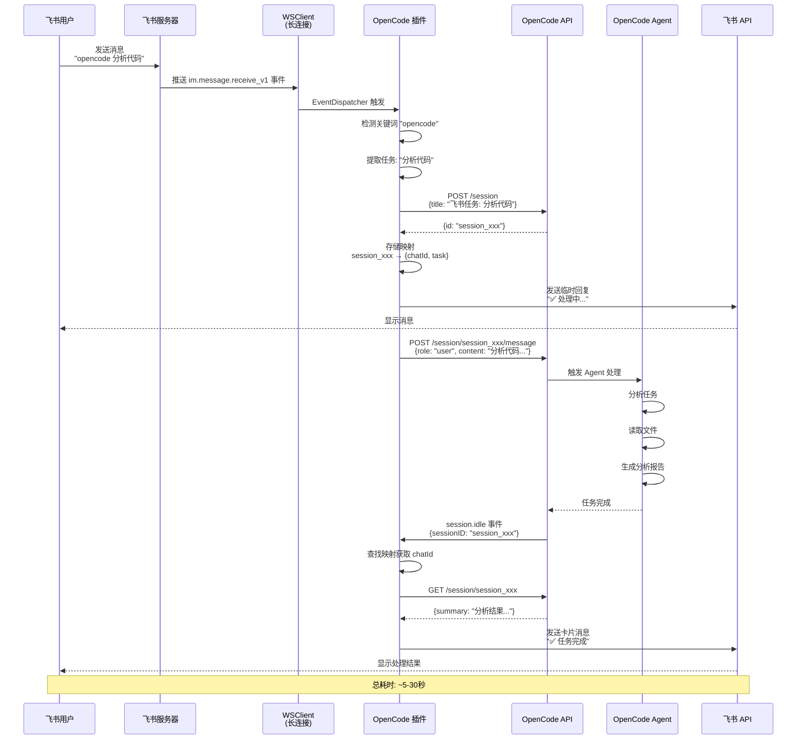
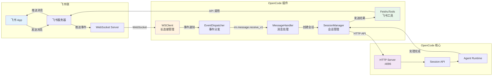
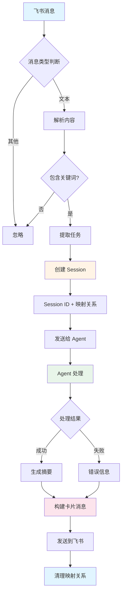
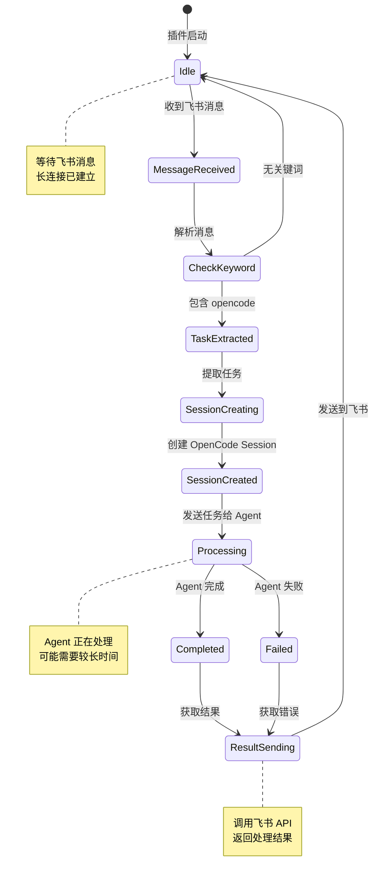
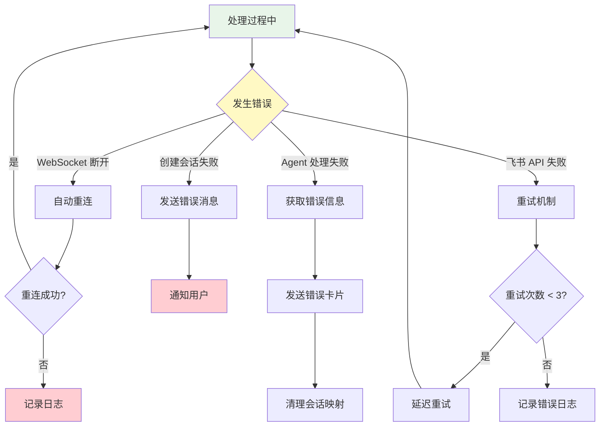
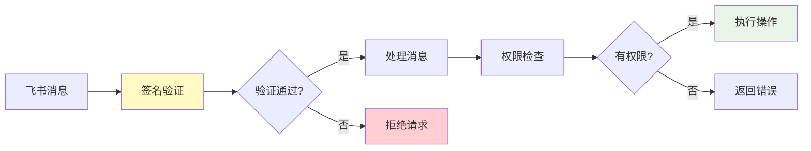

# 飞书 OpenCode 机器人 - 系统交互流程

## 📊 完整架构流程图

```mermaid
graph TB
    subgraph "飞书客户端"
        A[用户在飞书发送消息]
        A --> B[消息内容: opencode 任务描述]
    end

    subgraph "飞书服务器"
        C[飞书消息服务器]
        B --> C
        C --> D{判断消息类型}
        D -->|文本消息| E[推送到 WebSocket]
        D -->|其他类型| F[忽略]
    end

    subgraph "OpenCode 插件 (个人电脑)"
        G[WSClient 长连接]
        E --> G
        G --> H[EventDispatcher]
        H --> I[im.message.receive_v1 事件]
        
        I --> J{检测触发关键词}
        J -->|opencode/@opencode| K[提取任务内容]
        J -->|其他| L[忽略消息]
        
        K --> M[创建 OpenCode Session]
        M --> N[存储会话映射<br/>chatId, userId, task]
        N --> O[发送临时回复: 处理中...]
    end

    subgraph "OpenCode 核心服务"
        P[OpenCode HTTP API<br/>localhost:4096]
        O --> P
        M --> P
        
        P --> Q[创建新会话]
        Q --> R[Session ID: xxx]
        
        R --> S[发送任务给 Agent]
        S --> T[增强提示词:<br/>任务 + 飞书群ID]
    end

    subgraph "OpenCode Agent"
        U[Agent 接收任务]
        T --> U
        U --> V[分析任务]
        V --> W[执行操作]
        
        W --> W1[读取文件]
        W --> W2[编辑代码]
        W --> W3[运行命令]
        W --> W4[调用工具]
        
        W1 --> X[任务完成]
        W2 --> X
        W3 --> X
        W4 --> X
    end

    subgraph "会话完成处理"
        Y[session.idle 事件]
        X --> Y
        Y --> Z[插件监听事件]
        Z --> AA[查找会话映射]
        AA --> AB{找到映射?}
        
        AB -->|是| AC[获取处理结果]
        AB -->|否| AD[忽略]
        
        AC --> AE[构建结果消息]
    end

    subgraph "结果返回"
        AF[调用飞书 API]
        AE --> AF
        AF --> AG[发送卡片消息]
        AG --> AH[消息内容:<br/>✅ 任务完成<br/>结果详情]
    end

    subgraph "飞书客户端"
        AI[用户收到回复]
        AH --> AI
        AI --> AJ[显示 OpenCode 处理结果]
    end

    style A fill:#e1f5ff
    style AJ fill:#e1f5ff
    style G fill:#fff4e6
    style P fill:#f3e5f5
    style U fill:#e8f5e9
    style Y fill:#fff9c4
    style AF fill:#fce4ec
```

---

## 🔄 时序图



---

## 🎯 核心组件交互



---

## 📝 数据流转



---

## 🔧 关键状态转换



---

## 🚨 错误处理流程



---

## 💡 关键技术点

### 1. 长连接机制
```typescript
WSClient → WebSocket → 飞书服务器
├─ 自动建立连接
├─ 心跳保活
├─ 断线重连
└─ 事件推送
```

### 2. 事件处理链
```typescript
消息接收 → 关键词检测 → 任务提取 → 会话创建 → Agent处理 → 结果返回
```

### 3. 会话映射管理
```typescript
Map<SessionID, {
  chatId: string      // 飞书群ID
  userId: string      // 发送者ID
  task: string        // 任务内容
  startTime: number   // 开始时间
}>
```

### 4. 触发关键词
```
支持格式:
- "opencode <任务>"
- "@opencode <任务>"
- "/opencode <任务>"
```

---

## 📊 性能指标

| 环节 | 预期耗时 | 备注 |
|------|---------|------|
| 消息接收 | < 1s | WebSocket 实时推送 |
| 会话创建 | < 2s | HTTP API 调用 |
| Agent 处理 | 5-30s | 取决于任务复杂度 |
| 结果返回 | < 2s | 飞书 API 调用 |
| **总计** | **7-35s** | 端到端处理时间 |

---

## 🔐 安全机制



---

这个流程图展示了从用户发送消息到收到结果的完整交互过程！🎉