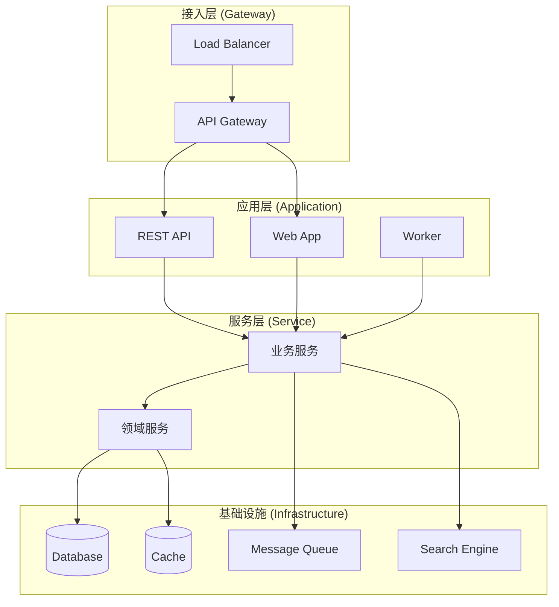
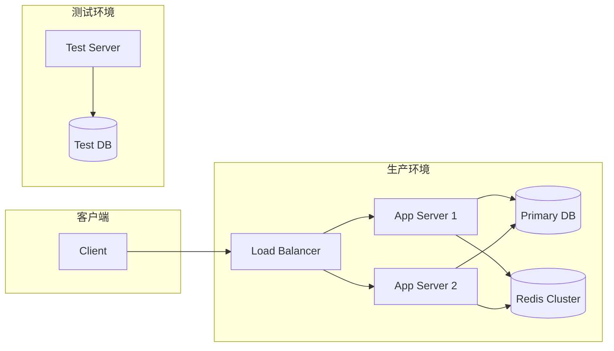

# 技术架构分析报告

> **项目名称**：`[项目名称]`
> **分析日期**：`[YYYY-MM-DD]`
> **分析人员**：`[姓名]`

---

## 1. 架构总览

### 1.1 系统架构图



### 1.2 部署架构图（如适用）



## 2. 技术栈详情

### 2.1 核心框架

| 框架 | 版本 | 用途 | 健康度 | 备注 |
|------|------|------|--------|------|
| `[框架名称]` | `[版本]` | `[用途描述]` | `[健康/警告/危险]` | `[备注]` |
| `[框架名称]` | `[版本]` | `[用途描述]` | `[健康/警告/危险]` | `[备注]` |

### 2.2 数据存储

| 组件 | 类型 | 用途 | 连接方式 | 备注 |
|------|------|------|----------|------|
| `[数据库名称]` | `[关系型/NoSQL]` | `[业务用途]` | `[JDBC/ORM等]` | `[分库分表/读写分离等]` |
| `[缓存名称]` | `[Redis/Memcached等]` | `[缓存用途]` | `[客户端/连接池]` | `[集群/单机]` |

### 2.3 中间件

| 组件 | 版本 | 用途 | 配置要点 | 连接信息 |
|------|------|------|----------|----------|
| `[中间件名称]` | `[版本]` | `[用途描述]` | `[配置参数]` | `[地址/端口]` |
| `[中间件名称]` | `[版本]` | `[用途描述]` | `[配置参数]` | `[地址/端口]` |

### 2.4 外部依赖

| 服务 | 版本 | 用途 | 调用方式 | 超时配置 |
|------|------|------|----------|----------|
| `[外部服务]` | `[版本]` | `[业务用途]` | `[HTTP/gRPC/RPC]` | `[超时时间]` |
| `[外部服务]` | `[版本]` | `[业务用途]` | `[HTTP/gRPC/RPC]` | `[超时时间]` |

## 3. 系统入口清单

### 3.1 API 入口（共 `[XX]` 个）

| 接口路径 | HTTP方法 | Controller类 | 方法名 | 描述 |
|----------|----------|--------------|--------|------|
| `/api/v1/[path]` | GET/POST/PUT/DELETE | `[Controller类]` | `[methodName]` | `[功能描述]` |
| `/api/v1/[path]` | GET/POST/PUT/DELETE | `[Controller类]` | `[methodName]` | `[功能描述]` |

### 3.2 定时任务（共 `[XX]` 个）

| 任务名称 | Cron表达式 | 执行类 | 方法名 | 描述 |
|----------|------------|--------|--------|------|
| `[任务名称]` | `[cron表达式]` | `[执行类]` | `[methodName]` | `[功能描述]` |
| `[任务名称]` | `[cron表达式]` | `[执行类]` | `[methodName]` | `[功能描述]` |

### 3.3 消息消费者（共 `[XX]` 个）

| 主题/队列 | 消费者类 | 方法名 | 并发数 | 描述 |
|-----------|----------|--------|--------|------|
| `[topic/queue]` | `[消费者类]` | `[methodName]` | `[并发数]` | `[功能描述]` |
| `[topic/queue]` | `[消费者类]` | `[methodName]` | `[并发数]` | `[功能描述]` |

### 3.4 RPC 服务提供者（共 `[XX]` 个）

| 服务接口 | 实现类 | 方法列表 | 描述 |
|----------|--------|----------|------|
| `[ServiceInterface]` | `[ServiceImpl]` | `[method1, method2]` | `[功能描述]` |
| `[ServiceInterface]` | `[ServiceImpl]` | `[method1, method2]` | `[功能描述]` |

## 4. 配置管理现状

### 4.1 配置文件清单

| 配置文件 | 环境 | 用途 | 敏感信息 |
|----------|------|------|----------|
| `application.yml` | all | 基础配置 | `[有/无]` |
| `application-dev.yml` | dev | 开发环境 | `[有/无]` |
| `application-prod.yml` | prod | 生产环境 | `[有/无]` |

### 4.2 配置方式评估

- **配置方式**：`[集中配置中心/本地文件/环境变量]`
- **环境管理**：`[多环境配置文件/配置中心环境隔离]`
- **敏感信息管理**：`[明文存储/加密存储/外部密钥管理]`
- **配置热更新**：`[支持/不支持]`

### 4.3 配置问题识别

| 问题类型 | 具体表现 | 文件位置 | 风险等级 |
|----------|----------|----------|----------|
| 硬编码 | `[具体硬编码内容]` | `[文件路径:行号]` | 高/中/低 |
| 明文密码 | `[具体密码内容]` | `[文件路径:行号]` | 高/中/低 |
| 环境耦合 | `[具体耦合表现]` | `[文件路径:行号]` | 高/中/低 |
| 魔法数字 | `[具体魔法数字]` | `[文件路径:行号]` | 高/中/低 |

## 5. 技术债务识别

| 编号 | 问题描述 | 影响范围 | 建议优先级 | 预计工作量 |
|------|----------|----------|------------|------------|
| TD-001 | `[技术债务描述]` | `[模块/类/方法]` | P0/P1/P2/P3/P4 | `[X人天]` |
| TD-002 | `[技术债务描述]` | `[模块/类/方法]` | P0/P1/P2/P3/P4 | `[X人天]` |
| TD-003 | `[技术债务描述]` | `[模块/类/方法]` | P0/P1/P2/P3/P4 | `[X人天]` |

## 6. 架构风险评估

| 风险 | 描述 | 可能性 | 影响 | 建议措施 |
|------|------|--------|------|----------|
| `[风险名称]` | `[详细描述]` | 高/中/低 | 高/中/低 | `[具体建议]` |
| `[风险名称]` | `[详细描述]` | 高/中/低 | 高/中/低 | `[具体建议]` |
| `[风险名称]` | `[详细描述]` | 高/中/低 | 高/中/低 | `[具体建议]` |

## 7. 性能瓶颈初步识别

### 7.1 数据库性能
- **慢查询**：`[是否存在慢查询，具体表现]`
- **连接池**：`[连接池配置是否合理]`
- **索引设计**：`[索引是否缺失或冗余]`

### 7.2 接口性能
- **响应时间**：`[平均/最大响应时间]`
- **吞吐量**：`[QPS/TPS 指标]`
- **资源消耗**：`[CPU/内存使用情况]`

### 7.3 缓存效率
- **命中率**：`[缓存命中率]`
- **失效策略**：`[缓存失效策略是否合理]`
- **数据一致性**：`[缓存与数据库一致性保障]`

## 8. 安全架构分析

### 8.1 认证授权
- **认证方式**：`[JWT/OAuth2/Session等]`
- **授权模型**：`[RBAC/ABAC等]`
- **安全漏洞**：`[是否存在已知漏洞]`

### 8.2 数据安全
- **敏感数据**：`[是否对敏感数据进行脱敏/加密]`
- **传输安全**：`[HTTPS/TLS 配置]`
- **存储安全**：`[数据库加密/文件权限]`

### 8.3 依赖安全
- **第三方库**：`[是否存在已知安全漏洞]`
- **版本更新**：`[依赖库是否及时更新]`

## 9. 监控与可观测性

### 9.1 日志体系
- **日志级别**：`[DEBUG/INFO/WARN/ERROR 配置]`
- **日志格式**：`[结构化/非结构化]`
- **日志收集**：`[ELK/Splunk/其他]`

### 9.2 监控指标
- **系统指标**：`[CPU/内存/磁盘/网络监控]`
- **应用指标**：`[JVM/线程池/连接池监控]`
- **业务指标**：`[核心业务指标监控]`

### 9.3 告警机制
- **告警规则**：`[关键指标告警配置]`
- **通知渠道**：`[邮件/短信/钉钉/企业微信]`
- **告警频率**：`[告警是否过于频繁或不足]`

## 10. 分析命令记录

### 10.1 依赖分析命令
```bash
# [执行的命令和结果]
```

### 10.2 配置文件分析命令
```bash
# [执行的命令和结果]
```

### 10.3 入口点识别命令
```bash
# [执行的命令和结果]
```

---

> **备注**：请替换所有 `[占位符]` 为实际内容，并删除此备注。