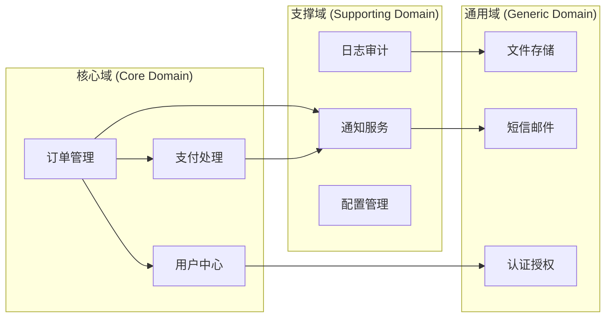
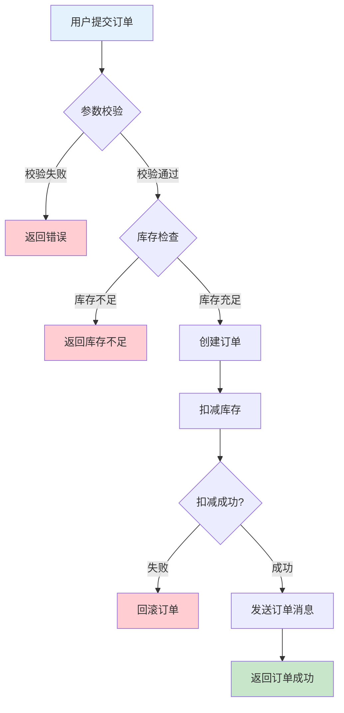
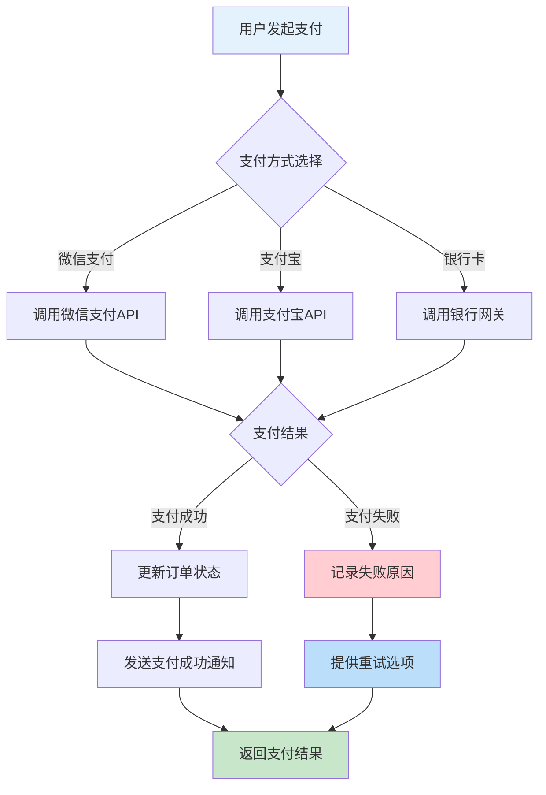
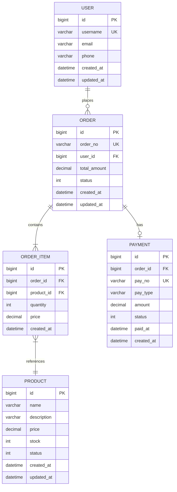
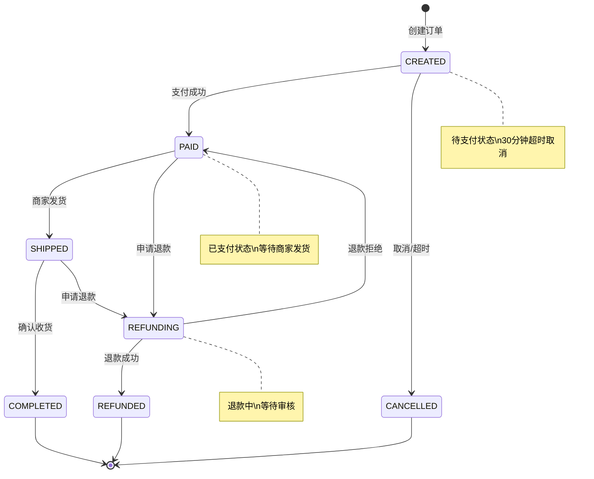
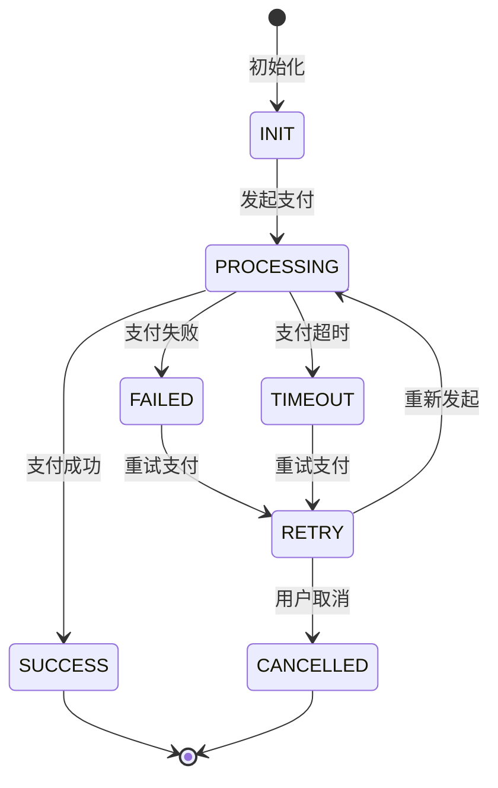

# 业务逻辑分析报告

> **项目名称**：`[项目名称]`
> **分析日期**：`[YYYY-MM-DD]`
> **分析人员**：`[姓名]`

---

## 1. 业务领域划分

### 1.1 领域地图



### 1.2 领域说明

| 领域 | 类型 | 核心概念 | 负责模块 | 关键类 |
|------|------|----------|----------|--------|
| `[领域名称]` | 核心/支撑/通用 | `[核心业务概念]` | `[模块路径]` | `[关键类列表]` |
| `[领域名称]` | 核心/支撑/通用 | `[核心业务概念]` | `[模块路径]` | `[关键类列表]` |
| `[领域名称]` | 核心/支撑/通用 | `[核心业务概念]` | `[模块路径]` | `[关键类列表]` |

### 1.3 业务术语表

| 术语 | 定义 | 所在领域 | 相关类 |
|------|------|----------|--------|
| `[业务术语]` | `[详细定义]` | `[领域名称]` | `[相关类]` |
| `[业务术语]` | `[详细定义]` | `[领域名称]` | `[相关类]` |
| `[业务术语]` | `[详细定义]` | `[领域名称]` | `[相关类]` |

## 2. 核心业务流程

### 2.1 `[业务流程1名称]` - 如：订单创建

#### 2.1.1 业务流程图



#### 2.1.2 调用链追踪

```
HTTP Request → OrderController.createOrder()
                ↓
                OrderService.createOrder()
                ↓
                OrderRepository.save()
                ↓
                InventoryService.decreaseStock()
                ↓
                MessageProducer.sendOrderCreated()
                ↓
                HTTP Response
```

#### 2.1.3 关键类和方法

| 类名 | 方法名 | 职责 | 复杂度 | 行数 |
|------|--------|------|--------|------|
| `OrderController` | `createOrder()` | 接收请求、参数校验 | `[圈复杂度]` | `[行数]` |
| `OrderService` | `createOrder()` | 业务逻辑处理 | `[圈复杂度]` | `[行数]` |
| `OrderRepository` | `save()` | 数据持久化 | `[圈复杂度]` | `[行数]` |
| `InventoryService` | `decreaseStock()` | 库存扣减 | `[圈复杂度]` | `[行数]` |

#### 2.1.4 异常处理流程

| 异常类型 | 处理方式 | 回滚策略 | 用户反馈 |
|----------|----------|----------|----------|
| 参数校验失败 | 直接返回错误 | 无 | `[具体错误信息]` |
| 库存不足 | 返回库存不足 | 无 | `[具体错误信息]` |
| 库存扣减失败 | 事务回滚 | 订单创建回滚 | `[具体错误信息]` |
| 消息发送失败 | 重试机制 | 记录日志，异步重试 | `[具体错误信息]` |

### 2.2 `[业务流程2名称]` - 如：支付处理

#### 2.2.1 业务流程图



#### 2.2.2 调用链追踪

```
HTTP Request → PaymentController.processPayment()
                ↓
                PaymentService.processPayment()
                ↓
                WeChatPayClient.pay() / AlipayClient.pay()
                ↓
                OrderService.updatePaymentStatus()
                ↓
                NotificationService.sendPaymentSuccess()
                ↓
                HTTP Response
```

#### 2.2.3 关键类和方法

| 类名 | 方法名 | 职责 | 复杂度 | 行数 |
|------|--------|------|--------|------|
| `PaymentController` | `processPayment()` | 支付入口 | `[圈复杂度]` | `[行数]` |
| `PaymentService` | `processPayment()` | 支付路由 | `[圈复杂度]` | `[行数]` |
| `WeChatPayClient` | `pay()` | 微信支付 | `[圈复杂度]` | `[行数]` |
| `AlipayClient` | `pay()` | 支付宝支付 | `[圈复杂度]` | `[行数]` |

### 2.3 `[业务流程3名称]` - 如：用户注册

[按照相同格式填写]

## 3. 数据模型

### 3.1 核心实体关系图



### 3.2 数据字典

#### 3.2.1 用户表 (user)

| 字段名 | 类型 | 必填 | 默认值 | 说明 | 约束 |
|--------|------|------|--------|------|------|
| id | bigint | 是 | | 主键 | PK, Auto Increment |
| username | varchar(50) | 是 | | 用户名 | UK, Not Null |
| email | varchar(100) | 是 | | 邮箱 | Not Null |
| phone | varchar(20) | 否 | null | 手机号 | |
| password | varchar(255) | 是 | | 密码 | Not Null |
| status | tinyint | 是 | 1 | 状态 | 1-正常, 2-禁用 |
| created_at | datetime | 是 | CURRENT_TIMESTAMP | 创建时间 | |
| updated_at | datetime | 是 | CURRENT_TIMESTAMP | 更新时间 | ON UPDATE |

#### 3.2.2 订单表 (order)

| 字段名 | 类型 | 必填 | 默认值 | 说明 | 约束 |
|--------|------|------|--------|------|------|
| id | bigint | 是 | | 主键 | PK, Auto Increment |
| order_no | varchar(32) | 是 | | 订单号 | UK, Not Null |
| user_id | bigint | 是 | | 用户ID | FK, Not Null |
| total_amount | decimal(10,2) | 是 | | 总金额 | Not Null |
| status | tinyint | 是 | 0 | 订单状态 | 0-待支付, 1-已支付, 2-已发货, 3-已完成, 4-已取消 |
| created_at | datetime | 是 | CURRENT_TIMESTAMP | 创建时间 | |
| updated_at | datetime | 是 | CURRENT_TIMESTAMP | 更新时间 | ON UPDATE |

#### 3.2.3 其他核心表

[按照相同格式填写其他重要表]

### 3.3 索引设计分析

| 表名 | 索引名 | 字段 | 类型 | 使用场景 | 建议 |
|------|--------|------|------|----------|------|
| user | idx_username | username | UNIQUE | 用户名查询 | 保持 |
| order | idx_user_id | user_id | NORMAL | 用户订单查询 | 保持 |
| order | idx_order_no | order_no | UNIQUE | 订单号查询 | 保持 |
| order | idx_status_created | status, created_at | COMPOSITE | 订单状态查询 | 优化 |

## 4. 状态机说明

### 4.1 订单状态机



### 4.2 支付状态机



### 4.3 状态转换规则

| 当前状态 | 事件 | 目标状态 | 条件 | 副作用 |
|----------|------|----------|------|--------|
| CREATED | payment_success | PAID | 支付成功回调 | 发送支付成功通知 |
| CREATED | timeout | CANCELLED | 30分钟未支付 | 释放库存 |
| PAID | ship_order | SHIPPED | 商家确认发货 | 发送发货通知 |
| PAID | apply_refund | REFUNDING | 用户申请退款 | 冻结相关资金 |
| SHIPPED | confirm_receipt | COMPLETED | 用户确认收货 | 完成订单结算 |

## 5. 业务规则汇总

| 编号 | 规则描述 | 所在模块 | 实现方式 | 验证方式 |
|------|----------|----------|----------|----------|
| BR-001 | 订单30分钟未支付自动取消 | OrderService | 定时任务 + 状态检查 | 单元测试 + 集成测试 |
| BR-002 | 库存不足时不能创建订单 | OrderService | 库存预占检查 | 单元测试 |
| BR-003 | 支付成功后必须更新订单状态 | PaymentService | 事务一致性 | 集成测试 |
| BR-004 | 退款金额不能超过订单金额 | RefundService | 金额校验 | 单元测试 |
| BR-005 | 用户名必须唯一 | UserService | 数据库唯一约束 | 集成测试 |

## 6. 业务风险与建议

### 6.1 业务风险识别

| 风险 | 影响 | 可能性 | 建议措施 |
|------|------|--------|----------|
| 库存超卖 | 财务损失、用户体验差 | 中 | 加强库存锁机制，增加库存预占 |
| 支付状态不一致 | 资金损失、订单异常 | 高 | 增加对账机制，完善事务补偿 |
| 订单状态混乱 | 用户困惑、客服压力 | 低 | 完善状态机，增加状态变更日志 |
| 业务规则硬编码 | 维护困难、灵活性差 | 中 | 抽取业务规则到配置或规则引擎 |

### 6.2 优化建议

#### 6.2.1 短期优化（1-2周）
- `[具体优化建议1]`
- `[具体优化建议2]`

#### 6.2.2 中期优化（1-2月）
- `[具体优化建议3]`
- `[具体优化建议4]`

#### 6.2.3 长期优化（1季度+）
- `[具体优化建议5]`
- `[具体优化建议6]`

## 7. 分析命令记录

### 7.1 业务关键词搜索
```bash
# [执行的命令和结果]
```

### 7.2 核心类追踪
```bash
# [执行的命令和结果]
```

### 7.3 数据库表分析
```bash
# [执行的命令和结果]
```

---

> **备注**：请替换所有 `[占位符]` 为实际内容，并删除此备注。