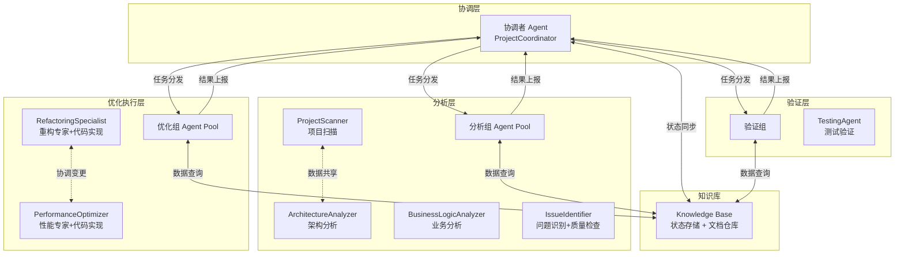
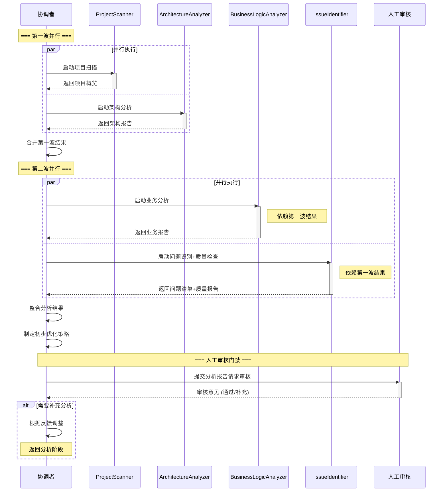
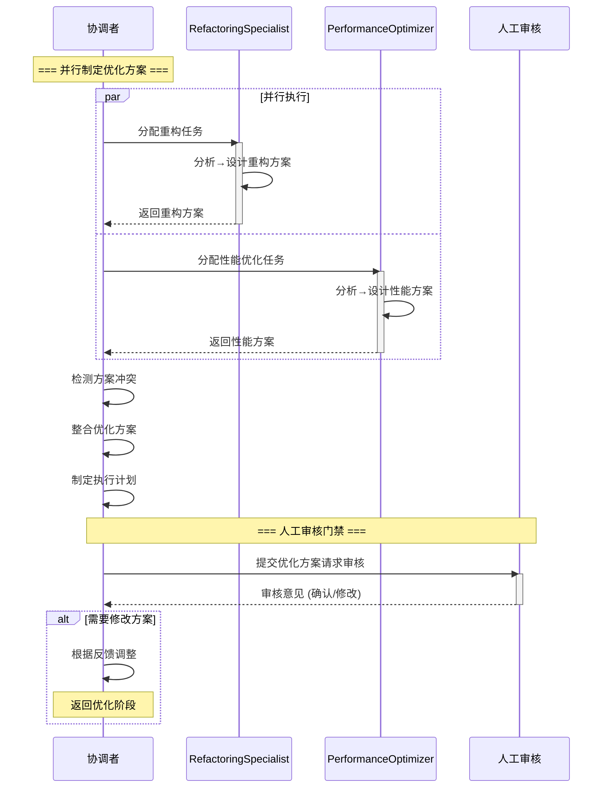
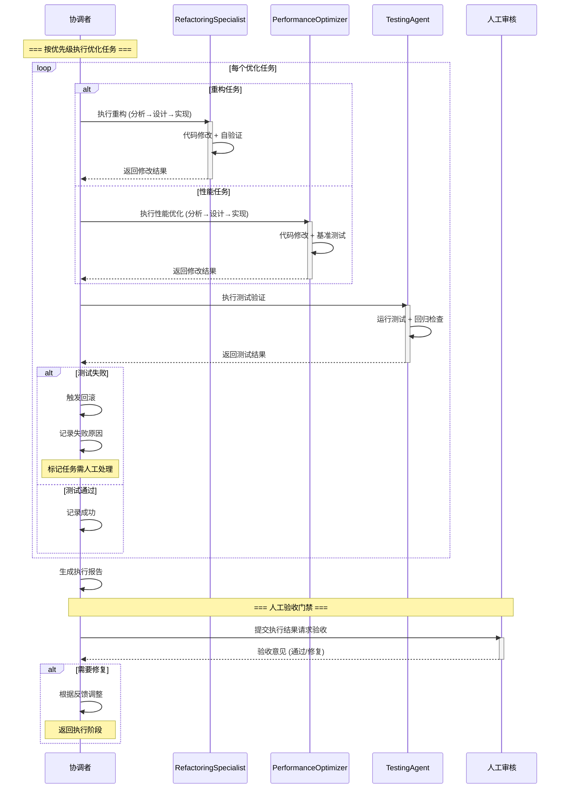
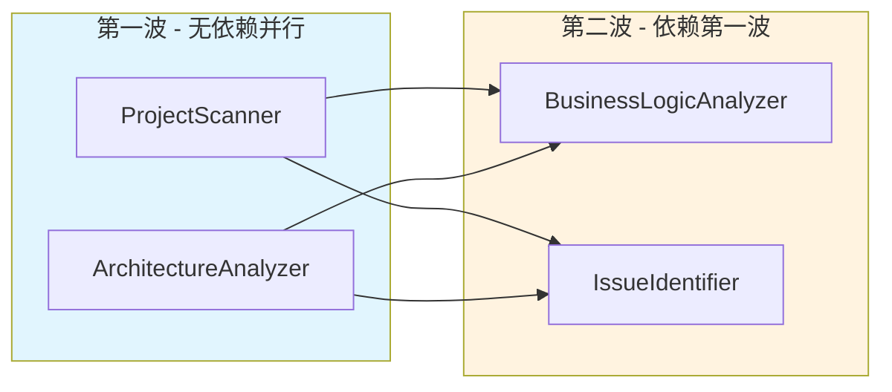
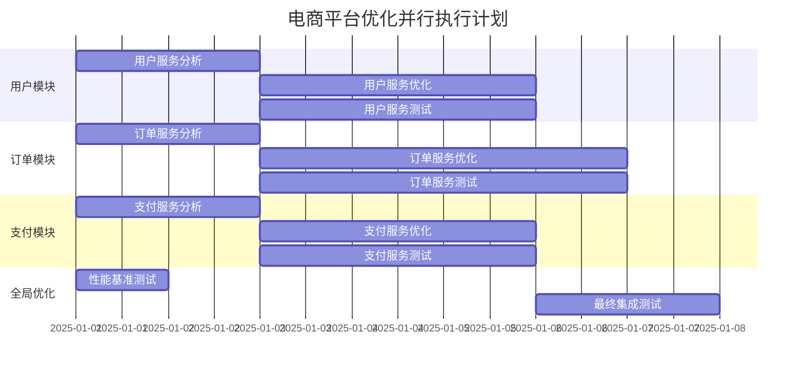
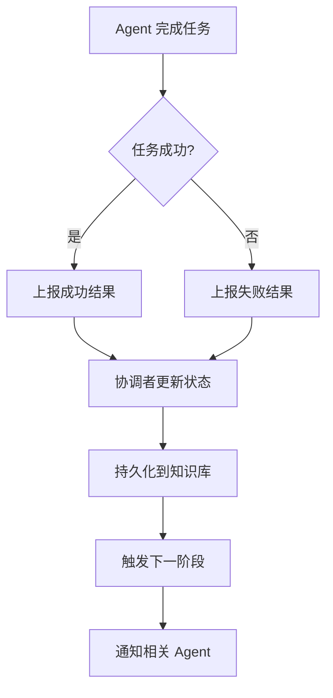
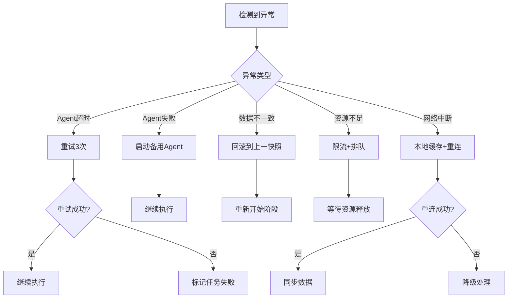
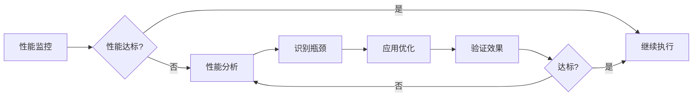

# 项目分析与优化 Agent 协作框架

> **版本**：v2.0  
> **设计日期**：2025-01  
> **更新日期**：2025-01 (精简Agent角色，优化协作流程)  
> **适用场景**：大型复杂项目的系统性分析与优化

---

## 📋 目录

- [1. 整体架构设计](#1-整体架构设计)
- [2. Agent 角色定义](#2-agent-角色定义)
- [3. 协作流程设计](#3-协作流程设计)
- [4. 并行处理策略](#4-并行处理策略)
- [5. 状态管理与同步](#5-状态管理与同步)
- [6. 异常处理与恢复](#6-异常处理与恢复)
- [7. 性能优化机制](#7-性能优化机制)
- [8. 实施指南](#8-实施指南)

---

## 1. 整体架构设计

### 1.1 系统架构图



### 1.2 架构精简说明 (v2.0 更新)

| 变更 | 原设计 | 新设计 | 理由 |
|------|--------|--------|------|
| **合并质量检查** | CodeQualityInspector 独立 | 合并到 IssueIdentifier | 功能重叠，都是"发现问题" |
| **合并代码实现** | ImplementationAgent 独立 | 合并到各优化Agent | 优化专家应端到端负责 |
| **层级简化** | 4层 (分析/优化/执行/验证) | 3层 (分析/优化执行/验证) | 减少协调开销 |
| **Agent间通信** | 全部经Coordinator中转 | 支持相关Agent直接通信 | 提升协作效率 |

**精简效果**: 9+1 Agent → **7+1 Agent**，减少 22% 的协调复杂度

### 1.3 核心设计理念

| 原则 | 说明 | 实现方式 |
|------|------|----------|
| **职责单一** | 每个 Agent 专注特定领域 | 专业能力封装，接口清晰 |
| **松耦合** | Agent 间通过协调者通信 | 消息队列/事件驱动架构 |
| **可扩展** | 支持动态添加新 Agent | 插件化架构，配置驱动 |
| **容错性** | 单个 Agent 失败不影响整体 | 超时重试、故障转移 |
| **可观测性** | 全流程状态可追踪 | 统一状态管理，日志记录 |

---

## 2. Agent 角色定义 (精简版 v2.0)

> **架构**: 1 协调者 + 4 分析Agent + 2 优化Agent + 1 验证Agent = **8 Agent**

### 2.1 协调者 Agent (ProjectCoordinator)

#### 核心职责
- **流程统筹**：控制整体分析优化流程
- **任务调度**：根据工作量和依赖关系分配任务
- **资源管理**：管理 Agent 池的并发数量
- **状态同步**：维护全局状态，记录阶段性成果
- **决策制定**：基于分析结果制定优化策略
- **人工协调**：在关键节点请求人工审核

#### 能力要求
- 流程编排能力
- 依赖关系分析
- 资源调度算法
- 状态管理
- 决策支持

#### 输入输出
- **输入**：项目路径、优化目标、约束条件
- **输出**：优化计划、执行报告、状态日志

### 2.2 分析组 Agent (4个)

#### 2.2.1 ProjectScanner (项目扫描器)
- **职责**：快速建立项目全貌认知
- **能力**：代码统计、Git 历史分析、热点代码识别、依赖扫描
- **输出**：项目概览报告、初步风险识别、模块依赖图
- **可并行**：✅ 可与 ArchitectureAnalyzer 并行

#### 2.2.2 ArchitectureAnalyzer (架构分析器)
- **职责**：深入分析技术架构和依赖关系
- **能力**：依赖树分析、配置文件解析、入口点识别、分层结构分析
- **输出**：架构分析报告、技术债务清单、架构图
- **可并行**：✅ 可与 ProjectScanner 并行

#### 2.2.3 BusinessLogicAnalyzer (业务逻辑分析器)
- **职责**：理解核心业务流程和领域模型
- **能力**：调用链追踪、状态机分析、数据模型构建、API 分析
- **输出**：业务逻辑报告、领域模型文档、业务流程图
- **依赖**：需要 ProjectScanner 和 ArchitectureAnalyzer 的输出

#### 2.2.4 IssueIdentifier (问题识别器) 🔄 已合并质量检查
- **职责**：系统化识别各类问题并分类，**包含代码质量检查**
- **能力**：
  - 代码异味检测 (God Class, Long Method, etc.)
  - 性能问题识别 (N+1 Query, 内存泄漏等)
  - 安全漏洞扫描
  - **代码规范检查** (原 CodeQualityInspector)
  - **测试覆盖分析** (原 CodeQualityInspector)
- **输出**：问题清单、优先级矩阵、技术债务评估、质量报告
- **依赖**：需要 ProjectScanner 和 ArchitectureAnalyzer 的输出

### 2.3 优化执行组 Agent (2个) 🔄 合并执行能力

#### 2.3.1 RefactoringSpecialist (重构专家) 🔄 已合并代码实现
- **职责**：针对代码质量问题进行重构优化，**端到端完成代码修改**
- **能力**：
  - 重构手法应用 (Extract Method, Move Class, etc.)
  - **代码编辑和修改** (原 ImplementationAgent)
  - **版本控制操作** (原 ImplementationAgent)
  - 小步验证、兼容性保障
- **输出**：重构方案、**已修改的代码**、提交记录、变更说明
- **工作模式**：分析→设计→实现→自验证 (闭环)

#### 2.3.2 PerformanceOptimizer (性能优化专家) 🔄 已合并代码实现
- **职责**：解决性能瓶颈和资源消耗问题，**端到端完成代码修改**
- **能力**：
  - 性能分析和瓶颈定位
  - SQL 优化、索引建议
  - 缓存策略设计和实现
  - 异步处理改造
  - **代码编辑和修改** (原 ImplementationAgent)
  - **基准测试执行**
- **输出**：性能优化方案、**已修改的代码**、基准测试对比报告
- **工作模式**：分析→设计→实现→测量 (闭环)

### 2.4 验证组 Agent (1个)

#### 2.4.1 TestingAgent (测试代理)
- **职责**：验证优化效果和回归测试
- **能力**：
  - 测试用例生成
  - 自动化测试执行
  - 性能基准测试
  - 回归测试
  - 覆盖率分析
- **输出**：测试报告、验证结果、覆盖率报告
- **触发时机**：每个优化任务完成后自动触发

### 2.5 Agent 角色对比 (v1.0 vs v2.0)

| v1.0 Agent | v2.0 状态 | 说明 |
|------------|-----------|------|
| ProjectCoordinator | ✅ 保留 | 核心协调者 |
| ProjectScanner | ✅ 保留 | 项目扫描 |
| ArchitectureAnalyzer | ✅ 保留 | 架构分析 |
| BusinessLogicAnalyzer | ✅ 保留 | 业务分析 |
| IssueIdentifier | 🔄 增强 | 合并了 CodeQualityInspector |
| RefactoringSpecialist | 🔄 增强 | 合并了代码实现能力 |
| PerformanceOptimizer | 🔄 增强 | 合并了代码实现能力 |
| CodeQualityInspector | ❌ 合并 | → IssueIdentifier |
| ImplementationAgent | ❌ 合并 | → 各优化Agent |
| TestingAgent | ✅ 保留 | 测试验证 |

---

## 3. 协作流程设计 (精简版 v2.0)

### 3.1 主流程状态机 🔄 新增人工审核门禁

```mermaid
stateDiagram-v2
    [*] --> INITIALIZED: 初始化
    
    INITIALIZED --> ANALYSIS_PHASE: 启动分析
    
    state ANALYSIS_PHASE {
        [*] --> PARALLEL_SCAN
        PARALLEL_SCAN: 并行扫描<br/>(Scanner + ArchAnalyzer)
        PARALLEL_SCAN --> PARALLEL_ANALYZE
        PARALLEL_ANALYZE: 并行分析<br/>(BizAnalyzer + IssueID)
        PARALLEL_ANALYZE --> [*]
    }
    
    ANALYSIS_PHASE --> HUMAN_REVIEW_1: 分析完成
    
    state HUMAN_REVIEW_1 {
        [*] --> REVIEW_ANALYSIS
        REVIEW_ANALYSIS: 人工审核分析结果
        REVIEW_ANALYSIS --> APPROVE_1: 确认
        REVIEW_ANALYSIS --> REJECT_1: 需补充
        APPROVE_1 --> [*]
        REJECT_1 --> [*]
    }
    
    HUMAN_REVIEW_1 --> OPTIMIZATION_PHASE: 审核通过
    HUMAN_REVIEW_1 --> ANALYSIS_PHASE: 需要补充分析
    
    state OPTIMIZATION_PHASE {
        [*] --> PARALLEL_OPTIMIZE
        PARALLEL_OPTIMIZE: 并行优化<br/>(Refactoring + Performance)
        PARALLEL_OPTIMIZE --> [*]
    }
    
    OPTIMIZATION_PHASE --> HUMAN_REVIEW_2: 方案完成
    
    state HUMAN_REVIEW_2 {
        [*] --> REVIEW_PLAN
        REVIEW_PLAN: 人工审核优化方案
        REVIEW_PLAN --> APPROVE_2: 确认执行
        REVIEW_PLAN --> REJECT_2: 需修改
        APPROVE_2 --> [*]
        REJECT_2 --> [*]
    }
    
    HUMAN_REVIEW_2 --> EXECUTION_PHASE: 审核通过
    HUMAN_REVIEW_2 --> OPTIMIZATION_PHASE: 需要修改方案
    
    state EXECUTION_PHASE {
        [*] --> IMPLEMENT
        IMPLEMENT: 执行代码修改
        IMPLEMENT --> VERIFY
        VERIFY: 测试验证
        VERIFY --> [*]
    }
    
    EXECUTION_PHASE --> HUMAN_REVIEW_3: 执行完成
    
    state HUMAN_REVIEW_3 {
        [*] --> REVIEW_RESULT
        REVIEW_RESULT: 人工验收结果
        REVIEW_RESULT --> APPROVE_3: 验收通过
        REVIEW_RESULT --> REJECT_3: 需修复
        APPROVE_3 --> [*]
        REJECT_3 --> [*]
    }
    
    HUMAN_REVIEW_3 --> COMPLETED: 验收通过
    HUMAN_REVIEW_3 --> EXECUTION_PHASE: 需要修复
    
    COMPLETED --> [*]
```



### 3.2 详细协作流程

#### 3.2.1 阶段一：分析阶段 (真正并行) 🔄



#### 3.2.2 阶段二：优化阶段 (并行+人工确认)



#### 3.2.3 阶段三：执行阶段 (实现+验证闭环)



### 3.3 人工审核门禁配置

```yaml
human_review_gates:
  # 分析阶段后的审核
  after_analysis:
    enabled: true
    required_artifacts:
      - project_overview_report
      - architecture_analysis_report
      - business_logic_report
      - issue_list_with_priority
    exit_criteria:
      - 所有模块已扫描
      - 架构图已生成
      - 问题清单已分类
      - 优先级已排序
    auto_approve_conditions:
      - confidence_score >= 0.95
      - no_critical_uncertainties
  
  # 优化方案后的审核
  after_optimization:
    enabled: true
    required_artifacts:
      - refactoring_plan
      - performance_optimization_plan
      - execution_schedule
      - risk_assessment
    exit_criteria:
      - 所有高优先级问题有方案
      - 方案无冲突
      - 风险已评估
      - 回滚方案已准备
    auto_approve_conditions:
      - all_changes_are_low_risk
      - test_coverage >= 0.8
  
  # 执行完成后的验收
  after_execution:
    enabled: true
    required_artifacts:
      - execution_report
      - test_results
      - performance_comparison
      - changed_files_list
    exit_criteria:
      - 所有测试通过
      - 性能不退化
      - 无新引入问题
      - 代码已提交
    auto_approve_conditions:
      - all_tests_passed
      - performance_improved_or_unchanged
      - no_new_issues_detected
```

---

## 4. 并行处理策略 (v2.0 优化)

### 4.1 并行维度分析

| 维度 | 并行策略 | 适用场景 | 控制机制 |
|------|----------|----------|----------|
| **阶段内并行** | 同阶段无依赖任务并行 | 分析阶段第一波、优化阶段 | 依赖图分析 |
| **模块级并行** | 不同业务模块独立处理 | 微服务架构、模块化项目 | 模块依赖图分析 |
| **问题类型并行** | 不同问题类型同时处理 | 多类型问题并存 | 问题分类和路由 |

### 4.2 分析阶段并行策略 🔄 新增



**并行规则**：
- Scanner 和 ArchAnalyzer **无依赖**，第一波并行
- BizAnalyzer 和 IssueIdentifier 依赖前两者输出，第二波并行
- 理论加速比：从 4 个串行 → 2 波并行，**提速约 50%**

### 4.3 动态资源分配 🔄 更新

#### Agent 池配置 (精简版)

```yaml
agent_pools:
  # 分析组：4个Agent，分2波并行
  analysis_pool:
    max_concurrent: 4
    agents:
      - ProjectScanner: 1
      - ArchitectureAnalyzer: 1
      - BusinessLogicAnalyzer: 1
      - IssueIdentifier: 1
    parallel_waves:
      wave_1: [ProjectScanner, ArchitectureAnalyzer]
      wave_2: [BusinessLogicAnalyzer, IssueIdentifier]
    
  # 优化执行组：2个Agent，可多实例
  optimization_pool:
    max_concurrent: 4
    agents:
      - RefactoringSpecialist: 2  # 可以有2个实例处理不同模块
      - PerformanceOptimizer: 2
    parallel_strategy: module_based  # 按模块分配
    
  # 验证组：1个Agent
  verification_pool:
    max_concurrent: 2
    agents:
      - TestingAgent: 2  # 可并行测试不同模块
```

#### 负载均衡策略

| 策略 | 说明 | 适用场景 |
|------|------|----------|
| **依赖优先** | 按依赖图顺序分配 | 分析阶段 |
| **模块亲和** | 同模块任务分配给同一Agent | 需要上下文共享 |
| **最少负载** | 分配给当前负载最低的Agent | 任务复杂度差异大 |
| **优先级抢占** | 高优先级任务可抢占资源 | 紧急问题处理 |

### 4.3 并行执行示例

#### 场景：大型电商平台优化



---

## 5. 状态管理与同步

### 5.1 状态数据模型

#### 全局状态结构

```markdown
# 项目全局状态

## 基本信息
- **项目ID**: project-uuid
- **当前阶段**: ANALYSIS_PHASE
- **当前步骤**: BUSINESS_ANALYSIS
- **完成进度**: 25%

## 分析结果

### 项目概览
```
[项目概览数据结构]
```

### 架构分析
```
[架构分析数据结构]
```

### 业务逻辑
```
[业务逻辑数据结构]
```

### 问题清单
```
[问题清单数据结构]
```

## 优化计划

### 重构任务
- 任务列表：[空]

### 性能优化任务
- 任务列表：[空]

### 质量改进任务
- 任务列表：[空]

## 执行状态

### 已完成任务
- 任务列表：[空]

### 进行中任务
- 任务列表：[空]

### 失败任务
- 任务列表：[空]

## 度量指标

### 基线指标
```
[基线指标数据结构]
```

### 当前指标
```
[当前指标数据结构]
```

### 目标指标
```
[目标指标数据结构]
```

## Agent 状态

- **活跃 Agent**: 3
- **已完成 Agent**: 2
- **失败 Agent**: 0
```

### 5.2 状态同步机制

#### 5.2.1 状态更新流程



### 5.3 知识库设计

#### 5.3.1 知识库结构

```
knowledge_base/
├── project_state.md            # 全局状态
├── analysis_results/           # 分析结果
│   ├── project_overview.md
│   ├── architecture_analysis.md
│   ├── business_logic.md
│   └── issue_list.md
├── optimization_plans/         # 优化方案
│   ├── refactoring_plan.md
│   ├── performance_plan.md
│   └── quality_plan.md
└── execution_logs/             # 执行日志
    ├── task_execution.log
    ├── agent_communication.log
    └── error_logs/

```

#### 5.3.2 数据一致性保证

- **事务性更新**：关键状态变更使用事务保证一致性
- **版本控制**：状态数据版本化，支持回滚
- **冲突检测**：并发更新时检测和解决冲突
- **定期快照**：定时保存状态快照，防止数据丢失

---

## 6. 异常处理与恢复

### 6.1 异常类型分类

| 异常类型 | 严重程度 | 处理策略 | 恢复机制 |
|----------|----------|----------|----------|
| **Agent 超时** | 中 | 重试 + 降级 | 重新分配任务 |
| **Agent 失败** | 高 | 故障转移 | 启动备用 Agent |
| **数据不一致** | 高 | 回滚 + 修复 | 从快照恢复 |
| **资源不足** | 中 | 限流 + 排队 | 动态扩容 |
| **网络中断** | 低 | 重连 + 缓存 | 本地缓存 + 重试 |

### 6.2 异常处理流程



### 6.3 监控与告警

#### 6.3.1 监控指标

| 指标类别 | 具体指标 | 告警阈值 |
|----------|----------|----------|
| **Agent 健康** | 在线率、响应时间、错误率 | <95%、>5s、>1% |
| **任务执行** | 任务完成率、平均执行时间 | <90%、>预期时间2倍 |
| **数据质量** | 状态一致性、数据完整性 | 不一致、缺失>5% |

#### 6.3.2 告警处理

- **自动处理**：低级别告警自动修复（如重启 Agent）
- **人工介入**：高级别告警通知运维人员
- **降级策略**：关键功能降级，保证核心流程
- **熔断机制**：连续失败时暂停相关功能

---

## 7. 性能优化机制

### 7.1 性能瓶颈识别

#### 7.1.1 Agent 层面瓶颈
- **启动开销**：Agent 初始化时间过长
- **内存占用**：单个 Agent 内存消耗过大
- **CPU 密集**：计算密集型任务阻塞其他任务

#### 7.1.2 协作层面瓶颈
- **状态同步**：频繁状态更新造成性能下降
- **消息传递**：Agent 间通信延迟过高
- **资源竞争**：多个 Agent 争抢同一资源

### 7.2 优化策略

| 优化维度 | 具体措施 | 预期效果 |
|----------|----------|----------|
| **Agent 优化** | 懒加载、连接池、缓存复用 | 减少 30-50% 启动时间 |
| **通信优化** | 批量处理、异步通信、压缩传输 | 减少 40-60% 通信开销 |
| **状态管理** | 增量更新、本地缓存、读写分离 | 减少 50-70% 状态同步开销 |
| **资源调度** | 动态扩缩容、亲和性调度、负载均衡 | 提升 20-40% 资源利用率 |

### 7.3 性能监控

#### 7.3.1 性能调优反馈环



---

## 📊 总结

### v2.0 更新要点

| 更新项 | v1.0 | v2.0 | 收益 |
|--------|------|------|------|
| Agent数量 | 9+1 | **7+1** | 减少22%协调复杂度 |
| 分析阶段 | 串行 | **2波并行** | 提速约50% |
| 人工审核 | 无 | **3个门禁点** | 提升安全性 |
| 代码实现 | 独立Agent | **合并到优化Agent** | 减少交接开销 |
| 质量检查 | 独立Agent | **合并到IssueIdentifier** | 减少重复工作 |

### 框架核心能力

✅ **精简的角色分工**：1 协调者 + 4 分析 + 2 优化执行 + 1 验证  
✅ **真正的并行策略**：分析阶段2波并行，优化阶段按模块并行  
✅ **人工审核门禁**：分析后、优化后、执行后三道审核关卡  
✅ **端到端优化Agent**：优化专家自己完成代码实现，减少交接  
✅ **可靠的状态管理**：统一状态存储和同步机制  
✅ **健壮的异常处理**：多种异常类型和恢复策略  
✅ **可扩展的架构**：插件化设计，易于定制和扩展

### Agent 角色速查表

| Agent | 层级 | 核心能力 | 输出物 |
|-------|------|----------|--------|
| **ProjectCoordinator** | 协调 | 流程统筹、任务调度、状态管理 | 执行报告、状态日志 |
| **ProjectScanner** | 分析 | 代码统计、Git分析、热点识别 | 项目概览、风险识别 |
| **ArchitectureAnalyzer** | 分析 | 依赖分析、配置解析、分层分析 | 架构报告、技术债务 |
| **BusinessLogicAnalyzer** | 分析 | 调用链追踪、领域建模 | 业务报告、领域模型 |
| **IssueIdentifier** | 分析 | 问题识别、质量检查、安全扫描 | 问题清单、质量报告 |
| **RefactoringSpecialist** | 优化执行 | 重构设计、代码实现、版本控制 | 重构方案、修改代码 |
| **PerformanceOptimizer** | 优化执行 | 性能分析、优化实现、基准测试 | 性能方案、修改代码 |
| **TestingAgent** | 验证 | 测试生成、自动化测试、覆盖分析 | 测试报告、验证结果 |