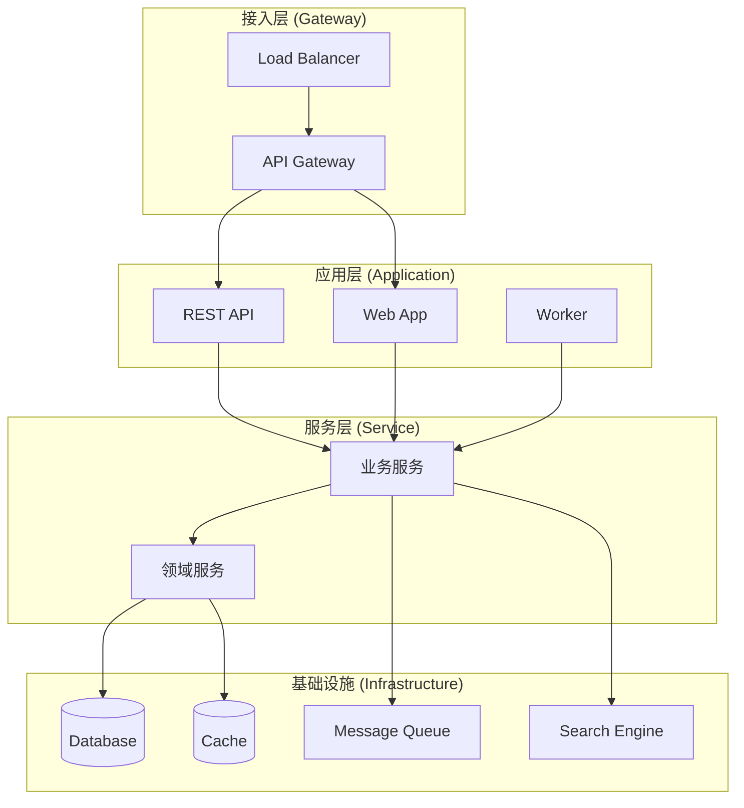
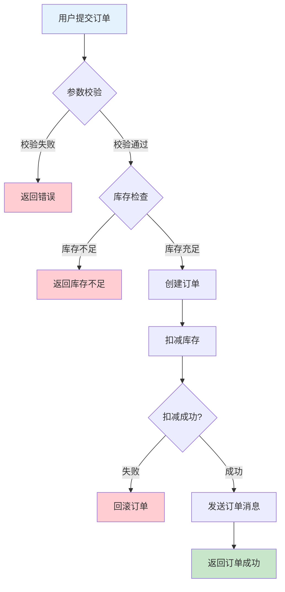
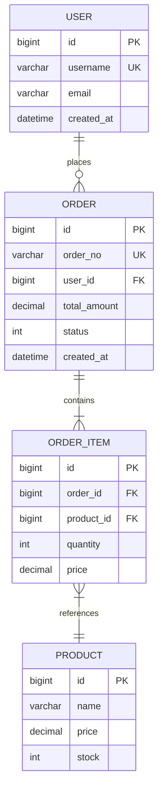
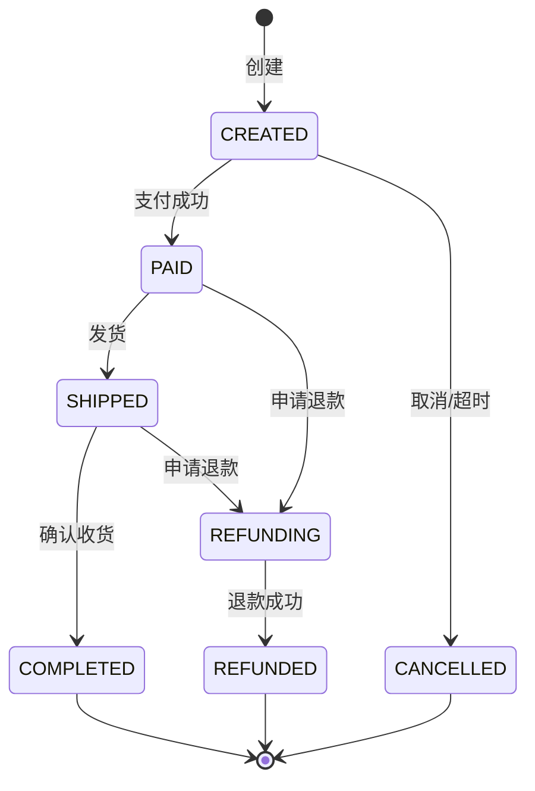

# 大型复杂项目分析与优化战术指导手册

> **适用范围**：任何规模庞大、业务复杂的软件项目  
> **核心价值**：系统化方法论 + 可复制执行框架 + 数据驱动决策  
> **最终目标**：提高项目质量、性能、可维护性

---

## 目录

- [第一部分：战略全景](#第一部分战略全景)
- [第二部分：分阶段执行框架](#第二部分分阶段执行框架)
  - [阶段一：项目全貌扫描](#阶段一项目全貌扫描)
  - [阶段二：技术架构解析](#阶段二技术架构解析)
  - [阶段三：业务逻辑梳理](#阶段三业务逻辑梳理)
  - [阶段四：问题识别与分类](#阶段四问题识别与分类)
  - [阶段五：优化方案设计](#阶段五优化方案设计)
  - [阶段六：执行与验证](#阶段六执行与验证)
- [第三部分：工具箱与检查清单](#第三部分工具箱与检查清单)
- [第四部分：风险管理与回滚策略](#第四部分风险管理与回滚策略)
- [第五部分：交付物模板](#第五部分交付物模板)
- [附录](#附录)

---

## 第一部分：战略全景

### 1.1 整体方法论：由外而内、由粗到细

```
┌─────────────────────────────────────────────────────────────────────┐
│                        整体执行路线图                                 │
├─────────────────────────────────────────────────────────────────────┤
│                                                                     │
│   [阶段一]         [阶段二]         [阶段三]                          │
│   项目全貌    ──►  技术架构    ──►  业务逻辑                          │
│   扫描             解析             梳理                              │
│   (1-2天)          (2-3天)          (3-5天)                          │
│                                                                     │
│        │               │               │                            │
│        ▼               ▼               ▼                            │
│   ┌────────────────────────────────────┐                            │
│   │    [阶段四] 问题识别与分类          │                            │
│   │         (2-3天)                    │                            │
│   └────────────────────────────────────┘                            │
│                      │                                              │
│                      ▼                                              │
│   ┌────────────────────────────────────┐                            │
│   │    [阶段五] 优化方案设计            │                            │
│   │         (3-5天)                    │                            │
│   └────────────────────────────────────┘                            │
│                      │                                              │
│                      ▼                                              │
│   ┌────────────────────────────────────┐                            │
│   │    [阶段六] 执行与验证              │                            │
│   │         (持续迭代)                 │                            │
│   └────────────────────────────────────┘                            │
│                                                                     │
└─────────────────────────────────────────────────────────────────────┘
```

### 1.2 核心原则

| 原则 | 说明 | 实践要点 |
|------|------|----------|
| **数据驱动** | 所有决策基于度量数据 | 收集代码度量、性能基线、Git 历史统计 |
| **渐进深入** | 先全貌后细节、先理解后改造 | 抵制直接"修代码"的冲动 |
| **小步快跑** | 每次改动可控、可验证、可回滚 | 单一职责变更、频繁提交 |
| **价值优先** | ROI 最高的问题优先处理 | 建立问题优先级矩阵 |
| **持续验证** | 每个阶段有明确验收标准 | 建立检查清单机制 |

### 1.3 角色与职责

| 角色 | 职责 | 交付物 |
|------|------|--------|
| **架构分析师** | 项目全貌扫描、技术架构解析 | 架构分析报告、技术债务清单 |
| **业务分析师** | 业务逻辑梳理、领域模型构建 | 业务流程图、领域模型文档 |
| **质量工程师** | 问题识别、代码质量分析 | 问题分类报告、质量度量报告 |
| **优化负责人** | 方案设计、执行协调 | 优化方案、执行计划、验收报告 |

---

## 第二部分：分阶段执行框架

---

### 阶段一：项目全貌扫描

> **目标**：在不深入代码细节的情况下，快速建立对项目的整体认知  
> **周期**：1-2 天  
> **产出**：《项目概览报告》

#### 1.1 项目元信息收集

**收集清单：**

| 维度 | 关键信息 | 收集方式 |
|------|----------|----------|
| 基本信息 | 项目名称、版本、负责人、创建时间 | README、配置文件 |
| 技术栈 | 语言版本、框架版本、核心依赖 | 构建配置文件 |
| 规模指标 | 代码行数、文件数量、模块数量 | 代码统计工具 |
| 团队信息 | 核心贡献者、活跃度、提交频率 | Git 历史分析 |

**执行命令示例（通用）：**

```bash
# 查看项目文档
cat README.md

# 代码规模统计
find . -type f \( -name "*.java" -o -name "*.js" -o -name "*.ts" -o -name "*.py" \) | wc -l
find . -type f \( -name "*.java" -o -name "*.js" -o -name "*.ts" -o -name "*.py" \) -exec wc -l {} + | tail -1

# Git 历史概览
git log --oneline --reverse | head -5    # 最早提交
git log --oneline | head -10             # 最近提交
git shortlog -sn --all | head -10        # 核心贡献者
```

#### 1.2 目录结构分析

**分析要点：**

```
项目根目录
├── 源码目录结构 ────────────► 识别分层/分模块方式
├── 配置文件位置 ────────────► 识别环境管理方式
├── 测试目录结构 ────────────► 评估测试覆盖情况
├── 文档目录结构 ────────────► 评估文档完善程度
└── 构建部署文件 ────────────► 识别 CI/CD 配置
```

**常见架构模式识别：**

| 模式 | 目录特征 | 适用场景 |
|------|----------|----------|
| **分层架构** | controller/service/repository/entity | 传统单体应用 |
| **领域驱动** | domain/application/infrastructure | 复杂业务系统 |
| **微服务** | 多个独立服务目录，各有完整结构 | 分布式系统 |
| **模块化** | 按功能划分模块，各有 src/test | 中大型项目 |

#### 1.3 Git 历史概览

**关键分析维度：**

```
Git 历史分析
│
├── 时间维度
│   ├── 项目年龄
│   ├── 活跃周期（按月/季度）
│   └── 最近活跃度
│
├── 贡献维度
│   ├── 核心贡献者（TOP 10）
│   ├── 代码所有权分布
│   └── 知识集中度风险
│
└── 变更维度
    ├── 高频修改文件（热点代码）
    ├── 变更量最大的模块
    └── Bug 修复集中区域
```

**热点代码识别命令：**

```bash
# 修改频率最高的文件（代码热点）
git log --pretty=format: --name-only --since="1 year ago" | \
  sort | uniq -c | sort -nr | head -20

# 代码变更量最大的文件
git log --numstat --pretty="%H" --since="1 year ago" | \
  awk 'NF==3 {plus[$3]+=$1; minus[$3]+=$2} END {for (f in plus) print plus[f]+minus[f], f}' | \
  sort -nr | head -20

# Bug 修复集中的文件
git log --oneline --grep="fix\|bug\|error" --since="1 year ago" --name-only | \
  grep -v "^[a-f0-9]" | sort | uniq -c | sort -nr | head -20
```

#### 1.4 阶段一产出：《项目概览报告》

```markdown
# 项目概览报告

## 1. 基本信息
- 项目名称：[名称]
- 版本：[版本号]
- 项目年龄：[X年Y月]
- 总代码行数：[XXX,XXX 行]
- 文件数量：[XXX 个]

## 2. 技术栈
| 类别 | 技术 | 版本 |
|------|------|------|
| 语言 | Java/Python/... | X.X |
| 框架 | Spring/Django/... | X.X |
| 数据库 | MySQL/PostgreSQL/... | X.X |
| ... | ... | ... |

## 3. 团队概况
- 总贡献者：[XX 人]
- 核心贡献者（TOP 5）：[名单]
- 最近 3 月活跃度：[XX commits/月]

## 4. 代码热点（TOP 10 高频修改文件）
| 排名 | 文件 | 修改次数 | 风险等级 |
|------|------|----------|----------|
| 1 | path/to/file | XX | 高/中/低 |
| ... | ... | ... | ... |

## 5. 初步风险识别
- [风险1]
- [风险2]
- ...

## 6. 下一阶段重点
- [重点关注领域1]
- [重点关注领域2]
```

---

### 阶段二：技术架构解析

> **目标**：理解系统的技术选型、架构设计和基础设施  
> **周期**：2-3 天  
> **产出**：《技术架构分析报告》

#### 2.1 依赖分析

**分析维度：**

| 层级 | 分析要点 | 关注问题 |
|------|----------|----------|
| **核心框架** | 版本、配置方式、扩展点 | 版本过旧？配置混乱？ |
| **数据层** | ORM/JDBC、连接池、事务管理 | N+1问题？事务边界？ |
| **缓存层** | 缓存策略、失效机制、一致性 | 缓存穿透？雪崩？ |
| **消息队列** | 消息模式、消费逻辑、幂等性 | 消息丢失？重复消费？ |
| **外部服务** | 第三方 API、超时配置、熔断 | 单点故障？级联失败？ |

**依赖健康度检查：**

```
依赖健康度评估矩阵

                        使用频率
                   低          高
              ┌─────────┬─────────┐
          低  │  考虑   │  关注   │
    维护     │  移除   │  替换   │
    活跃度    ├─────────┼─────────┤
          高  │  保持   │  核心   │
              │  观察   │  依赖   │
              └─────────┴─────────┘
```

#### 2.2 配置文件分析

**配置分析清单：**

- [ ] 数据源配置（单/多数据源）
- [ ] 缓存配置（本地/分布式）
- [ ] 中间件连接（消息队列、搜索引擎等）
- [ ] 安全配置（认证、授权、加密）
- [ ] 业务开关和参数
- [ ] 环境差异配置（dev/test/prod）
- [ ] 敏感信息管理（密码、密钥）

**配置问题识别：**

| 问题类型 | 表现 | 风险等级 |
|----------|------|----------|
| 硬编码 | 代码中写死配置值 | 高 |
| 明文密码 | 配置文件中明文存储敏感信息 | 高 |
| 环境耦合 | 缺少环境区分，配置混乱 | 中 |
| 魔法数字 | 未命名的配置常量 | 中 |
| 过期配置 | 不再使用但未清理的配置 | 低 |

#### 2.3 入口点识别

**系统入口分类：**

```
系统入口点
│
├── HTTP 入口
│   ├── REST API（Controller/Endpoint）
│   ├── WebSocket
│   └── GraphQL
│
├── 异步入口
│   ├── 消息消费者（MQ Listener）
│   ├── 定时任务（Scheduler）
│   └── 事件监听器
│
├── RPC 入口
│   ├── gRPC Service
│   ├── Dubbo Provider
│   └── Feign/RestTemplate 回调
│
└── 命令行入口
    ├── CLI 工具
    └── 批处理任务
```

#### 2.4 架构图绘制

**推荐使用 Mermaid 绘制标准化架构图：**



#### 2.5 阶段二产出：《技术架构分析报告》

```markdown
# 技术架构分析报告

## 1. 架构总览
[插入架构图]

## 2. 技术栈详情
### 2.1 核心框架
| 框架 | 版本 | 用途 | 健康度 |
|------|------|------|--------|

### 2.2 数据存储
| 组件 | 类型 | 用途 | 备注 |
|------|------|------|------|

### 2.3 中间件
| 组件 | 版本 | 用途 | 配置要点 |
|------|------|------|----------|

## 3. 系统入口清单
### 3.1 API 入口（共 XX 个）
### 3.2 定时任务（共 XX 个）
### 3.3 消息消费者（共 XX 个）

## 4. 配置管理现状
- 配置方式：[集中/分散]
- 环境管理：[方式描述]
- 敏感信息：[管理方式]

## 5. 技术债务识别
| 编号 | 问题 | 影响范围 | 建议优先级 |
|------|------|----------|------------|

## 6. 架构风险评估
| 风险 | 描述 | 可能性 | 影响 | 建议措施 |
|------|------|--------|------|----------|
```

---

### 阶段三：业务逻辑梳理

> **目标**：深入理解核心业务流程和领域模型  
> **周期**：3-5 天  
> **产出**：《业务逻辑分析报告》

#### 3.1 业务领域识别

**领域划分方法：**

```
业务领域识别步骤
│
├── Step 1: 收集业务术语
│   └── 从代码、文档、数据库表名收集领域词汇
│
├── Step 2: 绘制业务边界
│   └── 识别独立的业务子领域
│
├── Step 3: 识别核心域
│   └── 区分核心域、支撑域、通用域
│
└── Step 4: 验证边界
    └── 与业务方确认领域划分合理性
```

**领域分类：**

| 类型 | 说明 | 投入策略 |
|------|------|----------|
| **核心域** | 企业核心竞争力所在 | 重点投入、精心设计 |
| **支撑域** | 支持核心业务运作 | 适度投入、满足需求 |
| **通用域** | 可被其他系统复用 | 考虑使用成熟方案 |

#### 3.2 核心业务流程追踪

**流程追踪方法：**

```
业务流程追踪（以订单为例）
│
├── 1. 识别入口
│   └── OrderController.createOrder()
│
├── 2. 追踪调用链
│   └── Controller → Service → Repository → Database
│
├── 3. 记录分支逻辑
│   ├── 正常流程
│   ├── 异常处理
│   └── 边界条件
│
├── 4. 分析数据流转
│   └── DTO → Entity → DO → VO
│
└── 5. 绘制流程图
    └── 输出 Mermaid 流程图
```

**业务流程图示例：**



#### 3.3 数据模型分析

**分析要点：**

| 维度 | 关注点 | 常见问题 |
|------|--------|----------|
| **表结构** | 字段设计、类型选择 | 冗余字段、类型不当 |
| **索引设计** | 主键、唯一索引、普通索引 | 索引缺失、索引过多 |
| **表关系** | 外键、关联方式 | 循环依赖、过度关联 |
| **数据生命周期** | 归档策略、清理机制 | 数据膨胀、无清理 |

**ER 图绘制：**



#### 3.4 状态机分析

**对于有状态转换的业务，绘制状态图：**



#### 3.5 阶段三产出：《业务逻辑分析报告》

```markdown
# 业务逻辑分析报告

## 1. 业务领域划分
### 1.1 领域地图
[领域划分图]

### 1.2 领域说明
| 领域 | 类型 | 核心概念 | 负责模块 |
|------|------|----------|----------|

## 2. 核心业务流程
### 2.1 [业务流程1] - 如：订单创建
[流程图]
[流程说明]

### 2.2 [业务流程2] - 如：支付处理
[流程图]
[流程说明]

## 3. 数据模型
### 3.1 核心实体关系
[ER 图]

### 3.2 数据字典
[核心表结构说明]

## 4. 状态机说明
### 4.1 [实体1] 状态机
[状态图]

## 5. 业务规则汇总
| 编号 | 规则描述 | 所在模块 | 实现方式 |
|------|----------|----------|----------|

## 6. 业务风险与建议
| 风险 | 影响 | 建议 |
|------|------|------|
```

---

### 阶段四：问题识别与分类

> **目标**：系统化识别项目存在的各类问题并分类排优  
> **周期**：2-3 天  
> **产出**：《问题清单与优先级报告》

#### 4.1 问题分类体系

```
问题分类体系
│
├── 代码质量问题
│   ├── 代码异味（Code Smells）
│   ├── 重复代码（Duplication）
│   ├── 复杂度过高（Complexity）
│   └── 测试缺失（Test Coverage）
│
├── 架构设计问题
│   ├── 耦合度过高
│   ├── 职责不清
│   ├── 扩展性差
│   └── 可维护性差
│
├── 性能问题
│   ├── 数据库性能
│   ├── 接口响应慢
│   ├── 资源消耗高
│   └── 并发瓶颈
│
├── 安全问题
│   ├── 认证授权
│   ├── 数据安全
│   ├── 注入风险
│   └── 敏感信息泄露
│
└── 运维问题
    ├── 日志不完善
    ├── 监控缺失
    ├── 部署复杂
    └── 文档缺乏
```

#### 4.2 代码异味识别

**高优先级代码异味：**

| 异味 | 识别标准 | 推荐手法 | 工具辅助 |
|------|----------|----------|----------|
| **过长方法** | >20 行 | Extract Method | IDE 检查 |
| **过大类** | >500 行 | Extract Class | 静态分析 |
| **重复代码** | 相似代码块 | Extract Method, Pull Up | SonarQube |
| **过长参数列表** | >3 个参数 | Introduce Parameter Object | IDE 检查 |
| **Switch 惊悚** | 重复的 switch/if-else | Replace Conditional with Polymorphism | 代码审查 |
| **依恋情结** | 过度使用他类数据 | Move Method | 依赖分析 |
| **数据泥团** | 相同字段组重复 | Extract Class | 代码审查 |

**代码异味检测命令：**

```bash
# 找出过大的类（>500行）
find . -name "*.java" -exec wc -l {} + | awk '$1 > 500 {print}' | sort -rn

# 找出过长的方法（需要静态分析工具）
# 推荐使用：SonarQube, PMD, Checkstyle, ESLint 等

# 找出重复代码
# 推荐使用：jscpd, CPD (Copy Paste Detector)
```

#### 4.3 性能问题识别

**性能问题识别清单：**

| 问题类型 | 识别方式 | 关键指标 |
|----------|----------|----------|
| **慢 SQL** | 慢查询日志、APM | 执行时间 > 1s |
| **N+1 查询** | 代码审查、SQL 日志 | 循环中执行 SQL |
| **内存泄漏** | 堆分析、监控告警 | 内存持续增长 |
| **连接池耗尽** | 监控告警、日志 | 等待连接超时 |
| **锁竞争** | Thread Dump、监控 | 线程阻塞 |
| **缓存失效** | 监控、日志 | 缓存命中率低 |

#### 4.4 问题优先级矩阵

```
问题优先级矩阵

              影响范围
         小          大
    ┌─────────┬─────────┐
低  │   P4    │   P3    │
影  │  可选   │  计划   │
响  ├─────────┼─────────┤
严  │   P3    │   P1    │
重  │  计划   │  紧急   │
度  ├─────────┼─────────┤
高  │   P2    │   P0    │
    │  重要   │  立即   │
    └─────────┴─────────┘
```

**优先级定义：**

| 优先级 | 响应时间 | 处理策略 |
|--------|----------|----------|
| **P0** | 立即 | 停止其他工作，立即处理 |
| **P1** | 24小时内 | 优先安排，本周解决 |
| **P2** | 1周内 | 纳入迭代计划 |
| **P3** | 1月内 | 纳入季度计划 |
| **P4** | 按需 | 有余力时处理 |

#### 4.5 阶段四产出：《问题清单与优先级报告》

```markdown
# 问题清单与优先级报告

## 1. 问题统计概览
| 类别 | P0 | P1 | P2 | P3 | P4 | 总计 |
|------|----|----|----|----|----|----|
| 代码质量 | | | | | | |
| 架构设计 | | | | | | |
| 性能问题 | | | | | | |
| 安全问题 | | | | | | |
| 运维问题 | | | | | | |
| **总计** | | | | | | |

## 2. P0 - 立即处理（共 X 项）
| 编号 | 问题描述 | 所在模块 | 影响 | 负责人 |
|------|----------|----------|------|--------|

## 3. P1 - 紧急处理（共 X 项）
[同上格式]

## 4. P2 - 重要处理（共 X 项）
[同上格式]

## 5. P3/P4 - 计划处理（共 X 项）
[同上格式]

## 6. 技术债务清单
| 编号 | 债务描述 | 产生原因 | 影响评估 | 建议处理时间 |
|------|----------|----------|----------|--------------|

## 7. 处理建议
### 7.1 短期（1-2周）
### 7.2 中期（1-2月）
### 7.3 长期（1季度+）
```

---

### 阶段五：优化方案设计

> **目标**：针对识别的问题设计系统化的优化方案  
> **周期**：3-5 天  
> **产出**：《系统优化方案》

#### 5.1 优化策略选择

**根据问题类型选择策略：**

| 问题类型 | 优化策略 | 典型手法 |
|----------|----------|----------|
| **代码异味** | 重构 | Extract Method/Class, Rename, Move |
| **重复代码** | 抽象复用 | Extract Superclass, Template Method |
| **复杂度高** | 简化拆分 | Decompose Conditional, Replace with Polymorphism |
| **耦合度高** | 解耦 | Dependency Injection, Interface Extraction |
| **性能问题** | 优化/缓存/异步 | 算法优化、加缓存、消息队列 |
| **可测试性差** | 重构+补测试 | DI、接口提取、Mock |

#### 5.2 重构手法速查

| 问题 | 手法 | 说明 |
|------|------|------|
| 方法太长 | Extract Method | 提取小方法 |
| 表达式复杂 | Extract Variable | 引入解释变量 |
| 参数过多 | Introduce Parameter Object | 参数对象化 |
| 类太大 | Extract Class | 拆分职责 |
| 命名不清 | Rename | 重命名 |
| 重复代码 | Extract Method + Pull Up | 提取并上移 |
| Switch 惊悚 | Replace Conditional with Polymorphism | 多态替换 |
| 依赖过强 | Extract Interface + DI | 接口提取+依赖注入 |

#### 5.3 优化方案设计原则

**重构黄金法则：**

```
┌────────────────────────────────────────────────┐
│              重构四原则                         │
├────────────────────────────────────────────────┤
│ 1. 先写测试，再重构                             │
│    - 确保行为不变的验收标准                      │
│                                                │
│ 2. 小步前进，频繁验证                           │
│    - 每个小步骤都能编译通过、测试通过            │
│                                                │
│ 3. 一次只做一种重构                             │
│    - 避免多个变更混在一起                        │
│                                                │
│ 4. 保持代码始终可工作                           │
│    - 任何时候都可以停下来                        │
└────────────────────────────────────────────────┘
```

#### 5.4 优化方案模板

```markdown
# [模块名] 优化方案

## 1. 问题概述
- 问题描述：[描述]
- 影响范围：[范围]
- 当前度量：[复杂度/行数/性能指标]
- 目标度量：[优化后预期]

## 2. 优化策略
- 策略选择：[重构/性能优化/架构调整]
- 核心手法：[具体手法]
- 预计工作量：[X 人天]

## 3. 执行步骤
### Step 1: [步骤名]
- 操作：[具体操作]
- 验证：[验证方式]
- 风险：[潜在风险]

### Step 2: [步骤名]
...

## 4. 影响分析
- 涉及文件：[文件列表]
- 依赖变更：[依赖变化]
- 接口变化：[是否兼容]

## 5. 验收标准
- [ ] 编译通过
- [ ] 所有测试通过
- [ ] 性能指标达标
- [ ] Code Review 通过

## 6. 回滚方案
- 回滚条件：[触发条件]
- 回滚步骤：[具体步骤]
```

#### 5.5 阶段五产出：《系统优化方案》

```markdown
# 系统优化方案

## 1. 优化目标
### 1.1 质量目标
- 代码复杂度降低 XX%
- 重复代码率降低 XX%
- 测试覆盖率提升至 XX%

### 1.2 性能目标
- 接口平均响应时间 < XXms
- 数据库慢查询减少 XX%
- 资源利用率优化 XX%

### 1.3 可维护性目标
- 模块耦合度降低
- 核心代码注释率 > XX%
- 文档覆盖核心功能

## 2. 优化路线图
### 2.1 第一阶段：基础优化（Week 1-2）
| 任务 | 目标 | 负责人 | 状态 |
|------|------|--------|------|

### 2.2 第二阶段：核心重构（Week 3-4）
[同上格式]

### 2.3 第三阶段：性能优化（Week 5-6）
[同上格式]

### 2.4 第四阶段：巩固验收（Week 7-8）
[同上格式]

## 3. 详细优化方案
### 3.1 [模块1] 优化方案
[详细方案]

### 3.2 [模块2] 优化方案
[详细方案]

## 4. 资源需求
| 角色 | 人数 | 投入时间 |
|------|------|----------|

## 5. 风险管理
| 风险 | 可能性 | 影响 | 缓解措施 |
|------|--------|------|----------|

## 6. 验收标准
[明确的验收条件]
```

---

### 阶段六：执行与验证

> **目标**：按计划执行优化并持续验证效果  
> **周期**：持续迭代  
> **产出**：《优化执行报告》

#### 6.1 执行流程

```
执行循环
│
├── Plan（计划）
│   └── 选择本迭代要处理的优化项
│
├── Do（执行）
│   ├── 创建重构分支
│   ├── 按步骤执行
│   └── 小步提交
│
├── Check（检查）
│   ├── 运行测试
│   ├── Code Review
│   └── 度量对比
│
└── Act（改进）
    ├── 合并主分支
    ├── 总结经验
    └── 更新文档
```

#### 6.2 单次重构执行模板

```bash
# 1. 创建重构分支
git checkout -b refactor/[module-name]

# 2. 记录基线度量
[记录当前代码度量]

# 3. 执行重构（小步循环）
# Loop:
#   - 执行单个重构手法
#   - 编译
#   - 运行测试
#   - 提交：git commit -m "refactor: [描述]"

# 4. 完成后度量对比
[对比优化前后度量]

# 5. Code Review
git push origin refactor/[module-name]
# 创建 PR

# 6. 合并
git checkout main
git merge refactor/[module-name]
```

#### 6.3 验证检查清单

**重构前：**
- [ ] 有版本控制（Git）
- [ ] 核心路径有测试覆盖
- [ ] 了解改动影响范围
- [ ] 创建重构分支
- [ ] 记录度量基线

**重构中：**
- [ ] 一次只做一种重构
- [ ] 每步：编译通过 + 测试通过
- [ ] 小步提交

**重构后：**
- [ ] 所有测试通过
- [ ] Code Review 通过
- [ ] 度量对比达预期
- [ ] 合并主分支
- [ ] 更新文档

#### 6.4 阶段六产出：《优化执行报告》

```markdown
# 优化执行报告

## 1. 执行概览
- 执行周期：[起止日期]
- 计划任务：XX 项
- 完成任务：XX 项
- 完成率：XX%

## 2. 度量对比
| 指标 | 优化前 | 优化后 | 变化 |
|------|--------|--------|------|
| 代码行数 | | | |
| 圈复杂度 | | | |
| 重复代码率 | | | |
| 测试覆盖率 | | | |
| 平均响应时间 | | | |
| 慢查询数量 | | | |

## 3. 完成任务清单
| 任务 | 状态 | 负责人 | 完成日期 |
|------|------|--------|----------|

## 4. 遗留问题
| 问题 | 原因 | 计划处理时间 |
|------|------|--------------|

## 5. 经验总结
### 5.1 做得好的
- [经验1]
- [经验2]

### 5.2 待改进的
- [改进点1]
- [改进点2]

## 6. 下一步计划
[后续优化计划]
```

---

## 第三部分：工具箱与检查清单

### 3.1 分析工具箱

#### Git 命令速查

| 场景 | 命令 |
|------|------|
| 核心贡献者 | `git shortlog -sn --all` |
| 代码热点 | `git log --pretty=format: --name-only \| sort \| uniq -c \| sort -nr` |
| 文件历史 | `git log --oneline -20 -- <file>` |
| 搜索提交 | `git log --all --oneline --grep="关键词"` |
| Bug 定位 | `git bisect` |
| 文件 blame | `git blame <file>` |
| 分支对比 | `git diff main..feature --stat` |

#### 代码分析工具

| 工具 | 用途 | 适用语言 |
|------|------|----------|
| SonarQube | 代码质量全面分析 | 多语言 |
| PMD | 代码缺陷检测 | Java |
| ESLint | 代码规范检查 | JavaScript/TypeScript |
| Pylint | 代码质量分析 | Python |
| JSCPD | 重复代码检测 | 多语言 |

#### 性能分析工具

| 工具 | 用途 | 场景 |
|------|------|------|
| JProfiler/YourKit | Java 性能分析 | CPU/内存分析 |
| Arthas | Java 在线诊断 | 生产环境诊断 |
| Chrome DevTools | 前端性能 | Web 应用 |
| APM (SkyWalking/Pinpoint) | 链路追踪 | 分布式系统 |

### 3.2 检查清单汇总

#### 项目扫描检查清单

- [ ] 收集项目基本信息
- [ ] 统计代码规模
- [ ] 分析目录结构
- [ ] 识别架构模式
- [ ] 分析 Git 历史
- [ ] 识别核心贡献者
- [ ] 找出代码热点
- [ ] 输出项目概览报告

#### 架构分析检查清单

- [ ] 依赖树分析
- [ ] 框架版本检查
- [ ] 配置文件分析
- [ ] 入口点识别
- [ ] 绘制架构图
- [ ] 识别技术债务
- [ ] 输出架构分析报告

#### 业务分析检查清单

- [ ] 识别业务领域
- [ ] 追踪核心流程
- [ ] 分析数据模型
- [ ] 绘制状态机
- [ ] 梳理业务规则
- [ ] 输出业务分析报告

#### 问题识别检查清单

- [ ] 代码异味扫描
- [ ] 重复代码检测
- [ ] 复杂度分析
- [ ] 测试覆盖检查
- [ ] 性能问题识别
- [ ] 安全问题检查
- [ ] 问题分类排优
- [ ] 输出问题清单

#### 优化执行检查清单

- [ ] 创建重构分支
- [ ] 记录度量基线
- [ ] 按步骤执行
- [ ] 每步验证
- [ ] 小步提交
- [ ] Code Review
- [ ] 度量对比
- [ ] 合并主分支

---

## 第四部分：风险管理与回滚策略

### 4.1 风险矩阵

| 风险 | 可能性 | 影响 | 缓解措施 |
|------|:------:|:----:|----------|
| 引入 Bug | 中 | 高 | 完善测试，小步验证 |
| 破坏 API | 中 | 高 | 保留原签名委托 |
| 范围蔓延 | 高 | 中 | 明确边界，抵制诱惑 |
| 时间超支 | 中 | 中 | 分阶段交付 |
| 知识流失 | 低 | 高 | 文档化、知识分享 |
| 团队抵触 | 中 | 中 | 沟通价值、渐进推进 |

### 4.2 回滚策略

```
回滚级别
│
├── Level 1: 单文件回滚
│   └── git checkout <file>
│
├── Level 2: 阶段回滚
│   └── git reset --hard HEAD~n
│
├── Level 3: 分支回滚
│   └── git checkout main
│
└── Level 4: 版本回滚
    └── 回退到上一个稳定版本
```

### 4.3 紧急处理流程

```
发现严重问题时：
│
├── 1. 立即停止当前操作
│
├── 2. 评估影响范围
│   ├── 影响范围小 → 修复后继续
│   └── 影响范围大 → 回滚
│
├── 3. 执行回滚（如需要）
│
├── 4. 记录问题
│   ├── 问题现象
│   ├── 根本原因
│   └── 预防措施
│
└── 5. 复盘后继续
```

---

## 第五部分：交付物模板

### 5.1 交付物清单

| 阶段 | 交付物 | 格式 |
|------|--------|------|
| 阶段一 | 项目概览报告 | Markdown |
| 阶段二 | 技术架构分析报告 | Markdown + Mermaid |
| 阶段三 | 业务逻辑分析报告 | Markdown + Mermaid |
| 阶段四 | 问题清单与优先级报告 | Markdown + 表格 |
| 阶段五 | 系统优化方案 | Markdown |
| 阶段六 | 优化执行报告 | Markdown + 度量数据 |

### 5.2 文档命名规范

```
docs/
├── analysis/
│   ├── 01-project-overview.md          # 项目概览
│   ├── 02-architecture-analysis.md     # 架构分析
│   ├── 03-business-logic-analysis.md   # 业务分析
│   └── 04-issue-list.md                # 问题清单
├── plans/
│   ├── optimization-plan.md            # 优化方案
│   └── roadmap.md                      # 路线图
└── reports/
    ├── execution-report-[date].md      # 执行报告
    └── metrics-comparison.md           # 度量对比
```

---

## 附录

### A. 术语表

| 术语 | 说明 |
|------|------|
| **代码异味** | 代码中暗示潜在问题的特征 |
| **技术债务** | 短期妥协导致的长期维护成本 |
| **热点代码** | 频繁修改的代码区域 |
| **圈复杂度** | 代码复杂度度量，基于分支数量 |
| **重构** | 在不改变外部行为下改进内部结构 |
| **领域驱动设计** | 以业务领域为核心的软件设计方法 |

### B. 参考资料

- Martin Fowler,《重构：改善既有代码的设计》
- Eric Evans,《领域驱动设计》
- Robert C. Martin,《代码整洁之道》
- Michael Feathers,《修改代码的艺术》

### C. 常见问题 FAQ

**Q: 大型项目优化应该从哪里开始？**  
A: 从数据收集开始。先完成项目扫描和热点分析，用数据驱动决策，而不是凭直觉改代码。

**Q: 如何说服团队投入时间做优化？**  
A: 量化问题影响（Bug 率、维护成本、性能损失），展示 ROI，从小胜利开始建立信任。

**Q: 重构过程中如何保证系统稳定？**  
A: 坚持"小步快跑"原则，每次只做一种重构，频繁验证，保持代码始终可工作。

**Q: 没有测试覆盖的代码如何重构？**  
A: 先补充关键路径的测试（可以从端到端测试开始），再进行重构。或使用"新旧并行"策略。

**Q: 优化周期太长怎么办？**  
A: 分阶段交付，每个阶段有可验收的成果。优先处理 ROI 最高的问题。

---

> **文档版本**：v1.0  
> **创建日期**：2025-01  
> **适用场景**：任何需要系统性分析和优化的大型软件项目
