# Java 系统分析专家 (Java System Analysis Expert)

本技能提供系统化的方法论，用于理解复杂的 Java 项目并输出对新人友好的业务系统文档。支持使用 Mermaid 绘制各类可视化图表。

## 技能目录

- [分析方法论](#分析方法论)
- [执行流程](#执行流程)
- [Mermaid 图表模板](#mermaid-图表模板)
- [分析工具箱](#分析工具箱)
- [新人友好原则](#新人友好原则)
- [质量检查清单](#质量检查清单)
- [协作建议](#协作建议)

详细参考：
- 分析模式指南：`references/analysis-patterns.md`
- 文档模板：`references/document-template.md`

## 分析方法论

采用「由外而内、由粗到细」的渐进式分析策略：

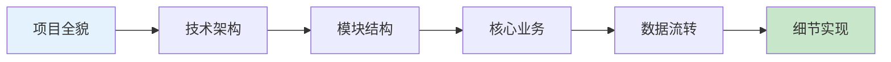

## 执行流程

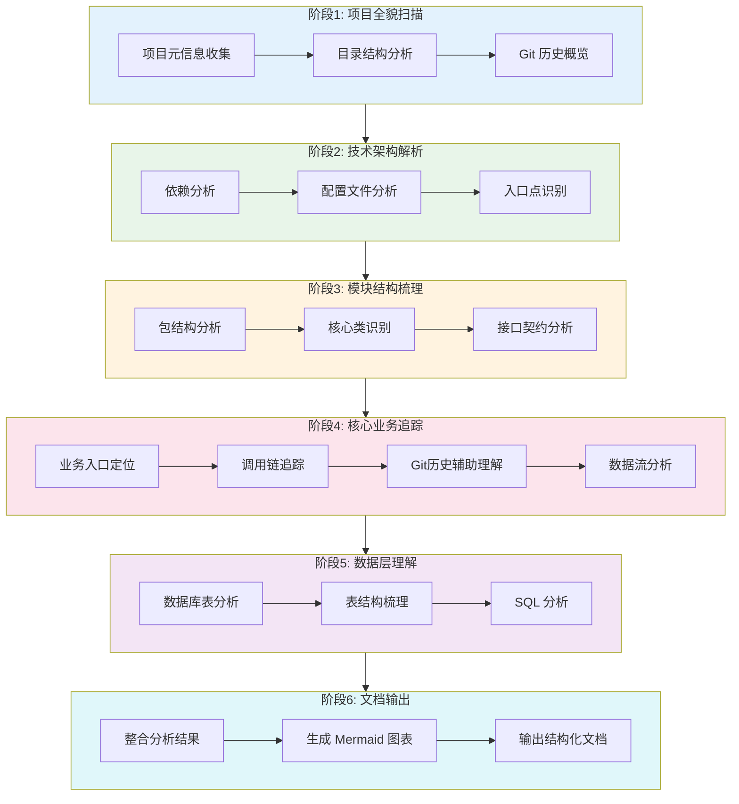

### 阶段 1：项目全貌扫描

**目标**：快速建立项目整体认知

#### 1.1 项目元信息收集

```bash
# 查看项目基本信息
cat README.md
cat pom.xml | head -50  # Maven 项目
cat build.gradle        # Gradle 项目

# 统计代码规模
find . -name "*.java" | wc -l
find . -name "*.java" -exec wc -l {} + | tail -1
```

提取关键信息：
- 项目名称和描述
- 技术栈版本（Java、Spring Boot、MyBatis 等）
- 核心依赖库
- 构建工具和模块结构

#### 1.2 目录结构分析

```bash
# 查看顶层结构
tree -L 2 -d

# 查看源码结构
tree src/main/java -L 3 -d
```

识别项目架构模式：
- 单模块 vs 多模块
- 分层架构（controller/service/repository）
- 领域驱动设计（domain/application/infrastructure）

#### 1.3 Git 历史概览

```bash
# 项目年龄和活跃度
git log --oneline --reverse | head -5  # 最早提交
git log --oneline | head -10           # 最近提交

# 提交统计
git shortlog -sn --all | head -10      # 核心贡献者

# 代码热点（最常修改的文件）
git log --pretty=format: --name-only | sort | uniq -c | sort -rn | head -20
```

### 阶段 2：技术架构解析

**目标**：理解系统的技术选型和架构设计

#### 2.1 依赖分析

```bash
# Maven 依赖树
mvn dependency:tree -Dincludes=org.springframework

# 核心框架识别
grep -r "spring-boot-starter" pom.xml
grep -r "mybatis\|hibernate\|jpa" pom.xml
```

识别技术栈组件：
| 层级 | 常见技术 | 分析要点 |
|------|----------|----------|
| Web 层 | Spring MVC, WebFlux | 路由配置、拦截器 |
| 业务层 | Spring Service | 事务管理、AOP 切面 |
| 数据层 | MyBatis, JPA, Hibernate | ORM 映射、SQL 风格 |
| 缓存层 | Redis, Caffeine | 缓存策略、失效机制 |
| 消息队列 | Kafka, RabbitMQ | 消息模式、消费逻辑 |

#### 2.2 配置文件分析

```bash
# 查找配置文件
find . -name "application*.yml" -o -name "application*.properties"

# 分析配置内容
cat src/main/resources/application.yml
```

提取关键配置：
- 数据源配置（多数据源识别）
- 中间件连接信息
- 业务开关和参数
- 环境差异配置

#### 2.3 入口点识别

```bash
# 主启动类
grep -rn "@SpringBootApplication" --include="*.java"

# API 入口
grep -rn "@RestController\|@Controller" --include="*.java" | head -20

# 定时任务
grep -rn "@Scheduled\|@EnableScheduling" --include="*.java"

# 消息消费者
grep -rn "@KafkaListener\|@RabbitListener" --include="*.java"
```

### 阶段 3：模块结构梳理

**目标**：理解模块划分和职责边界

#### 3.1 包结构分析

```bash
# 列出所有包
find src/main/java -type d | sed 's/src\/main\/java\///' | sort | uniq
```

典型的包结构模式：

**按层分包**：
```
com.example.project
├── controller/    # 接口层
├── service/       # 业务层
│   └── impl/
├── repository/    # 数据层
├── entity/        # 实体类
├── dto/           # 传输对象
└── config/        # 配置类
```

**按功能分包**：
```
com.example.project
├── user/          # 用户模块
│   ├── controller/
│   ├── service/
│   └── repository/
├── order/         # 订单模块
└── product/       # 商品模块
```

#### 3.2 核心类识别

```bash
# 按代码行数排序（复杂类）
find . -name "*.java" -exec wc -l {} + | sort -rn | head -20

# 被引用最多的类
grep -rh "^import.*com\.your\.package" --include="*.java" | sort | uniq -c | sort -rn | head -20
```

#### 3.3 接口契约分析

```bash
# 统计 API 数量
grep -rn "@RequestMapping\|@GetMapping\|@PostMapping" --include="*.java" | wc -l

# API 列表
grep -rn "@.*Mapping" --include="*.java" | grep -oP '(?<=Mapping\(")[^"]*'
```

### 阶段 4：核心业务追踪

**目标**：理解关键业务流程的实现逻辑

#### 4.1 业务入口定位

识别核心业务的 API 入口：

```bash
# 搜索关键业务词
grep -rn "order\|pay\|user\|login" --include="*Controller.java"
```

#### 4.2 调用链追踪

从 Controller 开始，追踪完整调用链，使用 Mermaid 时序图表示：

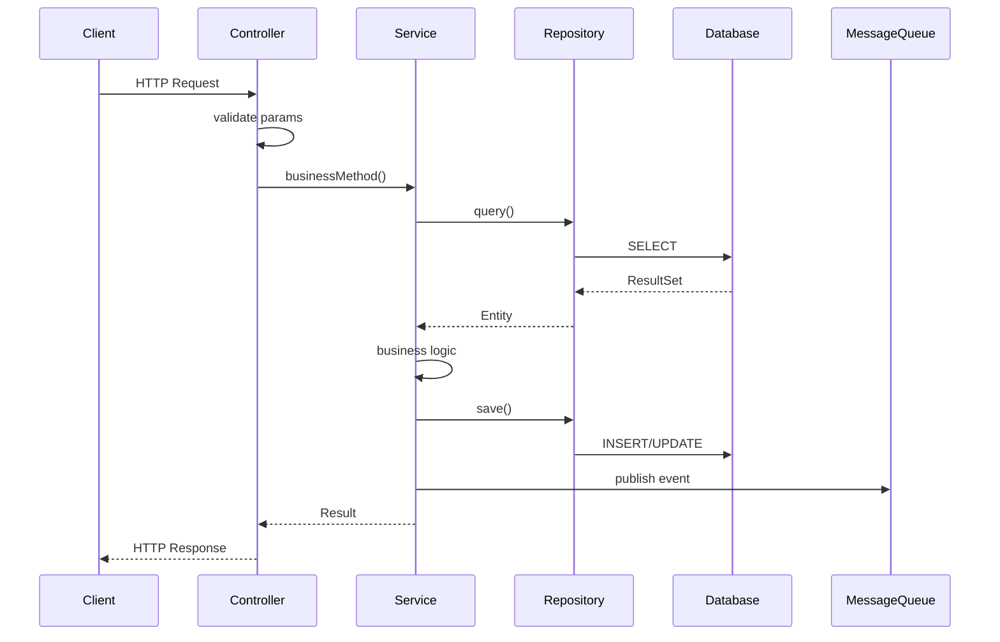

分析方法：
1. 查看 Controller 方法，识别入参和调用的 Service
2. 进入 Service 实现类，理解业务逻辑
3. 追踪数据库操作、远程调用、消息发送
4. 记录关键的分支逻辑和异常处理

#### 4.3 Git 历史辅助理解

```bash
# 查看某个文件的修改历史
git log --oneline -20 -- path/to/ImportantService.java

# 查看某次重要提交的详情
git show <commit-hash>

# 搜索特定功能的实现历史
git log --all --oneline --grep="支付\|payment"
```

#### 4.4 数据流分析

追踪数据从入口到存储的完整流转：

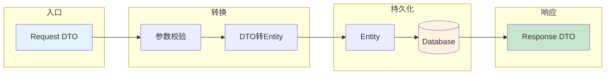

关注点：
- DTO 与 Entity 的转换逻辑
- 数据校验规则
- 数据库表结构和关联关系

### 阶段 5：数据层理解

**目标**：理解数据模型和持久化逻辑

#### 5.1 数据库表分析

```bash
# 查找实体类
find . -name "*.java" -exec grep -l "@Entity\|@Table" {} \;

# 查找 MyBatis Mapper
find . -name "*Mapper.xml" -o -name "*Mapper.java"
```

#### 5.2 表结构梳理

从实体类提取表结构：
- 表名和字段
- 主键策略
- 索引设计
- 表关联关系

#### 5.3 SQL 分析

```bash
# MyBatis XML 中的复杂 SQL
grep -A 20 "<select\|<update\|<insert" src/main/resources/mapper/*.xml
```

### 阶段 6：文档输出

**目标**：生成对新人友好的系统文档

#### 6.1 文档结构模板

```markdown
# [系统名称] 业务系统文档

## 1. 项目概述
### 1.1 系统简介
### 1.2 技术栈
### 1.3 核心功能

## 2. 快速上手
### 2.1 环境准备
### 2.2 本地运行
### 2.3 常用命令

## 3. 架构设计              ← Mermaid 架构图
### 3.1 整体架构图
### 3.2 模块划分
### 3.3 技术选型说明

## 4. 核心业务              ← Mermaid 流程图/时序图
### 4.1 [业务1] 流程说明
### 4.2 [业务2] 流程说明
### 4.3 业务流程图

## 5. 数据模型              ← Mermaid ER 图
### 5.1 核心表结构
### 5.2 表关系图
### 5.3 数据字典

## 6. 接口文档
### 6.1 API 概览
### 6.2 核心接口详情

## 7. 代码导航
### 7.1 目录结构说明
### 7.2 核心类索引
### 7.3 代码阅读顺序建议

## 8. 开发指南
### 8.1 开发规范
### 8.2 常见问题 FAQ
### 8.3 调试技巧

## 9. 历史演进
### 9.1 重要版本记录
### 9.2 技术债务清单

## 附录
### A. 术语表
### B. 参考资料
```

## Mermaid 图表模板

### 分层架构图

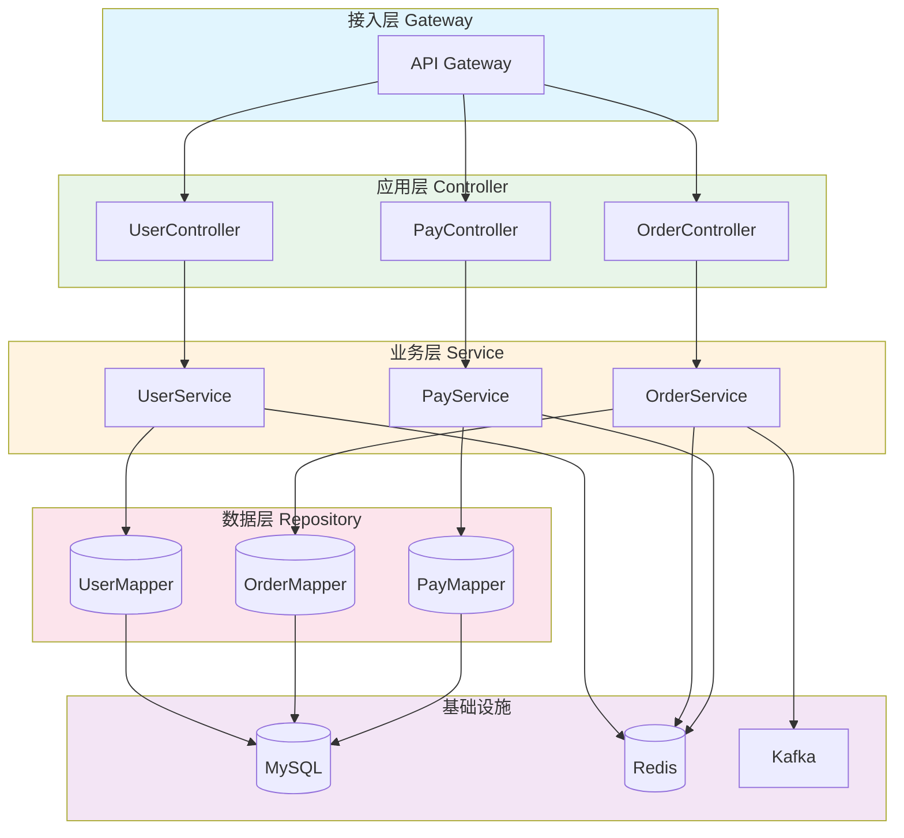

### 微服务架构图

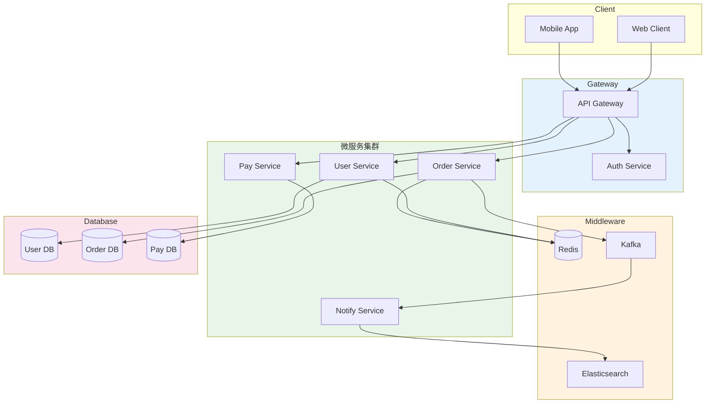

### 业务流程图示例（订单创建）

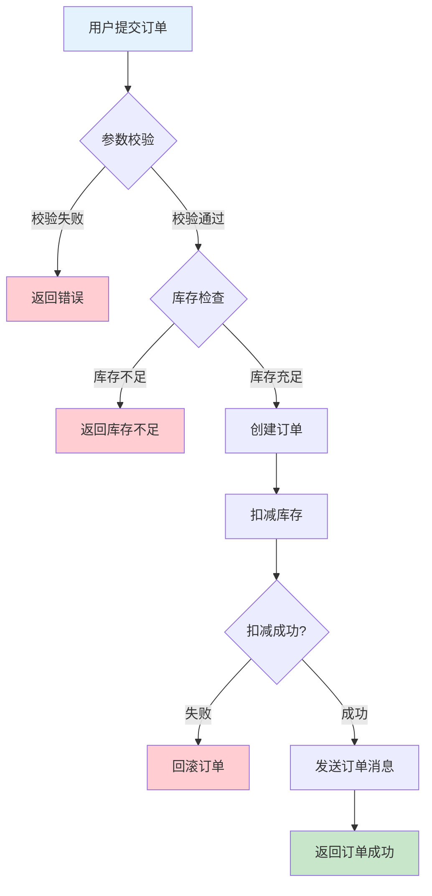

### 状态机图示例

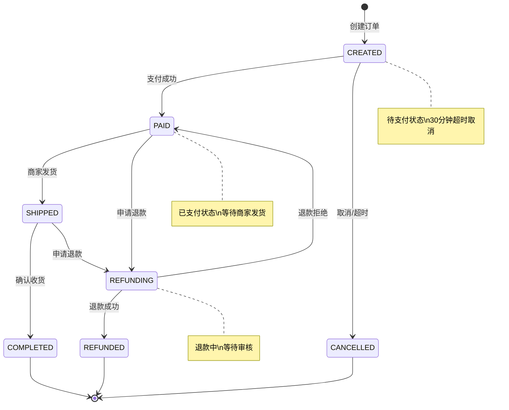

### ER 图示例

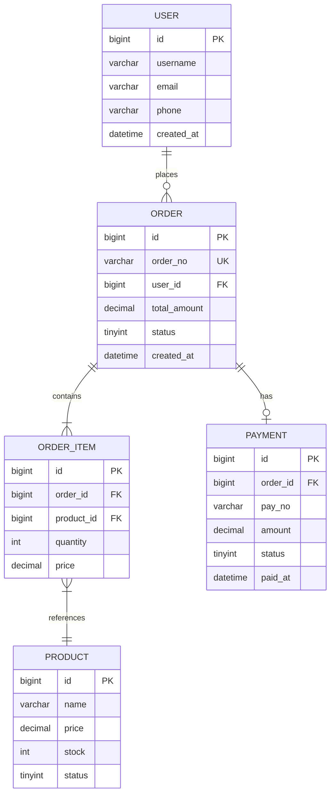

### 类图示例

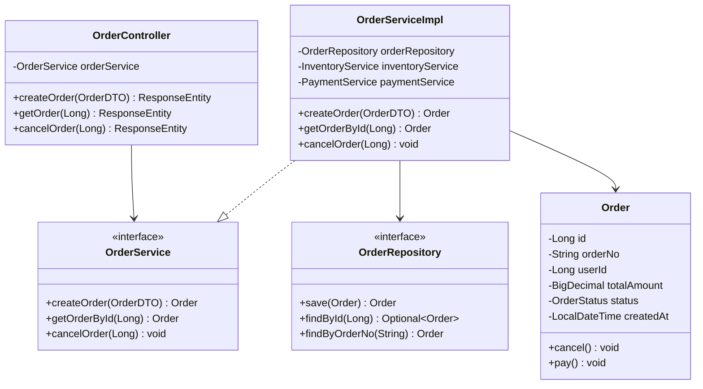
### 3.1 整体架构图
### 3.2 模块划分
### 3.3 技术选型说明

## 4. 核心业务
### 4.1 [业务1] 流程说明
### 4.2 [业务2] 流程说明
### 4.3 业务流程图

## 5. 数据模型
### 5.1 核心表结构
### 5.2 表关系图
### 5.3 数据字典

## 6. 接口文档
### 6.1 API 概览
### 6.2 核心接口详情

## 7. 代码导航
### 7.1 目录结构说明
### 7.2 核心类索引
### 7.3 代码阅读顺序建议

## 8. 开发指南
### 8.1 开发规范
### 8.2 常见问题 FAQ
### 8.3 调试技巧

## 9. 历史演进
### 9.1 重要版本记录
### 9.2 技术债务清单

## 附录
### A. 术语表
### B. 参考资料
```

## 分析工具箱

### Git 命令速查

| 场景 | 命令 | 说明 |
|------|------|------|
| 核心贡献者 | `git shortlog -sn --all` | 按提交数排名 |
| 代码热点(次数) | `git log --pretty=format: --name-only \| sort \| uniq -c \| sort -rn` | 修改频率最高的文件 |
| 文件历史 | `git log --oneline -20 -- <file>` | 查看文件修改历史 |
| 搜索提交 | `git log --all --oneline --grep="关键词"` | 按关键词搜索 |
| 代码演进 | `git log -p --follow -- <file>` | 查看文件完整演进 |
| 时间段变更 | `git log --after="2023-01-01" --before="2023-06-30" --oneline` | 指定时间范围 |
| Bug定位 | `git bisect start && git bisect bad && git bisect good <commit>` | 二分查找引入Bug的提交 |
| 文件blame | `git blame <file>` | 查看每行的最后修改者 |
| 分支对比 | `git diff main..feature --stat` | 比较分支差异 |

### 代码分析命令

| 场景 | 命令 | 说明 |
|------|------|------|
| 代码行数 | `find . -name "*.java" -exec wc -l {} + \| tail -1` | 统计总行数 |
| 类数量 | `find . -name "*.java" \| wc -l` | 统计Java文件数 |
| 搜索注解 | `grep -rn "@注解名" --include="*.java"` | 搜索特定注解 |
| 搜索类引用 | `grep -rn "ClassName" --include="*.java"` | 搜索类的使用 |
| 复杂类识别 | `find . -name "*.java" -exec wc -l {} + \| sort -rn \| head -20` | 找出最大的类 |
| 接口统计 | `grep -rn "@RequestMapping\|@GetMapping\|@PostMapping" --include="*.java" \| wc -l` | 统计API数量 |
| 依赖分析 | `mvn dependency:tree` | Maven依赖树 |
| 循环依赖检测 | `mvn dependency:analyze` | 检测依赖问题 |

### 高级分析命令

```bash
# 识别 God Class（超大类）
find . -name "*.java" -exec wc -l {} + | awk '$1 > 500 {print}' | sort -rn

# 查找循环引用（包级别）
grep -rh "^import.*com\.your\.package" --include="*.java" | \
  sed 's/import //' | sed 's/;$//' | sort | uniq -c | sort -rn | head -30

# 统计各层代码量
for dir in controller service repository entity dto; do
  echo "$dir: $(find . -path "*/$dir/*" -name "*.java" -exec wc -l {} + | tail -1)"
done

# 查找未使用的公共方法（需配合 IDE）
grep -rn "public.*(" --include="*.java" | grep -v "Controller\|Service\|Repository"

# 查找硬编码配置
grep -rn "localhost\|127.0.0.1\|password\|secret" --include="*.java"
```

### IDE 辅助分析

推荐使用的 IDE 功能：
- **Find Usages**: 查找类/方法的所有引用
- **Call Hierarchy**: 查看调用层级
- **Type Hierarchy**: 查看类继承关系
- **Diagram**: 生成类图、依赖图
- **Database Tools**: 可视化数据库结构

## 新人友好原则

输出文档时遵循以下原则，确保新人能够快速上手：

### 1. 由浅入深
- 先介绍"是什么"，再解释"为什么"
- 从业务视角开始，再到技术实现
- 提供推荐的阅读顺序

### 2. 图文并茂
- 使用架构图展示系统全貌
- 使用流程图说明业务逻辑
- 使用表格整理结构化信息

### 3. 实例驱动
- 提供具体的代码示例
- 给出实际的 curl 请求示例
- 包含常见场景的处理方式

### 4. 快速定位
- 提供代码导航索引
- 标注核心类和入口点
- 给出"修改某功能应该看哪个类"的指引

### 5. FAQ 覆盖
- 收集常见问题
- 提供调试技巧
- 记录踩坑经验

## 输出规范

### 架构图输出格式

使用 Mermaid 语法输出架构图：

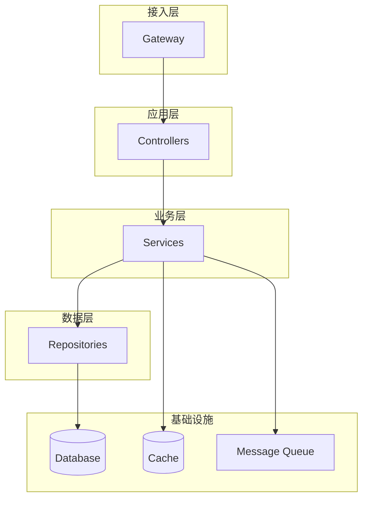

### 流程图输出格式

使用 Mermaid flowchart 描述业务流程：

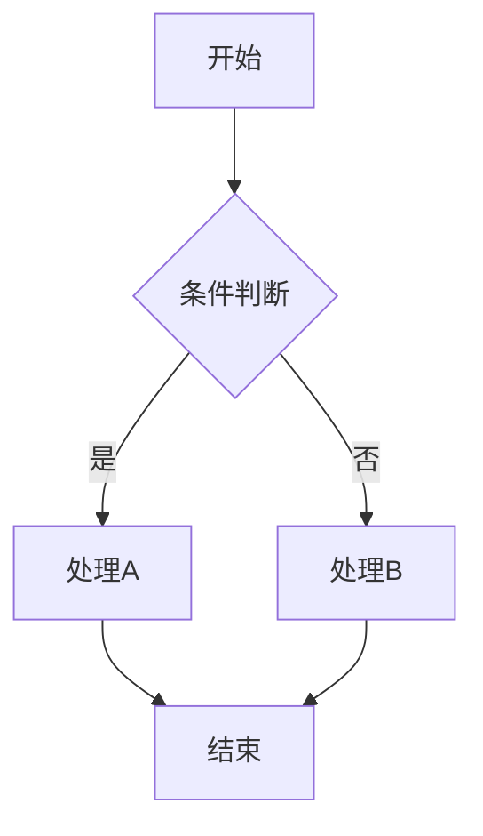

### 时序图输出格式

使用 Mermaid sequenceDiagram 描述调用链：

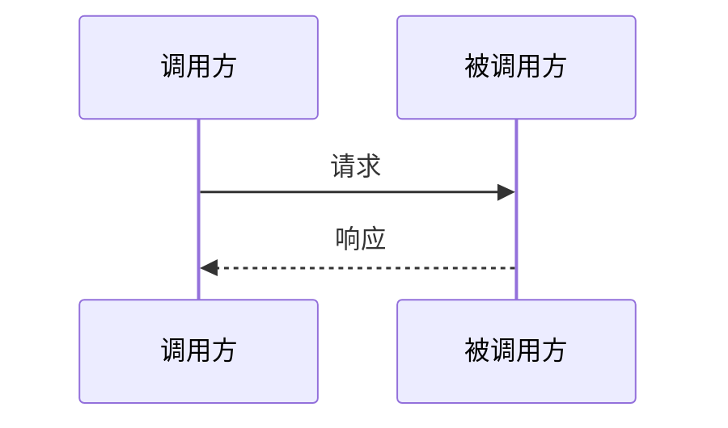

### 数据表描述格式

使用 Mermaid erDiagram 或表格：

```markdown
## 核心表结构

### t_order 订单表
| 字段 | 类型 | 说明 | 备注 |
|------|------|------|------|
| id | bigint | 主键 | 自增 |
| order_no | varchar(32) | 订单号 | 唯一索引 |
| user_id | bigint | 用户ID | 外键 |
| status | tinyint | 状态 | 0-待支付 1-已支付 |
| created_at | datetime | 创建时间 | |
```

## 质量检查清单

- [ ] 项目概述是否清晰完整
- [ ] 技术栈是否准确列出
- [ ] 核心业务流程是否覆盖
- [ ] 数据模型是否说明清楚
- [ ] 代码导航是否便于定位
- [ ] 新人阅读顺序是否提供
- [ ] 常见问题是否收集
- [ ] 图表描述是否清晰
- [ ] 术语是否解释


## 协作建议

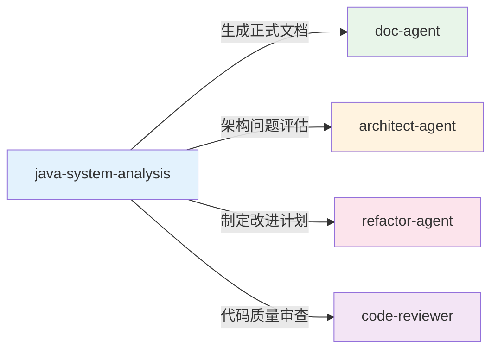

| 场景 | 委托目标 | 说明 |
|------|----------|------|
| 分析完成后 | `doc-agent` | 生成正式格式的技术文档 |
| 发现架构问题 | `architect-agent` | 进行深入架构评估 |
| 识别技术债务 | `refactor-agent` | 制定改进计划和重构方案 |
| 需要代码审查 | `code-reviewer` | 对关键代码进行质量评审 |

## 强制校验：确保引用的代码在项目中存在 (Mandatory verification: Ensure referenced code exists in project)

> 目的 / Purpose
>
> 为了保证培训材料、示例脚本与流程文档的准确性和可复现性，任何在技能培训或流程中引用的“流程代码”（例如示例脚本路径、模块名、类/函数名、配置项、SQL表名、API路由、文件路径等）必须在目标项目仓库中得到验证——可以是自动化验证也可以是手动核验。
>
> The purpose of this rule is to ensure that any "process code" referenced in training materials (example scripts, paths, module names, config keys, class/function names, SQL table names, API routes, etc.) actually exists in the target project repository. Verification may be automated or performed manually.

### 范畴 / Scope

- 属于“流程代码”的示例包括但不限于：文件路径、源代码文件、类/接口名、模块名、脚本路径、配置项键名、数据库表/列名、API 路径、示例命令中的可执行文件名等。
- 本规则适用于本技能文档、示例、练习模板、教学幻灯片与代码仓库中出现的引用。

### 验证步骤示例 / Verification examples

跨平台（Linux/macOS/WSL/Git Bash）示例：

- 使用 git grep：

  git grep -n "MyClass" || echo "Not found"

- 使用 ripgrep (rg)：

  rg -n "MyClass" || echo "Not found"

Windows PowerShell 示例：

- 检查文件路径或类文件是否存在：

  Test-Path 'src\main\java\com\example\MyClass.java'

- 在项目中搜索包含标识符的文件：

  Get-ChildItem -Recurse -Filter *.java | Select-String -Pattern 'MyClass' -List | Select-Object Filename, LineNumber

- 组合使用（优先使用 git grep，然后回退到 PowerShell 搜索）：

  if ((git grep -n "MyClass") -ne $null) { Write-Output "Found via git grep" } else { Get-ChildItem -Recurse -Filter *.java | Select-String -Pattern 'MyClass' -List }

### 自动化检查脚本示例 / Automation script snippets

下列脚本片段放在 `examples` 目录，供培训和 CI 使用。

Bash (verify-references.sh)：

PowerShell (Verify-References.ps1)：


### 培训检查清单建议 / Checklist recommendation

- 在本技能的培训检查清单中新增一项：
  - 验证文档/示例中所有引用的代码、路径、模块名和配置项在目标仓库中真实存在（若缺失则标注为“示例缺失”并记录在缺失清单中）。

- 发现缺失时的处理流程：
  1. 将缺失项记录到 `mandatory-missing.txt`（或 CI 报告）并在文档中对应位置标注 `示例缺失`（或使用注释说明）。
  2. 在项目 issue tracker 中创建 issue，附上缺失清单、引用来源（文档路径/行号）与建议修复（添加示例文件或修正文档）。
  3. 若需临时继续培训，可提供 mock 或替代示例并在文档中明确标注（示例为 mock，需在后续更新替换为真实存在的引用）。

### 参考示例文件位置建议 / Where to place example scripts

- 本技能仓库内建议路径：
  - `skills/java-system-analysis/examples/mandatory-verification.md`（包含上述脚本与运行说明）
  - 或 `skills/java-system-analysis/exercises/templates/verify-references.sh` 和 `Verify-References.ps1`
