# Java 系统分析参考指南

本文档提供更详细的分析模式和最佳实践，使用 Mermaid 绘制可视化图表。

## 目录

1. [常见架构模式识别](#常见架构模式识别)
2. [复杂业务分析技巧](#复杂业务分析技巧)
3. [遗留系统分析策略](#遗留系统分析策略)
4. [文档写作技巧](#文档写作技巧)
5. [安全审计检查点](#安全审计检查点)
6. [性能分析模式](#性能分析模式)

---

## 常见架构模式识别

### 1. MVC 分层架构

**识别特征**：
```
src/main/java/com/example/
├── controller/     # @Controller, @RestController
├── service/        # @Service
│   └── impl/
├── dao/repository/ # @Repository, @Mapper
├── entity/model/   # @Entity, @Table
└── dto/vo/         # 数据传输对象
```

**架构图（Mermaid）**：
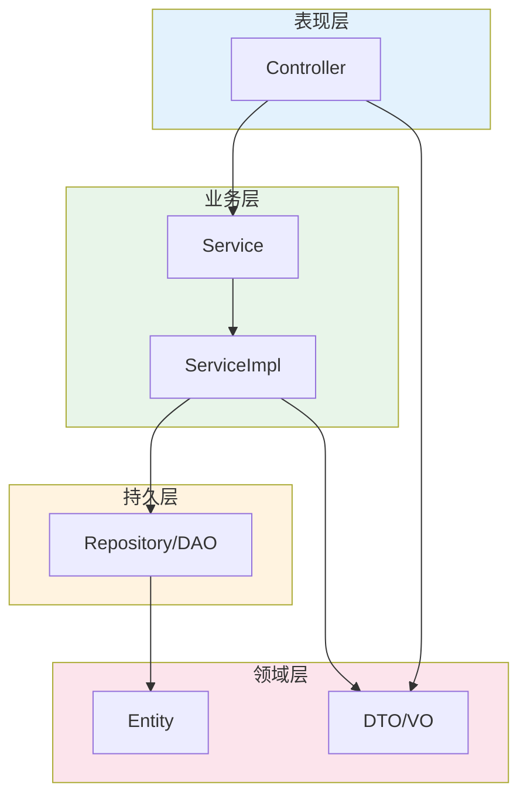

**分析要点**：
- Controller 负责请求路由和参数校验
- Service 包含业务逻辑，注意事务边界
- Repository/DAO 处理数据持久化

### 2. DDD 领域驱动设计

**识别特征**：
```
src/main/java/com/example/
├── domain/              # 领域层
│   ├── model/          # 聚合根、实体、值对象
│   ├── repository/     # 仓储接口
│   └── service/        # 领域服务
├── application/        # 应用层
│   ├── service/       # 应用服务
│   └── dto/           # 命令、查询对象
├── infrastructure/     # 基础设施层
│   ├── persistence/   # 仓储实现
│   └── external/      # 外部服务
└── interfaces/         # 接口层
    ├── rest/          # REST API
    └── event/         # 事件处理
```

**架构图（Mermaid）**：
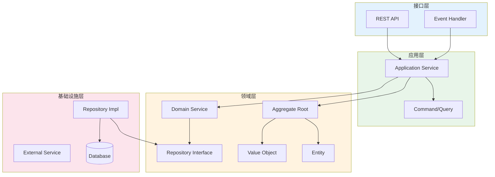

**分析要点**：
- 识别限界上下文边界
- 理解聚合根和实体关系
- 关注领域事件流转

### 3. 六边形架构 (Ports and Adapters)

**识别特征**：
```
├── core/               # 核心业务
│   ├── domain/
│   └── port/          # 端口接口
│       ├── in/        # 入站端口
│       └── out/       # 出站端口
└── adapter/           # 适配器
    ├── in/            # 入站适配器 (Controller, Consumer)
    └── out/           # 出站适配器 (Repository, Client)
```

**架构图（Mermaid）**：
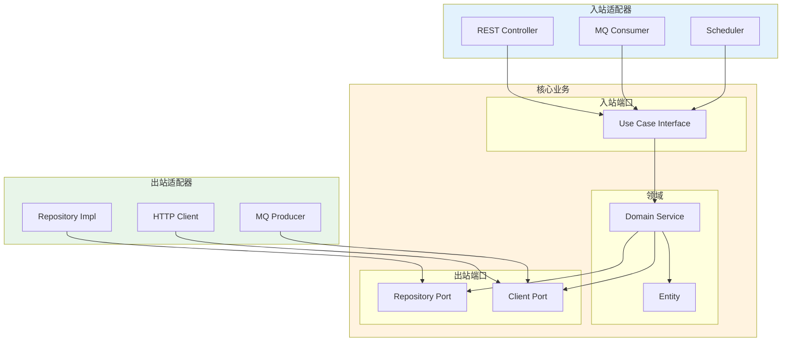

**分析要点**：
- 核心业务与外部依赖解耦
- 通过端口定义契约
- 适配器实现具体技术

### 4. 微服务架构

**识别特征**：
```
project-root/
├── user-service/
├── order-service/
├── payment-service/
├── gateway/
└── common/
```

**架构图（Mermaid）**：
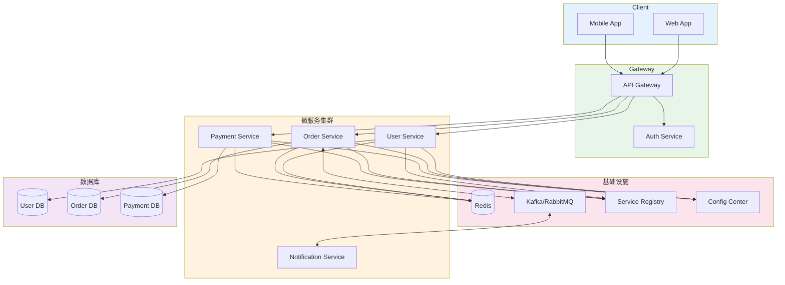

**分析要点**：
- 服务边界划分依据
- 服务间通信方式 (REST/gRPC/MQ)
- 数据一致性策略（Saga/TCC/最终一致性）

---

## 复杂业务分析技巧

### 1. 状态机分析

复杂业务往往涉及状态流转，识别状态机模式：

```bash
# 搜索枚举状态定义
grep -rn "enum.*Status\|enum.*State" --include="*.java"

# 搜索状态转换逻辑
grep -rn "setStatus\|updateStatus\|changeState" --include="*.java"
```

**状态图输出（Mermaid）**：
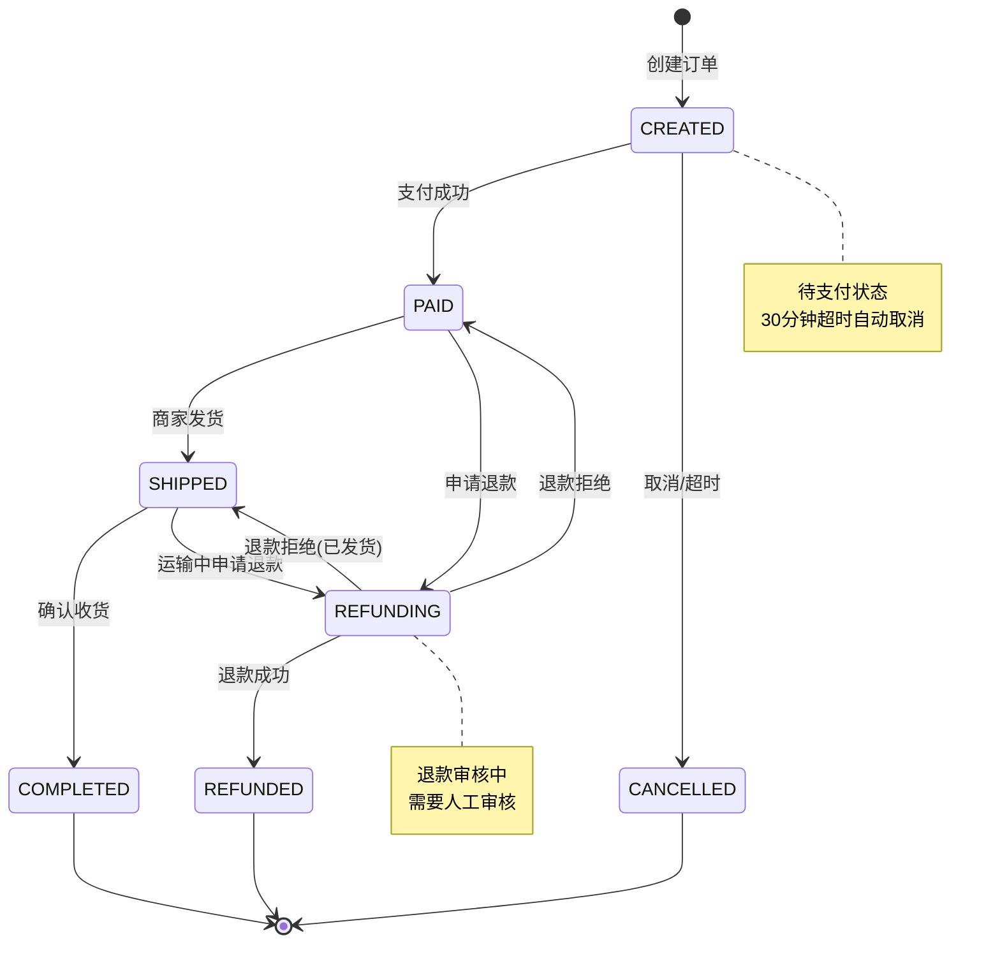

**输出格式**：
```markdown
## 订单状态机

### 状态定义
| 状态码 | 状态名 | 说明 |
|--------|--------|------|
| 0 | CREATED | 已创建，待支付 |
| 1 | PAID | 已支付，待发货 |
| 2 | SHIPPED | 已发货，运输中 |
| 3 | COMPLETED | 已完成 |
| 4 | CANCELLED | 已取消 |
| 5 | REFUNDING | 退款中 |
| 6 | REFUNDED | 已退款 |

### 转换规则
| 源状态 | 目标状态 | 触发条件 | 处理逻辑 |
|--------|----------|----------|----------|
| CREATED | PAID | 支付回调成功 | 更新状态，发送通知 |
| CREATED | CANCELLED | 用户取消/超时 | 释放库存 |
| PAID | SHIPPED | 商家发货 | 记录物流单号 |
```

### 2. 事务边界分析

```bash
# 查找事务注解
grep -rn "@Transactional" --include="*.java" -A 5

# 查找分布式事务
grep -rn "GlobalTransactional\|@TccTransaction\|Saga" --include="*.java"
```

### 3. 异步处理分析

```bash
# 消息生产者
grep -rn "kafkaTemplate\|rabbitTemplate\|send\|publish" --include="*.java"

# 消息消费者
grep -rn "@KafkaListener\|@RabbitListener\|@StreamListener" --include="*.java"

# 异步方法
grep -rn "@Async" --include="*.java"
```

### 4. 定时任务分析

```bash
# Spring Scheduled
grep -rn "@Scheduled" --include="*.java" -B 2 -A 5

# Quartz/XXL-Job
grep -rn "@XxlJob\|implements Job" --include="*.java"
```

---

## 遗留系统分析策略

### 1. 代码考古学

当文档缺失时，通过代码历史还原设计意图，必要时使用技能"git-log-and-hotspot-code-analysis"：

```bash
# 查找最早的提交，理解初始设计
git log --oneline --reverse | head -20

# 查看某个类的完整演进历史
git log -p --follow -- path/to/Class.java

# 查找重大重构的提交
git log --all --oneline | grep -i "refactor\|重构\|优化"

# 按时间段查看变更
git log --after="2022-01-01" --before="2022-06-30" --stat
```

### 2. 热点代码识别

识别系统中最关键的代码：

```bash
# 修改频率最高的文件（通常是核心业务）
git log --pretty=format: --name-only --since="1 year ago" | \
  sort | uniq -c | sort -rn | head -30

# 近期活跃的模块
git diff --stat $(git log --oneline -1 --before="3 months ago" | cut -d' ' -f1)..HEAD

# Bug 修复集中的区域
git log --all --oneline --grep="fix\|bug\|修复" | wc -l
```

### 3. 死代码识别

```bash
# 长期未修改的文件
find . -name "*.java" -mtime +365

# 搜索 @Deprecated 标记
grep -rn "@Deprecated" --include="*.java"

# 查找未被引用的公共方法（需要 IDE 辅助）
```

### 4. 技术债务清单

分析过程中记录发现的技术债务：

```markdown
## 技术债务清单

### 高优先级
- [ ] OrderService 类超过 2000 行，建议拆分
- [ ] 存在硬编码的配置值
- [ ] 部分 SQL 存在 N+1 查询问题

### 中优先级
- [ ] 缺少单元测试覆盖
- [ ] 部分接口缺少参数校验
- [ ] 日志记录不完整

### 低优先级
- [ ] 部分类命名不规范
- [ ] 存在未使用的导入
- [ ] 代码格式不统一
```

---

## 文档写作技巧

### 1. 新人视角写作

始终站在"完全不了解这个系统"的角度：

**反面示例**：
> OrderService 处理订单相关的业务逻辑。

**正面示例**：
> OrderService 是订单模块的核心服务类，负责：
> - 创建订单：校验库存 → 计算价格 → 保存订单 → 扣减库存
> - 取消订单：检查状态 → 恢复库存 → 更新状态
> - 查询订单：支持按用户、状态、时间范围查询
> 
> 代码位置：`com.example.order.service.OrderService`
> 依赖服务：InventoryService（库存）、PriceService（价格计算）

### 2. 代码导航地图

提供"我想修改 XX 功能，应该看哪里"的指引：

```markdown
## 代码导航

### 我想了解/修改...

| 功能 | 入口类 | 核心类 | 配置文件 |
|------|--------|--------|----------|
| 用户登录 | AuthController | AuthService, JwtUtil | security.yml |
| 创建订单 | OrderController | OrderService | order-config.yml |
| 支付回调 | PayCallbackController | PayService | pay.yml |
| 定时对账 | ReconcileJob | ReconcileService | job-config.yml |

### 阅读顺序建议

1. **快速了解**：先看 README 和本文档
2. **业务入门**：从 Controller 开始，追踪核心业务流程
3. **深入理解**：阅读 Service 实现，理解业务规则
4. **细节掌握**：查看 Repository 和 SQL，理解数据操作
```

### 3. 图表优于文字

使用 Mermaid 语法描述复杂逻辑：

**状态图示例**：
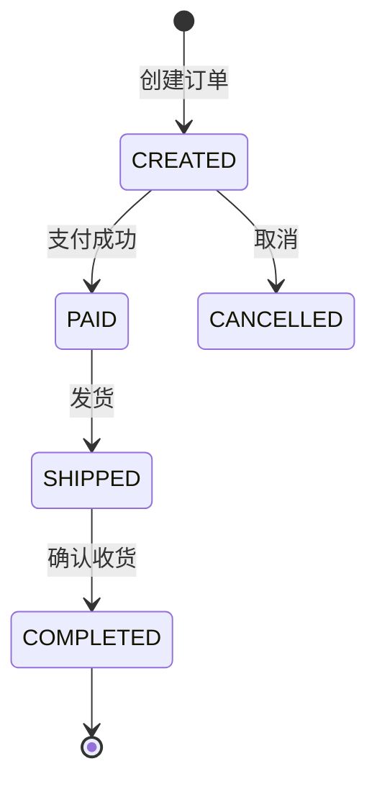

**服务调用关系（时序图）**：
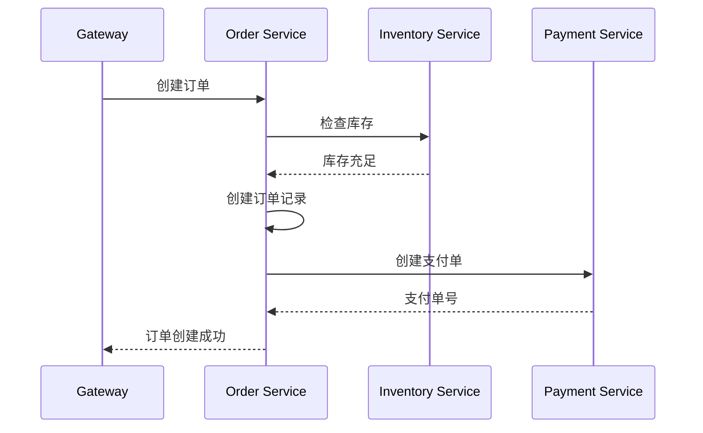

**架构图示例**：
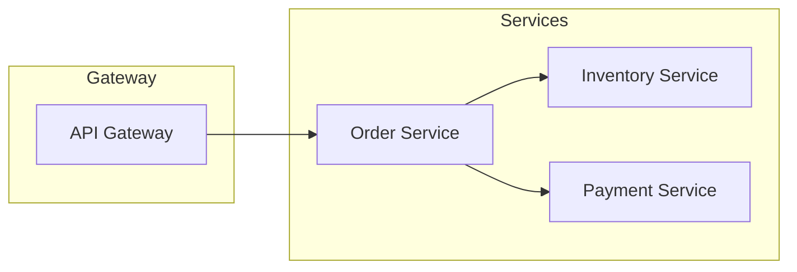

**ER 图示例**：
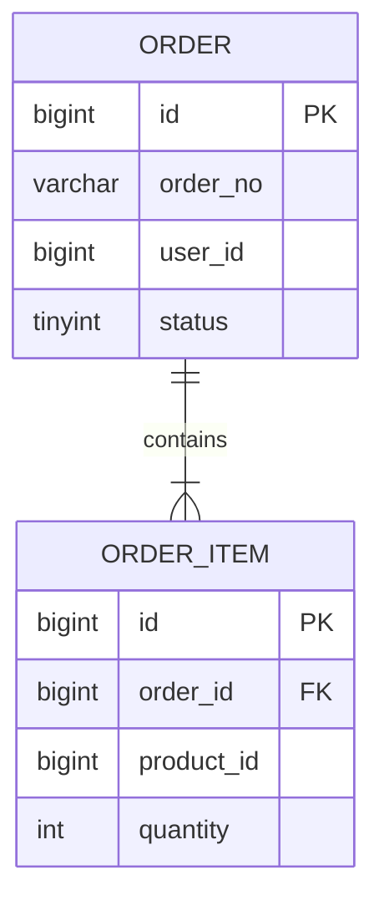

### 4. 常见问题预埋

预判新人可能遇到的问题：

```markdown
## FAQ

### Q: 本地启动报错 "Connection refused"
A: 检查 MySQL 和 Redis 是否已启动，配置文件中的连接信息是否正确。

### Q: 如何查看某个接口的完整调用链？
A: 使用 IDE 的 "Find Usages" 功能，或查看 Swagger 文档中的接口定义。

### Q: 测试环境和生产环境的配置有什么区别？
A: 查看 `application-test.yml` 和 `application-prod.yml` 的差异，主要是数据库地址和一些开关配置。
```

---

## 安全审计检查点

### 1. 认证与授权

```bash
# 查找认证相关代码
grep -rn "@PreAuthorize\|@Secured\|@RolesAllowed" --include="*.java"

# 查找权限校验
grep -rn "hasRole\|hasAuthority\|isAuthenticated" --include="*.java"

# 查找登录相关
grep -rn "login\|authenticate\|logout" --include="*.java"

# JWT 相关
grep -rn "jwt\|token\|Bearer" --include="*.java" --include="*.yml"
```

**安全检查清单**：
| 检查项 | 命令/方法 | 风险级别 |
|--------|-----------|----------|
| SQL 注入 | `grep -rn "\$\{.*\}" --include="*.xml"` | 高 |
| XSS 漏洞 | 检查返回 HTML 的接口 | 高 |
| 敏感信息泄露 | `grep -rn "password\|secret\|key" --include="*.yml"` | 高 |
| 越权访问 | 检查接口权限注解 | 高 |
| CSRF 防护 | 检查 CSRF token 配置 | 中 |

### 2. 敏感数据处理

```bash
# 查找敏感字段
grep -rn "password\|credential\|secret\|apiKey\|privateKey" --include="*.java"

# 查找加密相关
grep -rn "encrypt\|decrypt\|AES\|RSA\|MD5\|SHA" --include="*.java"

# 查找日志中的敏感信息
grep -rn "log.*password\|log.*token" --include="*.java"
```

### 3. 输入校验

```bash
# 查找参数校验注解
grep -rn "@Valid\|@NotNull\|@NotBlank\|@Size\|@Pattern" --include="*.java"

# 查找自定义校验
grep -rn "Validator\|validate" --include="*.java"
```

**安全审计流程图**：
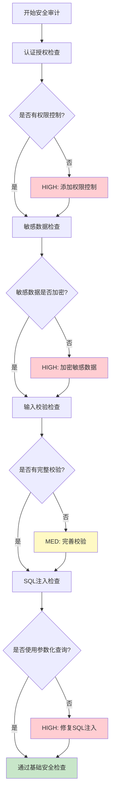

---

## 性能分析模式

### 1. 慢查询识别

```bash
# 查找复杂 SQL
grep -rn "SELECT.*FROM.*JOIN.*JOIN" --include="*.xml"

# 查找无索引查询
grep -rn "SELECT \*\|LIKE '%.*%'" --include="*.xml"

# 查找大量数据操作
grep -rn "findAll\|selectAll" --include="*.java"
```

### 2. N+1 查询问题

```bash
# 查找循环中的数据库调用
grep -rn "for.*{" -A 10 --include="*.java" | grep -i "mapper\|repository"

# 查找懒加载配置
grep -rn "FetchType.LAZY\|lazy" --include="*.java"
```

**N+1 问题示意图**：
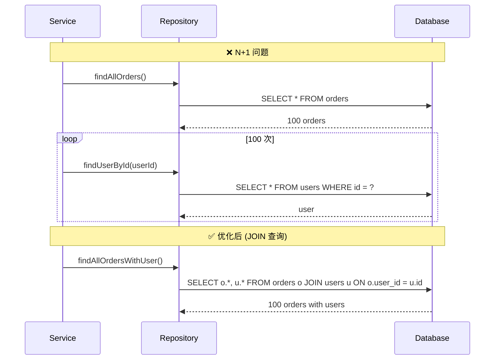

### 3. 缓存使用分析

```bash
# 查找缓存注解
grep -rn "@Cacheable\|@CacheEvict\|@CachePut" --include="*.java"

# 查找 Redis 操作
grep -rn "redisTemplate\|StringRedisTemplate\|RedissonClient" --include="*.java"

# 查找本地缓存
grep -rn "Caffeine\|Guava.*Cache\|ConcurrentHashMap" --include="*.java"
```

### 4. 性能热点检测

**代码热点分析流程**：
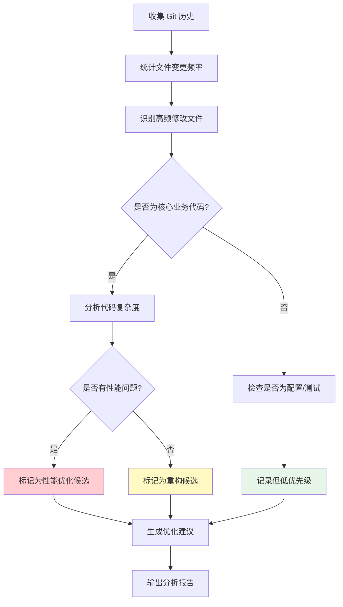

### 5. 性能检查清单

| 检查项 | 识别方法 | 优化建议 |
|--------|----------|----------|
| N+1 查询 | 循环中的 DB 调用 | 使用 JOIN 或批量查询 |
| 无索引查询 | EXPLAIN 分析 | 添加适当索引 |
| 大对象传输 | 接口返回完整实体 | 使用 DTO 精简返回 |
| 重复计算 | 相同逻辑多次执行 | 添加缓存 |
| 同步阻塞 | 长时间 I/O 操作 | 异步处理 |
| 内存泄漏 | 集合只增不减 | 定期清理或使用弱引用 |

**性能优化优先级矩阵**：
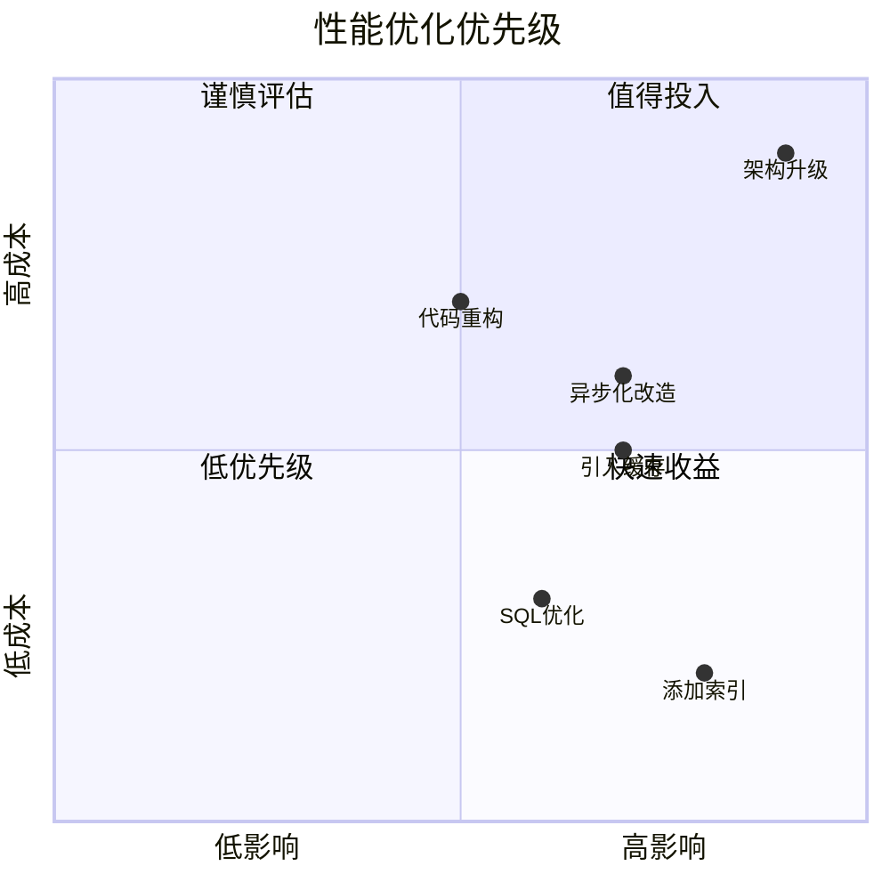
