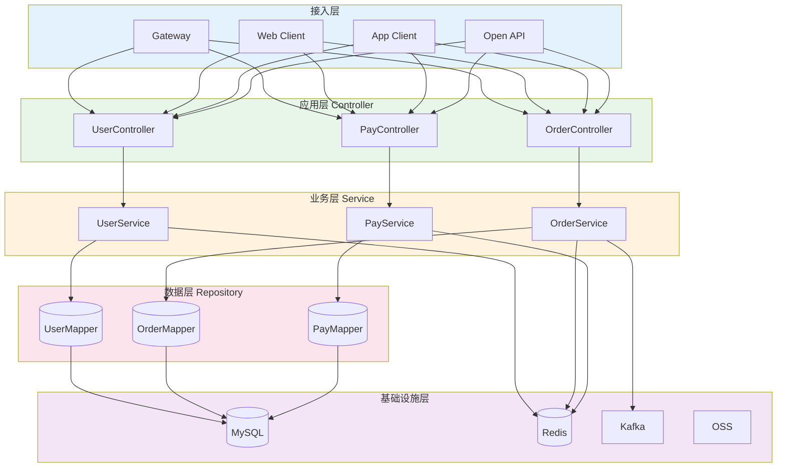
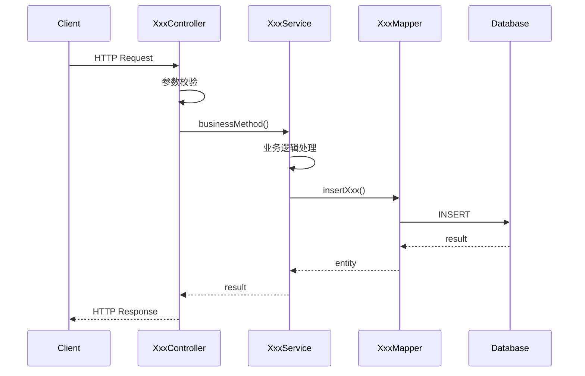
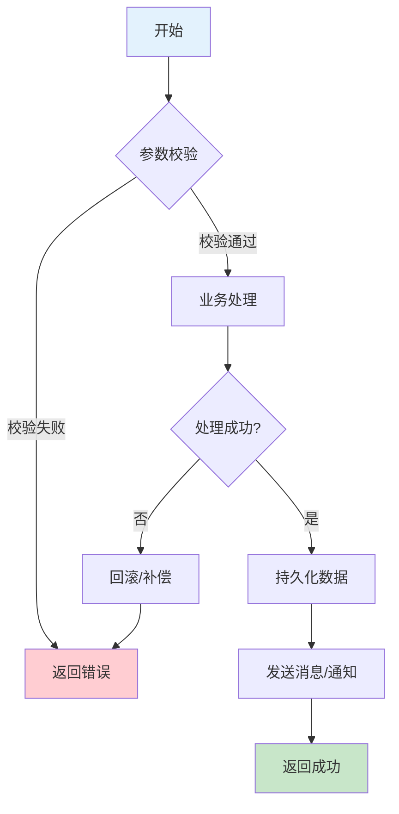
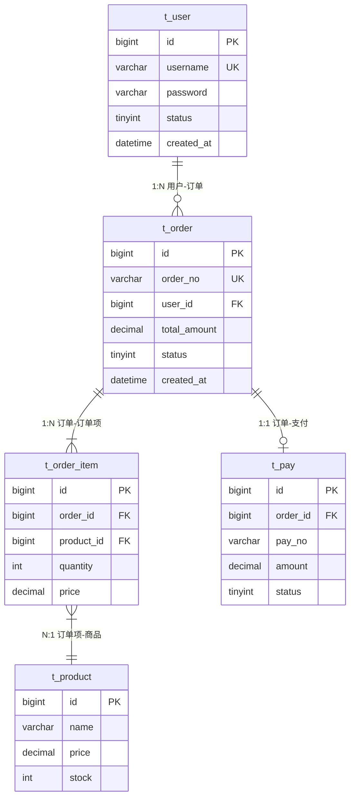

# [系统名称] 业务系统文档

> 本文档由 Java 系统分析专家生成，旨在帮助新人快速理解和上手本系统。
> 
> 生成日期：[YYYY-MM-DD]
> 分析版本：[commit-hash]

---

## 1. 项目概述

### 1.1 系统简介

[一段话描述系统的核心功能和业务价值]

**系统名称**：[name]
**仓库地址**：[git-url]
**负责团队**：[team-name]

### 1.2 技术栈

| 类别 | 技术 | 版本 | 说明 |
|------|------|------|------|
| 语言 | Java | [version] | |
| 框架 | Spring Boot | [version] | |
| ORM | MyBatis/JPA | [version] | |
| 数据库 | MySQL | [version] | |
| 缓存 | Redis | [version] | |
| 消息队列 | Kafka/RabbitMQ | [version] | |

### 1.3 核心功能

- [ ] 功能1：[简要描述]
- [ ] 功能2：[简要描述]
- [ ] 功能3：[简要描述]

---

## 2. 快速上手

### 2.1 环境准备

**必需环境**：
- JDK [version]
- Maven [version]
- MySQL [version]
- Redis [version]

**安装步骤**：
```bash
# 1. 克隆代码
git clone [repository-url]
cd [project-name]

# 2. 安装依赖
mvn clean install -DskipTests

# 3. 初始化数据库
mysql -u root -p < docs/sql/init.sql

# 4. 修改配置
cp src/main/resources/application-local.yml.example src/main/resources/application-local.yml
# 编辑 application-local.yml，填入本地数据库和 Redis 配置
```

### 2.2 本地运行

```bash
# 方式一：命令行
mvn spring-boot:run -Dspring.profiles.active=local

# 方式二：IDE
# 运行 Application.java 的 main 方法，添加 VM 参数: -Dspring.profiles.active=local
```

**启动成功标志**：
```
Started Application in X.XX seconds
```

**访问地址**：
- 应用地址：http://localhost:8080
- Swagger 文档：http://localhost:8080/swagger-ui.html
- 健康检查：http://localhost:8080/actuator/health

### 2.3 常用命令

```bash
# 编译打包
mvn clean package -DskipTests

# 运行测试
mvn test

# 代码格式检查
mvn checkstyle:check

# 生成代码覆盖率报告
mvn jacoco:report
```

---

## 3. 架构设计

### 3.1 整体架构图



### 3.2 模块划分

```
src/main/java/com/example/[project]/
├── controller/          # 接口层：REST API 定义
│   ├── UserController.java
│   └── OrderController.java
├── service/             # 业务层：核心业务逻辑
│   ├── UserService.java
│   ├── OrderService.java
│   └── impl/
├── repository/          # 数据层：数据库操作
│   ├── UserMapper.java
│   └── OrderMapper.java
├── entity/              # 实体类：数据库映射
├── dto/                 # 传输对象：接口入参出参
├── config/              # 配置类：Spring 配置
├── common/              # 公共组件：工具类、常量
│   ├── util/
│   ├── constant/
│   └── exception/
└── Application.java     # 启动类
```

### 3.3 技术选型说明

| 技术 | 选型理由 | 备注 |
|------|----------|------|
| Spring Boot | 团队标准，生态完善 | |
| MyBatis-Plus | 简化 CRUD，动态 SQL 灵活 | |
| Redis | 缓存、分布式锁、会话管理 | |

---

## 4. 核心业务

### 4.1 [业务1名称] 流程说明

**业务描述**：[一句话描述业务场景]

**流程步骤**：
1. [步骤1]
2. [步骤2]
3. [步骤3]

**代码调用时序图**：


**关键代码位置**：
- Controller：`com.example.controller.XxxController#method`
- Service：`com.example.service.impl.XxxServiceImpl#businessMethod`
- Mapper：`com.example.mapper.XxxMapper#insertXxx`

### 4.2 [业务2名称] 流程说明

[同上格式]

### 4.3 业务流程图

使用 Mermaid flowchart 描述业务流程：



---

## 5. 数据模型

### 5.1 核心表结构

#### t_user 用户表

| 字段 | 类型 | 必填 | 说明 | 备注 |
|------|------|------|------|------|
| id | bigint | Y | 主键 | 自增 |
| username | varchar(50) | Y | 用户名 | 唯一索引 |
| password | varchar(100) | Y | 密码 | MD5加密 |
| status | tinyint | Y | 状态 | 0-禁用 1-正常 |
| created_at | datetime | Y | 创建时间 | |
| updated_at | datetime | Y | 更新时间 | |

#### t_order 订单表

[同上格式]

### 5.2 表关系图



### 5.3 数据字典

[枚举值、状态码说明]

---

## 6. 接口文档

### 6.1 API 概览

| 模块 | 路径前缀 | 说明 |
|------|----------|------|
| 用户 | /api/v1/user | 用户管理相关接口 |
| 订单 | /api/v1/order | 订单管理相关接口 |

### 6.2 核心接口详情

#### POST /api/v1/order/create

**描述**：创建订单

**请求参数**：
```json
{
  "userId": 10001,
  "items": [
    {
      "productId": 1,
      "quantity": 2
    }
  ]
}
```

**响应示例**：
```json
{
  "code": 0,
  "message": "success",
  "data": {
    "orderId": "202301010001",
    "totalAmount": 100.00
  }
}
```

---

## 7. 代码导航

### 7.1 目录结构说明

[见 3.2 模块划分]

### 7.2 核心类索引

| 类名 | 路径 | 职责 |
|------|------|------|
| Application | com.example.Application | 启动类 |
| OrderService | com.example.service.OrderService | 订单核心服务 |
| OrderMapper | com.example.mapper.OrderMapper | 订单数据访问 |

### 7.3 代码阅读顺序建议

**新人推荐阅读顺序**：

1. **了解全貌**（30分钟）
   - 阅读本文档
   - 浏览目录结构
   - 运行项目，访问 Swagger

2. **核心业务**（2小时）
   - 从 OrderController 开始
   - 追踪 createOrder 完整流程
   - 理解 Service 和 Mapper 的交互

3. **深入细节**（按需）
   - 查看配置文件
   - 理解公共组件
   - 阅读单元测试

---

## 8. 开发指南

### 8.1 开发规范

- 代码风格遵循阿里巴巴 Java 开发手册
- 接口路径使用 RESTful 风格
- 日志使用 SLF4J，禁止 System.out
- 异常统一通过 GlobalExceptionHandler 处理

### 8.2 常见问题 FAQ

**Q: 本地启动报错 "Table xxx doesn't exist"**
A: 执行 `docs/sql/init.sql` 初始化数据库。

**Q: 如何添加新的接口？**
A: 
1. 在 Controller 中添加方法
2. 在 Service 中实现业务逻辑
3. 如需数据库操作，在 Mapper 中添加方法

**Q: 如何查看接口日志？**
A: 日志文件位于 `logs/` 目录，或使用 `tail -f logs/app.log`。

### 8.3 调试技巧

- 使用 IDE 的断点调试
- 开启 SQL 日志：`logging.level.com.example.mapper=DEBUG`
- 使用 Arthas 进行线上诊断

---

## 9. 历史演进

### 9.1 重要版本记录

| 版本 | 日期 | 主要变更 | 负责人 |
|------|------|----------|--------|
| v1.0 | 2023-01-01 | 初始版本 | [name] |
| v1.1 | 2023-03-01 | 新增支付模块 | [name] |

### 9.2 技术债务清单

- [ ] [高] XxxService 类过大，建议拆分
- [ ] [中] 部分接口缺少参数校验
- [ ] [低] 代码注释不完整

---

## 附录

### A. 术语表

| 术语 | 说明 |
|------|------|
| [term1] | [description] |
| [term2] | [description] |

### B. 参考资料

- [项目 Wiki]()
- [接口文档]()
- [设计文档]()

---

> 如有疑问，请联系：[contact-info]
